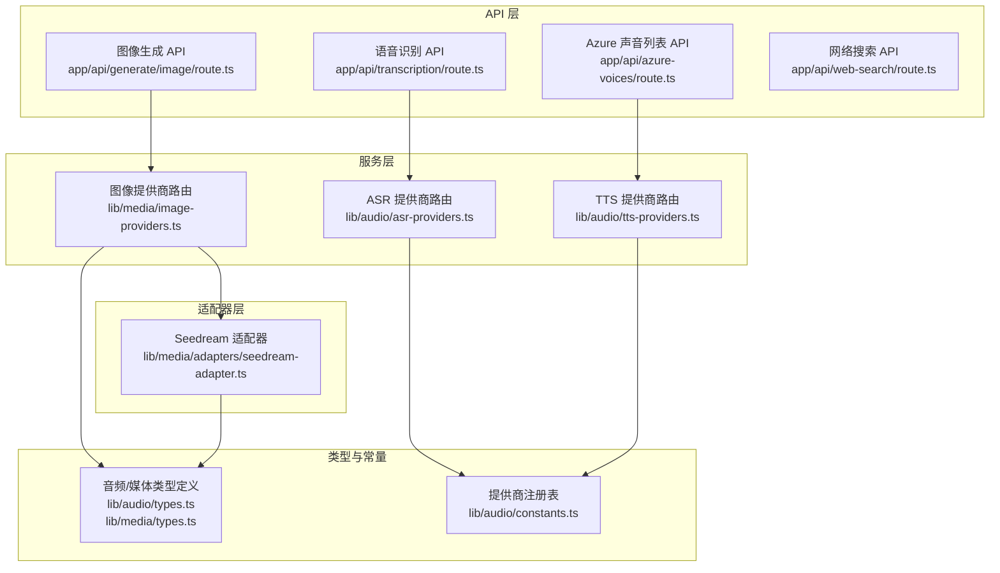
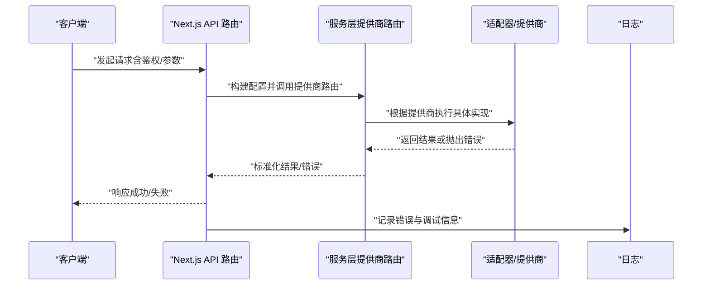
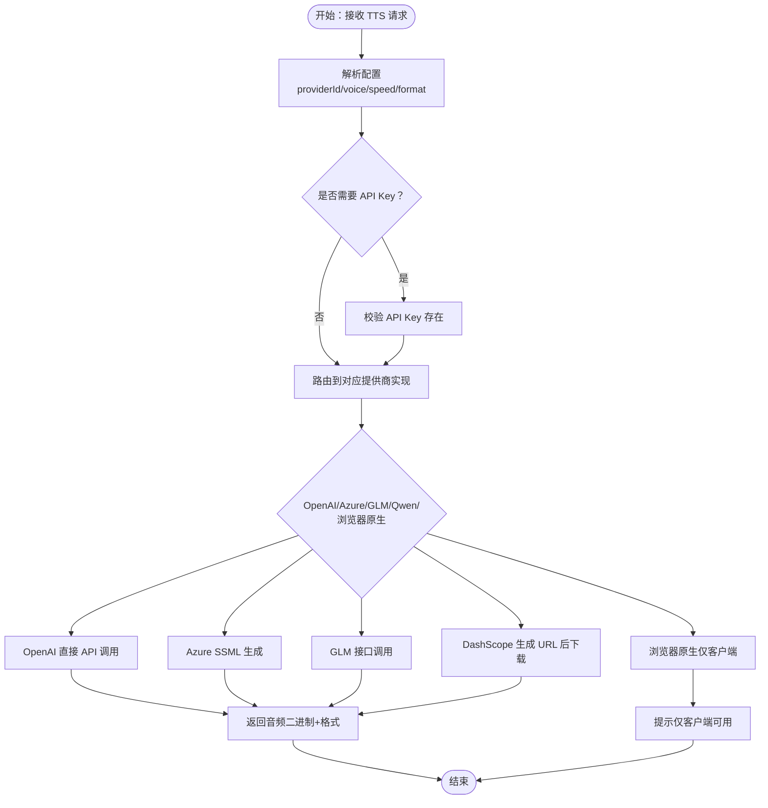
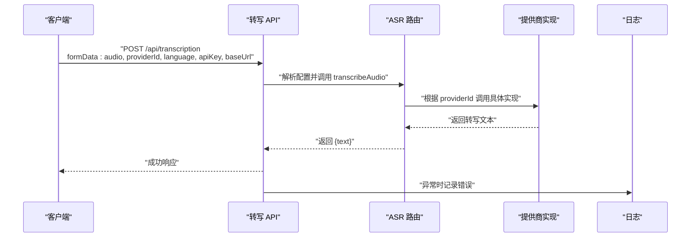
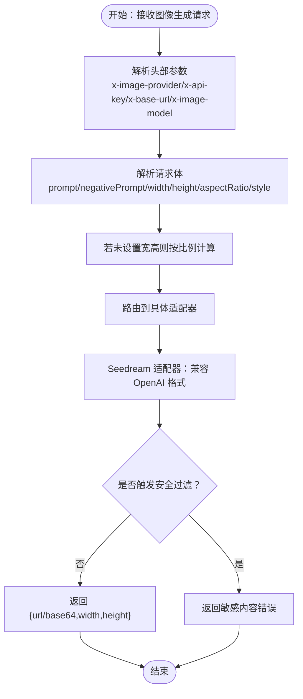
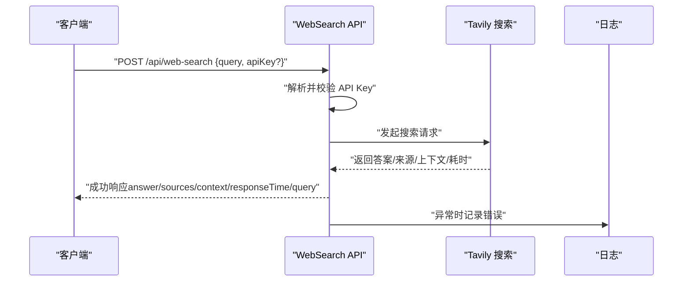
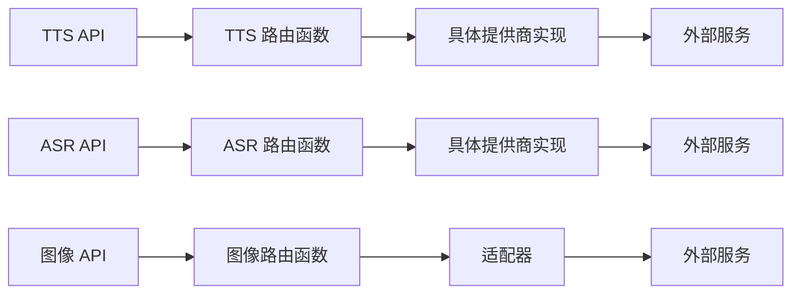

# 多媒体功能

<cite>
**本文引用的文件**
- [app/api/transcription/route.ts](file://app/api/transcription/route.ts)
- [lib/audio/asr-providers.ts](file://lib/audio/asr-providers.ts)
- [lib/audio/types.ts](file://lib/audio/types.ts)
- [lib/audio/constants.ts](file://lib/audio/constants.ts)
- [app/api/azure-voices/route.ts](file://app/api/azure-voices/route.ts)
- [lib/audio/tts-providers.ts](file://lib/audio/tts-providers.ts)
- [app/api/generate/image/route.ts](file://app/api/generate/image/route.ts)
- [lib/media/image-providers.ts](file://lib/media/image-providers.ts)
- [lib/media/adapters/seedream-adapter.ts](file://lib/media/adapters/seedream-adapter.ts)
- [lib/media/types.ts](file://lib/media/types.ts)
- [app/api/web-search/route.ts](file://app/api/web-search/route.ts)
</cite>

## 目录
1. [简介](#简介)
2. [项目结构](#项目结构)
3. [核心组件](#核心组件)
4. [架构总览](#架构总览)
5. [详细组件分析](#详细组件分析)
6. [依赖关系分析](#依赖关系分析)
7. [性能考量](#性能考量)
8. [故障排查指南](#故障排查指南)
9. [结论](#结论)
10. [附录](#附录)

## 简介
本章节面向 OpenMAIC 的多媒体能力，系统性梳理语音合成（TTS）、语音识别（ASR）、图像生成与视频处理、以及网络搜索等模块的实现方式、扩展机制与最佳实践。文档以“可读性优先”的原则，既覆盖代码级细节，也提供高层架构图与流程图，帮助开发者快速理解与落地应用。

## 项目结构
OpenMAIC 将多媒体能力按“API 层 + 服务层 + 适配器层 + 类型与常量”组织，形成清晰的分层与职责边界：
- API 层：提供对外接口，负责请求解析、鉴权与错误返回
- 服务层：封装具体提供商的调用逻辑，统一错误处理与参数转换
- 适配器层：针对特定提供商的实现细节（如图像生成、视频生成）
- 类型与常量：定义统一的数据模型与提供商注册表，确保前后端一致

图表来源
- [app/api/transcription/route.ts:1-52](file://app/api/transcription/route.ts#L1-L52)
- [lib/audio/asr-providers.ts:163-190](file://lib/audio/asr-providers.ts#L163-L190)
- [lib/audio/tts-providers.ts:106-141](file://lib/audio/tts-providers.ts#L106-L141)
- [lib/media/image-providers.ts:89-103](file://lib/media/image-providers.ts#L89-L103)
- [lib/media/adapters/seedream-adapter.ts:81-120](file://lib/media/adapters/seedream-adapter.ts#L81-L120)
- [lib/audio/types.ts:1-173](file://lib/audio/types.ts#L1-L173)
- [lib/media/types.ts:1-321](file://lib/media/types.ts#L1-L321)
- [lib/audio/constants.ts:42-622](file://lib/audio/constants.ts#L42-L622)

章节来源
- [app/api/transcription/route.ts:1-52](file://app/api/transcription/route.ts#L1-L52)
- [lib/audio/asr-providers.ts:1-354](file://lib/audio/asr-providers.ts#L1-L354)
- [lib/audio/tts-providers.ts:1-357](file://lib/audio/tts-providers.ts#L1-L357)
- [lib/media/image-providers.ts:1-113](file://lib/media/image-providers.ts#L1-L113)
- [lib/media/adapters/seedream-adapter.ts:1-121](file://lib/media/adapters/seedream-adapter.ts#L1-L121)
- [lib/audio/types.ts:1-173](file://lib/audio/types.ts#L1-L173)
- [lib/media/types.ts:1-321](file://lib/media/types.ts#L1-L321)
- [lib/audio/constants.ts:1-800](file://lib/audio/constants.ts#L1-L800)

## 核心组件
- 语音合成（TTS）
  - 支持 OpenAI、Azure、GLM、Qwen、浏览器原生等多家提供商
  - 统一配置模型与声音列表管理，支持速度、格式、声音选择
- 语音识别（ASR）
  - 支持 OpenAI Whisper、Qwen ASR、浏览器原生
  - 支持语言自动检测与多格式输入
- 图像生成
  - 支持 Seedream、Qwen Image、Nano Banana
  - 维度推导、尺寸校验、最小像素约束、安全过滤
- 视频处理（规划阶段）
  - 定义了视频生成类型与任务适配器接口，预留多家提供商
- 网络搜索
  - 基于 Tavily 的搜索与上下文构造，便于课堂内容即时检索

章节来源
- [lib/audio/types.ts:74-173](file://lib/audio/types.ts#L74-L173)
- [lib/audio/constants.ts:42-622](file://lib/audio/constants.ts#L42-L622)
- [lib/audio/asr-providers.ts:163-190](file://lib/audio/asr-providers.ts#L163-L190)
- [lib/audio/tts-providers.ts:106-141](file://lib/audio/tts-providers.ts#L106-L141)
- [lib/media/types.ts:66-321](file://lib/media/types.ts#L66-L321)
- [lib/media/image-providers.ts:16-103](file://lib/media/image-providers.ts#L16-L103)
- [app/api/web-search/route.ts:15-51](file://app/api/web-search/route.ts#L15-L51)

## 架构总览
下图展示了从 API 到服务层再到提供商的具体调用链路与数据流：

图表来源
- [app/api/transcription/route.ts:11-51](file://app/api/transcription/route.ts#L11-L51)
- [lib/audio/asr-providers.ts:163-190](file://lib/audio/asr-providers.ts#L163-L190)
- [lib/audio/tts-providers.ts:106-141](file://lib/audio/tts-providers.ts#L106-L141)
- [lib/media/image-providers.ts:89-103](file://lib/media/image-providers.ts#L89-L103)
- [lib/media/adapters/seedream-adapter.ts:81-120](file://lib/media/adapters/seedream-adapter.ts#L81-L120)

## 详细组件分析

### 语音合成（TTS）实现
- 多提供商支持
  - OpenAI TTS：直接 API 调用，返回 MP3 音频
  - Azure TTS：基于 SSML，支持速率调节与区域化声音
  - GLM TTS：DashScope 兼容接口，返回 WAV
  - Qwen TTS：通过 DashScope 生成音频 URL 后下载
  - 浏览器原生：仅限客户端侧使用
- 声音定制与质量控制
  - 声音列表来自常量注册表，包含性别、语言、描述等元信息
  - 速度范围在各提供商间有差异，统一通过配置项传递
  - 输出格式随提供商而异，服务层统一封装为二进制与格式标识
- 扩展新提供商
  - 在类型定义中新增提供商 ID
  - 在常量注册表中补充提供商元数据与声音列表
  - 在服务层实现具体调用逻辑，并在路由函数中添加分支

图表来源
- [lib/audio/tts-providers.ts:106-141](file://lib/audio/tts-providers.ts#L106-L141)
- [lib/audio/tts-providers.ts:146-177](file://lib/audio/tts-providers.ts#L146-L177)
- [lib/audio/tts-providers.ts:182-217](file://lib/audio/tts-providers.ts#L182-L217)
- [lib/audio/tts-providers.ts:222-260](file://lib/audio/tts-providers.ts#L222-L260)
- [lib/audio/tts-providers.ts:265-317](file://lib/audio/tts-providers.ts#L265-L317)
- [lib/audio/constants.ts:42-622](file://lib/audio/constants.ts#L42-L622)

章节来源
- [lib/audio/tts-providers.ts:1-357](file://lib/audio/tts-providers.ts#L1-L357)
- [lib/audio/types.ts:74-133](file://lib/audio/types.ts#L74-L133)
- [lib/audio/constants.ts:42-622](file://lib/audio/constants.ts#L42-L622)

### 语音识别（ASR）实现
- 多提供商支持
  - OpenAI Whisper：使用 Vercel AI SDK 进行转写
  - Qwen ASR：DashScope API，支持指定语言提升准确率
  - 浏览器原生：仅限客户端侧使用
- 实时交互与输入处理
  - API 接收音频文件与可选的语言/密钥/基础地址
  - 将 Buffer 或 Blob 转换为 SDK/HTTP 请求所需格式
  - 对静音/过短音频进行容错处理，避免崩溃
- 扩展新提供商
  - 在类型定义中新增提供商 ID
  - 在常量注册表中补充语言与格式支持
  - 在服务层实现具体调用逻辑并在路由函数中添加分支

图表来源
- [app/api/transcription/route.ts:11-51](file://app/api/transcription/route.ts#L11-L51)
- [lib/audio/asr-providers.ts:163-190](file://lib/audio/asr-providers.ts#L163-L190)
- [lib/audio/asr-providers.ts:195-235](file://lib/audio/asr-providers.ts#L195-L235)
- [lib/audio/asr-providers.ts:240-327](file://lib/audio/asr-providers.ts#L240-L327)

章节来源
- [app/api/transcription/route.ts:1-52](file://app/api/transcription/route.ts#L1-L52)
- [lib/audio/asr-providers.ts:1-354](file://lib/audio/asr-providers.ts#L1-L354)
- [lib/audio/types.ts:138-172](file://lib/audio/types.ts#L138-L172)
- [lib/audio/constants.ts:630-800](file://lib/audio/constants.ts#L630-L800)

### 图像生成与视频处理集成
- 图像生成
  - 提供商路由：根据 providerId 分发至具体适配器
  - Seedream 适配器：遵循 OpenAI 兼容格式，支持尺寸推导与最小像素校验
  - 安全过滤：对敏感内容拦截并返回明确错误码
- 视频处理（规划阶段）
  - 类型定义已预留视频生成接口与任务适配器模式，便于后续接入多家视频提供商
- 使用建议
  - 指定合适的宽高或比例，避免过小分辨率导致内容不清晰
  - 对高风险提示词启用负向提示或安全过滤开关

图表来源
- [app/api/generate/image/route.ts:29-79](file://app/api/generate/image/route.ts#L29-L79)
- [lib/media/image-providers.ts:89-103](file://lib/media/image-providers.ts#L89-L103)
- [lib/media/adapters/seedream-adapter.ts:81-120](file://lib/media/adapters/seedream-adapter.ts#L81-L120)
- [lib/media/types.ts:139-169](file://lib/media/types.ts#L139-L169)

章节来源
- [app/api/generate/image/route.ts:1-79](file://app/api/generate/image/route.ts#L1-L79)
- [lib/media/image-providers.ts:1-113](file://lib/media/image-providers.ts#L1-L113)
- [lib/media/adapters/seedream-adapter.ts:1-121](file://lib/media/adapters/seedream-adapter.ts#L1-L121)
- [lib/media/types.ts:66-170](file://lib/media/types.ts#L66-L170)

### 网络搜索（课堂内容实时信息支持）
- 实现要点
  - 使用 Tavily 搜索引擎，支持答案、来源与响应时间
  - 通过设置页面或环境变量配置 API Key
  - 返回结构化上下文，便于注入到对话或讲解中
- 使用场景
  - 课堂问答：当学生提问时，先检索相关资料再生成回答
  - 讲稿增强：为讲授内容补充最新事实与数据

图表来源
- [app/api/web-search/route.ts:15-51](file://app/api/web-search/route.ts#L15-L51)

章节来源
- [app/api/web-search/route.ts:1-52](file://app/api/web-search/route.ts#L1-L52)

## 依赖关系分析
- 组件耦合
  - API 层仅负责参数解析与错误包装，不直接关心提供商细节
  - 服务层通过工厂模式路由到具体实现，降低耦合度
  - 适配器层隔离第三方 API 差异，便于替换与扩展
- 关键依赖链
  - TTS：API → 路由函数 → 具体提供商实现 → 第三方服务
  - ASR：API → 路由函数 → 具体提供商实现 → 第三方服务
  - 图像：API → 路由函数 → 适配器 → 第三方服务
- 循环依赖规避
  - 类型与常量在客户端安全导入，避免在前端组件中引入 Node 专用库

图表来源
- [lib/audio/tts-providers.ts:106-141](file://lib/audio/tts-providers.ts#L106-L141)
- [lib/audio/asr-providers.ts:163-190](file://lib/audio/asr-providers.ts#L163-L190)
- [lib/media/image-providers.ts:89-103](file://lib/media/image-providers.ts#L89-L103)

章节来源
- [lib/audio/tts-providers.ts:1-357](file://lib/audio/tts-providers.ts#L1-L357)
- [lib/audio/asr-providers.ts:1-354](file://lib/audio/asr-providers.ts#L1-L354)
- [lib/media/image-providers.ts:1-113](file://lib/media/image-providers.ts#L1-L113)

## 性能考量
- 并发与超时
  - API 层设置了最大执行时长，避免长时间占用资源
  - 对异步提供商（如 Qwen ASR）采用直连下载音频，减少中间态
- 缓存与预热
  - 建议在网关或边缘层缓存常用声音列表与提供商元数据
- 压缩与格式
  - 优先选择低延迟格式（如 MP3），在保证质量前提下降低传输开销
- 错误降级
  - 对静音/过短音频返回空文本，避免阻塞主流程
  - 对敏感内容直接拦截，减少无效调用

## 故障排查指南
- 常见错误与定位
  - 缺少必填字段：检查请求体/表单参数是否完整
  - API Key 未配置：确认设置页面或环境变量已正确填写
  - URL 不合法（Azure）：检查基础地址与 SSRF 防护规则
  - 内容安全过滤拒绝：调整提示词或启用负向提示
- 日志与可观测性
  - API 层统一记录错误信息与状态码，便于定位问题
  - 对第三方服务返回的错误消息进行透传与归一化
- 快速修复清单
  - 确认提供商 ID 与注册表一致
  - 校验语言/格式/速度参数是否在提供商支持范围内
  - 检查网络连通性与代理设置

章节来源
- [app/api/transcription/route.ts:20-50](file://app/api/transcription/route.ts#L20-L50)
- [app/api/azure-voices/route.ts:17-65](file://app/api/azure-voices/route.ts#L17-L65)
- [app/api/generate/image/route.ts:43-77](file://app/api/generate/image/route.ts#L43-L77)
- [lib/media/adapters/seedream-adapter.ts:53-79](file://lib/media/adapters/seedream-adapter.ts#L53-L79)

## 结论
OpenMAIC 的多媒体能力以“统一类型 + 工厂路由 + 适配器”为核心设计，实现了 TTS/ASR/图像生成/网络搜索的模块化与可扩展性。通过提供商注册表与清晰的错误处理，开发者可以快速接入新能力并稳定地服务于教学场景。建议在生产环境中结合缓存、降级与监控策略，持续优化用户体验与稳定性。

## 附录
- 配置指南（概要）
  - 设置页面：在“设置 → 语音/图像/网络搜索”中配置提供商密钥与基础地址
  - 环境变量：部分提供商支持通过环境变量进行全局配置
  - 声音与语言：在设置中选择默认声音与语言，API 将自动应用
- 使用示例（场景化）
  - 课堂讲解：使用 TTS 将讲稿转为语音；使用 ASR 实时转写学生提问；使用网络搜索补充背景资料
  - 课件制作：使用图像生成为幻灯片配图；使用视频生成（规划中）产出动态内容
  - 互动问答：结合网络搜索与 ASR，实现“听—说—答”的闭环