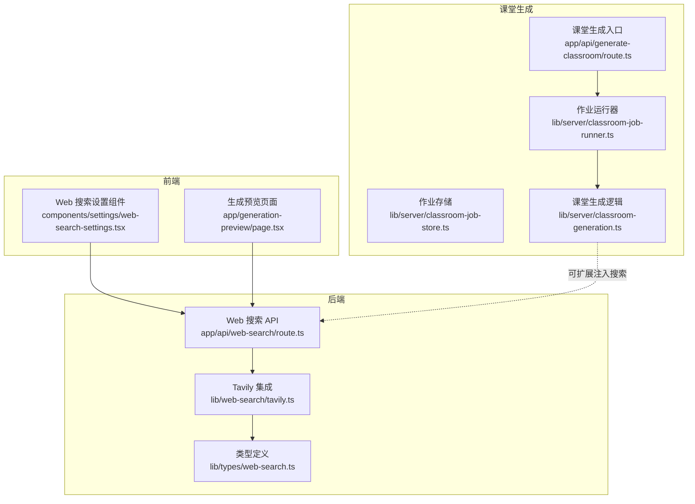
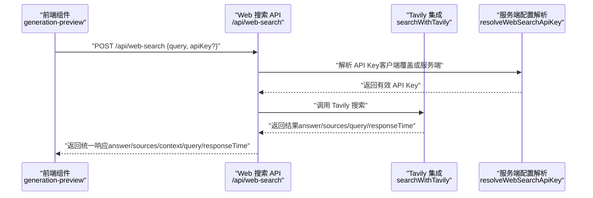
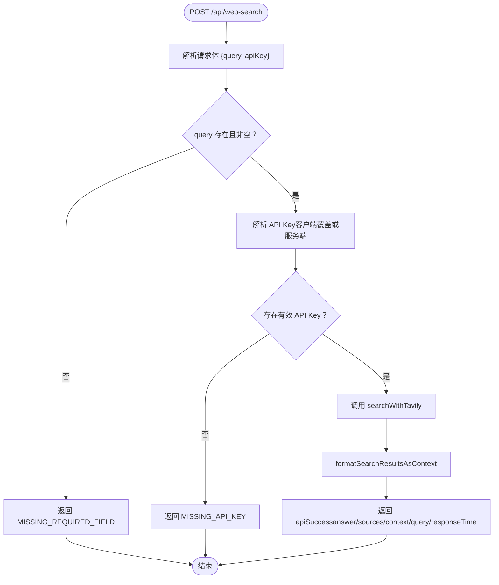
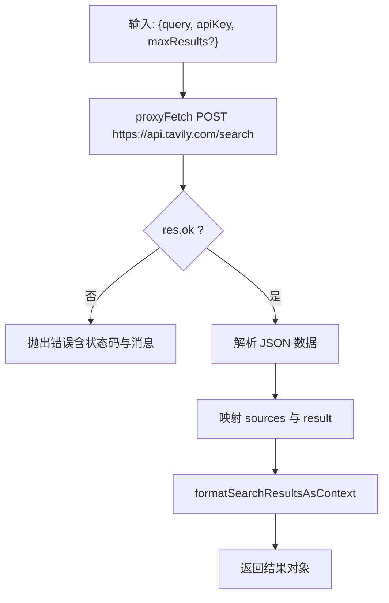
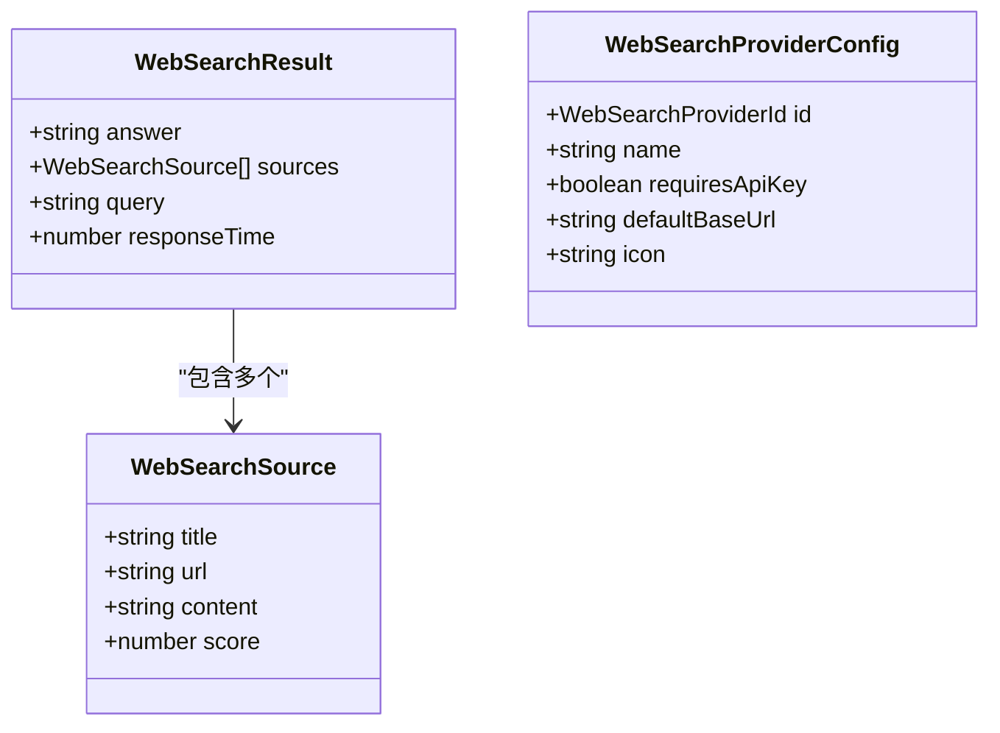
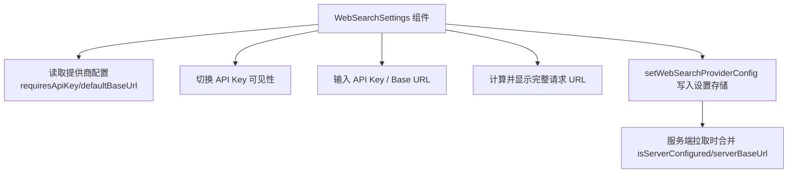
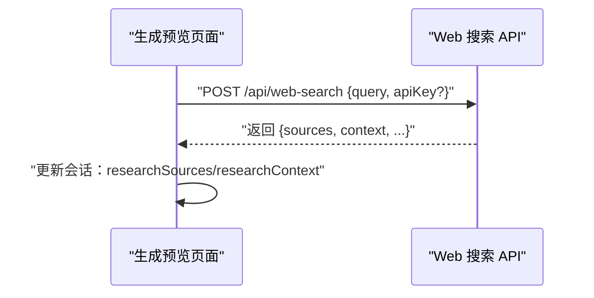
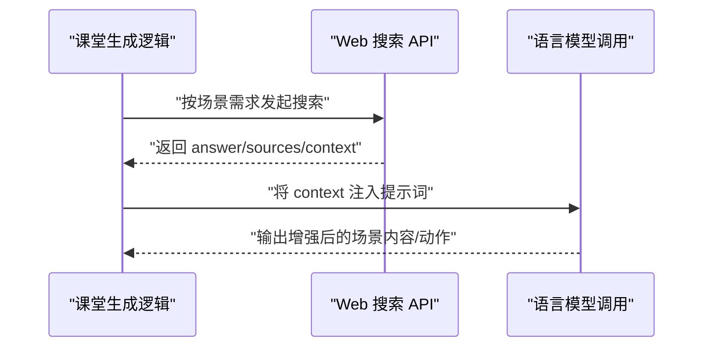
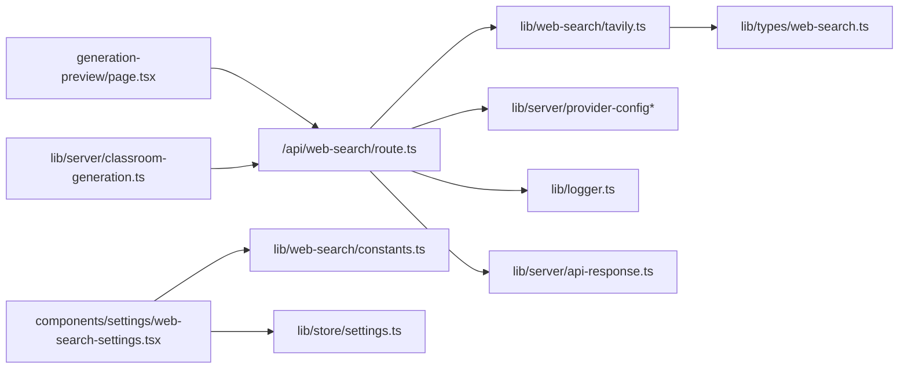

# 网络搜索集成

<cite>
**本文引用的文件**
- [app/api/web-search/route.ts](file://app/api/web-search/route.ts)
- [lib/web-search/tavily.ts](file://lib/web-search/tavily.ts)
- [lib/web-search/types.ts](file://lib/web-search/types.ts)
- [lib/web-search/constants.ts](file://lib/web-search/constants.ts)
- [lib/types/web-search.ts](file://lib/types/web-search.ts)
- [components/settings/web-search-settings.tsx](file://components/settings/web-search-settings.tsx)
- [lib/store/settings.ts](file://lib/store/settings.ts)
- [app/generation-preview/page.tsx](file://app/generation-preview/page.tsx)
- [lib/server/classroom-generation.ts](file://lib/server/classroom-generation.ts)
- [app/api/generate-classroom/route.ts](file://app/api/generate-classroom/route.ts)
- [app/api/generate-classroom/[jobId]/route.ts](file://app/api/generate-classroom/[jobId]/route.ts)
- [lib/server/classroom-job-runner.ts](file://lib/server/classroom-job-runner.ts)
- [lib/server/classroom-job-store.ts](file://lib/server/classroom-job-store.ts)
</cite>

## 目录
1. [简介](#简介)
2. [项目结构](#项目结构)
3. [核心组件](#核心组件)
4. [架构总览](#架构总览)
5. [详细组件分析](#详细组件分析)
6. [依赖关系分析](#依赖关系分析)
7. [性能考量](#性能考量)
8. [故障排查指南](#故障排查指南)
9. [结论](#结论)
10. [附录](#附录)

## 简介
本文件系统性阐述 OpenMAIC 的网络搜索集成功能，覆盖从接口设计、搜索引擎集成（当前为 Tavily）、结果格式化与上下文注入、到在课堂内容生成流程中的实际应用。文档同时给出配置项说明、缓存策略建议、质量评估与隐私保护策略，并通过图示与路径指引帮助读者快速定位实现细节。

## 项目结构
网络搜索相关代码主要分布在以下位置：
- 后端 API：负责接收查询、校验参数、调用搜索引擎、返回统一响应
- 搜索引擎适配层：封装 Tavily REST 调用与结果格式化
- 类型定义：统一 Web 搜索的数据模型
- 前端设置页：配置 API Key 与基础地址
- 前端使用点：在生成预览页面中发起搜索并将结果注入会话上下文
- 课堂生成流水线：作为生成阶段的一部分被调用（当前未直接内嵌搜索，但可扩展）

图表来源
- [app/api/web-search/route.ts:1-52](file://app/api/web-search/route.ts#L1-L52)
- [lib/web-search/tavily.ts:1-93](file://lib/web-search/tavily.ts#L1-L93)
- [lib/types/web-search.ts:1-14](file://lib/types/web-search.ts#L1-L14)
- [components/settings/web-search-settings.tsx:1-107](file://components/settings/web-search-settings.tsx#L1-L107)
- [app/generation-preview/page.tsx:306-340](file://app/generation-preview/page.tsx#L306-L340)
- [app/api/generate-classroom/route.ts:1-51](file://app/api/generate-classroom/route.ts#L1-L51)
- [lib/server/classroom-job-runner.ts:1-50](file://lib/server/classroom-job-runner.ts#L1-L50)
- [lib/server/classroom-job-store.ts:169-226](file://lib/server/classroom-job-store.ts#L169-L226)
- [lib/server/classroom-generation.ts:1-265](file://lib/server/classroom-generation.ts#L1-L265)

章节来源
- [app/api/web-search/route.ts:1-52](file://app/api/web-search/route.ts#L1-L52)
- [lib/web-search/tavily.ts:1-93](file://lib/web-search/tavily.ts#L1-L93)
- [lib/types/web-search.ts:1-14](file://lib/types/web-search.ts#L1-L14)
- [components/settings/web-search-settings.tsx:1-107](file://components/settings/web-search-settings.tsx#L1-L107)
- [app/generation-preview/page.tsx:306-340](file://app/generation-preview/page.tsx#L306-L340)
- [app/api/generate-classroom/route.ts:1-51](file://app/api/generate-classroom/route.ts#L1-L51)
- [lib/server/classroom-job-runner.ts:1-50](file://lib/server/classroom-job-runner.ts#L1-L50)
- [lib/server/classroom-job-store.ts:169-226](file://lib/server/classroom-job-store.ts#L169-L226)
- [lib/server/classroom-generation.ts:1-265](file://lib/server/classroom-generation.ts#L1-L265)

## 核心组件
- Web 搜索 API 控制器：接收查询请求，校验必填字段与密钥，调用搜索引擎并返回统一结构
- Tavily 集成：封装 Tavily REST 调用、错误处理、结果映射与上下文格式化
- 类型系统：定义搜索源与结果的结构，确保前后端一致
- 设置界面：支持客户端覆盖或服务端托管的 API Key 与基础地址
- 前端使用点：在生成预览中发起搜索并将上下文写入会话状态
- 课堂生成流水线：作为生成阶段的一部分，可扩展注入搜索能力

章节来源
- [app/api/web-search/route.ts:15-51](file://app/api/web-search/route.ts#L15-L51)
- [lib/web-search/tavily.ts:16-67](file://lib/web-search/tavily.ts#L16-L67)
- [lib/types/web-search.ts:1-14](file://lib/types/web-search.ts#L1-L14)
- [components/settings/web-search-settings.tsx:16-106](file://components/settings/web-search-settings.tsx#L16-L106)
- [app/generation-preview/page.tsx:306-340](file://app/generation-preview/page.tsx#L306-L340)
- [lib/server/classroom-generation.ts:86-264](file://lib/server/classroom-generation.ts#L86-L264)

## 架构总览
下图展示了从前端到后端、再到搜索引擎的整体调用链路，以及课堂生成阶段的扩展点。

图表来源
- [app/generation-preview/page.tsx:306-340](file://app/generation-preview/page.tsx#L306-L340)
- [app/api/web-search/route.ts:15-51](file://app/api/web-search/route.ts#L15-L51)
- [lib/web-search/tavily.ts:16-67](file://lib/web-search/tavily.ts#L16-L67)

## 详细组件分析

### Web 搜索 API 控制器
- 请求处理：解析 JSON，校验 query 必填；若客户端传入 apiKey，则优先使用；否则回退到服务端配置解析
- 错误处理：缺失字段、密钥未配置、内部异常均以统一错误响应返回
- 结果组装：调用搜索引擎并格式化为上下文字符串，一并返回 answer、sources、context、query、responseTime

图表来源
- [app/api/web-search/route.ts:15-51](file://app/api/web-search/route.ts#L15-L51)

章节来源
- [app/api/web-search/route.ts:15-51](file://app/api/web-search/route.ts#L15-L51)

### Tavily 集成与结果格式化
- 搜索调用：通过代理请求访问 Tavily 搜索端点，发送查询、深度、结果数与是否需要答案等参数
- 错误处理：对非 2xx 响应读取文本并抛出带状态码的错误
- 结果映射：将返回的字段映射为统一的 WebSearchSource 与 WebSearchResult
- 上下文格式化：将答案与来源列表拼接为 Markdown 片段，便于注入到 LLM 提示词中

图表来源
- [lib/web-search/tavily.ts:16-67](file://lib/web-search/tavily.ts#L16-L67)
- [lib/web-search/tavily.ts:72-92](file://lib/web-search/tavily.ts#L72-L92)

章节来源
- [lib/web-search/tavily.ts:16-67](file://lib/web-search/tavily.ts#L16-L67)
- [lib/web-search/tavily.ts:72-92](file://lib/web-search/tavily.ts#L72-L92)

### 类型系统与配置常量
- 类型定义：WebSearchSource 与 WebSearchResult 明确了搜索结果的数据结构
- 提供商常量：注册可用的 Web 搜索提供商（当前为 tavily），包含名称、是否需要 API Key、默认基础地址等元信息
- 提供商类型：WebSearchProviderId 与 WebSearchProviderConfig 定义了提供商的标识与配置

图表来源
- [lib/types/web-search.ts:1-14](file://lib/types/web-search.ts#L1-L14)
- [lib/web-search/types.ts:5-19](file://lib/web-search/types.ts#L5-L19)
- [lib/web-search/constants.ts:10-17](file://lib/web-search/constants.ts#L10-L17)

章节来源
- [lib/types/web-search.ts:1-14](file://lib/types/web-search.ts#L1-L14)
- [lib/web-search/types.ts:5-19](file://lib/web-search/types.ts#L5-L19)
- [lib/web-search/constants.ts:10-17](file://lib/web-search/constants.ts#L10-L17)

### 设置界面与服务端托管
- 设置组件：支持显示/隐藏 API Key、输入基础地址、预览最终请求 URL
- 服务端托管：当服务端已配置提供商时，界面提示“服务器已配置”，允许客户端可选覆盖
- 配置持久化：设置状态写入全局设置存储，并在拉取时合并服务端托管信息

图表来源
- [components/settings/web-search-settings.tsx:16-106](file://components/settings/web-search-settings.tsx#L16-L106)
- [lib/store/settings.ts:786-806](file://lib/store/settings.ts#L786-L806)

章节来源
- [components/settings/web-search-settings.tsx:16-106](file://components/settings/web-search-settings.tsx#L16-L106)
- [lib/store/settings.ts:786-806](file://lib/store/settings.ts#L786-L806)

### 前端使用点：在生成预览中集成搜索
- 发起搜索：在生成预览页面中，根据当前会话需求构造查询，调用 /api/web-search
- 处理响应：解析 sources 并写入研究来源列表；将 context 注入会话，以便后续生成步骤使用
- 中断与容错：支持 AbortSignal 中断；非 2xx 响应抛出错误并提示

图表来源
- [app/generation-preview/page.tsx:306-340](file://app/generation-preview/page.tsx#L306-L340)

章节来源
- [app/generation-preview/page.tsx:306-340](file://app/generation-preview/page.tsx#L306-L340)

### 课堂生成流水线中的搜索集成（扩展）
- 当前实现：课堂生成主流程不直接调用网络搜索，但其生成阶段（大纲、场景内容、动作）可扩展注入搜索结果作为上下文
- 扩展建议：在生成场景内容或动作之前，插入一次网络搜索调用，将 context 注入到 LLM 的 system/user 提示词中，以增强事实性与时效性

图表来源
- [lib/server/classroom-generation.ts:86-264](file://lib/server/classroom-generation.ts#L86-L264)
- [app/api/web-search/route.ts:15-51](file://app/api/web-search/route.ts#L15-L51)

章节来源
- [lib/server/classroom-generation.ts:86-264](file://lib/server/classroom-generation.ts#L86-L264)
- [app/api/web-search/route.ts:15-51](file://app/api/web-search/route.ts#L15-L51)

## 依赖关系分析
- 组件耦合
  - Web 搜索 API 依赖于提供商配置解析与日志、统一响应工具
  - Tavily 集成依赖代理请求工具与类型定义
  - 前端设置组件依赖提供商常量与全局设置存储
  - 课堂生成逻辑依赖模型解析与持久化工具
- 外部依赖
  - Tavily REST API：POST https://api.tavily.com/search
  - Next.js 路由与中间件：用于作业轮询与后台执行
- 潜在循环依赖
  - 当前模块间为单向依赖，无明显循环

图表来源
- [app/api/web-search/route.ts:8-11](file://app/api/web-search/route.ts#L8-L11)
- [lib/web-search/tavily.ts:8-9](file://lib/web-search/tavily.ts#L8-L9)
- [lib/types/web-search.ts:1-14](file://lib/types/web-search.ts#L1-L14)
- [app/generation-preview/page.tsx:309](file://app/generation-preview/page.tsx#L309)
- [components/settings/web-search-settings.tsx:8](file://components/settings/web-search-settings.tsx#L8)
- [lib/web-search/constants.ts:5](file://lib/web-search/constants.ts#L5)
- [lib/store/settings.ts:786-806](file://lib/store/settings.ts#L786-L806)
- [lib/server/classroom-generation.ts:1-265](file://lib/server/classroom-generation.ts#L1-L265)

章节来源
- [app/api/web-search/route.ts:8-11](file://app/api/web-search/route.ts#L8-L11)
- [lib/web-search/tavily.ts:8-9](file://lib/web-search/tavily.ts#L8-L9)
- [lib/types/web-search.ts:1-14](file://lib/types/web-search.ts#L1-L14)
- [app/generation-preview/page.tsx:309](file://app/generation-preview/page.tsx#L309)
- [components/settings/web-search-settings.tsx:8](file://components/settings/web-search-settings.tsx#L8)
- [lib/web-search/constants.ts:5](file://lib/web-search/constants.ts#L5)
- [lib/store/settings.ts:786-806](file://lib/store/settings.ts#L786-L806)
- [lib/server/classroom-generation.ts:1-265](file://lib/server/classroom-generation.ts#L1-L265)

## 性能考量
- 搜索并发与节流
  - 在前端发起搜索时，建议使用 AbortController 与去抖动策略，避免频繁重复请求
  - 对相同查询进行本地缓存（见“缓存策略”），减少重复网络开销
- 结果数量与质量
  - maxResults 参数可控制返回条目数，默认值可在调用处调整
  - 上下文格式化仅截取部分摘要，避免提示词过长影响性能
- 代理与超时
  - 使用代理请求工具统一处理跨域与代理，建议设置合理超时与重试
- 课堂生成中的搜索
  - 将搜索置于场景生成前，减少重复搜索；对失败场景进行降级处理（保留已有上下文）

## 故障排查指南
- 常见错误与定位
  - 缺少必填字段：检查请求体是否包含非空 query
  - 缺少 API Key：确认设置界面已填写或服务端已托管；检查环境变量
  - Tavily 返回非 2xx：查看响应状态与错误文本，核对密钥与配额
  - 生成预览无法加载搜索：确认 /api/web-search 可达，检查网络与代理配置
- 日志与可观测性
  - 后端控制器记录错误堆栈；建议在生产环境开启结构化日志
- 课堂生成中的问题
  - 若搜索失败，可跳过该步骤并使用已有上下文继续生成，保证流程可用性

章节来源
- [app/api/web-search/route.ts:23-34](file://app/api/web-search/route.ts#L23-L34)
- [lib/web-search/tavily.ts:37-40](file://lib/web-search/tavily.ts#L37-L40)
- [app/generation-preview/page.tsx:319-322](file://app/generation-preview/page.tsx#L319-L322)

## 结论
OpenMAIC 的网络搜索集成以简洁可控的方式接入 Tavily，提供统一的结果结构与上下文格式化能力。前端设置界面支持客户端覆盖与服务端托管，满足多租户与安全策略需求。当前课堂生成流程未直接内嵌搜索，但具备清晰的扩展点，可在场景生成前注入搜索结果以提升内容质量与时效性。建议结合缓存与节流策略优化性能，并在生产环境完善日志与监控。

## 附录

### 搜索配置选项说明
- 搜索提供商
  - 当前支持：tavily（名称、是否需要 API Key、默认基础地址）
- API Key 与基础地址
  - 支持客户端覆盖或服务端托管；服务端托管时界面提示“服务器已配置”
- 结果数量控制
  - 调用处可设置 maxResults（默认值可在实现中调整）
- 上下文格式化
  - 将答案与来源列表格式化为 Markdown 片段，便于注入 LLM 提示词

章节来源
- [lib/web-search/constants.ts:10-17](file://lib/web-search/constants.ts#L10-L17)
- [components/settings/web-search-settings.tsx:43-103](file://components/settings/web-search-settings.tsx#L43-L103)
- [lib/web-search/tavily.ts:16-21](file://lib/web-search/tavily.ts#L16-L21)
- [lib/web-search/tavily.ts:72-92](file://lib/web-search/tavily.ts#L72-L92)

### 网络搜索 API 接口设计
- 端点
  - POST /api/web-search
- 请求体
  - query: string（必填）
  - apiKey: string（可选，客户端覆盖）
- 响应
  - answer: string
  - sources: 数组（包含 title/url/content/score）
  - context: string（Markdown 上下文片段）
  - query: string
  - responseTime: number

章节来源
- [app/api/web-search/route.ts:15-51](file://app/api/web-search/route.ts#L15-L51)
- [lib/types/web-search.ts:8-13](file://lib/types/web-search.ts#L8-L13)

### 缓存策略建议
- 本地缓存
  - 以 query 为键缓存最近 N 条搜索结果，有效期可设为 10-30 分钟
- 会话内复用
  - 在生成预览中，同一会话内的多次生成可复用已有的 context 与 sources
- 服务端缓存（可选）
  - 对热点查询在服务端进行短期缓存，降低第三方调用频率

### 搜索结果质量评估
- 评分与排序
  - 利用返回的 score 进行初步筛选，优先选择高分来源
- 内容长度与相关性
  - 截取摘要长度（如 200 字）以平衡信息密度与提示词长度
- 事实性与时效性
  - 优先选择权威来源与近期内容；对时效性要求高的主题可增加时间过滤

### 隐私保护策略
- 密钥管理
  - 优先使用服务端托管 API Key，避免在客户端暴露
  - 设置最小权限与配额限制，定期轮换密钥
- 数据最小化
  - 仅传输必要查询与来源摘要，避免泄露用户隐私
- 透明度与审计
  - 记录关键操作（如搜索触发、来源选择），便于审计与合规

### 在不同教学场景中的应用
- 资料收集
  - 为课程主题生成初始背景资料，结合搜索结果与教材内容
- 事实验证
  - 在生成预览中对关键事实进行交叉验证，标注来源
- 背景知识补充
  - 在课堂生成前注入最新研究成果或政策动态，提升内容时效性