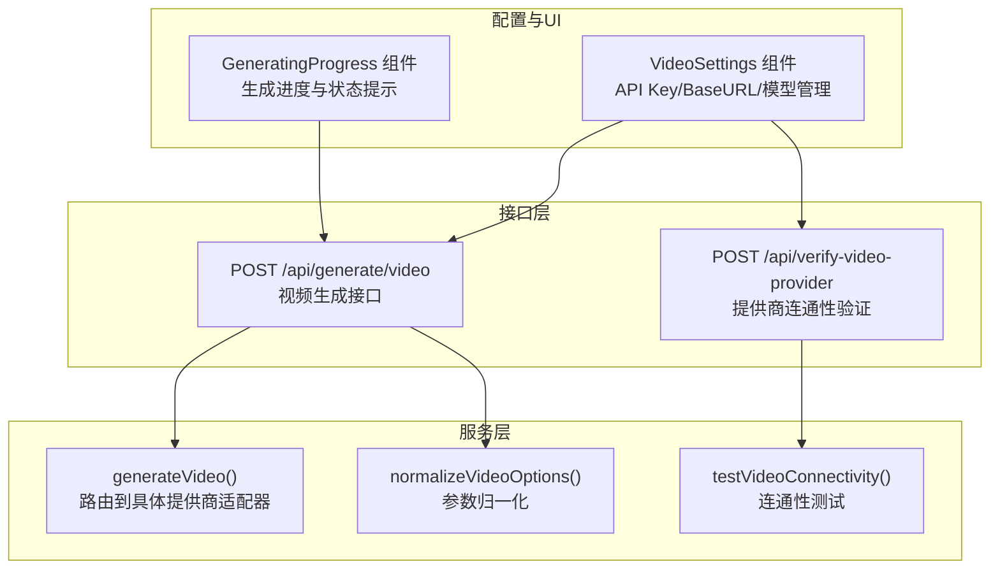
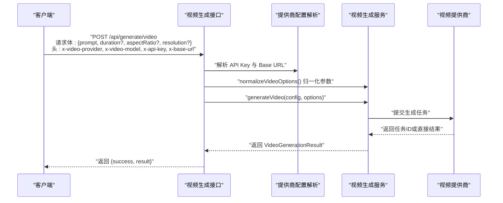
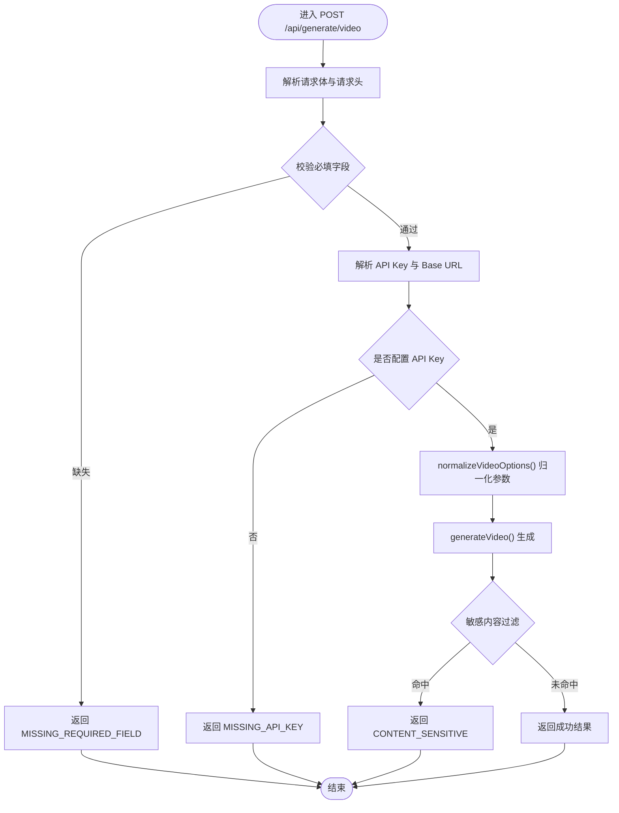
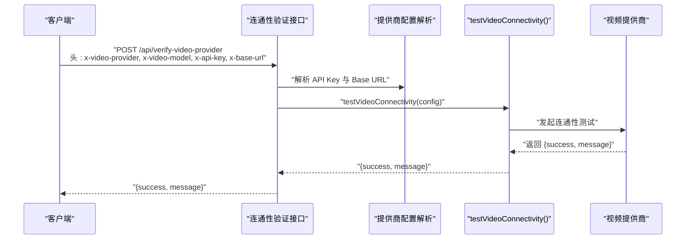
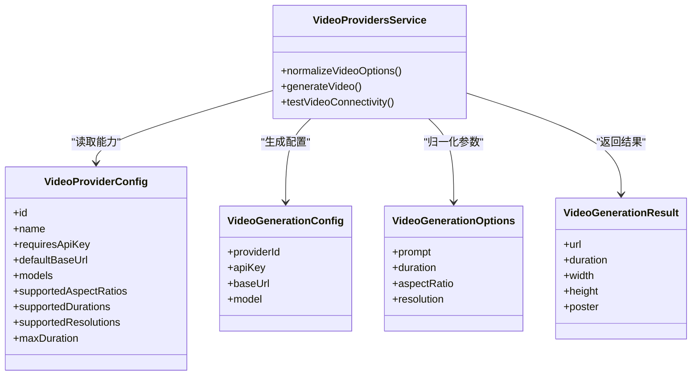
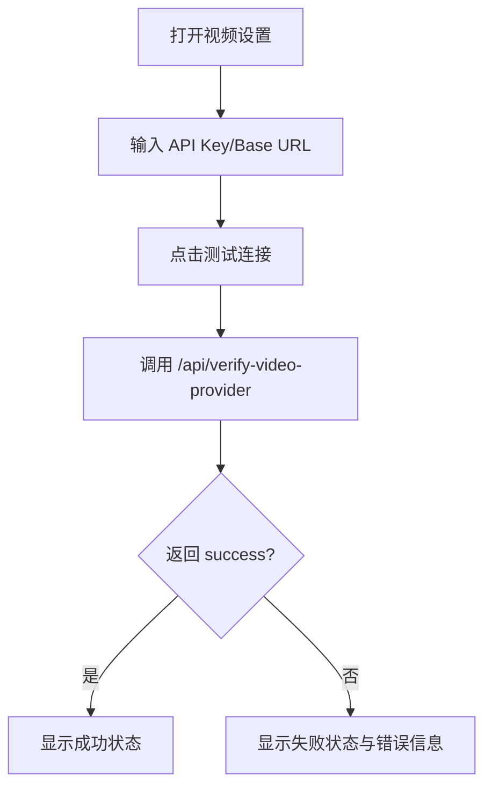
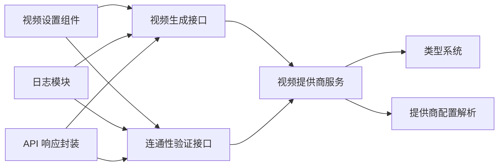

# 视频处理

<cite>
**本文引用的文件**
- [app/api/generate/video/route.ts](file://app/api/generate/video/route.ts)
- [app/api/verify-video-provider/route.ts](file://app/api/verify-video-provider/route.ts)
- [lib/media/video-providers.ts](file://lib/media/video-providers.ts)
- [lib/media/types.ts](file://lib/media/types.ts)
- [components/settings/video-settings.tsx](file://components/settings/video-settings.tsx)
- [lib/server/provider-config.ts](file://lib/server/provider-config.ts)
- [lib/server/api-response.ts](file://lib/server/api-response.ts)
- [lib/logger.ts](file://lib/logger.ts)
- [components/generation/generating-progress.tsx](file://components/generation/generating-progress.tsx)
</cite>

## 目录
1. [简介](#简介)
2. [项目结构](#项目结构)
3. [核心组件](#核心组件)
4. [架构总览](#架构总览)
5. [详细组件分析](#详细组件分析)
6. [依赖关系分析](#依赖关系分析)
7. [性能考虑](#性能考虑)
8. [故障排查指南](#故障排查指南)
9. [结论](#结论)
10. [附录](#附录)

## 简介
本章节概述 OpenMAIC 的视频处理能力与目标：通过统一的视频生成 API，支持多提供商（Seedance、Kling、Veo、Sora）的文本到视频生成任务；提供配置化能力以适配不同提供商的分辨率、时长与宽高比限制；并通过前端设置界面与验证接口保障可用性与安全性。同时，文档将说明如何在课堂内容中集成视频生成流程，涵盖上传、处理进度跟踪与结果下载链接生成。

## 项目结构
视频处理功能由三层组成：
- 接口层：提供视频生成与提供商连通性验证的 REST 接口
- 服务层：统一路由至各提供商适配器，负责参数归一化与任务提交
- 配置与 UI 层：提供提供商密钥、基础地址与模型管理，以及连通性测试与状态提示

图表来源
- [app/api/generate/video/route.ts:30-83](file://app/api/generate/video/route.ts#L30-L83)
- [app/api/verify-video-provider/route.ts:26-56](file://app/api/verify-video-provider/route.ts#L26-L56)
- [lib/media/video-providers.ts:97-155](file://lib/media/video-providers.ts#L97-L155)
- [components/settings/video-settings.tsx:71-99](file://components/settings/video-settings.tsx#L71-L99)
- [components/generation/generating-progress.tsx:57-140](file://components/generation/generating-progress.tsx#L57-L140)

章节来源
- [app/api/generate/video/route.ts:1-84](file://app/api/generate/video/route.ts#L1-L84)
- [app/api/verify-video-provider/route.ts:1-57](file://app/api/verify-video-provider/route.ts#L1-L57)
- [lib/media/video-providers.ts:1-156](file://lib/media/video-providers.ts#L1-L156)
- [components/settings/video-settings.tsx:1-342](file://components/settings/video-settings.tsx#L1-L342)
- [components/generation/generating-progress.tsx:1-141](file://components/generation/generating-progress.tsx#L1-L141)

## 核心组件
- 视频生成接口：接收请求体与头部参数，解析提供商、模型、密钥与基础地址，进行参数归一化后调用生成函数，并返回结果或错误
- 连通性验证接口：用于在不实际生成视频的前提下校验提供商凭据与网络可达性
- 视频提供商服务：集中定义各提供商的能力边界（支持的宽高比、时长、分辨率、最大时长），并提供参数归一化与生成路由
- 类型系统：统一定义视频生成配置、选项与结果的数据结构，确保跨提供商的一致性
- 设置与 UI：提供 API Key、Base URL 与自定义模型的管理，以及连通性测试按钮与状态反馈
- 日志与响应：统一的日志记录与 API 响应封装，便于调试与错误上报

章节来源
- [app/api/generate/video/route.ts:30-83](file://app/api/generate/video/route.ts#L30-L83)
- [app/api/verify-video-provider/route.ts:26-56](file://app/api/verify-video-provider/route.ts#L26-L56)
- [lib/media/video-providers.ts:97-155](file://lib/media/video-providers.ts#L97-L155)
- [lib/media/types.ts:175-321](file://lib/media/types.ts#L175-L321)
- [components/settings/video-settings.tsx:63-99](file://components/settings/video-settings.tsx#L63-L99)
- [lib/logger.ts:28-52](file://lib/logger.ts#L28-L52)
- [lib/server/api-response.ts](file://lib/server/api-response.ts)

## 架构总览
视频处理采用“异步任务模式”（提交→轮询），接口最大执行时间为 300 秒。整体流程如下：

图表来源
- [app/api/generate/video/route.ts:30-83](file://app/api/generate/video/route.ts#L30-L83)
- [lib/media/video-providers.ts:97-155](file://lib/media/video-providers.ts#L97-L155)
- [lib/server/provider-config.ts](file://lib/server/provider-config.ts)
- [lib/media/types.ts:241-269](file://lib/media/types.ts#L241-L269)

## 详细组件分析

### 视频生成接口（POST /api/generate/video）
- 请求与响应
  - 请求头：x-video-provider（默认 seedance）、x-video-model、x-api-key、x-base-url
  - 请求体：prompt 必填，duration、aspectRatio、resolution 可选
  - 响应：包含 success 与 result 或错误信息
- 处理逻辑
  - 校验必填字段
  - 解析提供商密钥与基础地址（支持服务器回退）
  - 参数归一化（时长、宽高比、分辨率）
  - 调用生成函数并记录日志
  - 对敏感内容过滤进行特殊处理
- 错误处理
  - 缺少 API Key、上游错误、内部错误等分类返回

图表来源
- [app/api/generate/video/route.ts:30-83](file://app/api/generate/video/route.ts#L30-L83)

章节来源
- [app/api/generate/video/route.ts:1-84](file://app/api/generate/video/route.ts#L1-L84)

### 连通性验证接口（POST /api/verify-video-provider）
- 作用：在不生成视频的前提下验证提供商凭据与网络可达性
- 请求头：x-video-provider、x-video-model、x-api-key、x-base-url
- 返回：success 与 message

图表来源
- [app/api/verify-video-provider/route.ts:26-56](file://app/api/verify-video-provider/route.ts#L26-L56)
- [lib/media/video-providers.ts:79-95](file://lib/media/video-providers.ts#L79-L95)

章节来源
- [app/api/verify-video-provider/route.ts:1-57](file://app/api/verify-video-provider/route.ts#L1-L57)

### 视频提供商服务与参数归一化
- 提供商能力注册：包含名称、是否需要 API Key、默认 Base URL、支持的宽高比、时长、分辨率、最大时长等
- 参数归一化策略：
  - 时长：若未设置或不受支持，则使用第一个受支持值
  - 宽高比：若未设置或不受支持，则使用第一个受支持值
  - 分辨率：若未设置或不受支持，则使用第一个受支持值
- 生成路由：根据 providerId 路由到对应适配器

图表来源
- [lib/media/video-providers.ts:16-77](file://lib/media/video-providers.ts#L16-L77)
- [lib/media/video-providers.ts:97-155](file://lib/media/video-providers.ts#L97-L155)
- [lib/media/types.ts:195-269](file://lib/media/types.ts#L195-L269)

章节来源
- [lib/media/video-providers.ts:1-156](file://lib/media/video-providers.ts#L1-L156)
- [lib/media/types.ts:175-321](file://lib/media/types.ts#L175-L321)

### 视频设置与连通性测试（前端）
- 功能点
  - API Key 明文/密文切换显示
  - Base URL 输入与生效展示
  - 内置模型与自定义模型列表
  - 添加/编辑/删除自定义模型
  - 连通性测试按钮与状态反馈
- 行为
  - 测试时携带当前选择的提供商、模型、API Key 与 Base URL
  - 成功/失败分别展示绿色/红色反馈

图表来源
- [components/settings/video-settings.tsx:71-99](file://components/settings/video-settings.tsx#L71-L99)

章节来源
- [components/settings/video-settings.tsx:1-342](file://components/settings/video-settings.tsx#L1-L342)

### 生成进度与状态提示（前端）
- 用于展示生成过程中的里程碑与实时状态
- 包含大纲完成、第一页生成完成、错误状态与动态加载提示

章节来源
- [components/generation/generating-progress.tsx:1-141](file://components/generation/generating-progress.tsx#L1-L141)

## 依赖关系分析
- 接口层依赖服务层与配置解析模块
- 服务层依赖类型系统与提供商适配器
- UI 层依赖接口层与本地存储
- 日志与响应封装贯穿各层

图表来源
- [app/api/generate/video/route.ts:19-24](file://app/api/generate/video/route.ts#L19-L24)
- [app/api/verify-video-provider/route.ts:17-21](file://app/api/verify-video-provider/route.ts#L17-L21)
- [lib/media/video-providers.ts:1-156](file://lib/media/video-providers.ts#L1-L156)
- [lib/media/types.ts:175-321](file://lib/media/types.ts#L175-L321)
- [lib/server/provider-config.ts](file://lib/server/provider-config.ts)
- [lib/logger.ts:28-52](file://lib/logger.ts#L28-L52)
- [lib/server/api-response.ts](file://lib/server/api-response.ts)

章节来源
- [app/api/generate/video/route.ts:1-84](file://app/api/generate/video/route.ts#L1-L84)
- [app/api/verify-video-provider/route.ts:1-57](file://app/api/verify-video-provider/route.ts#L1-L57)
- [lib/media/video-providers.ts:1-156](file://lib/media/video-providers.ts#L1-L156)
- [lib/media/types.ts:175-321](file://lib/media/types.ts#L175-L321)
- [lib/server/provider-config.ts](file://lib/server/provider-config.ts)
- [lib/logger.ts:1-53](file://lib/logger.ts#L1-L53)
- [lib/server/api-response.ts](file://lib/server/api-response.ts)

## 性能考虑
- 异步任务模式：接口最大执行时间限制为 300 秒，适合长耗时任务
- 参数归一化：避免无效请求导致的重试与资源浪费
- 日志级别与格式：可通过环境变量控制日志输出，便于生产环境性能观测
- 前端状态反馈：通过进度组件减少用户等待焦虑，提升交互体验

章节来源
- [app/api/generate/video/route.ts](file://app/api/generate/video/route.ts#L28)
- [lib/logger.ts:4-11](file://lib/logger.ts#L4-L11)

## 故障排查指南
- 缺少 API Key
  - 现象：返回 MISSING_API_KEY
  - 处理：在视频设置中填写或覆盖 API Key
- 敏感内容过滤
  - 现象：返回 CONTENT_SENSITIVE
  - 处理：修改提示词，避免敏感内容
- 上游错误
  - 现象：返回 UPSTREAM_ERROR
  - 处理：检查提供商连通性与凭据有效性
- 内部错误
  - 现象：返回 INTERNAL_ERROR
  - 处理：查看日志定位异常并修复

章节来源
- [app/api/generate/video/route.ts:75-82](file://app/api/generate/video/route.ts#L75-L82)
- [app/api/verify-video-provider/route.ts:47-49](file://app/api/verify-video-provider/route.ts#L47-L49)
- [lib/server/api-response.ts](file://lib/server/api-response.ts)

## 结论
OpenMAIC 的视频处理功能通过统一的接口与类型系统，实现了对多家提供商的抽象与参数归一化，结合前端设置与进度反馈，提供了从配置到生成的完整链路。在教学场景中，可基于该能力快速生成适配不同平台与设备的视频素材，满足多样化教学需求。

## 附录

### 视频处理 API 接口定义
- 视频生成
  - 方法与路径：POST /api/generate/video
  - 请求头：
    - x-video-provider：提供商标识（默认 seedance）
    - x-video-model：模型标识（可选）
    - x-api-key：API 密钥（可选，支持服务器回退）
    - x-base-url：基础地址（可选，支持服务器回退）
  - 请求体：
    - prompt：必填
    - duration：可选（秒）
    - aspectRatio：可选（支持的宽高比）
    - resolution：可选（支持的分辨率）
  - 响应：
    - 成功：{ success: true, result: VideoGenerationResult }
    - 失败：{ success: false, error: string }

- 连通性验证
  - 方法与路径：POST /api/verify-video-provider
  - 请求头：同上
  - 响应：{ success: boolean, message: string }

章节来源
- [app/api/generate/video/route.ts:1-17](file://app/api/generate/video/route.ts#L1-L17)
- [app/api/verify-video-provider/route.ts:1-15](file://app/api/verify-video-provider/route.ts#L1-L15)

### 配置选项与参数归一化
- 支持的提供商能力
  - Seedance：支持多种模型、时长与分辨率，最大时长受限
  - Kling：支持特定模型与时长
  - Veo：支持特定模型与时长，分辨率受限
  - Sora：支持更长时长，模型集合可扩展
- 参数归一化规则
  - 时长：若未设置或不受支持，使用首个受支持值
  - 宽高比：若未设置或不受支持，使用首个受支持值
  - 分辨率：若未设置或不受支持，使用首个受支持值

章节来源
- [lib/media/video-providers.ts:16-77](file://lib/media/video-providers.ts#L16-L77)
- [lib/media/video-providers.ts:102-139](file://lib/media/video-providers.ts#L102-L139)

### 在课堂内容中集成视频处理的实践步骤
- 配置阶段
  - 在视频设置中填写或覆盖 API Key 与 Base URL
  - 使用“测试连接”验证提供商连通性
  - 如需，添加自定义模型并保存
- 生成阶段
  - 调用视频生成接口，传入 prompt、时长、宽高比与分辨率
  - 记录返回的视频链接与元数据
- 展示阶段
  - 在课堂页面嵌入视频播放器
  - 提供下载链接以便学生课后学习

章节来源
- [components/settings/video-settings.tsx:71-99](file://components/settings/video-settings.tsx#L71-L99)
- [app/api/generate/video/route.ts:30-83](file://app/api/generate/video/route.ts#L30-L83)
- [components/generation/generating-progress.tsx:57-140](file://components/generation/generating-progress.tsx#L57-L140)

### 教学场景应用建议
- 教学视频剪辑
  - 利用参数归一化保证输出尺寸与平台一致
  - 通过连通性测试确保生成稳定性
- 效果添加
  - 在 UI 中提供预设模板（时长、宽高比、分辨率）
  - 通过进度组件反馈生成状态
- 格式适配
  - 依据提供商能力选择合适的分辨率与时长
  - 将生成结果与课堂内容元素（如讲义、演示）关联

章节来源
- [lib/media/video-providers.ts:102-139](file://lib/media/video-providers.ts#L102-L139)
- [components/generation/generating-progress.tsx:57-140](file://components/generation/generating-progress.tsx#L57-L140)