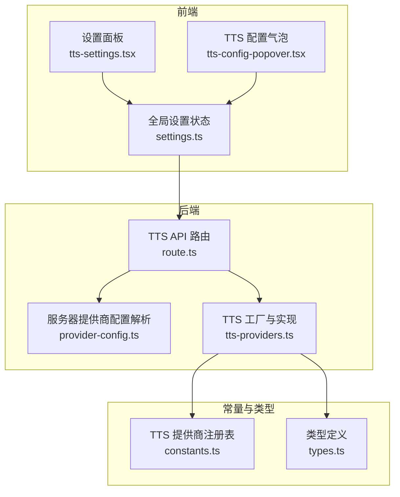
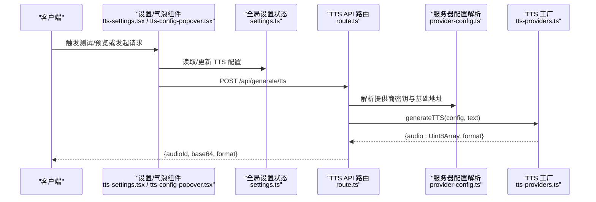
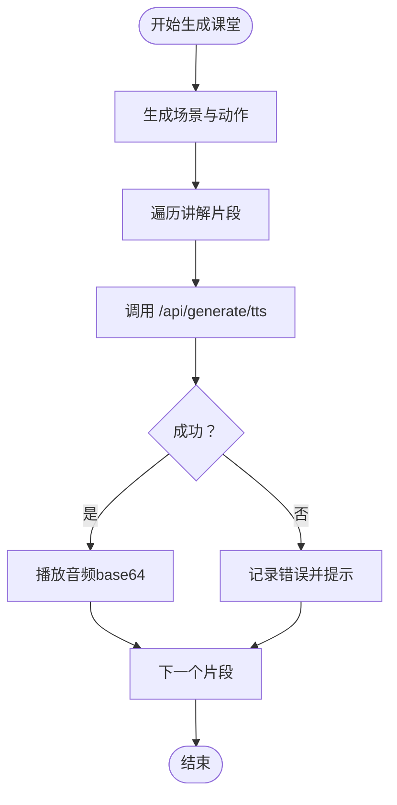
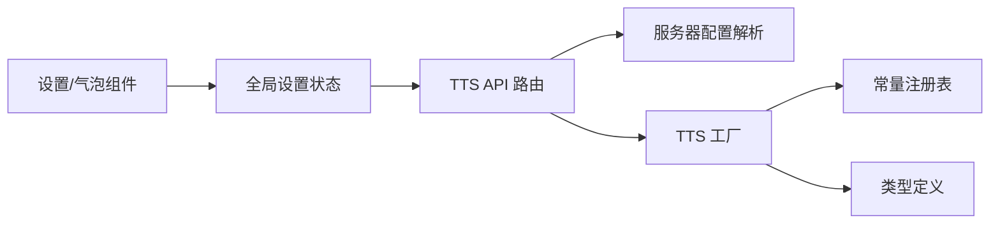

# 语音合成 (TTS)

<cite>
**本文引用的文件**
- [app/api/generate/tts/route.ts](file://app/api/generate/tts/route.ts)
- [lib/audio/tts-providers.ts](file://lib/audio/tts-providers.ts)
- [lib/audio/constants.ts](file://lib/audio/constants.ts)
- [lib/audio/types.ts](file://lib/audio/types.ts)
- [lib/server/provider-config.ts](file://lib/server/provider-config.ts)
- [components/settings/tts-settings.tsx](file://components/settings/tts-settings.tsx)
- [components/audio/tts-config-popover.tsx](file://components/audio/tts-config-popover.tsx)
- [lib/store/settings.ts](file://lib/store/settings.ts)
- [lib/types/settings.ts](file://lib/types/settings.ts)
- [app/api/classroom/route.ts](file://app/api/classroom/route.ts)
- [lib/server/classroom-generation.ts](file://lib/server/classroom-generation.ts)
- [components/audio/speech-button.tsx](file://components/audio/speech-button.tsx)
</cite>

## 目录
1. [简介](#简介)
2. [项目结构](#项目结构)
3. [核心组件](#核心组件)
4. [架构总览](#架构总览)
5. [详细组件分析](#详细组件分析)
6. [依赖关系分析](#依赖关系分析)
7. [性能考虑](#性能考虑)
8. [故障排除指南](#故障排除指南)
9. [结论](#结论)
10. [附录](#附录)

## 简介
本文件系统性梳理 OpenMAIC 的语音合成（Text-to-Speech, TTS）能力，覆盖多语音提供商集成（OpenAI、Azure、智谱/GLM、通义/Qwen、浏览器原生 Web Speech API）、声音配置与播放控制、API 设计与错误处理、课堂应用场景以及性能优化与故障排除建议。读者可据此在课堂中实现教师语音讲解、学生朗读练习、PBL 场景引导等教学功能。

## 项目结构
TTS 能力由“前端设置与交互”、“后端 API 路由”、“服务器侧提供商配置解析”、“统一的 TTS 提供商工厂”四部分协同构成，同时通过全局状态管理持久化用户偏好与提供商配置。

图示来源
- [app/api/generate/tts/route.ts:1-81](file://app/api/generate/tts/route.ts#L1-L81)
- [lib/audio/tts-providers.ts:1-357](file://lib/audio/tts-providers.ts#L1-L357)
- [lib/audio/constants.ts:1-866](file://lib/audio/constants.ts#L1-L866)
- [lib/audio/types.ts:1-173](file://lib/audio/types.ts#L1-L173)
- [lib/server/provider-config.ts:1-398](file://lib/server/provider-config.ts#L1-L398)
- [components/settings/tts-settings.tsx:1-275](file://components/settings/tts-settings.tsx#L1-L275)
- [components/audio/tts-config-popover.tsx:1-185](file://components/audio/tts-config-popover.tsx#L1-L185)
- [lib/store/settings.ts:1-1053](file://lib/store/settings.ts#L1-L1053)

章节来源
- [app/api/generate/tts/route.ts:1-81](file://app/api/generate/tts/route.ts#L1-L81)
- [lib/audio/tts-providers.ts:1-357](file://lib/audio/tts-providers.ts#L1-L357)
- [lib/audio/constants.ts:1-866](file://lib/audio/constants.ts#L1-L866)
- [lib/audio/types.ts:1-173](file://lib/audio/types.ts#L1-L173)
- [lib/server/provider-config.ts:1-398](file://lib/server/provider-config.ts#L1-L398)
- [components/settings/tts-settings.tsx:1-275](file://components/settings/tts-settings.tsx#L1-L275)
- [components/audio/tts-config-popover.tsx:1-185](file://components/audio/tts-config-popover.tsx#L1-L185)
- [lib/store/settings.ts:1-1053](file://lib/store/settings.ts#L1-L1053)

## 核心组件
- TTS API 路由：接收客户端请求，校验参数，解析服务器侧提供商配置，调用工厂生成音频并返回 base64。
- TTS 工厂与实现：按提供商 ID 分发到具体实现，负责参数转换、鉴权头、SSML 构造、URL 下载等。
- 服务器提供商配置解析：从 YAML/环境变量加载密钥与基础地址，支持客户端覆盖。
- 前端设置与交互：提供测试 TTS、预览、切换提供商与声音、语速调节等能力。
- 全局设置状态：持久化存储 TTS 开关、提供商、声音、语速、音量、自动播放等。

章节来源
- [app/api/generate/tts/route.ts:21-80](file://app/api/generate/tts/route.ts#L21-L80)
- [lib/audio/tts-providers.ts:106-141](file://lib/audio/tts-providers.ts#L106-L141)
- [lib/server/provider-config.ts:266-274](file://lib/server/provider-config.ts#L266-L274)
- [components/settings/tts-settings.tsx:59-139](file://components/settings/tts-settings.tsx#L59-L139)
- [lib/store/settings.ts:454-530](file://lib/store/settings.ts#L454-L530)

## 架构总览
下图展示一次 TTS 请求从客户端到各层组件的调用链路与职责边界。

图示来源
- [components/settings/tts-settings.tsx:92-128](file://components/settings/tts-settings.tsx#L92-L128)
- [components/audio/tts-config-popover.tsx:65-98](file://components/audio/tts-config-popover.tsx#L65-L98)
- [lib/store/settings.ts:517-525](file://lib/store/settings.ts#L517-L525)
- [app/api/generate/tts/route.ts:48-71](file://app/api/generate/tts/route.ts#L48-L71)
- [lib/server/provider-config.ts:266-274](file://lib/server/provider-config.ts#L266-L274)
- [lib/audio/tts-providers.ts:106-141](file://lib/audio/tts-providers.ts#L106-L141)

## 详细组件分析

### API 接口设计与错误处理
- 终结点：POST /api/generate/tts
- 请求体字段
  - text: 必填，待合成文本
  - audioId: 必填，用于标识本次音频
  - ttsProviderId: 必填，提供商 ID
  - ttsVoice: 必填，声音 ID
  - ttsSpeed: 可选，语速（数值）
  - ttsApiKey: 可选，覆盖用的密钥
  - ttsBaseUrl: 可选，覆盖用的基础地址
- 响应体字段
  - success: 布尔
  - audioId: 字符串
  - base64: 字符串（base64 编码的二进制音频）
  - format: 字符串（音频格式）
- 错误处理
  - 参数缺失：返回 400
  - 浏览器原生提供商必须在客户端处理：返回 400
  - 通用异常：返回 500 并记录日志

章节来源
- [app/api/generate/tts/route.ts:21-80](file://app/api/generate/tts/route.ts#L21-L80)

### 多提供商集成与实现要点
- OpenAI TTS：直接 API 调用，UTF-8 编码，返回 mp3
- Azure TTS：构造 SSML，发送 application/ssml+xml，返回 mp3
- 智谱 GLM：发送 JSON，返回 wav
- 通义 Qwen：返回音频 URL，二次下载，返回 wav
- 浏览器原生：仅支持客户端 Web Speech API，服务端抛错

章节来源
- [lib/audio/tts-providers.ts:146-177](file://lib/audio/tts-providers.ts#L146-L177)
- [lib/audio/tts-providers.ts:182-217](file://lib/audio/tts-providers.ts#L182-L217)
- [lib/audio/tts-providers.ts:222-260](file://lib/audio/tts-providers.ts#L222-L260)
- [lib/audio/tts-providers.ts:265-317](file://lib/audio/tts-providers.ts#L265-L317)
- [lib/audio/tts-providers.ts:133-136](file://lib/audio/tts-providers.ts#L133-L136)

### 声音配置与播放控制
- 声音选择：根据当前提供商从常量注册表中读取可用声音列表
- 语速调节：不同提供商采用不同参数映射（如 Azure 使用百分比，Qwen 使用 rate 数值）
- 播放控制：全局状态包含音量、静音、自动播放、播放速度等
- 语言与本地化：声音显示名会根据当前语言进行英文名提取

章节来源
- [lib/audio/constants.ts:42-622](file://lib/audio/constants.ts#L42-L622)
- [components/audio/tts-config-popover.tsx:29-98](file://components/audio/tts-config-popover.tsx#L29-L98)
- [lib/store/settings.ts:454-530](file://lib/store/settings.ts#L454-L530)

### 服务器侧提供商配置解析
- 支持从 server-providers.yml 加载密钥与基础地址
- 支持环境变量覆盖（优先级高于 YAML）
- 客户端可传入 ttsApiKey/ttsBaseUrl 进行覆盖
- 仅暴露提供商 ID 与元数据，不泄露密钥

章节来源
- [lib/server/provider-config.ts:101-168](file://lib/server/provider-config.ts#L101-L168)
- [lib/server/provider-config.ts:266-274](file://lib/server/provider-config.ts#L266-L274)
- [app/api/generate/tts/route.ts:48-50](file://app/api/generate/tts/route.ts#L48-L50)

### 前端设置与交互
- 设置面板：显示/编辑 API Key、Base URL；测试 TTS；显示请求 URL 预览
- 气泡面板：开关 TTS、选择声音、试听预览
- 浏览器原生：检测支持情况，动态选择声音并使用 Web Speech API 播放

章节来源
- [components/settings/tts-settings.tsx:17-275](file://components/settings/tts-settings.tsx#L17-L275)
- [components/audio/tts-config-popover.tsx:29-185](file://components/audio/tts-config-popover.tsx#L29-L185)

### 类型与常量
- 提供商 ID 联合类型：openai-tts、azure-tts、glm-tts、qwen-tts、browser-native-tts
- 声音信息：id、name、语言、性别、描述等
- 速度范围：每家提供商支持的速度区间不同
- 默认声音映射：切换提供商时自动选择对应默认声音

章节来源
- [lib/audio/types.ts:80-132](file://lib/audio/types.ts#L80-L132)
- [lib/audio/constants.ts:42-622](file://lib/audio/constants.ts#L42-L622)
- [lib/store/settings.ts:517-525](file://lib/store/settings.ts#L517-L525)

### 课堂场景应用
- 教师语音讲解：在生成课堂内容后，对每个讲解片段调用 /api/generate/tts 获取音频，再以 base64 播放
- 学生朗读练习：结合语音按钮组件进行口语练习，回放录音并生成讲解音频
- PBL 场景：根据课程大纲与角色生成引导性讲解词，按页输出语音内容

图示来源
- [app/api/classroom/route.ts:11-38](file://app/api/classroom/route.ts#L11-L38)
- [lib/server/classroom-generation.ts:86-100](file://lib/server/classroom-generation.ts#L86-L100)
- [app/api/generate/tts/route.ts:21-80](file://app/api/generate/tts/route.ts#L21-L80)
- [components/audio/speech-button.tsx:18-53](file://components/audio/speech-button.tsx#L18-L53)

## 依赖关系分析
- 组件耦合
  - 前端设置组件依赖全局状态与常量注册表
  - API 路由依赖服务器配置解析与 TTS 工厂
  - 工厂依赖类型定义与常量注册表
- 外部依赖
  - 各家 TTS 提供商的 HTTP API
  - 浏览器 Web Speech API（仅限客户端）

图示来源
- [components/settings/tts-settings.tsx:1-275](file://components/settings/tts-settings.tsx#L1-L275)
- [components/audio/tts-config-popover.tsx:1-185](file://components/audio/tts-config-popover.tsx#L1-L185)
- [lib/store/settings.ts:1-1053](file://lib/store/settings.ts#L1-L1053)
- [app/api/generate/tts/route.ts:1-81](file://app/api/generate/tts/route.ts#L1-L81)
- [lib/server/provider-config.ts:1-398](file://lib/server/provider-config.ts#L1-L398)
- [lib/audio/tts-providers.ts:1-357](file://lib/audio/tts-providers.ts#L1-L357)
- [lib/audio/constants.ts:1-866](file://lib/audio/constants.ts#L1-L866)
- [lib/audio/types.ts:1-173](file://lib/audio/types.ts#L1-L173)

## 性能考虑
- 并行请求：课堂场景中对多个讲解片段并行发起 /api/generate/tts 请求，缩短总等待时间
- 服务器缓存：可结合服务器端缓存策略减少重复请求（需在工厂层扩展）
- 压缩与格式：优先选择高效音频格式（如 mp3），降低传输体积
- 语速与长度：合理设置 ttsSpeed 与文本长度，避免超长请求导致超时
- 超时控制：API 层已设置 maxDuration=30，确保长文本分段处理

章节来源
- [app/api/generate/tts/route.ts:19-20](file://app/api/generate/tts/route.ts#L19-L20)

## 故障排除指南
- 参数缺失：检查 text、audioId、ttsProviderId、ttsVoice 是否齐全
- 浏览器原生提供商：确保使用客户端 Web Speech API，服务端不可用
- 密钥与基础地址：确认服务器配置或客户端覆盖是否正确
- 通义 Qwen：若返回无音频 URL，检查响应结构与网络可达性
- OpenAI/Azure/GLM：查看响应错误消息，确认鉴权头与模型参数

章节来源
- [app/api/generate/tts/route.ts:34-46](file://app/api/generate/tts/route.ts#L34-L46)
- [lib/audio/tts-providers.ts:167-170](file://lib/audio/tts-providers.ts#L167-L170)
- [lib/audio/tts-providers.ts:291-294](file://lib/audio/tts-providers.ts#L291-L294)
- [lib/server/provider-config.ts:266-274](file://lib/server/provider-config.ts#L266-L274)

## 结论
OpenMAIC 的 TTS 架构以“前端配置 + 服务器路由 + 工厂分发 + 服务器配置解析”的模式实现多提供商统一接入，具备良好的扩展性与可维护性。结合课堂场景，可实现教师讲解与学生练习的自动化语音输出，提升教学效率与体验。

## 附录

### API 定义摘要
- 终结点：POST /api/generate/tts
- 请求体
  - text: 字符串，必填
  - audioId: 字符串，必填
  - ttsProviderId: 枚举，必填
  - ttsVoice: 字符串，必填
  - ttsSpeed: 数值，可选
  - ttsApiKey: 字符串，可选
  - ttsBaseUrl: 字符串，可选
- 响应体
  - success: 布尔
  - audioId: 字符串
  - base64: 字符串
  - format: 字符串

章节来源
- [app/api/generate/tts/route.ts:21-80](file://app/api/generate/tts/route.ts#L21-L80)

### 常用代码示例路径（不展示具体代码）
- 配置与使用不同提供商
  - 设置面板：[components/settings/tts-settings.tsx:92-128](file://components/settings/tts-settings.tsx#L92-L128)
  - 气泡面板：[components/audio/tts-config-popover.tsx:65-98](file://components/audio/tts-config-popover.tsx#L65-L98)
- 服务器配置解析
  - [lib/server/provider-config.ts:266-274](file://lib/server/provider-config.ts#L266-L274)
- 工厂与实现
  - [lib/audio/tts-providers.ts:106-141](file://lib/audio/tts-providers.ts#L106-L141)
  - OpenAI: [lib/audio/tts-providers.ts:146-177](file://lib/audio/tts-providers.ts#L146-L177)
  - Azure: [lib/audio/tts-providers.ts:182-217](file://lib/audio/tts-providers.ts#L182-L217)
  - GLM: [lib/audio/tts-providers.ts:222-260](file://lib/audio/tts-providers.ts#L222-L260)
  - Qwen: [lib/audio/tts-providers.ts:265-317](file://lib/audio/tts-providers.ts#L265-L317)
- 类型与常量
  - [lib/audio/types.ts:80-132](file://lib/audio/types.ts#L80-L132)
  - [lib/audio/constants.ts:42-622](file://lib/audio/constants.ts#L42-L622)
- 全局状态
  - [lib/store/settings.ts:517-525](file://lib/store/settings.ts#L517-L525)
  - [lib/types/settings.ts:19-43](file://lib/types/settings.ts#L19-L43)