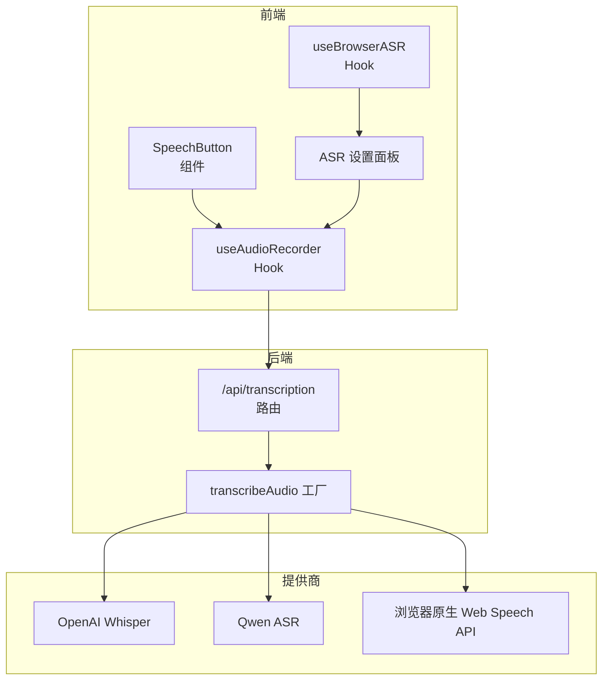
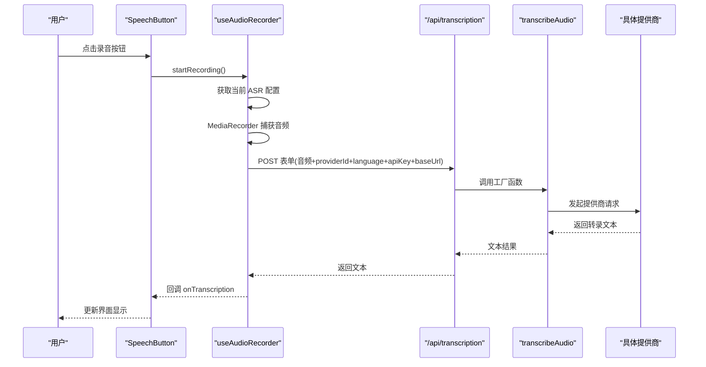
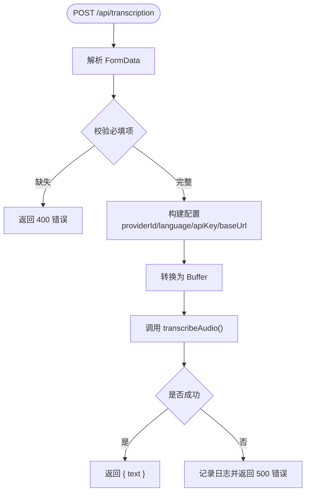
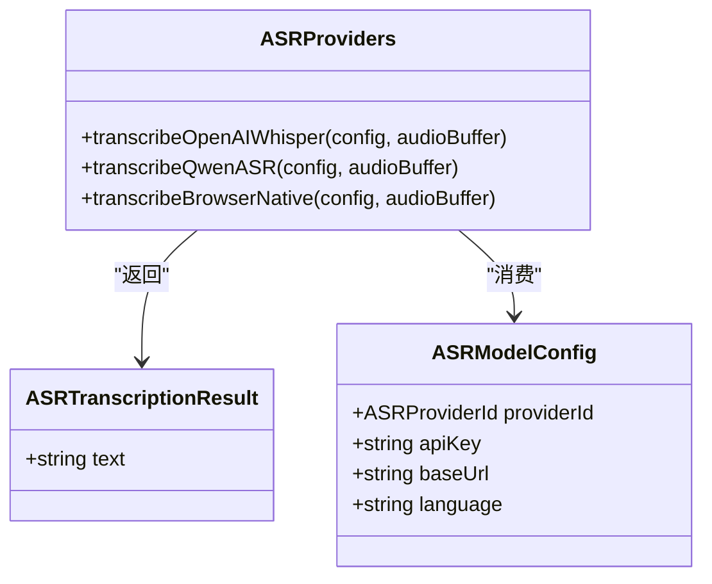
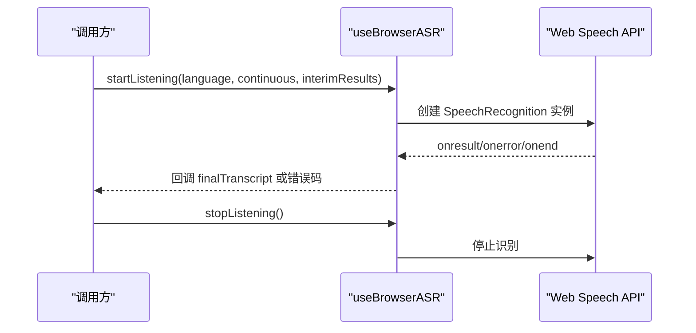
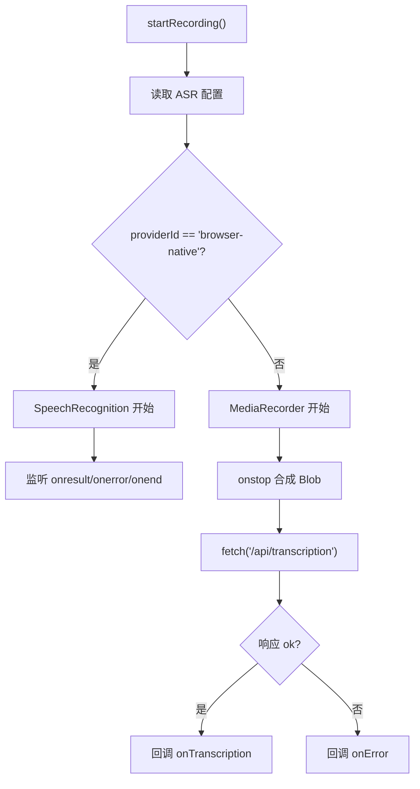
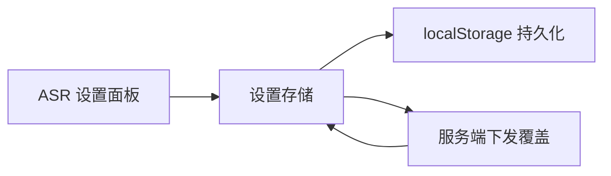
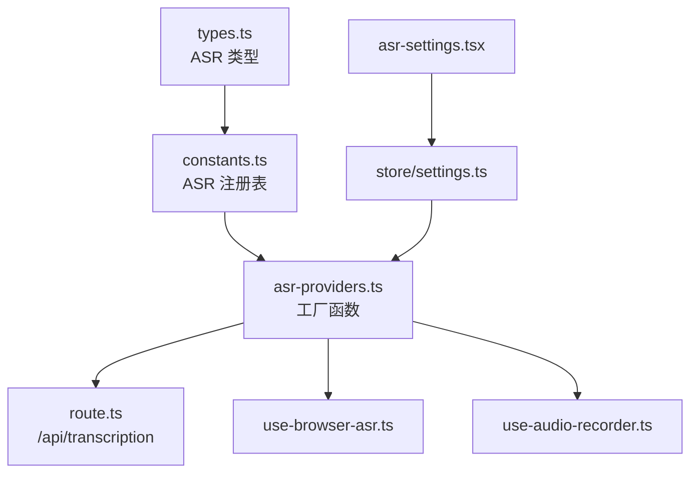

# 语音识别 (ASR)

<cite>
**本文引用的文件**
- [app/api/transcription/route.ts](file://app/api/transcription/route.ts)
- [lib/audio/asr-providers.ts](file://lib/audio/asr-providers.ts)
- [lib/audio/constants.ts](file://lib/audio/constants.ts)
- [lib/audio/types.ts](file://lib/audio/types.ts)
- [lib/hooks/use-browser-asr.ts](file://lib/hooks/use-browser-asr.ts)
- [lib/hooks/use-audio-recorder.ts](file://lib/hooks/use-audio-recorder.ts)
- [components/audio/speech-button.tsx](file://components/audio/speech-button.tsx)
- [components/settings/asr-settings.tsx](file://components/settings/asr-settings.tsx)
- [components/settings/audio-settings.tsx](file://components/settings/audio-settings.tsx)
- [lib/store/settings.ts](file://lib/store/settings.ts)
- [components/roundtable/index.tsx](file://components/roundtable/index.tsx)
- [lib/utils/audio-player.ts](file://lib/utils/audio-player.ts)
</cite>

## 目录
1. [简介](#简介)
2. [项目结构](#项目结构)
3. [核心组件](#核心组件)
4. [架构总览](#架构总览)
5. [详细组件分析](#详细组件分析)
6. [依赖关系分析](#依赖关系分析)
7. [性能考量](#性能考量)
8. [故障排查指南](#故障排查指南)
9. [结论](#结论)
10. [附录](#附录)

## 简介
本文件系统性梳理 OpenMAIC 的语音识别（ASR）能力，覆盖多提供商集成与切换、音频采集与处理、实时转录、API 设计、课堂应用场景以及音质优化与准确率提升策略。文档以“可读性优先”的原则组织，既适合开发者快速上手，也便于非技术读者理解整体方案。

## 项目结构
ASR 能力由前端录音与交互、后端转录 API、提供商适配层与全局设置存储构成，形成“客户端采集 + 服务端统一调度”的架构。关键模块如下：
- 前端录音与交互：录音钩子、语音按钮、ASR 设置面板
- 后端 API：统一接收音频与配置，路由到具体提供商
- 提供商适配：工厂模式封装不同 ASR 提供商的调用细节
- 全局设置：持久化存储 ASR 提供商、语言、密钥与基础地址

图表来源
- [components/audio/speech-button.tsx:1-142](file://components/audio/speech-button.tsx#L1-L142)
- [lib/hooks/use-audio-recorder.ts:1-293](file://lib/hooks/use-audio-recorder.ts#L1-L293)
- [lib/hooks/use-browser-asr.ts:1-156](file://lib/hooks/use-browser-asr.ts#L1-L156)
- [components/settings/asr-settings.tsx:1-277](file://components/settings/asr-settings.tsx#L1-L277)
- [app/api/transcription/route.ts:1-52](file://app/api/transcription/route.ts#L1-L52)
- [lib/audio/asr-providers.ts:163-190](file://lib/audio/asr-providers.ts#L163-L190)

章节来源
- [lib/audio/asr-providers.ts:1-354](file://lib/audio/asr-providers.ts#L1-L354)
- [lib/audio/constants.ts:624-823](file://lib/audio/constants.ts#L624-L823)
- [lib/audio/types.ts:144-173](file://lib/audio/types.ts#L144-L173)
- [app/api/transcription/route.ts:1-52](file://app/api/transcription/route.ts#L1-L52)

## 核心组件
- 统一转录入口：后端路由负责解析表单数据、解析提供商与语言参数、调用工厂函数并返回文本结果。
- 提供商工厂：根据 providerId 分发到具体实现，内置错误校验与 API Key 校验。
- 浏览器原生 ASR：通过 Web Speech API 实现本地实时转写，适合低延迟与隐私场景。
- 录音与发送：前端 Hook 负责麦克风权限、MediaRecorder 捕获、表单提交与错误处理。
- 设置与持久化：全局设置存储 ASR 配置，支持服务端下发覆盖与本地覆盖。

章节来源
- [app/api/transcription/route.ts:11-51](file://app/api/transcription/route.ts#L11-L51)
- [lib/audio/asr-providers.ts:163-190](file://lib/audio/asr-providers.ts#L163-L190)
- [lib/hooks/use-browser-asr.ts:31-156](file://lib/hooks/use-browser-asr.ts#L31-L156)
- [lib/hooks/use-audio-recorder.ts:21-293](file://lib/hooks/use-audio-recorder.ts#L21-L293)
- [lib/store/settings.ts:421-800](file://lib/store/settings.ts#L421-L800)

## 架构总览
ASR 架构采用“前端采集 + 后端统一调度 + 多提供商适配”的分层设计：
- 前端层：录音、实时显示、错误提示、设置面板
- 传输层：表单上传音频、附加 providerId、language、apiKey、baseUrl
- 适配层：工厂函数按提供商类型选择实现；浏览器原生 ASR 必须在前端处理
- 存储层：设置持久化，支持服务端下发覆盖

图表来源
- [components/audio/speech-button.tsx:40-53](file://components/audio/speech-button.tsx#L40-L53)
- [lib/hooks/use-audio-recorder.ts:34-83](file://lib/hooks/use-audio-recorder.ts#L34-L83)
- [app/api/transcription/route.ts:11-51](file://app/api/transcription/route.ts#L11-L51)
- [lib/audio/asr-providers.ts:163-190](file://lib/audio/asr-providers.ts#L163-L190)

## 详细组件分析

### 组件 A：统一转录 API（/api/transcription）
- 输入：multipart 表单，字段包括 audio（二进制音频）、providerId、language、apiKey、baseUrl
- 校验：必填字段校验、默认 providerId 回退策略
- 配置：resolveASRApiKey/resolveASRBaseUrl 解析最终配置
- 执行：将 Buffer/Blob 传入 transcribeAudio 工厂函数
- 输出：成功返回 { text }，失败返回标准化错误

图表来源
- [app/api/transcription/route.ts:11-51](file://app/api/transcription/route.ts#L11-L51)

章节来源
- [app/api/transcription/route.ts:11-51](file://app/api/transcription/route.ts#L11-L51)

### 组件 B：ASR 提供商工厂与适配
- 工厂函数 transcribeAudio：根据 providerId 分派到具体实现
- 支持提供商：
  - OpenAI Whisper：使用 Vercel AI SDK，支持语言参数
  - Qwen ASR：DashScope API，Base64 上传，支持 asr_options
  - 浏览器原生：Web Speech API，必须在前端处理
- 错误处理：API Key 校验、空音频/静音处理、网络异常与超时策略

图表来源
- [lib/audio/asr-providers.ts:156-190](file://lib/audio/asr-providers.ts#L156-L190)
- [lib/audio/types.ts:167-173](file://lib/audio/types.ts#L167-L173)

章节来源
- [lib/audio/asr-providers.ts:163-354](file://lib/audio/asr-providers.ts#L163-L354)
- [lib/audio/types.ts:144-173](file://lib/audio/types.ts#L144-L173)

### 组件 C：浏览器原生 ASR Hook（useBrowserASR）
- 用途：在前端直接使用 Web Speech API 进行本地转写
- 特性：支持连续/临时结果、错误码映射、生命周期管理
- 限制：必须在浏览器端运行，无 API Key 要求

图表来源
- [lib/hooks/use-browser-asr.ts:61-156](file://lib/hooks/use-browser-asr.ts#L61-L156)

章节来源
- [lib/hooks/use-browser-asr.ts:31-156](file://lib/hooks/use-browser-asr.ts#L31-L156)

### 组件 D：录音与发送 Hook（useAudioRecorder）
- 逻辑：根据 ASR 配置决定使用浏览器原生还是服务端转录
- 浏览器原生：直接启动 SpeechRecognition 并回调转写结果
- 服务端转录：MediaRecorder 捕获音频，组装表单提交 /api/transcription
- 错误处理：权限、网络、识别错误分类提示

图表来源
- [lib/hooks/use-audio-recorder.ts:85-242](file://lib/hooks/use-audio-recorder.ts#L85-L242)

章节来源
- [lib/hooks/use-audio-recorder.ts:21-293](file://lib/hooks/use-audio-recorder.ts#L21-L293)

### 组件 E：ASR 设置面板与持久化
- 设置面板：支持 API Key、Base URL、测试转写、请求 URL 预览
- 持久化：全局设置存储 ASR 提供商、语言、密钥与启用状态
- 服务端覆盖：支持从 /api/server-providers 下发配置

图表来源
- [components/settings/asr-settings.tsx:156-221](file://components/settings/asr-settings.tsx#L156-L221)
- [lib/store/settings.ts:421-800](file://lib/store/settings.ts#L421-L800)

章节来源
- [components/settings/asr-settings.tsx:1-277](file://components/settings/asr-settings.tsx#L1-L277)
- [lib/store/settings.ts:421-800](file://lib/store/settings.ts#L421-L800)

## 依赖关系分析
- 类型与常量：ASRProviderId、ASRProviderConfig、ASRModelConfig 定义了提供商元数据与调用参数
- 提供商注册：ASR_PROVIDERS 注册表集中维护支持的提供商及其特性
- 路由与工厂：/api/transcription 将请求转发至 transcribeAudio 工厂
- 前后端耦合：浏览器原生 ASR 必须在前端完成，服务端 ASR 通过表单上传音频

图表来源
- [lib/audio/types.ts:144-173](file://lib/audio/types.ts#L144-L173)
- [lib/audio/constants.ts:624-823](file://lib/audio/constants.ts#L624-L823)
- [lib/audio/asr-providers.ts:163-190](file://lib/audio/asr-providers.ts#L163-L190)
- [app/api/transcription/route.ts:1-52](file://app/api/transcription/route.ts#L1-L52)
- [lib/hooks/use-browser-asr.ts:1-156](file://lib/hooks/use-browser-asr.ts#L1-L156)
- [lib/hooks/use-audio-recorder.ts:1-293](file://lib/hooks/use-audio-recorder.ts#L1-L293)
- [components/settings/asr-settings.tsx:1-277](file://components/settings/asr-settings.tsx#L1-L277)
- [lib/store/settings.ts:421-800](file://lib/store/settings.ts#L421-L800)

章节来源
- [lib/audio/types.ts:144-173](file://lib/audio/types.ts#L144-L173)
- [lib/audio/constants.ts:624-823](file://lib/audio/constants.ts#L624-L823)
- [lib/audio/asr-providers.ts:163-190](file://lib/audio/asr-providers.ts#L163-L190)
- [app/api/transcription/route.ts:1-52](file://app/api/transcription/route.ts#L1-L52)

## 性能考量
- 采样与格式：MediaRecorder 使用 audio/webm，体积小、兼容好；服务端提供商通常支持多种格式，按需选择
- 上传与并发：单次录音建议分段上传或压缩，避免大文件导致超时
- 语言参数：明确语言可提升准确率，但需与实际语种匹配
- 缓存与复用：浏览器端可缓存常用模型与配置，减少重复初始化成本
- 错误恢复：网络抖动与权限问题需有重试与降级策略（如切换到浏览器原生）

## 故障排查指南
- 常见错误与定位
  - 缺少必填字段：确认表单中包含 audio、providerId、language 等
  - API Key 无效：检查设置面板中的密钥与服务端覆盖
  - 浏览器不支持：useBrowserASR 返回 not-supported，需引导用户更换浏览器或使用服务端
  - 权限被拒：麦克风权限未授权，引导用户开启
  - 空音频/静音：部分提供商对短音频或无声有特殊处理，需在 UI 上提示
- 日志与诊断
  - 后端路由与工厂均输出错误日志，便于定位问题
  - 前端 Hook 记录错误码与用户提示，便于用户自助排查

章节来源
- [app/api/transcription/route.ts:42-50](file://app/api/transcription/route.ts#L42-L50)
- [lib/hooks/use-browser-asr.ts:116-128](file://lib/hooks/use-browser-asr.ts#L116-L128)
- [lib/hooks/use-audio-recorder.ts:127-155](file://lib/hooks/use-audio-recorder.ts#L127-L155)

## 结论
OpenMAIC 的 ASR 架构以“统一入口 + 工厂适配 + 前后端协作”为核心，既保证了多提供商的可扩展性，又兼顾了隐私与性能需求。通过设置面板与持久化存储，用户可以灵活切换提供商与参数；通过浏览器原生与服务端两种路径，满足不同场景下的实时性与准确性要求。

## 附录

### API 接口定义（/api/transcription）
- 方法：POST
- 路径：/api/transcription
- 请求头：multipart/form-data
- 请求体字段：
  - audio：二进制音频文件
  - providerId：ASR 提供商标识
  - language：语言代码（可选，默认 auto）
  - apiKey：提供商密钥（可选，若服务端已配置可省略）
  - baseUrl：提供商基础地址（可选）
- 成功响应：{ text: "转录文本" }
- 失败响应：标准化错误对象（包含错误码与详情）

章节来源
- [app/api/transcription/route.ts:11-51](file://app/api/transcription/route.ts#L11-L51)

### 配置与使用示例（路径指引）
- 设置提供商与参数：参考设置面板组件
  - [components/settings/asr-settings.tsx:156-221](file://components/settings/asr-settings.tsx#L156-L221)
- 服务端覆盖配置：参考设置存储
  - [lib/store/settings.ts:620-800](file://lib/store/settings.ts#L620-L800)
- 浏览器原生测试：参考设置面板与 Hook
  - [components/settings/asr-settings.tsx:38-144](file://components/settings/asr-settings.tsx#L38-L144)
  - [lib/hooks/use-browser-asr.ts:61-156](file://lib/hooks/use-browser-asr.ts#L61-L156)
- 服务端转录测试：参考录音 Hook 与按钮
  - [lib/hooks/use-audio-recorder.ts:34-83](file://lib/hooks/use-audio-recorder.ts#L34-L83)
  - [components/audio/speech-button.tsx:40-53](file://components/audio/speech-button.tsx#L40-L53)

### 课堂应用场景
- 实时字幕：在 Roundtable 场景中，ASR 可作为输入源，结合播放引擎实现字幕同步
  - [components/roundtable/index.tsx:136-145](file://components/roundtable/index.tsx#L136-L145)
- 语音问答：通过录音 Hook 触发转写，进入 QA 会话
  - [lib/hooks/use-audio-recorder.ts:85-120](file://lib/hooks/use-audio-recorder.ts#L85-L120)
- 语音控制：在课堂工具栏中集成语音按钮，触发相关操作
  - [components/audio/speech-button.tsx:18-53](file://components/audio/speech-button.tsx#L18-L53)

### 音频质量优化与准确率提升策略
- 音频预处理：尽量在安静环境录制，避免背景噪音；必要时使用前端降噪（如浏览器侧滤波）
- 采样与格式：优先使用 webm，确保压缩比与兼容性平衡
- 语言与方言：明确语言代码可提升准确率；混合口音场景建议使用 auto 或更通用模型
- 提供商选择：不同提供商在不同语言/口音上有差异，可按场景切换
- 服务端覆盖：通过 /api/server-providers 下发最优配置，减少本地配置负担