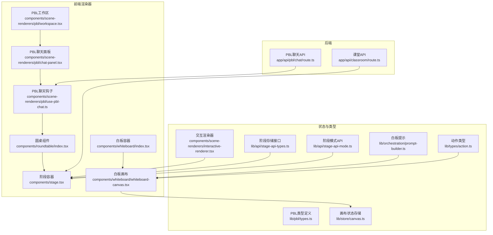
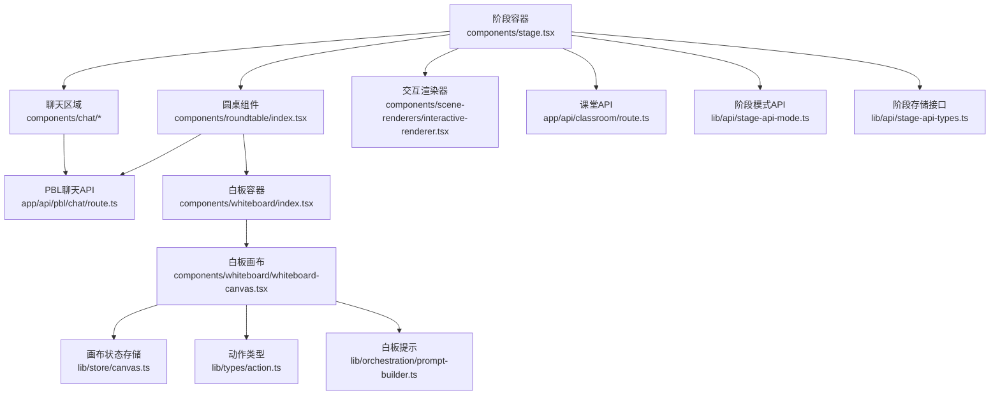
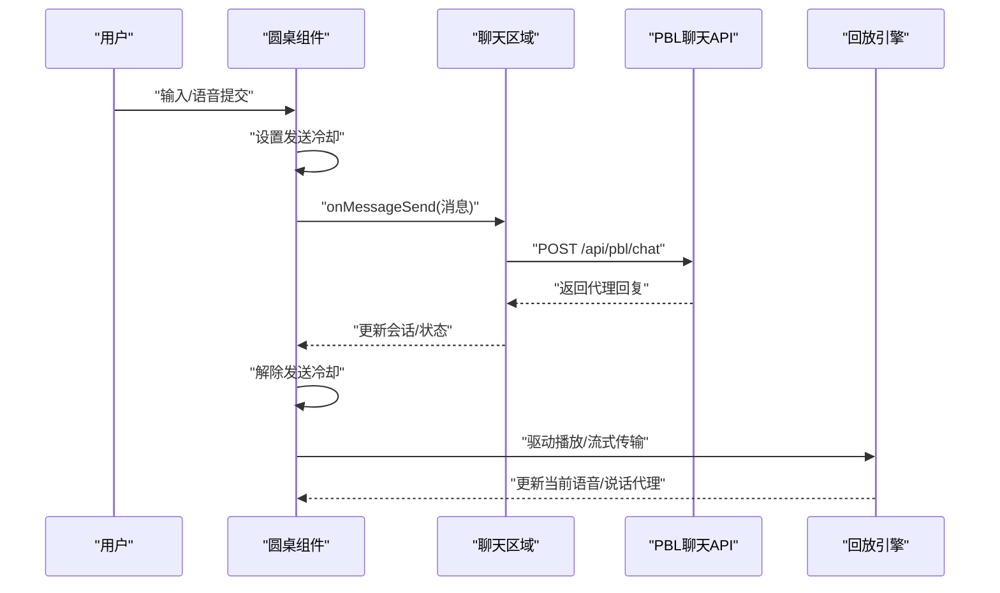
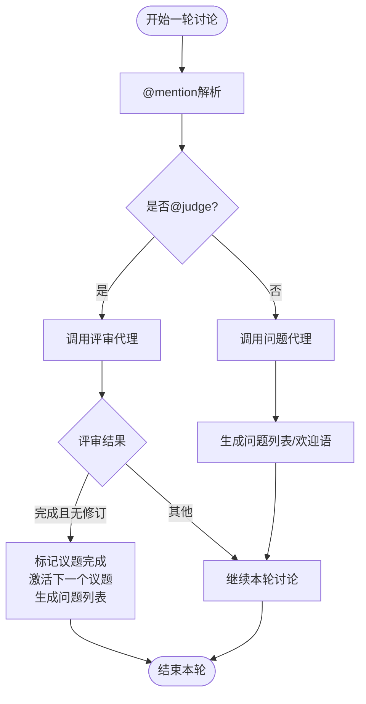
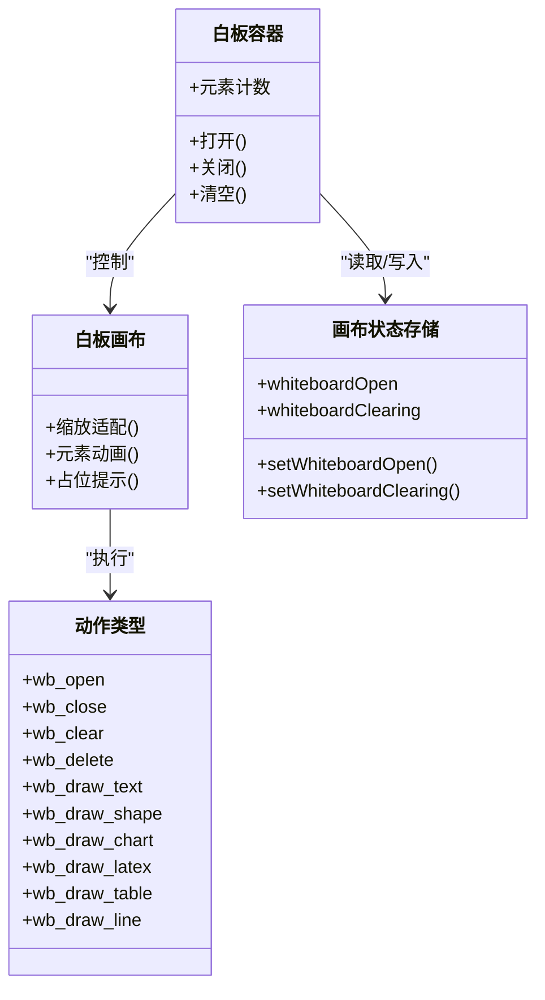
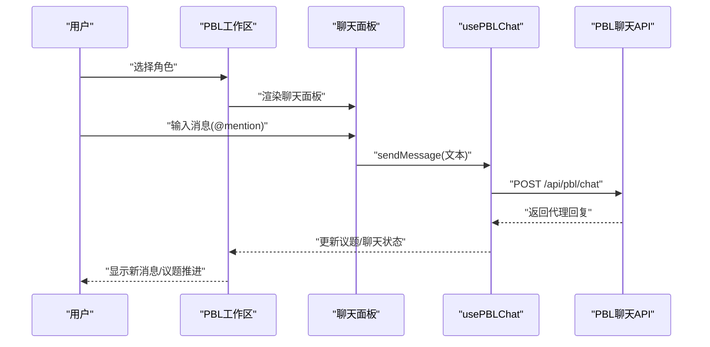
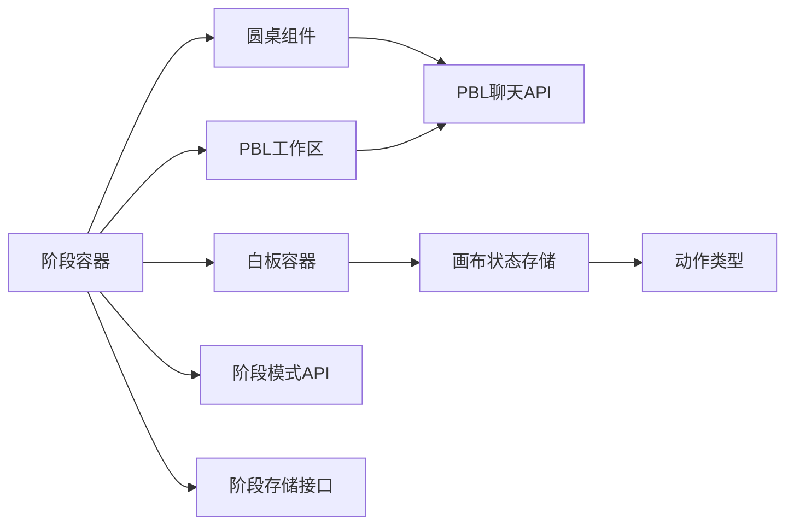

# 交互模式实现

<cite>
**本文引用的文件**
- [app/api/classroom/route.ts](file://app/api/classroom/route.ts)
- [app/api/pbl/chat/route.ts](file://app/api/pbl/chat/route.ts)
- [components/scene-renderers/pbl/workspace.tsx](file://components/scene-renderers/pbl/workspace.tsx)
- [components/scene-renderers/pbl/chat-panel.tsx](file://components/scene-renderers/pbl/chat-panel.tsx)
- [components/scene-renderers/pbl/use-pbl-chat.ts](file://components/scene-renderers/pbl/use-pbl-chat.ts)
- [components/scene-renderers/pbl/role-selection.tsx](file://components/scene-renderers/pbl/role-selection.tsx)
- [lib/pbl/types.ts](file://lib/pbl/types.ts)
- [components/roundtable/index.tsx](file://components/roundtable/index.tsx)
- [components/stage.tsx](file://components/stage.tsx)
- [components/whiteboard/index.tsx](file://components/whiteboard/index.tsx)
- [components/whiteboard/whiteboard-canvas.tsx](file://components/whiteboard/whiteboard-canvas.tsx)
- [lib/store/canvas.ts](file://lib/store/canvas.ts)
- [lib/types/action.ts](file://lib/types/action.ts)
- [lib/orchestration/prompt-builder.ts](file://lib/orchestration/prompt-builder.ts)
- [lib/api/stage-api-mode.ts](file://lib/api/stage-api-mode.ts)
- [lib/api/stage-api-types.ts](file://lib/api/stage-api-types.ts)
- [components/scene-renderers/interactive-renderer.tsx](file://components/scene-renderers/interactive-renderer.tsx)
</cite>

## 目录
1. [引言](#引言)
2. [项目结构](#项目结构)
3. [核心组件](#核心组件)
4. [架构总览](#架构总览)
5. [详细组件分析](#详细组件分析)
6. [依赖关系分析](#依赖关系分析)
7. [性能考量](#性能考量)
8. [故障排查指南](#故障排查指南)
9. [结论](#结论)
10. [附录](#附录)

## 引言
本文件系统性梳理并解释本仓库中“交互模式”的实现与设计理念，覆盖以下四种交互形态：
- 课堂讨论（Roundtable）
- 圆桌辩论（Roundtable 的 QA 模式）
- 问答模式（Roundtable 的 QA 模式）
- 白板协作（Whiteboard）

文档从系统架构、组件关系、数据流、处理逻辑、集成点、错误处理与性能特性等维度展开，并提供模式切换与状态保持机制说明、典型使用场景与配置建议，以及用户体验优化与性能考虑。

## 项目结构
围绕交互模式的关键目录与文件如下：
- 后端 API
  - 课堂存储与检索：app/api/classroom/route.ts
  - PBL 实时聊天路由：app/api/pbl/chat/route.ts
- 前端渲染器与工作区
  - PBL 工作区：components/scene-renderers/pbl/workspace.tsx
  - PBL 聊天面板：components/scene-renderers/pbl/chat-panel.tsx
  - PBL 聊天钩子：components/scene-renderers/pbl/use-pbl-chat.ts
  - PBL 角色选择：components/scene-renderers/pbl/role-selection.tsx
  - PBL 类型定义：lib/pbl/types.ts
- 课堂讨论与问答
  - 圆桌组件：components/roundtable/index.tsx
  - 阶段主容器：components/stage.tsx
- 白板协作
  - 白板容器：components/whiteboard/index.tsx
  - 白板画布：components/whiteboard/whiteboard-canvas.tsx
  - 画布状态存储：lib/store/canvas.ts
  - 白板动作类型：lib/types/action.ts
  - 白板提示与绘制规范：lib/orchestration/prompt-builder.ts
- 阶段模式与元数据
  - 阶段模式 API：lib/api/stage-api-mode.ts
  - 阶段存储接口：lib/api/stage-api-types.ts
- 互动场景渲染
  - 交互场景渲染器：components/scene-renderers/interactive-renderer.tsx

图表来源
- [app/api/classroom/route.ts:1-71](file://app/api/classroom/route.ts#L1-L71)
- [app/api/pbl/chat/route.ts:1-75](file://app/api/pbl/chat/route.ts#L1-L75)
- [components/scene-renderers/pbl/workspace.tsx:1-93](file://components/scene-renderers/pbl/workspace.tsx#L1-L93)
- [components/scene-renderers/pbl/chat-panel.tsx:1-181](file://components/scene-renderers/pbl/chat-panel.tsx#L1-L181)
- [components/scene-renderers/pbl/use-pbl-chat.ts:1-273](file://components/scene-renderers/pbl/use-pbl-chat.ts#L1-L273)
- [components/roundtable/index.tsx:1-800](file://components/roundtable/index.tsx#L1-L800)
- [components/stage.tsx:1-200](file://components/stage.tsx#L1-L200)
- [components/whiteboard/index.tsx:1-136](file://components/whiteboard/index.tsx#L1-L136)
- [components/whiteboard/whiteboard-canvas.tsx:1-167](file://components/whiteboard/whiteboard-canvas.tsx#L1-L167)
- [lib/pbl/types.ts:1-80](file://lib/pbl/types.ts#L1-L80)
- [lib/store/canvas.ts:1-473](file://lib/store/canvas.ts#L1-L473)
- [lib/types/action.ts:47-131](file://lib/types/action.ts#L47-L131)
- [lib/orchestration/prompt-builder.ts:327-365](file://lib/orchestration/prompt-builder.ts#L327-L365)
- [lib/api/stage-api-mode.ts:1-63](file://lib/api/stage-api-mode.ts#L1-L63)
- [lib/api/stage-api-types.ts:64-80](file://lib/api/stage-api-types.ts#L64-L80)
- [components/scene-renderers/interactive-renderer.tsx:1-29](file://components/scene-renderers/interactive-renderer.tsx#L1-L29)

章节来源
- [app/api/classroom/route.ts:1-71](file://app/api/classroom/route.ts#L1-L71)
- [app/api/pbl/chat/route.ts:1-75](file://app/api/pbl/chat/route.ts#L1-L75)
- [components/scene-renderers/pbl/workspace.tsx:1-93](file://components/scene-renderers/pbl/workspace.tsx#L1-L93)
- [components/scene-renderers/pbl/chat-panel.tsx:1-181](file://components/scene-renderers/pbl/chat-panel.tsx#L1-L181)
- [components/scene-renderers/pbl/use-pbl-chat.ts:1-273](file://components/scene-renderers/pbl/use-pbl-chat.ts#L1-L273)
- [components/roundtable/index.tsx:1-800](file://components/roundtable/index.tsx#L1-L800)
- [components/stage.tsx:1-200](file://components/stage.tsx#L1-L200)
- [components/whiteboard/index.tsx:1-136](file://components/whiteboard/index.tsx#L1-L136)
- [components/whiteboard/whiteboard-canvas.tsx:1-167](file://components/whiteboard/whiteboard-canvas.tsx#L1-L167)
- [lib/pbl/types.ts:1-80](file://lib/pbl/types.ts#L1-L80)
- [lib/store/canvas.ts:1-473](file://lib/store/canvas.ts#L1-L473)
- [lib/types/action.ts:47-131](file://lib/types/action.ts#L47-L131)
- [lib/orchestration/prompt-builder.ts:327-365](file://lib/orchestration/prompt-builder.ts#L327-L365)
- [lib/api/stage-api-mode.ts:1-63](file://lib/api/stage-api-mode.ts#L1-L63)
- [lib/api/stage-api-types.ts:64-80](file://lib/api/stage-api-types.ts#L64-L80)
- [components/scene-renderers/interactive-renderer.tsx:1-29](file://components/scene-renderers/interactive-renderer.tsx#L1-L29)

## 核心组件
- 课堂讨论（Roundtable）
  - 组件职责：提供教师与学生代理的实时对话与讨论体验，支持输入框、语音录制、TTS/ASR 控制、播放速度、停止按钮等；在播放模式下与回放引擎联动，在自主模式下可直接发起讨论。
  - 关键状态：引擎模式、当前语音、会话类型、正在说话的代理、思考状态、用户提示、话题挂起、流式传输状态等。
  - 交互入口：阶段容器根据模式与参与者生成圆桌区域，圆桌内部管理输入/语音状态、发送消息回调、软暂停/恢复等。

- 圆桌辩论（Roundtable 的 QA 模式）
  - 设计要点：以“提问—回答—评价”闭环为主，支持教师作为主持人，学生代理轮流发言，AI 代理扮演“问题生成者”和“评审者”，通过 @mention 机制路由到指定代理。
  - 数据流：用户输入经 @mention 解析，调用 PBL 聊天 API，返回结果后更新聊天记录与议题状态（完成/激活）。

- 问答模式（Roundtable 的 QA 模式）
  - 设计要点：与圆桌辩论共享同一套 UI 与状态机，区别在于会话类型标识与触发方式。问答模式强调“问题—解答—反馈”的快速迭代。
  - 状态保持：通过阶段容器的会话类型、引擎模式、流式传输状态等字段维持跨轮次的一致性。

- 白板协作（Whiteboard）
  - 容器组件：负责打开/关闭白板、清空动画、元素计数与提示、与画布状态存储联动。
  - 画布组件：响应容器指令执行元素级动画（入场/出场），按比例缩放适配容器尺寸，支持占位提示。
  - 动作类型：提供 wb_open/wb_close/wb_clear/wb_delete 及多种绘制动作（文本、形状、图表、公式、表格、连线），配合提示文档实现动画化效果与布局约束。

章节来源
- [components/roundtable/index.tsx:1-800](file://components/roundtable/index.tsx#L1-L800)
- [components/stage.tsx:1-200](file://components/stage.tsx#L1-L200)
- [components/whiteboard/index.tsx:1-136](file://components/whiteboard/index.tsx#L1-L136)
- [components/whiteboard/whiteboard-canvas.tsx:1-167](file://components/whiteboard/whiteboard-canvas.tsx#L1-L167)
- [lib/types/action.ts:47-131](file://lib/types/action.ts#L47-L131)
- [lib/orchestration/prompt-builder.ts:327-365](file://lib/orchestration/prompt-builder.ts#L327-L365)

## 架构总览
交互模式的整体架构由“阶段容器 + 渲染器 + 代理与动作引擎 + 状态存储 + API 层”构成。阶段容器统一调度模式、回放引擎、圆桌组件与聊天区域；渲染器负责具体场景展示；状态存储（Zustand）贯穿 UI 与教学功能；API 层提供课堂与 PBL 聊天能力。

图表来源
- [components/stage.tsx:1-200](file://components/stage.tsx#L1-L200)
- [components/roundtable/index.tsx:1-800](file://components/roundtable/index.tsx#L1-L800)
- [components/scene-renderers/interactive-renderer.tsx:1-29](file://components/scene-renderers/interactive-renderer.tsx#L1-L29)
- [app/api/pbl/chat/route.ts:1-75](file://app/api/pbl/chat/route.ts#L1-L75)
- [app/api/classroom/route.ts:1-71](file://app/api/classroom/route.ts#L1-L71)
- [components/whiteboard/index.tsx:1-136](file://components/whiteboard/index.tsx#L1-L136)
- [components/whiteboard/whiteboard-canvas.tsx:1-167](file://components/whiteboard/whiteboard-canvas.tsx#L1-L167)
- [lib/store/canvas.ts:1-473](file://lib/store/canvas.ts#L1-L473)
- [lib/types/action.ts:47-131](file://lib/types/action.ts#L47-L131)
- [lib/orchestration/prompt-builder.ts:327-365](file://lib/orchestration/prompt-builder.ts#L327-L365)
- [lib/api/stage-api-mode.ts:1-63](file://lib/api/stage-api-mode.ts#L1-L63)
- [lib/api/stage-api-types.ts:64-80](file://lib/api/stage-api-types.ts#L64-L80)

## 详细组件分析

### 课堂讨论（Roundtable）
- 智能体角色分配
  - 教师代理：主持讨论，显示高亮与头像状态，可触发/暂停/继续讨论。
  - 学生代理：作为发言主体，按顺序或随机被选中进行回答，支持 TTS 播放与 ASR 录音。
  - 用户：通过输入框或语音参与讨论，消息发送后进入冷却期，避免与代理气泡出现时机冲突。
- 对话流程控制
  - 发送消息：输入/语音提交后，设置发送冷却，等待代理气泡出现再解除。
  - 流式传输：在流式传输期间自动滚动到最新文本，结束时清除冷却。
  - 软暂停/恢复：点击气泡暂停时保留当前代理与文本，恢复时重新发起该轮对话。
- 用户交互设计
  - 输入/语音切换：点击输入框或录音按钮，录音时显示波形与状态提示。
  - TTS/ASR 设置：音量、静音、自动播放等设置持久化于设置存储。
  - 工具栏：播放/暂停、上一/下一场景、白板开关、侧边栏/聊天折叠等。

图表来源
- [components/roundtable/index.tsx:1-800](file://components/roundtable/index.tsx#L1-L800)
- [components/stage.tsx:1-200](file://components/stage.tsx#L1-L200)
- [app/api/pbl/chat/route.ts:1-75](file://app/api/pbl/chat/route.ts#L1-L75)

章节来源
- [components/roundtable/index.tsx:1-800](file://components/roundtable/index.tsx#L1-L800)
- [components/stage.tsx:1-200](file://components/stage.tsx#L1-L200)

### 圆桌辩论（QA 模式）
- 智能体角色分配
  - 问题代理：根据议题生成若干可操作问题列表。
  - 评审代理：对回答进行评估，识别“完成”与“需要修订”两类状态。
  - 学生代理：针对问题进行回答，形成“问题—回答—评审”的闭环。
- 对话流程控制
  - @mention 路由：支持 @question/@judge 或直接 @代理名，未命中则默认路由至问题代理。
  - 议题推进：当评审代理判定“完成”且不含“需要修订”时，自动标记议题完成并激活下一个议题，同时生成新议题的问题列表。
- 用户交互设计
  - 提示信息：输入框下方显示 @mention 使用提示。
  - 草稿缓存：本地缓存草稿，刷新后自动恢复。
  - 语音输入：支持语音转写并追加到输入框。

图表来源
- [components/scene-renderers/pbl/use-pbl-chat.ts:1-273](file://components/scene-renderers/pbl/use-pbl-chat.ts#L1-L273)
- [app/api/pbl/chat/route.ts:1-75](file://app/api/pbl/chat/route.ts#L1-L75)

章节来源
- [components/scene-renderers/pbl/use-pbl-chat.ts:1-273](file://components/scene-renderers/pbl/use-pbl-chat.ts#L1-L273)
- [components/scene-renderers/pbl/chat-panel.tsx:1-181](file://components/scene-renderers/pbl/chat-panel.tsx#L1-L181)
- [lib/pbl/types.ts:1-80](file://lib/pbl/types.ts#L1-L80)

### 问答模式（QA 模式）
- 模式差异
  - 与圆桌辩论共享 UI 与状态机，主要差异体现在会话类型标识与触发方式。
  - 问答模式强调快速问题—解答—反馈循环，适合知识点巩固与即时答疑。
- 状态保持
  - 通过阶段容器的会话类型、引擎模式、流式传输状态等字段，确保跨轮次一致性。
  - 软暂停/恢复机制保证用户在打断后仍能回到同一轮对话。

章节来源
- [components/roundtable/index.tsx:1-800](file://components/roundtable/index.tsx#L1-L800)
- [components/stage.tsx:1-200](file://components/stage.tsx#L1-L200)

### 白板协作
- 组件与状态
  - 白板容器：负责打开/关闭、清空动画、元素计数与提示，调用阶段 API 删除元素。
  - 白板画布：响应容器指令执行元素级动画（入场/出场），按比例缩放适配容器尺寸。
  - 画布状态存储：维护白板开关、清空动画状态等 UI 状态。
- 动作与绘制
  - 支持文本、形状、图表、公式、表格、连线等多种绘制动作，所有动作均支持可选 elementId，便于后续删除与动画化过渡。
  - 提供删除动作以实现“删除+绘制”的动画效果，遵循坐标与间距约束，避免元素重叠。
- 用户体验
  - 清空采用级联淡出动画，元素数量越多耗时越长但上限限制，保证流畅体验。
  - 占位提示在白板为空时显示，引导用户开始绘制。

图表来源
- [components/whiteboard/index.tsx:1-136](file://components/whiteboard/index.tsx#L1-L136)
- [components/whiteboard/whiteboard-canvas.tsx:1-167](file://components/whiteboard/whiteboard-canvas.tsx#L1-L167)
- [lib/store/canvas.ts:1-473](file://lib/store/canvas.ts#L1-L473)
- [lib/types/action.ts:47-131](file://lib/types/action.ts#L47-L131)

章节来源
- [components/whiteboard/index.tsx:1-136](file://components/whiteboard/index.tsx#L1-L136)
- [components/whiteboard/whiteboard-canvas.tsx:1-167](file://components/whiteboard/whiteboard-canvas.tsx#L1-L167)
- [lib/store/canvas.ts:1-473](file://lib/store/canvas.ts#L1-L473)
- [lib/types/action.ts:47-131](file://lib/types/action.ts#L47-L131)
- [lib/orchestration/prompt-builder.ts:327-365](file://lib/orchestration/prompt-builder.ts#L327-L365)

### PBL 工作区与角色选择
- 工作区布局
  - 左侧议题看板（约 35%）：显示议题列表、负责人、备注、生成问题等；右侧聊天区（约 65%）：消息列表、输入框、语音按钮。
  - 支持重启确认流程，避免误操作。
- 角色选择
  - 仅展示开发角色的非系统代理，用户可选择扮演特定代理参与议题讨论。
- 聊天钩子
  - 负责 @mention 解析、调用 PBL 聊天 API、更新议题状态（完成/激活）、生成下一个议题的问题列表与欢迎语。

图表来源
- [components/scene-renderers/pbl/workspace.tsx:1-93](file://components/scene-renderers/pbl/workspace.tsx#L1-L93)
- [components/scene-renderers/pbl/chat-panel.tsx:1-181](file://components/scene-renderers/pbl/chat-panel.tsx#L1-L181)
- [components/scene-renderers/pbl/use-pbl-chat.ts:1-273](file://components/scene-renderers/pbl/use-pbl-chat.ts#L1-L273)
- [app/api/pbl/chat/route.ts:1-75](file://app/api/pbl/chat/route.ts#L1-L75)

章节来源
- [components/scene-renderers/pbl/workspace.tsx:1-93](file://components/scene-renderers/pbl/workspace.tsx#L1-L93)
- [components/scene-renderers/pbl/role-selection.tsx:1-64](file://components/scene-renderers/pbl/role-selection.tsx#L1-L64)
- [components/scene-renderers/pbl/use-pbl-chat.ts:1-273](file://components/scene-renderers/pbl/use-pbl-chat.ts#L1-L273)

## 依赖关系分析
- 组件耦合
  - 圆桌组件与阶段容器强耦合：通过 props 传递引擎模式、当前语音、会话类型、播放视图等状态，实现播放/直播态切换。
  - 白板容器与画布组件弱耦合：通过状态存储与动作类型解耦，便于扩展新的绘制元素。
- 外部依赖
  - 阶段模式 API 与阶段存储接口：统一管理模式切换与阶段元数据访问。
  - PBL 聊天 API：依赖模型配置头（x-model/x-api-key/x-base-url 等）进行推理调用。
- 循环依赖
  - 未发现直接循环依赖；状态存储与渲染器通过单向数据流连接。

图表来源
- [components/stage.tsx:1-200](file://components/stage.tsx#L1-L200)
- [components/roundtable/index.tsx:1-800](file://components/roundtable/index.tsx#L1-L800)
- [components/whiteboard/index.tsx:1-136](file://components/whiteboard/index.tsx#L1-L136)
- [components/scene-renderers/pbl/workspace.tsx:1-93](file://components/scene-renderers/pbl/workspace.tsx#L1-L93)
- [app/api/pbl/chat/route.ts:1-75](file://app/api/pbl/chat/route.ts#L1-L75)
- [lib/store/canvas.ts:1-473](file://lib/store/canvas.ts#L1-L473)
- [lib/types/action.ts:47-131](file://lib/types/action.ts#L47-L131)
- [lib/api/stage-api-mode.ts:1-63](file://lib/api/stage-api-mode.ts#L1-L63)
- [lib/api/stage-api-types.ts:64-80](file://lib/api/stage-api-types.ts#L64-L80)

章节来源
- [lib/api/stage-api-mode.ts:1-63](file://lib/api/stage-api-mode.ts#L1-L63)
- [lib/api/stage-api-types.ts:64-80](file://lib/api/stage-api-types.ts#L64-L80)

## 性能考量
- 白板清空动画
  - 采用级联淡出策略，按元素数量递增延迟，最大耗时上限控制在合理范围，避免长时间阻塞 UI。
- 圆桌组件
  - 发送冷却机制避免频繁重渲染与闪烁；流式传输时自动滚动，减少手动干预。
- 状态存储
  - 画布状态使用轻量级 Zustand，避免深层嵌套导致的不必要重渲染。
- 模型调用
  - PBL 聊天 API 通过请求头携带模型配置，减少重复初始化成本；@mention 解析与最近消息截断降低上下文长度，提升响应速度。

## 故障排查指南
- 圆桌组件
  - 若输入框无法提交：检查发送冷却状态与禁用条件；确认 ASR/TTS 设置未阻塞输入。
  - 录音无响应：检查麦克风权限与录音状态，查看错误提示与日志。
- 白板协作
  - 清空无效：确认元素数量大于零且未处于清空动画中；检查阶段 API 返回结果。
  - 元素重叠：遵循布局约束与间距规则，优先使用删除+绘制实现动画过渡。
- PBL 聊天
  - 代理未回复：检查模型配置头是否正确；确认 @mention 解析是否命中目标代理。
  - 议题未推进：确认评审代理回复包含“完成”且不含“需要修订”。

章节来源
- [components/roundtable/index.tsx:1-800](file://components/roundtable/index.tsx#L1-L800)
- [components/whiteboard/index.tsx:1-136](file://components/whiteboard/index.tsx#L1-L136)
- [components/scene-renderers/pbl/use-pbl-chat.ts:1-273](file://components/scene-renderers/pbl/use-pbl-chat.ts#L1-L273)

## 结论
本仓库的交互模式实现以“阶段容器 + 渲染器 + 代理与动作引擎 + 状态存储 + API 层”为核心，围绕课堂讨论、圆桌辩论、问答模式与白板协作构建了完整的交互生态。通过明确的角色分配、严谨的对话流程控制、完善的模式切换与状态保持机制，以及针对性能与用户体验的优化，实现了高效、稳定且易扩展的交互体验。

## 附录
- 实际使用场景与配置示例
  - 课堂讨论：在播放模式下，教师可随时通过圆桌组件发起讨论；在自主模式下，用户可直接输入话题或语音参与。
  - 圆桌辩论：为议题配置问题代理与评审代理，启用 @mention 路由；在评审代理判定“完成”后自动推进议题。
  - 问答模式：与圆桌辩论共享 UI，适用于快速知识点巩固与即时答疑。
  - 白板协作：通过动作类型实现绘制与动画化过渡，结合布局约束与删除+绘制技巧，打造动态演示。
- 模式切换与状态保持
  - 阶段模式 API 提供 set/get 接口，统一管理模式切换；阶段存储接口提供模式与场景状态的读取与订阅。
  - 圆桌组件与阶段容器通过 props 传递引擎模式、当前语音、会话类型等关键状态，确保播放/直播态切换时的连续性。

章节来源
- [lib/api/stage-api-mode.ts:1-63](file://lib/api/stage-api-mode.ts#L1-L63)
- [lib/api/stage-api-types.ts:64-80](file://lib/api/stage-api-types.ts#L64-L80)
- [components/stage.tsx:1-200](file://components/stage.tsx#L1-L200)
- [components/roundtable/index.tsx:1-800](file://components/roundtable/index.tsx#L1-L800)