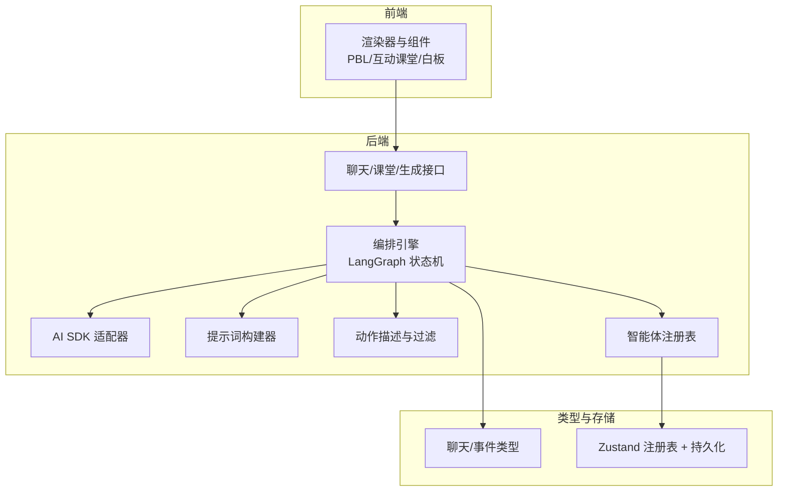
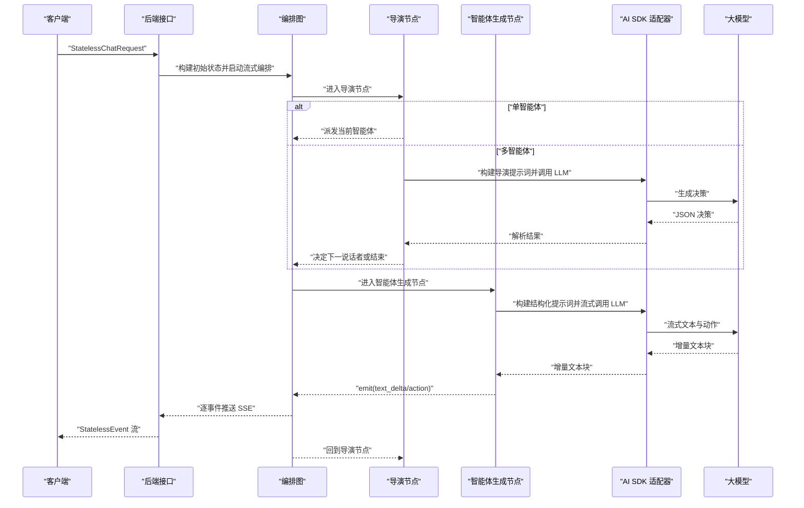
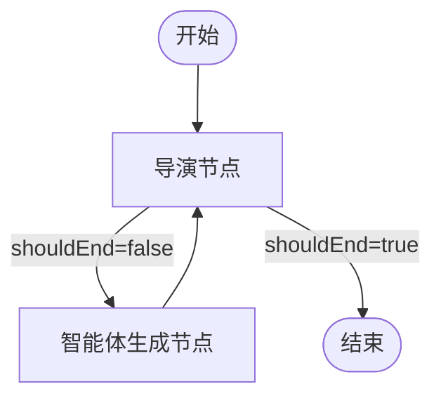
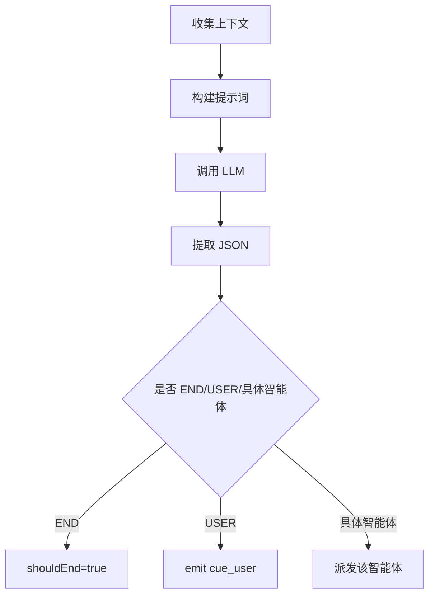
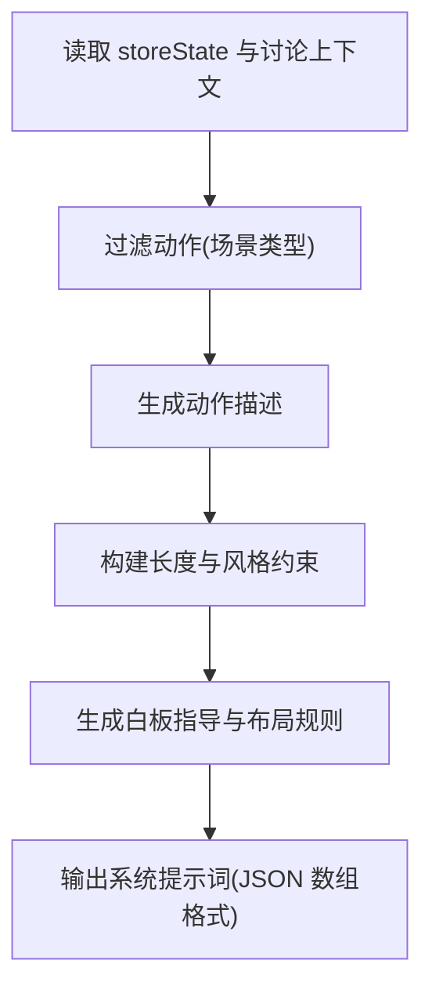
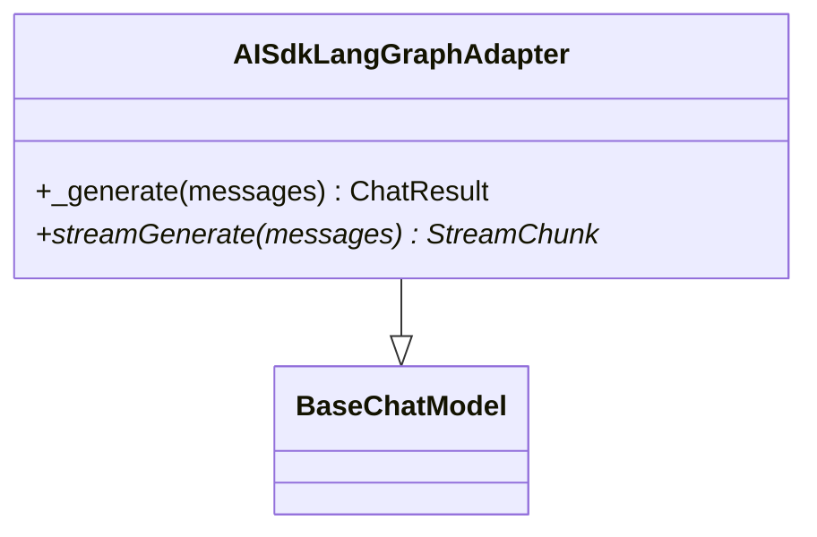
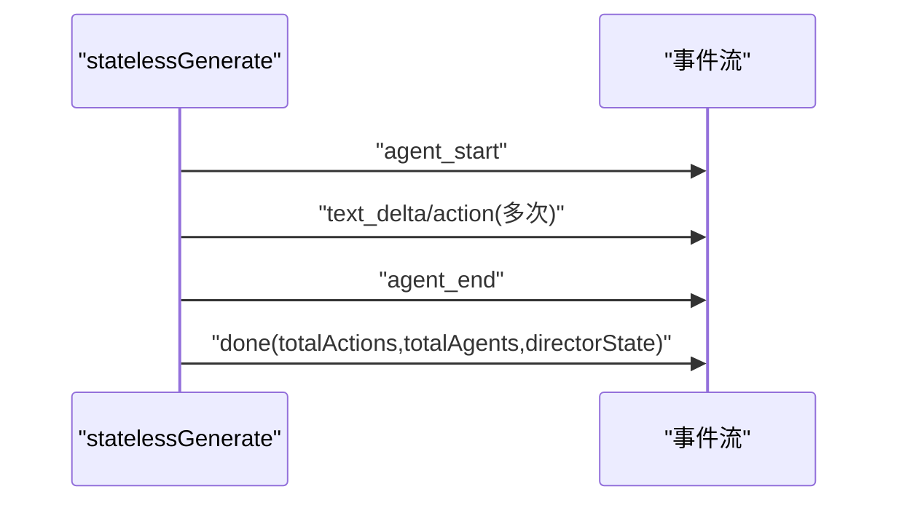
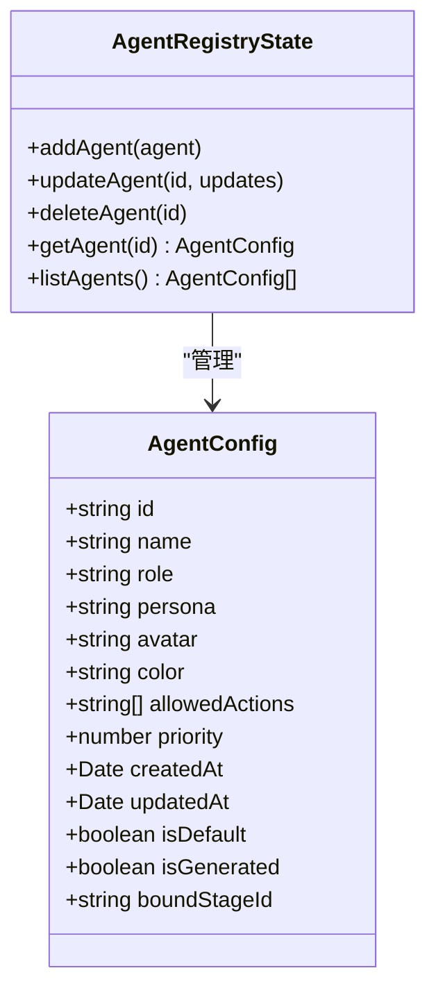
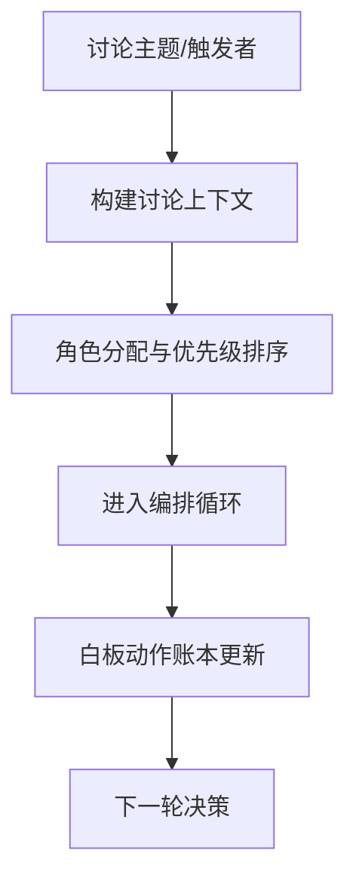
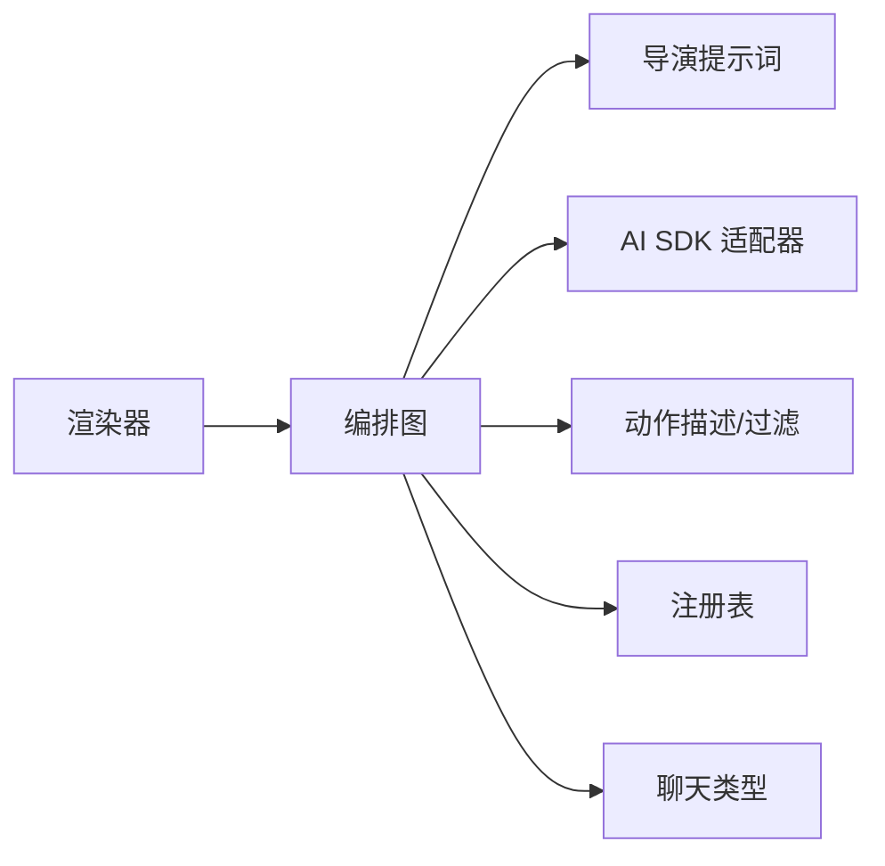

# 多智能体交互系统

<cite>
**本文引用的文件**
- [lib/orchestration/director-graph.ts](file://lib/orchestration/director-graph.ts)
- [lib/orchestration/director-prompt.ts](file://lib/orchestration/director-prompt.ts)
- [lib/orchestration/ai-sdk-adapter.ts](file://lib/orchestration/ai-sdk-adapter.ts)
- [lib/orchestration/prompt-builder.ts](file://lib/orchestration/prompt-builder.ts)
- [lib/orchestration/tool-schemas.ts](file://lib/orchestration/tool-schemas.ts)
- [lib/orchestration/stateless-generate.ts](file://lib/orchestration/stateless-generate.ts)
- [lib/types/chat.ts](file://lib/types/chat.ts)
- [lib/orchestration/registry/types.ts](file://lib/orchestration/registry/types.ts)
- [lib/orchestration/registry/store.ts](file://lib/orchestration/registry/store.ts)
- [app/api/chat/route.ts](file://app/api/chat/route.ts)
- [app/api/classroom/route.ts](file://app/api/classroom/route.ts)
- [app/api/generate-classroom/route.ts](file://app/api/generate-classroom/route.ts)
- [components/scene-renderers/pbl-renderer.tsx](file://components/scene-renderers/pbl-renderer.tsx)
- [components/scene-renderers/interactive-renderer.tsx](file://components/scene-renderers/interactive-renderer.tsx)
- [components/whiteboard/index.tsx](file://components/whiteboard/index.tsx)
- [components/roundtable/index.tsx](file://components/roundtable/index.tsx)
- [components/scene-renderers/pbl/chat-panel.tsx](file://components/scene-renderers/pbl/chat-panel.tsx)
- [components/scene-renderers/pbl/issueboard-panel.tsx](file://components/scene-renderers/pbl/issueboard-panel.tsx)
- [components/scene-renderers/pbl/role-selection.tsx](file://components/scene-renderers/pbl/role-selection.tsx)
- [components/scene-renderers/pbl/use-pbl-chat.ts](file://components/scene-renderers/pbl/use-pbl-chat.ts)
- [components/scene-renderers/pbl/workspace.tsx](file://components/scene-renderers/pbl/workspace.tsx)
</cite>

## 目录
1. [引言](#引言)
2. [项目结构](#项目结构)
3. [核心组件](#核心组件)
4. [架构总览](#架构总览)
5. [详细组件分析](#详细组件分析)
6. [依赖关系分析](#依赖关系分析)
7. [性能考量](#性能考量)
8. [故障排除指南](#故障排除指南)
9. [结论](#结论)
10. [附录](#附录)

## 引言
本文件面向 OpenMAIC 的多智能体交互系统，围绕基于 LangGraph 的状态机编排系统，系统性阐述智能体之间的协调机制与对话流程控制；详解课堂讨论、圆桌辩论、问答模式与白板协作等交互模式的实现；说明智能体配置管理、工具调用模式与角色分配机制；并提供实际交互示例与对话流程图，帮助读者快速理解与落地。

## 项目结构
OpenMAIC 的多智能体交互由“前端渲染器 + 后端编排引擎 + 类型与注册表”三层构成：
- 前端渲染器：负责场景渲染（PBL、互动课堂、白板）、UI 控件与用户交互。
- 后端编排引擎：以 LangGraph StateGraph 实现状态机编排，驱动多智能体轮转与动作执行。
- 类型与注册表：定义消息事件、请求/响应类型，以及默认与生成智能体的注册与持久化。

**图表来源**
- [lib/orchestration/director-graph.ts:484-496](file://lib/orchestration/director-graph.ts#L484-L496)
- [lib/orchestration/ai-sdk-adapter.ts:43-51](file://lib/orchestration/ai-sdk-adapter.ts#L43-L51)
- [lib/orchestration/prompt-builder.ts:93-253](file://lib/orchestration/prompt-builder.ts#L93-L253)
- [lib/orchestration/tool-schemas.ts:12-21](file://lib/orchestration/tool-schemas.ts#L12-L21)
- [lib/orchestration/registry/store.ts:189-246](file://lib/orchestration/registry/store.ts#L189-L246)
- [lib/types/chat.ts:236-282](file://lib/types/chat.ts#L236-L282)

**章节来源**
- [lib/orchestration/director-graph.ts:1-550](file://lib/orchestration/director-graph.ts#L1-L550)
- [lib/orchestration/ai-sdk-adapter.ts:1-157](file://lib/orchestration/ai-sdk-adapter.ts#L1-L157)
- [lib/orchestration/prompt-builder.ts:1-849](file://lib/orchestration/prompt-builder.ts#L1-L849)
- [lib/orchestration/tool-schemas.ts:1-69](file://lib/orchestration/tool-schemas.ts#L1-L69)
- [lib/orchestration/registry/store.ts:1-398](file://lib/orchestration/registry/store.ts#L1-L398)
- [lib/types/chat.ts:1-337](file://lib/types/chat.ts#L1-L337)

## 核心组件
- 编排图与状态机
  - 使用 LangGraph StateGraph 定义状态注解与节点，拓扑为 START → director → agent_generate → director 循环，直至 shouldEnd 或达到最大轮次。
  - 状态字段覆盖输入（消息、可用智能体、触发者、讨论上下文、用户画像）与可变字段（当前智能体、轮次、响应汇总、白板账本、动作计数等）。
- 导演节点（Director）
  - 单智能体：纯逻辑调度，首回合派发，后续引导用户。
  - 多智能体：首回合若存在触发者且在可用列表中则直接派发；否则通过 LLM 决策下一个说话者或结束。
  - 输出事件：thinking（加载阶段）、cue_user（引导用户）、shouldEnd 控制循环。
- 智能体生成节点（Agent Generate）
  - 构建结构化提示词，转换消息格式，流式解析模型输出（文本片段与动作），并记录白板动作到账本。
  - 输出事件：agent_start、text_delta、action、agent_end，并更新 turnCount、totalActions、agentResponses、whiteboardLedger。
- 提示词构建器（Prompt Builder）
  - 针对不同角色（教师、助教、学生）给出职责与风格约束；根据场景类型过滤动作（如 spotlight/laser 仅限 slide 场景）。
  - 输出格式要求为 JSON 数组，元素为 text 或 action，支持顺序原则与互斥规则。
- 动作描述与过滤（Tool Schemas）
  - 将允许的动作映射为自然语言描述，用于系统提示词；按场景类型过滤 slide-only 动作。
- AI SDK 适配器（AISdkLangGraphAdapter）
  - 将 LangGraph 的消息格式转换为 AI SDK 可用的消息数组，统一走 callLLM/streamLLM，支持多提供商。
- 状态无关生成（stateless-generate）
  - 基于 LangGraph 的自定义流模式，逐事件推送，前端按事件流实时渲染；最终返回 directorState 供下一轮使用。
- 类型与事件（chat.ts）
  - 定义 StatelessChatRequest、StatelessEvent、ParsedAction、DirectorState 等，确保前后端一致的事件契约。
- 智能体注册表（registry）
  - 默认智能体模板（教师、助教、学生角色），支持本地持久化与生成智能体的加载/保存；提供角色到动作集合的映射。

**章节来源**
- [lib/orchestration/director-graph.ts:49-78](file://lib/orchestration/director-graph.ts#L49-L78)
- [lib/orchestration/director-graph.ts:102-228](file://lib/orchestration/director-graph.ts#L102-L228)
- [lib/orchestration/director-graph.ts:239-472](file://lib/orchestration/director-graph.ts#L239-L472)
- [lib/orchestration/prompt-builder.ts:93-253](file://lib/orchestration/prompt-builder.ts#L93-L253)
- [lib/orchestration/tool-schemas.ts:12-69](file://lib/orchestration/tool-schemas.ts#L12-L69)
- [lib/orchestration/ai-sdk-adapter.ts:43-157](file://lib/orchestration/ai-sdk-adapter.ts#L43-L157)
- [lib/orchestration/stateless-generate.ts:317-434](file://lib/orchestration/stateless-generate.ts#L317-L434)
- [lib/types/chat.ts:236-337](file://lib/types/chat.ts#L236-L337)
- [lib/orchestration/registry/types.ts:6-87](file://lib/orchestration/registry/types.ts#L6-L87)
- [lib/orchestration/registry/store.ts:42-187](file://lib/orchestration/registry/store.ts#L42-L187)

## 架构总览
下面的时序图展示了从客户端发起一次“单轮多智能体生成”的完整流程，包括编排、提示词构建、模型流式输出与事件分发。

**图表来源**
- [lib/orchestration/director-graph.ts:484-496](file://lib/orchestration/director-graph.ts#L484-L496)
- [lib/orchestration/director-graph.ts:102-228](file://lib/orchestration/director-graph.ts#L102-L228)
- [lib/orchestration/director-graph.ts:239-472](file://lib/orchestration/director-graph.ts#L239-L472)
- [lib/orchestration/ai-sdk-adapter.ts:128-155](file://lib/orchestration/ai-sdk-adapter.ts#L128-L155)
- [lib/orchestration/stateless-generate.ts:317-434](file://lib/orchestration/stateless-generate.ts#L317-L434)

## 详细组件分析

### 组件一：编排图与状态机（LangGraph）
- 状态注解
  - 输入：messages、storeState、availableAgentIds、maxTurns、languageModel、thinkingConfig、discussionContext、triggerAgentId、userProfile、agentConfigOverrides
  - 可变：currentAgentId、turnCount、agentResponses、whiteboardLedger、shouldEnd、totalActions
- 节点
  - director：根据单/多智能体策略与 LLM 决策选择下一步
  - agent_generate：构建提示词、流式解析、产出 text_delta 与 action 事件
- 条件边：director → agent_generate 或 END

**图表来源**
- [lib/orchestration/director-graph.ts:484-496](file://lib/orchestration/director-graph.ts#L484-L496)

**章节来源**
- [lib/orchestration/director-graph.ts:49-78](file://lib/orchestration/director-graph.ts#L49-L78)
- [lib/orchestration/director-graph.ts:102-228](file://lib/orchestration/director-graph.ts#L102-L228)
- [lib/orchestration/director-graph.ts:239-472](file://lib/orchestration/director-graph.ts#L239-L472)

### 组件二：导演提示词与决策解析
- 提示词构建
  - 列出可用智能体、已发言者摘要、对话摘要、讨论模式、白板状态、学生画像
  - 规则：优先教师开场、避免重复、推进对话、角色多样性、内容去重、问候规则
- 决策解析
  - 从 LLM 输出中提取 JSON，支持 END 与 USER 指令

**图表来源**
- [lib/orchestration/director-prompt.ts:52-138](file://lib/orchestration/director-prompt.ts#L52-L138)
- [lib/orchestration/director-prompt.ts:254-277](file://lib/orchestration/director-prompt.ts#L254-L277)

**章节来源**
- [lib/orchestration/director-prompt.ts:52-138](file://lib/orchestration/director-prompt.ts#L52-L138)
- [lib/orchestration/director-prompt.ts:254-277](file://lib/orchestration/director-prompt.ts#L254-L277)

### 组件三：结构化提示词与动作过滤
- 角色职责与长度约束：教师约 100 字、助教约 80 字、学生约 50 字
- 白板绘制规则：坐标边界、间距、LaTeX 高度与宽度计算、删除与动画式更新
- 动作过滤：非 slide 场景移除 spotlight/laser
- 输出格式：严格 JSON 数组，text 与 action 交错

**图表来源**
- [lib/orchestration/prompt-builder.ts:93-253](file://lib/orchestration/prompt-builder.ts#L93-L253)
- [lib/orchestration/tool-schemas.ts:12-69](file://lib/orchestration/tool-schemas.ts#L12-L69)

**章节来源**
- [lib/orchestration/prompt-builder.ts:93-253](file://lib/orchestration/prompt-builder.ts#L93-L253)
- [lib/orchestration/prompt-builder.ts:288-395](file://lib/orchestration/prompt-builder.ts#L288-L395)
- [lib/orchestration/tool-schemas.ts:12-69](file://lib/orchestration/tool-schemas.ts#L12-L69)

### 组件四：AI SDK 适配器与流式生成
- 将 LangChain 消息转换为 AI SDK 消息，统一走 callLLM/streamLLM
- 流式生成：yield delta 文本块，最后 yield done 含完整内容

**图表来源**
- [lib/orchestration/ai-sdk-adapter.ts:43-157](file://lib/orchestration/ai-sdk-adapter.ts#L43-L157)

**章节来源**
- [lib/orchestration/ai-sdk-adapter.ts:64-155](file://lib/orchestration/ai-sdk-adapter.ts#L64-L155)

### 组件五：状态无关生成与事件流
- 逐事件推送：agent_start、text_delta、action、agent_end、thinking、cue_user、done/error
- 前端按事件流实时渲染，完成后返回 directorState 用于下一轮

**图表来源**
- [lib/orchestration/stateless-generate.ts:317-434](file://lib/orchestration/stateless-generate.ts#L317-L434)
- [lib/types/chat.ts:299-337](file://lib/types/chat.ts#L299-L337)

**章节来源**
- [lib/orchestration/stateless-generate.ts:136-306](file://lib/orchestration/stateless-generate.ts#L136-L306)
- [lib/orchestration/stateless-generate.ts:317-434](file://lib/orchestration/stateless-generate.ts#L317-L434)
- [lib/types/chat.ts:299-337](file://lib/types/chat.ts#L299-L337)

### 组件六：智能体配置管理与角色分配
- 默认智能体：教师、助教、多种学生角色，含头像、颜色、优先级与动作集合
- 注册表：Zustand + 持久化，支持添加/更新/删除/列出；合并持久化与默认值
- 生成智能体：按阶段加载/保存至 IndexedDB，并注入注册表

**图表来源**
- [lib/orchestration/registry/types.ts:6-24](file://lib/orchestration/registry/types.ts#L6-L24)
- [lib/orchestration/registry/store.ts:14-23](file://lib/orchestration/registry/store.ts#L14-L23)

**章节来源**
- [lib/orchestration/registry/types.ts:6-87](file://lib/orchestration/registry/types.ts#L6-L87)
- [lib/orchestration/registry/store.ts:42-187](file://lib/orchestration/registry/store.ts#L42-L187)
- [lib/orchestration/registry/store.ts:318-350](file://lib/orchestration/registry/store.ts#L318-L350)
- [lib/orchestration/registry/store.ts:356-397](file://lib/orchestration/registry/store.ts#L356-L397)

### 组件七：交互模式与场景集成
- 课堂讨论（Discussion）
  - 讨论主题与引导提示；首回合由触发智能体开场，随后按导演规则推进。
- 圆桌辩论（Roundtable）
  - 基于智能体注册表与参与者映射，形成教师与学生侧布局。
- 问答模式（QA）
  - 通常由教师或指定智能体回答，结合讨论上下文与白板状态。
- 白板协作
  - wb_open/wb_draw_* / wb_delete / wb_clear / wb_close；根据场景类型与白板互斥规则进行动作协调。

**图表来源**
- [lib/orchestration/director-prompt.ts:52-138](file://lib/orchestration/director-prompt.ts#L52-L138)
- [lib/orchestration/registry/store.ts:253-311](file://lib/orchestration/registry/store.ts#L253-L311)

**章节来源**
- [lib/orchestration/director-prompt.ts:52-138](file://lib/orchestration/director-prompt.ts#L52-L138)
- [lib/orchestration/registry/store.ts:253-311](file://lib/orchestration/registry/store.ts#L253-L311)

## 依赖关系分析
- 编排图依赖
  - 导演提示词构建器：用于多智能体决策
  - AI SDK 适配器：统一 LLM 调用
  - 工具描述与过滤：按场景类型限制动作
  - 注册表：解析智能体配置
  - 类型系统：事件与请求/响应契约
- 前端渲染器
  - PBL 渲染器、互动课堂渲染器、白板组件与圆桌组件消费后端事件流，实时更新 UI

**图表来源**
- [lib/orchestration/director-graph.ts:31-40](file://lib/orchestration/director-graph.ts#L31-L40)
- [lib/orchestration/director-prompt.ts:52-138](file://lib/orchestration/director-prompt.ts#L52-L138)
- [lib/orchestration/ai-sdk-adapter.ts:43-51](file://lib/orchestration/ai-sdk-adapter.ts#L43-L51)
- [lib/orchestration/tool-schemas.ts:12-69](file://lib/orchestration/tool-schemas.ts#L12-L69)
- [lib/orchestration/registry/store.ts:189-246](file://lib/orchestration/registry/store.ts#L189-L246)
- [lib/types/chat.ts:236-282](file://lib/types/chat.ts#L236-L282)

**章节来源**
- [lib/orchestration/director-graph.ts:31-40](file://lib/orchestration/director-graph.ts#L31-L40)
- [lib/types/chat.ts:236-282](file://lib/types/chat.ts#L236-L282)

## 性能考量
- 流式解析与增量输出
  - 使用 partial-json 与 jsonrepair 支持不完整 JSON 的增量解析，降低等待时间。
- 动作过滤与场景感知
  - 在提示词构建阶段即过滤 slide-only 动作，减少无效动作尝试。
- 事件驱动渲染
  - SSE 事件逐段推送，前端即时渲染，避免一次性大块数据传输。
- 轮次限制与早停
  - maxTurns 与 shouldEnd 控制对话长度，避免无意义的长轮次。

[本节为通用性能建议，无需特定文件引用]

## 故障排除指南
- 模型未输出 JSON 数组
  - 现象：前端只收到纯文本或空内容
  - 排查：检查提示词格式要求与输出示例；确认模型遵循 JSON 数组格式
  - 参考：结构化解析与最终收尾逻辑
- 动作被拒绝
  - 现象：action 事件被忽略
  - 排查：确认动作是否属于 allowedActions；非 slide 场景是否移除了 spotlight/laser
  - 参考：动作过滤与提示词构建
- 导演决策解析失败
  - 现象：导演出错或提前结束
  - 排查：检查 LLM 输出是否包含有效 JSON；核对提示词中的输出格式要求
- 事件流中断
  - 现象：前端接收不到 done 或 error
  - 排查：检查 AbortSignal 是否被触发；查看 statelessGenerate 的错误分支

**章节来源**
- [lib/orchestration/stateless-generate.ts:136-306](file://lib/orchestration/stateless-generate.ts#L136-L306)
- [lib/orchestration/stateless-generate.ts:421-434](file://lib/orchestration/stateless-generate.ts#L421-L434)
- [lib/orchestration/tool-schemas.ts:12-21](file://lib/orchestration/tool-schemas.ts#L12-L21)
- [lib/orchestration/director-prompt.ts:254-277](file://lib/orchestration/director-prompt.ts#L254-L277)

## 结论
OpenMAIC 的多智能体交互系统以 LangGraph 为核心，通过“导演 + 智能体”的两阶段编排，实现了课堂讨论、圆桌辩论、问答与白板协作等多种教学场景的自然推进。系统通过严格的提示词格式、动作过滤与事件流机制，确保了教学过程的沉浸感与可控性。注册表与类型系统进一步保障了配置管理与前后端一致性。建议在实际部署中关注流式解析的健壮性、动作过滤的准确性与轮次控制策略，以获得更稳定的用户体验。

## 附录
- 实际交互示例（概念性说明）
  - 课堂讨论：教师作为触发者开场，随后根据导演规则引入学生视角，白板用于可视化关键公式或图表。
  - 圆桌辩论：多智能体按角色与优先级轮流发言，导演避免重复与推进对话，白板用于记录要点。
  - 问答模式：教师主导回答，必要时辅以助教补充，学生提问推动深入探讨。
  - 白板协作：教师与助教在白板上绘制图表与公式，学生在受邀情况下参与书写，动作与语音同步呈现。

[本节为概念性说明，无需特定文件引用]