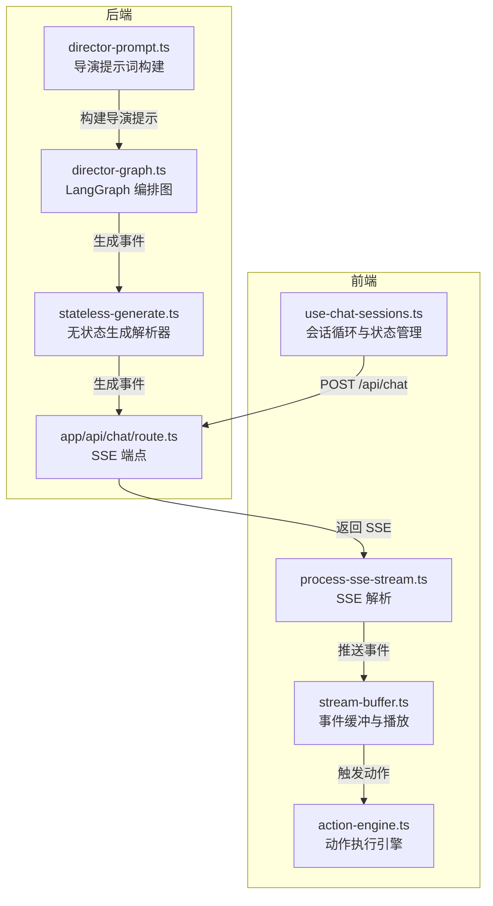
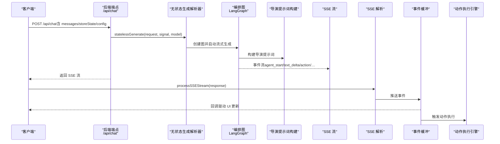
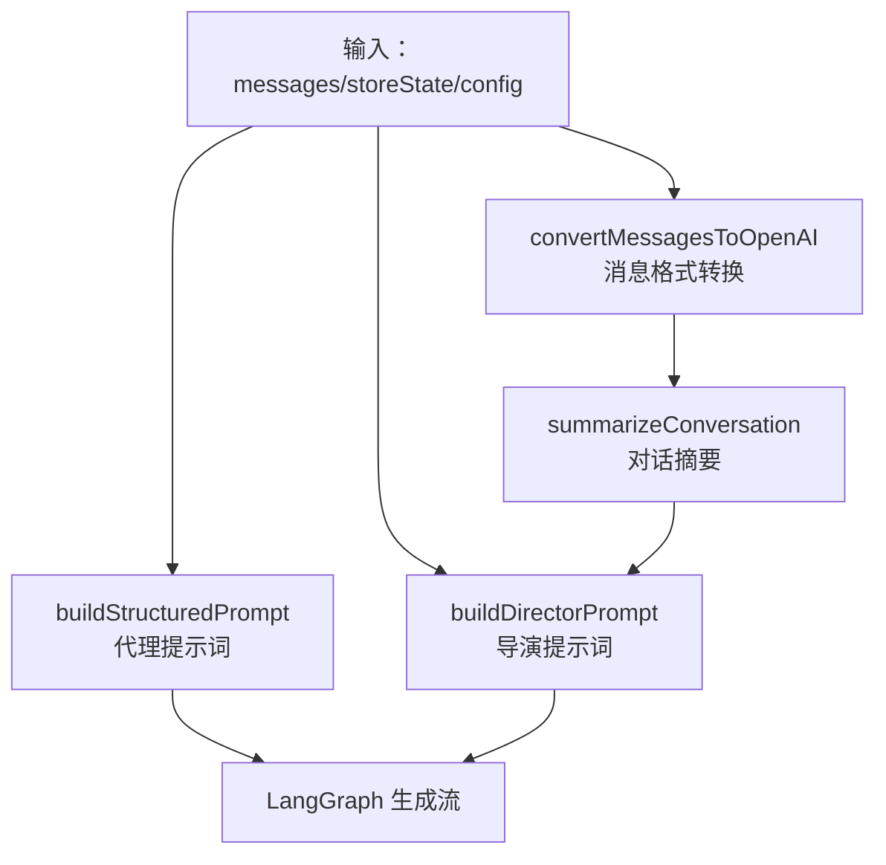
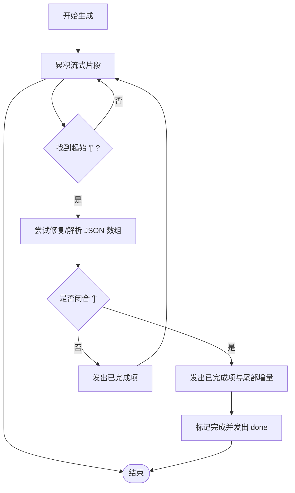
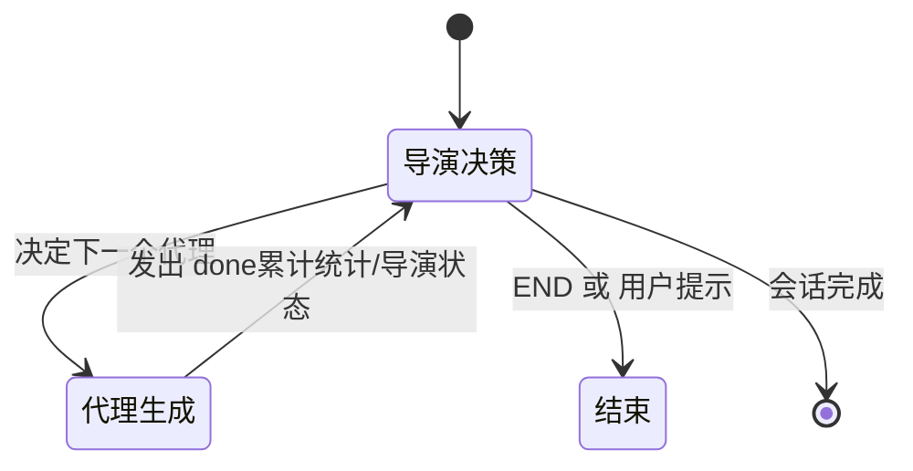
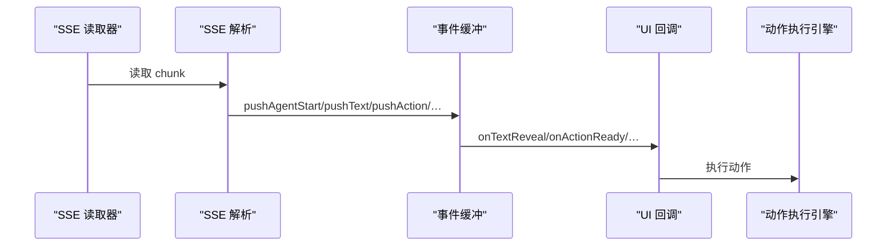
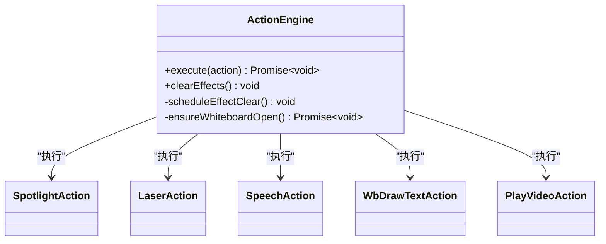
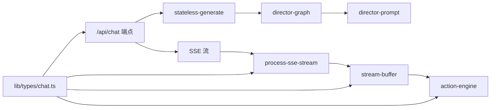

# 对话流程控制

<cite>
**本文引用的文件**
- [app/api/chat/route.ts](file://app/api/chat/route.ts)
- [lib/orchestration/stateless-generate.ts](file://lib/orchestration/stateless-generate.ts)
- [lib/orchestration/director-graph.ts](file://lib/orchestration/director-graph.ts)
- [lib/orchestration/director-prompt.ts](file://lib/orchestration/director-prompt.ts)
- [lib/buffer/stream-buffer.ts](file://lib/buffer/stream-buffer.ts)
- [components/chat/process-sse-stream.ts](file://components/chat/process-sse-stream.ts)
- [components/chat/use-chat-sessions.ts](file://components/chat/use-chat-sessions.ts)
- [lib/types/chat.ts](file://lib/types/chat.ts)
- [lib/action/engine.ts](file://lib/action/engine.ts)
- [lib/types/action.ts](file://lib/types/action.ts)
</cite>

## 目录
1. [引言](#引言)
2. [项目结构](#项目结构)
3. [核心组件](#核心组件)
4. [架构总览](#架构总览)
5. [详细组件分析](#详细组件分析)
6. [依赖关系分析](#依赖关系分析)
7. [性能考量](#性能考量)
8. [故障排查指南](#故障排查指南)
9. [结论](#结论)
10. [附录](#附录)

## 引言
本文件聚焦于 OpenMAIC 的“对话流程控制”能力，围绕以下目标展开：  
- 提示词构建系统：结构化提示词生成、对话上下文总结与消息格式转换  
- 无状态生成解析器：文本块解析、动作提取与事件流生成  
- 对话状态管理：轮次跟踪、响应汇总与进度控制  
- 调试方法与性能优化技巧  
- 实际对话示例与状态转换图  

通过对服务端无状态生成、前端事件缓冲与播放节奏层的协同机制进行深入剖析，帮助读者在理解系统设计的同时，掌握如何扩展与优化多智能体对话编排。

## 项目结构
该系统采用“服务端无状态 + 前端事件缓冲”的分层设计：  
- 服务端：接收完整客户端状态，单轮次生成，通过 SSE 流式输出事件  
- 前端：统一的事件缓冲与播放层，负责字符级打字机效果、动作执行与 UI 同步

图表来源
- [app/api/chat/route.ts:44-191](file://app/api/chat/route.ts#L44-L191)
- [lib/orchestration/stateless-generate.ts:317-435](file://lib/orchestration/stateless-generate.ts#L317-L435)
- [lib/orchestration/director-graph.ts:484-550](file://lib/orchestration/director-graph.ts#L484-L550)
- [lib/orchestration/director-prompt.ts:52-138](file://lib/orchestration/director-prompt.ts#L52-L138)
- [components/chat/process-sse-stream.ts:12-123](file://components/chat/process-sse-stream.ts#L12-L123)
- [lib/buffer/stream-buffer.ts:151-605](file://lib/buffer/stream-buffer.ts#L151-L605)
- [lib/action/engine.ts:55-519](file://lib/action/engine.ts#L55-L519)

章节来源
- [app/api/chat/route.ts:1-191](file://app/api/chat/route.ts#L1-L191)
- [lib/orchestration/stateless-generate.ts:1-435](file://lib/orchestration/stateless-generate.ts#L1-L435)
- [lib/orchestration/director-graph.ts:1-550](file://lib/orchestration/director-graph.ts#L1-L550)
- [lib/orchestration/director-prompt.ts:1-278](file://lib/orchestration/director-prompt.ts#L1-L278)
- [components/chat/process-sse-stream.ts:1-123](file://components/chat/process-sse-stream.ts#L1-L123)
- [lib/buffer/stream-buffer.ts:1-605](file://lib/buffer/stream-buffer.ts#L1-L605)
- [lib/action/engine.ts:1-519](file://lib/action/engine.ts#L1-L519)

## 核心组件
- 无状态聊天端点：接收完整客户端状态，创建语言模型，启动后台生成与心跳，以 SSE 流式返回事件  
- 无状态生成解析器：基于 LangGraph 的编排图，使用结构化 JSON 数组输出，增量解析文本与动作，生成事件流  
- 导演提示词构建：根据可用代理、对话摘要、白板账本与讨论上下文生成决策提示，决定下一个说话者或结束/用户提示  
- SSE 解析与事件缓冲：解析 SSE 数据，按顺序推入统一的事件缓冲，驱动 UI 打字机与动作执行  
- 动作执行引擎：集中处理所有动作类型（火速/同步），在画布与媒体层落地效果  
- 会话循环与状态管理：前端驱动的代理循环，每轮请求后等待缓冲排空，读取 done 数据更新导演状态并推进流程

章节来源
- [app/api/chat/route.ts:44-191](file://app/api/chat/route.ts#L44-L191)
- [lib/orchestration/stateless-generate.ts:317-435](file://lib/orchestration/stateless-generate.ts#L317-L435)
- [lib/orchestration/director-graph.ts:484-550](file://lib/orchestration/director-graph.ts#L484-L550)
- [lib/orchestration/director-prompt.ts:52-138](file://lib/orchestration/director-prompt.ts#L52-L138)
- [components/chat/process-sse-stream.ts:12-123](file://components/chat/process-sse-stream.ts#L12-L123)
- [lib/buffer/stream-buffer.ts:151-605](file://lib/buffer/stream-buffer.ts#L151-L605)
- [lib/action/engine.ts:55-519](file://lib/action/engine.ts#L55-L519)
- [components/chat/use-chat-sessions.ts:340-502](file://components/chat/use-chat-sessions.ts#L340-L502)

## 架构总览
下图展示从客户端到服务端再到前端事件缓冲与动作执行的整体链路：

图表来源
- [app/api/chat/route.ts:118-174](file://app/api/chat/route.ts#L118-L174)
- [lib/orchestration/stateless-generate.ts:317-435](file://lib/orchestration/stateless-generate.ts#L317-L435)
- [lib/orchestration/director-graph.ts:484-550](file://lib/orchestration/director-graph.ts#L484-L550)
- [lib/orchestration/director-prompt.ts:52-138](file://lib/orchestration/director-prompt.ts#L52-L138)
- [components/chat/process-sse-stream.ts:12-123](file://components/chat/process-sse-stream.ts#L12-L123)
- [lib/buffer/stream-buffer.ts:151-605](file://lib/buffer/stream-buffer.ts#L151-L605)
- [lib/action/engine.ts:55-519](file://lib/action/engine.ts#L55-L519)

## 详细组件分析

### 组件一：提示词构建系统（结构化提示词生成、上下文总结与消息格式转换）
- 结构化提示词生成：针对每个代理，结合场景、白板账本、讨论上下文与用户画像，生成面向该代理的系统提示，确保其输出符合“动作+文本交错”的结构化数组格式  
- 对话上下文总结：将历史消息转换为 OpenAI 兼容的消息列表，并生成简要的对话摘要，供导演节点决策使用  
- 消息格式转换：将 UI 消息映射为 LangChain 消息对象，保证代理视角的角色一致性与最后一条消息为用户角色，避免模型无法区分轮次边界

图表来源
- [lib/orchestration/director-graph.ts:32-35](file://lib/orchestration/director-graph.ts#L32-L35)
- [lib/orchestration/director-graph.ts:284-291](file://lib/orchestration/director-graph.ts#L284-L291)
- [lib/orchestration/director-graph.ts:169-179](file://lib/orchestration/director-graph.ts#L169-L179)
- [lib/orchestration/director-prompt.ts:52-138](file://lib/orchestration/director-prompt.ts#L52-L138)

章节来源
- [lib/orchestration/director-graph.ts:32-35](file://lib/orchestration/director-graph.ts#L32-L35)
- [lib/orchestration/director-graph.ts:284-291](file://lib/orchestration/director-graph.ts#L284-L291)
- [lib/orchestration/director-graph.ts:169-179](file://lib/orchestration/director-graph.ts#L169-L179)
- [lib/orchestration/director-prompt.ts:52-138](file://lib/orchestration/director-prompt.ts#L52-L138)

### 组件二：无状态生成解析器（文本块解析、动作提取与事件流生成）
- 结构化输出：要求模型输出形如 [ { "type": "action|text", … } , … ] 的 JSON 数组  
- 增量解析：使用部分 JSON 解析与修复策略，逐步产出已完成项与尾部文本增量，保持事件顺序一致  
- 事件生成：在生成过程中实时发出 agent_start、text_delta、action、agent_end 等事件；完成后附加 done 包含累计统计与导演状态

图表来源
- [lib/orchestration/stateless-generate.ts:136-255](file://lib/orchestration/stateless-generate.ts#L136-L255)
- [lib/orchestration/stateless-generate.ts:265-306](file://lib/orchestration/stateless-generate.ts#L265-L306)
- [lib/orchestration/stateless-generate.ts:317-435](file://lib/orchestration/stateless-generate.ts#L317-L435)

章节来源
- [lib/orchestration/stateless-generate.ts:136-255](file://lib/orchestration/stateless-generate.ts#L136-L255)
- [lib/orchestration/stateless-generate.ts:265-306](file://lib/orchestration/stateless-generate.ts#L265-L306)
- [lib/orchestration/stateless-generate.ts:317-435](file://lib/orchestration/stateless-generate.ts#L317-L435)

### 组件三：对话状态管理（轮次跟踪、响应汇总与进度控制）
- 轮次跟踪：每次 per-agent 请求仅允许一次导演→代理循环，turnCount 在代理生成结束后自增  
- 响应汇总：记录当前轮次中各代理的内容预览、动作数量与白板操作，形成导演状态的一部分  
- 进度控制：前端循环在每轮请求后等待缓冲排空，读取 done 数据更新 directorState，再决定是否继续或结束

图表来源
- [lib/orchestration/director-graph.ts:484-496](file://lib/orchestration/director-graph.ts#L484-L496)
- [lib/orchestration/stateless-generate.ts:385-417](file://lib/orchestration/stateless-generate.ts#L385-L417)
- [components/chat/use-chat-sessions.ts:340-502](file://components/chat/use-chat-sessions.ts#L340-L502)

章节来源
- [lib/orchestration/stateless-generate.ts:385-417](file://lib/orchestration/stateless-generate.ts#L385-L417)
- [components/chat/use-chat-sessions.ts:340-502](file://components/chat/use-chat-sessions.ts#L340-L502)

### 组件四：SSE 解析与事件缓冲（文本呈现与动作执行）
- SSE 解析：逐条解析 data: 行，将事件反序列化并推送到事件缓冲  
- 事件缓冲：统一的节拍循环，按配置速率逐字符呈现文本，动作在到达时触发回调并执行  
- 回调桥接：缓冲层回调将动作注入 UI 并交由动作执行引擎落地

图表来源
- [components/chat/process-sse-stream.ts:12-123](file://components/chat/process-sse-stream.ts#L12-L123)
- [lib/buffer/stream-buffer.ts:151-605](file://lib/buffer/stream-buffer.ts#L151-L605)
- [lib/action/engine.ts:55-519](file://lib/action/engine.ts#L55-L519)

章节来源
- [components/chat/process-sse-stream.ts:12-123](file://components/chat/process-sse-stream.ts#L12-L123)
- [lib/buffer/stream-buffer.ts:151-605](file://lib/buffer/stream-buffer.ts#L151-L605)
- [lib/action/engine.ts:55-519](file://lib/action/engine.ts#L55-L519)

### 组件五：动作执行引擎（统一动作入口与生命周期）
- 分类执行：火速动作（spotlight、laser）立即生效并定时清理；同步动作（speech、wb_*、play_video、discussion）等待完成后再进入下一阶段  
- 场景适配：根据当前场景类型过滤不允许的动作，确保安全与一致性  
- 生命周期：提供清理定时器、自动清除视觉效果等能力，避免副作用残留

图表来源
- [lib/action/engine.ts:55-519](file://lib/action/engine.ts#L55-L519)
- [lib/types/action.ts:165-205](file://lib/types/action.ts#L165-L205)

章节来源
- [lib/action/engine.ts:55-519](file://lib/action/engine.ts#L55-L519)
- [lib/types/action.ts:165-205](file://lib/types/action.ts#L165-L205)

## 依赖关系分析
- 服务端端点依赖无状态生成解析器与 LangGraph 编排图；编排图依赖导演提示词构建与消息格式转换  
- 前端依赖 SSE 解析与事件缓冲；事件缓冲依赖动作执行引擎  
- 类型定义贯穿前后端，确保事件与状态结构一致

图表来源
- [app/api/chat/route.ts:44-191](file://app/api/chat/route.ts#L44-L191)
- [lib/orchestration/stateless-generate.ts:317-435](file://lib/orchestration/stateless-generate.ts#L317-L435)
- [lib/orchestration/director-graph.ts:484-550](file://lib/orchestration/director-graph.ts#L484-L550)
- [lib/orchestration/director-prompt.ts:52-138](file://lib/orchestration/director-prompt.ts#L52-L138)
- [components/chat/process-sse-stream.ts:12-123](file://components/chat/process-sse-stream.ts#L12-L123)
- [lib/buffer/stream-buffer.ts:151-605](file://lib/buffer/stream-buffer.ts#L151-L605)
- [lib/action/engine.ts:55-519](file://lib/action/engine.ts#L55-L519)
- [lib/types/chat.ts:236-337](file://lib/types/chat.ts#L236-L337)

章节来源
- [lib/types/chat.ts:236-337](file://lib/types/chat.ts#L236-L337)

## 性能考量
- 单轮次生成：每次 per-agent 请求只允许一次导演→代理循环，避免深度嵌套与长链路  
- 心跳保活：后端定时发送注释行以维持 SSE 连接，减少代理/浏览器超时断连  
- 节拍控制：事件缓冲的节拍与每节字符数可调，平衡流畅度与资源占用  
- 动作批处理：同步动作串行等待，避免并发写入导致的抖动与冲突  
- 前端循环：前端循环在缓冲排空后才发起下一轮请求，降低服务器压力与网络拥塞

## 故障排查指南
- SSE 连接中断：检查心跳定时器与代理/浏览器超时设置；确认前端在软暂停/结束会话时正确释放缓冲与控制器  
- 事件丢失：核对 SSE 解析是否正确识别 data: 行与事件类型；确认事件缓冲未被提前关闭  
- 动作不生效：确认动作类型在当前场景下有效；检查动作执行引擎是否抛错或被提前清理  
- 导演决策异常：检查导演提示词构建参数（可用代理、对话摘要、白板账本、讨论上下文）是否齐全  
- 生成解析失败：关注部分 JSON 修复与增量解析逻辑，必要时放宽输出约束或增加重试

章节来源
- [app/api/chat/route.ts:96-174](file://app/api/chat/route.ts#L96-L174)
- [components/chat/process-sse-stream.ts:12-123](file://components/chat/process-sse-stream.ts#L12-L123)
- [lib/buffer/stream-buffer.ts:363-396](file://lib/buffer/stream-buffer.ts#L363-L396)
- [lib/orchestration/director-prompt.ts:254-278](file://lib/orchestration/director-prompt.ts#L254-L278)
- [lib/orchestration/stateless-generate.ts:165-180](file://lib/orchestration/stateless-generate.ts#L165-L180)

## 结论
该系统通过“服务端无状态 + 前端统一缓冲”的组合，实现了高可控、可扩展的多智能体对话编排：  
- 服务端专注结构化输出与事件流生成，前端专注节奏与交互体验  
- 通过导演提示词与编排图，实现灵活的轮次控制与状态推进  
- 事件缓冲与动作引擎解耦 UI 与底层执行，便于调试与优化  
建议在实际部署中结合业务场景调整节拍、动作延迟与轮次上限，并完善错误上报与回放能力。

## 附录
- 关键类型定义：会话类型、消息元数据、事件类型、动作类型等，确保前后端契约一致  
- 实际对话示例（路径参考）：  
  - 会话循环与状态推进：[runAgentLoop:340-502](file://components/chat/use-chat-sessions.ts#L340-L502)  
  - SSE 解析与事件推送：[processSSEStream:12-123](file://components/chat/process-sse-stream.ts#L12-L123)  
  - 事件缓冲与播放：[StreamBuffer:151-605](file://lib/buffer/stream-buffer.ts#L151-L605)  
  - 动作执行：[ActionEngine:55-519](file://lib/action/engine.ts#L55-L519)  
  - 无状态生成与事件流：[statelessGenerate:317-435](file://lib/orchestration/stateless-generate.ts#L317-L435)  
  - 导演提示词构建：[buildDirectorPrompt:52-138](file://lib/orchestration/director-prompt.ts#L52-L138)  
  - 编排图拓扑：[createOrchestrationGraph:484-496](file://lib/orchestration/director-graph.ts#L484-L496)