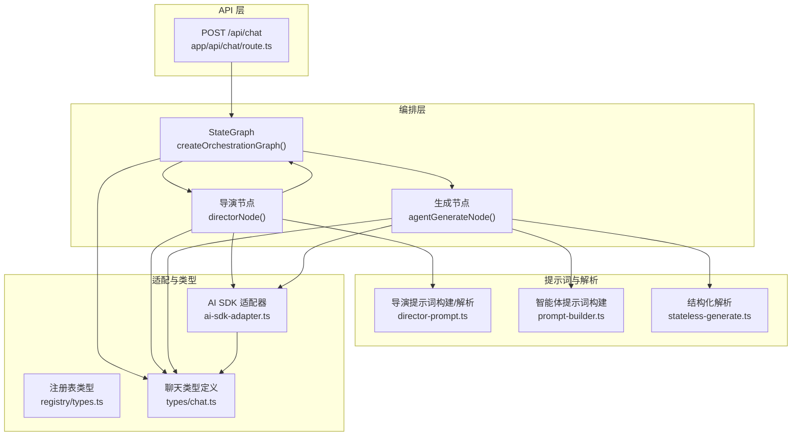
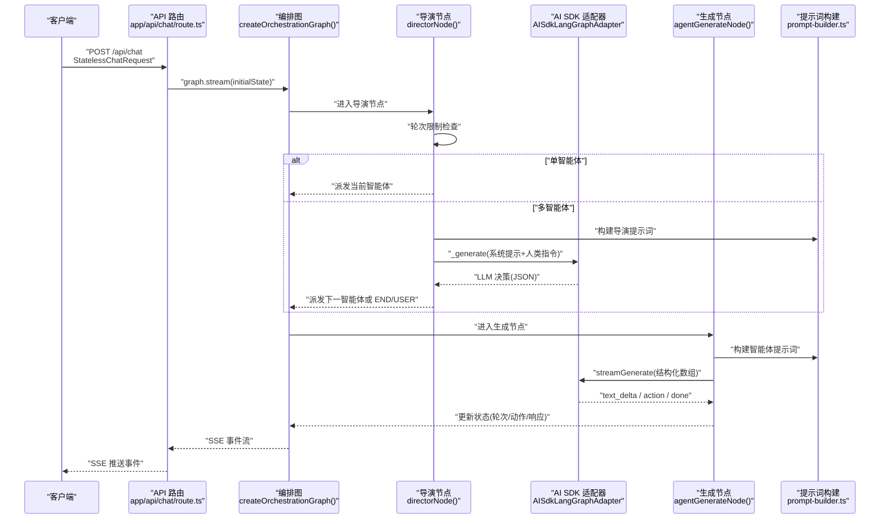
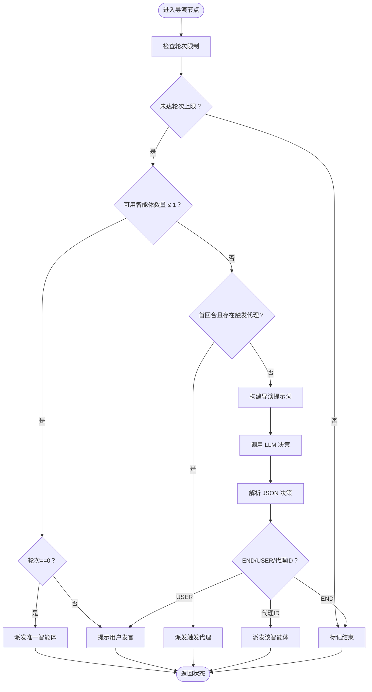
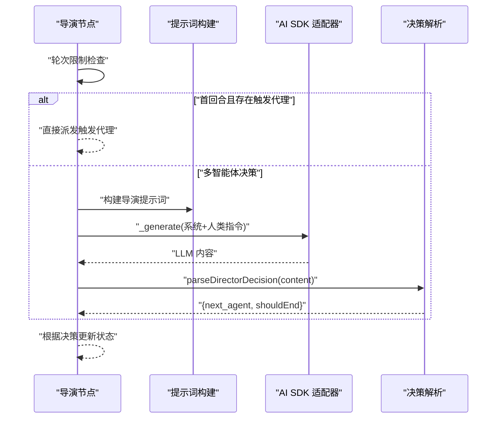
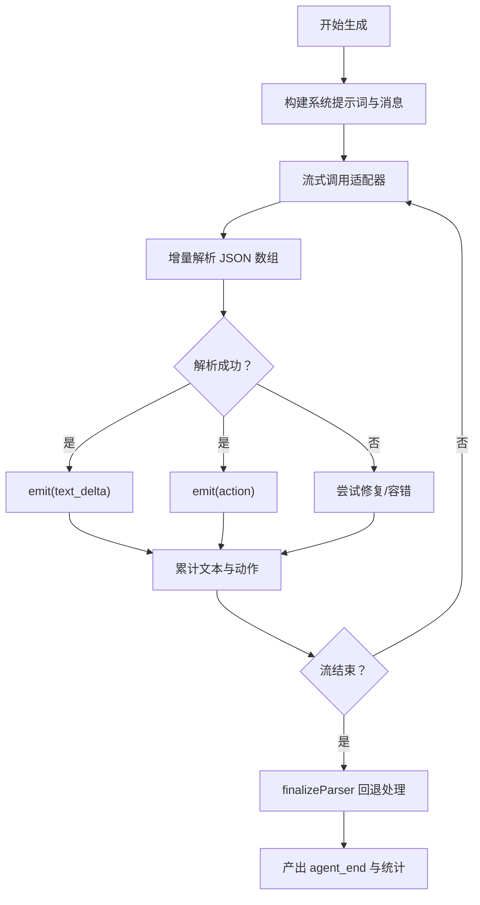
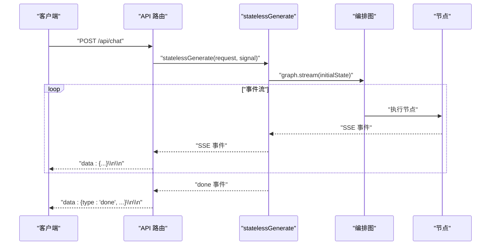
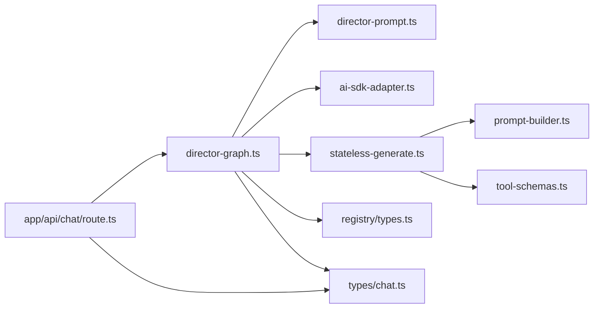

# 导演图设计

<cite>
**本文引用的文件**
- [lib/orchestration/director-graph.ts](file://lib/orchestration/director-graph.ts)
- [lib/orchestration/director-prompt.ts](file://lib/orchestration/director-prompt.ts)
- [lib/orchestration/stateless-generate.ts](file://lib/orchestration/stateless-generate.ts)
- [lib/orchestration/ai-sdk-adapter.ts](file://lib/orchestration/ai-sdk-adapter.ts)
- [lib/orchestration/prompt-builder.ts](file://lib/orchestration/prompt-builder.ts)
- [lib/orchestration/tool-schemas.ts](file://lib/orchestration/tool-schemas.ts)
- [lib/orchestration/registry/types.ts](file://lib/orchestration/registry/types.ts)
- [lib/types/chat.ts](file://lib/types/chat.ts)
- [app/api/chat/route.ts](file://app/api/chat/route.ts)
</cite>

## 目录
1. [简介](#简介)
2. [项目结构](#项目结构)
3. [核心组件](#核心组件)
4. [架构总览](#架构总览)
5. [详细组件分析](#详细组件分析)
6. [依赖关系分析](#依赖关系分析)
7. [性能考量](#性能考量)
8. [故障排查指南](#故障排查指南)
9. [结论](#结论)
10. [附录](#附录)

## 简介
本设计围绕基于 LangGraph 的“导演图”（Director Graph）展开，构建一个状态机编排系统，用于在多智能体课堂场景中决定“谁先说话”。系统支持两种运行模式：
- 单智能体模式：纯代码逻辑，零 LLM 调用，首回合直接调度唯一可用智能体，后续回合引导用户参与。
- 多智能体模式：以 LLM 为主导的决策，结合首轮触发代理与轮次限制等快速路径。

导演节点负责：
- 检查轮次上限
- 单智能体时的直接派发与用户提示
- 多智能体时的 LLM 决策与动作解析
- 将决策结果写入流事件并更新状态

## 项目结构
与导演图直接相关的核心模块如下：
- 状态与图：director-graph.ts 定义状态注解、导演节点、生成节点与图构建
- 提示词与解析：director-prompt.ts 构建导演提示词、解析决策
- 结构化输出解析：stateless-generate.ts 实现增量 JSON 数组解析与事件流
- LLM 适配器：ai-sdk-adapter.ts 将 AI SDK 的语言模型桥接到 LangGraph
- 提示词构建：prompt-builder.ts 为各智能体构建系统提示词
- 动作过滤：tool-schemas.ts 根据场景类型过滤可用动作
- 注册表类型：registry/types.ts 定义智能体配置与默认动作映射
- 类型定义：types/chat.ts 定义请求、事件与导演状态等类型
- API 入口：app/api/chat/route.ts 提供 SSE 流式接口

图表来源
- [lib/orchestration/director-graph.ts:484-496](file://lib/orchestration/director-graph.ts#L484-L496)
- [lib/orchestration/director-prompt.ts:52-138](file://lib/orchestration/director-prompt.ts#L52-L138)
- [lib/orchestration/stateless-generate.ts:317-434](file://lib/orchestration/stateless-generate.ts#L317-L434)
- [lib/orchestration/ai-sdk-adapter.ts:43-157](file://lib/orchestration/ai-sdk-adapter.ts#L43-L157)
- [lib/orchestration/prompt-builder.ts:93-253](file://lib/orchestration/prompt-builder.ts#L93-L253)
- [lib/orchestration/registry/types.ts:6-24](file://lib/orchestration/registry/types.ts#L6-L24)
- [lib/types/chat.ts:236-336](file://lib/types/chat.ts#L236-L336)
- [app/api/chat/route.ts:44-190](file://app/api/chat/route.ts#L44-L190)

章节来源
- [lib/orchestration/director-graph.ts:1-550](file://lib/orchestration/director-graph.ts#L1-L550)
- [lib/orchestration/director-prompt.ts:1-278](file://lib/orchestration/director-prompt.ts#L1-L278)
- [lib/orchestration/stateless-generate.ts:1-435](file://lib/orchestration/stateless-generate.ts#L1-L435)
- [lib/orchestration/ai-sdk-adapter.ts:1-157](file://lib/orchestration/ai-sdk-adapter.ts#L1-L157)
- [lib/orchestration/prompt-builder.ts:1-849](file://lib/orchestration/prompt-builder.ts#L1-L849)
- [lib/orchestration/tool-schemas.ts:1-69](file://lib/orchestration/tool-schemas.ts#L1-L69)
- [lib/orchestration/registry/types.ts:1-87](file://lib/orchestration/registry/types.ts#L1-L87)
- [lib/types/chat.ts:1-337](file://lib/types/chat.ts#L1-L337)
- [app/api/chat/route.ts:1-190](file://app/api/chat/route.ts#L1-L190)

## 核心组件
- 状态注解（OrchestratorState）
  - 输入态：消息、存储状态、可用智能体列表、最大轮次、语言模型、思考配置、讨论上下文、触发代理、用户画像、请求级代理配置覆盖
  - 可变态：当前智能体、轮次计数、智能体响应摘要、白板流水、是否结束、动作总数
- 导演节点（directorNode）
  - 单智能体：首回合派发，后续回合提示用户
  - 多智能体：轮次限制检查；首回合存在触发代理则直接派发；否则构造提示词并调用 LLM 做出决策
  - 决策解析：解析 JSON 输出，支持 END、USER 或具体代理 ID
- 生成节点（agentGenerateNode）
  - 运行单个智能体，流式产出文本增量与动作事件
  - 解析结构化数组，按顺序回放文本与动作，记录白板操作并更新状态
- 图构建（createOrchestrationGraph）
  - 有向无环图拓扑：START → director → 条件边 → END 或 agent_generate → director 循环
- 初始状态（buildInitialState）
  - 从 StatelessChatRequest 构建初始状态，支持请求级代理配置覆盖与讨论上下文

章节来源
- [lib/orchestration/director-graph.ts:49-76](file://lib/orchestration/director-graph.ts#L49-L76)
- [lib/orchestration/director-graph.ts:102-228](file://lib/orchestration/director-graph.ts#L102-L228)
- [lib/orchestration/director-graph.ts:439-472](file://lib/orchestration/director-graph.ts#L439-L472)
- [lib/orchestration/director-graph.ts:484-496](file://lib/orchestration/director-graph.ts#L484-L496)
- [lib/orchestration/director-graph.ts:502-549](file://lib/orchestration/director-graph.ts#L502-L549)

## 架构总览
导演图采用 LangGraph 的 StateGraph，将“导演决策”和“智能体生成”两个阶段串联，通过自定义流模式实时推送事件，前端可即时渲染文本增量与动作。

图表来源
- [app/api/chat/route.ts:44-190](file://app/api/chat/route.ts#L44-L190)
- [lib/orchestration/director-graph.ts:484-496](file://lib/orchestration/director-graph.ts#L484-L496)
- [lib/orchestration/director-graph.ts:102-228](file://lib/orchestration/director-graph.ts#L102-L228)
- [lib/orchestration/stateless-generate.ts:317-434](file://lib/orchestration/stateless-generate.ts#L317-L434)
- [lib/orchestration/ai-sdk-adapter.ts:80-155](file://lib/orchestration/ai-sdk-adapter.ts#L80-L155)
- [lib/orchestration/prompt-builder.ts:93-253](file://lib/orchestration/prompt-builder.ts#L93-L253)

## 详细组件分析

### 状态定义与节点设计
- 状态注解（OrchestratorState）
  - 输入态字段：messages、storeState、availableAgentIds、maxTurns、languageModel、thinkingConfig、discussionContext、triggerAgentId、userProfile、agentConfigOverrides
  - 可变态字段：currentAgentId、turnCount、agentResponses（reducer）、whiteboardLedger（reducer）、shouldEnd、totalActions
- 导演节点（directorNode）
  - 首先执行轮次限制检查
  - 单智能体分支：首回合派发，非首回合提示用户
  - 多智能体分支：若首回合存在触发代理且在可用列表内则直接派发；否则构建提示词并调用 LLM 决策
  - 决策解析：支持 END、USER 或具体代理 ID；未知代理视为结束
- 生成节点（agentGenerateNode）
  - 解析当前智能体配置，构建智能体提示词与消息序列
  - 使用适配器进行流式生成，增量解析结构化数组，按序产出 text_delta 与 action 事件
  - 记录白板操作到 ledger，并更新轮次、动作总数与响应摘要

图表来源
- [lib/orchestration/director-graph.ts:116-228](file://lib/orchestration/director-graph.ts#L116-L228)
- [lib/orchestration/director-prompt.ts:254-277](file://lib/orchestration/director-prompt.ts#L254-L277)

章节来源
- [lib/orchestration/director-graph.ts:49-76](file://lib/orchestration/director-graph.ts#L49-L76)
- [lib/orchestration/director-graph.ts:102-228](file://lib/orchestration/director-graph.ts#L102-L228)
- [lib/orchestration/director-graph.ts:439-472](file://lib/orchestration/director-graph.ts#L439-L472)

### 导演节点的决策算法
- 触发代理优先策略
  - 首回合若存在 triggerAgentId 且在可用代理列表中，则直接派发该代理，跳过 LLM 决策
- 轮次限制检查
  - 当前轮次达到 maxTurns 时直接结束
- 智能体选择逻辑
  - 将 availableAgentIds 映射为 AgentConfig 并过滤空值
  - 构造对话摘要与本轮已发言列表，生成导演提示词
  - 通过适配器调用 LLM，解析其 JSON 输出，支持 END、USER 或具体代理 ID
  - 若解析失败或代理不存在，标记结束

图表来源
- [lib/orchestration/director-graph.ts:116-228](file://lib/orchestration/director-graph.ts#L116-L228)
- [lib/orchestration/director-prompt.ts:52-138](file://lib/orchestration/director-prompt.ts#L52-L138)
- [lib/orchestration/director-prompt.ts:254-277](file://lib/orchestration/director-prompt.ts#L254-L277)
- [lib/orchestration/ai-sdk-adapter.ts:80-120](file://lib/orchestration/ai-sdk-adapter.ts#L80-L120)

章节来源
- [lib/orchestration/director-graph.ts:139-228](file://lib/orchestration/director-graph.ts#L139-L228)
- [lib/orchestration/director-prompt.ts:52-138](file://lib/orchestration/director-prompt.ts#L52-L138)
- [lib/orchestration/director-prompt.ts:254-277](file://lib/orchestration/director-prompt.ts#L254-L277)

### 智能体生成与结构化输出解析
- 生成节点
  - 解析当前智能体配置，构建系统提示词与消息序列
  - 使用适配器进行流式生成，增量解析结构化数组（JSON 数组），按序产出 text_delta 与 action 事件
  - 白板动作记录到 ledger，更新轮次、动作总数与响应摘要
- 结构化输出解析
  - 使用 partial-json 与 jsonrepair 对增量 JSON 数组进行容错解析
  - 维护有序数组以保持文本与动作交错的原始顺序
  - 支持最终收尾：当流结束但未产生有效 JSON 时，回退为纯文本输出

图表来源
- [lib/orchestration/stateless-generate.ts:240-434](file://lib/orchestration/stateless-generate.ts#L240-L434)
- [lib/orchestration/stateless-generate.ts:136-255](file://lib/orchestration/stateless-generate.ts#L136-L255)
- [lib/orchestration/stateless-generate.ts:265-306](file://lib/orchestration/stateless-generate.ts#L265-L306)

章节来源
- [lib/orchestration/stateless-generate.ts:136-306](file://lib/orchestration/stateless-generate.ts#L136-L306)
- [lib/orchestration/stateless-generate.ts:317-434](file://lib/orchestration/stateless-generate.ts#L317-L434)

### 单智能体 vs 多智能体运行模式
- 单智能体模式
  - 特点：零 LLM 调用，纯代码逻辑
  - 行为：首回合直接派发唯一代理；后续回合提示用户参与，保持会话活跃
- 多智能体模式
  - 特点：LLM 主导决策，结合快速路径
  - 行为：首回合存在触发代理则直接派发；否则由 LLM 基于规则与上下文选择下一个代理、提示用户或结束

章节来源
- [lib/orchestration/director-graph.ts:90-101](file://lib/orchestration/director-graph.ts#L90-L101)
- [lib/orchestration/director-graph.ts:122-137](file://lib/orchestration/director-graph.ts#L122-L137)
- [lib/orchestration/director-graph.ts:139-228](file://lib/orchestration/director-graph.ts#L139-L228)

### API 工作流与事件流
- API 入口
  - POST /api/chat 接收 StatelessChatRequest，解析模型与密钥，启动编排图流
  - 使用自定义流模式，将事件逐条推送给客户端
- 事件类型
  - agent_start、text_delta、action、agent_end、thinking、cue_user、done、error
  - done 中携带 totalActions、totalAgents、agentHadContent 与更新后的 directorState

图表来源
- [app/api/chat/route.ts:44-190](file://app/api/chat/route.ts#L44-L190)
- [lib/orchestration/stateless-generate.ts:317-434](file://lib/orchestration/stateless-generate.ts#L317-L434)

章节来源
- [app/api/chat/route.ts:44-190](file://app/api/chat/route.ts#L44-L190)
- [lib/types/chat.ts:299-336](file://lib/types/chat.ts#L299-L336)

## 依赖关系分析
- 组件耦合
  - 导演节点依赖提示词构建与决策解析、AI SDK 适配器
  - 生成节点依赖提示词构建、AI SDK 适配器与结构化输出解析
  - 编排图依赖状态注解与条件边逻辑
- 外部依赖
  - LangGraph：StateGraph、Annotation、START/END
  - AI SDK：统一的 callLLM/streamLLM 抽象
- 关键接口契约
  - AISdkLangGraphAdapter 实现 LangChain 的 BaseChatModel 接口，提供 _generate 与 streamGenerate
  - StatelessEvent 作为 SSE 事件载体，贯穿前后端

图表来源
- [lib/orchestration/director-graph.ts:25-40](file://lib/orchestration/director-graph.ts#L25-L40)
- [lib/orchestration/director-prompt.ts:8-11](file://lib/orchestration/director-prompt.ts#L8-L11)
- [lib/orchestration/stateless-generate.ts:25-28](file://lib/orchestration/stateless-generate.ts#L25-L28)
- [lib/orchestration/ai-sdk-adapter.ts:9-17](file://lib/orchestration/ai-sdk-adapter.ts#L9-L17)
- [lib/orchestration/prompt-builder.ts:7-10](file://lib/orchestration/prompt-builder.ts#L7-L10)
- [lib/orchestration/tool-schemas.ts:8-9](file://lib/orchestration/tool-schemas.ts#L8-L9)
- [lib/orchestration/registry/types.ts:6-24](file://lib/orchestration/registry/types.ts#L6-L24)
- [lib/types/chat.ts:236-336](file://lib/types/chat.ts#L236-L336)
- [app/api/chat/route.ts:15-23](file://app/api/chat/route.ts#L15-L23)

章节来源
- [lib/orchestration/director-graph.ts:25-40](file://lib/orchestration/director-graph.ts#L25-L40)
- [lib/orchestration/stateless-generate.ts:25-28](file://lib/orchestration/stateless-generate.ts#L25-L28)
- [lib/orchestration/ai-sdk-adapter.ts:9-17](file://lib/orchestration/ai-sdk-adapter.ts#L9-L17)
- [lib/orchestration/prompt-builder.ts:7-10](file://lib/orchestration/prompt-builder.ts#L7-L10)
- [lib/orchestration/tool-schemas.ts:8-9](file://lib/orchestration/tool-schemas.ts#L8-L9)
- [lib/orchestration/registry/types.ts:6-24](file://lib/orchestration/registry/types.ts#L6-L24)
- [lib/types/chat.ts:236-336](file://lib/types/chat.ts#L236-L336)
- [app/api/chat/route.ts:15-23](file://app/api/chat/route.ts#L15-L23)

## 性能考量
- 流式生成与增量解析
  - 使用 partial-json 与 jsonrepair 提升对不完整 JSON 的鲁棒性，减少重试与回退成本
  - 结构化数组的有序回放确保前端渲染一致性，避免乱序导致的视觉抖动
- 场景动作过滤
  - 根据场景类型动态过滤动作（如非幻灯片场景移除 spotlight/laser），降低无效动作带来的解析与渲染开销
- 轮次限制
  - 通过 maxTurns 限制对话长度，防止长轮次导致的资源浪费与体验劣化
- 事件粒度
  - 将 text_delta 与 action 事件按序推送，有助于前端及时呈现，同时避免一次性大量数据造成阻塞

## 故障排查指南
- 导演节点错误
  - LLM 决策解析失败：解析不到 JSON 或 next_agent 字段，将标记结束
  - 未知代理 ID：解析到的代理不在可用列表中，将标记结束
  - 轮次超限：达到 maxTurns 后直接结束
- 生成节点错误
  - 适配器异常：捕获并上报 error 事件
  - 空响应：若文本与动作均为空，记录警告日志
- API 层中断
  - 客户端中断请求：服务端捕获 AbortError，发送 error 事件并关闭连接

章节来源
- [lib/orchestration/director-graph.ts:192-227](file://lib/orchestration/director-graph.ts#L192-L227)
- [lib/orchestration/director-graph.ts:451-455](file://lib/orchestration/director-graph.ts#L451-L455)
- [lib/orchestration/stateless-generate.ts:421-433](file://lib/orchestration/stateless-generate.ts#L421-L433)
- [app/api/chat/route.ts:143-172](file://app/api/chat/route.ts#L143-L172)

## 结论
导演图通过 LangGraph 将“导演决策”与“智能体生成”解耦，结合结构化输出与增量解析，实现了低延迟、高一致性的多智能体课堂编排。单智能体模式以纯代码逻辑保证确定性与低开销，多智能体模式借助 LLM 决策与规则约束实现灵活的会话推进。整体架构具备良好的扩展性与可观测性，便于在复杂教学场景中持续演进。

## 附录
- 关键配置参数说明（来自 StatelessChatRequest 与 DirectorState）
  - messages：对话历史（UIMessage[]）
  - storeState：应用状态（stage、scenes、currentSceneId、mode、whiteboardOpen）
  - config.agentIds：本次会话可用智能体 ID 列表
  - config.sessionType：会话类型（qa/discussion）
  - config.discussionTopic/discussionPrompt：讨论主题与引导语
  - config.triggerAgentId：讨论首发言者
  - config.agentConfigs：请求级代理配置覆盖（非默认注册表）
  - directorState.turnCount：轮次计数
  - directorState.agentResponses：本轮已发言摘要
  - directorState.whiteboardLedger：白板操作流水
  - userProfile：学生画像（昵称/背景）

章节来源
- [lib/types/chat.ts:236-282](file://lib/types/chat.ts#L236-L282)
- [lib/types/chat.ts:226-230](file://lib/types/chat.ts#L226-L230)
- [lib/orchestration/director-graph.ts:502-549](file://lib/orchestration/director-graph.ts#L502-L549)