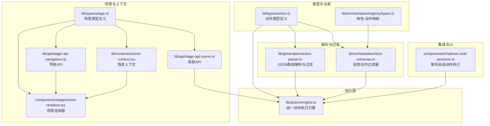
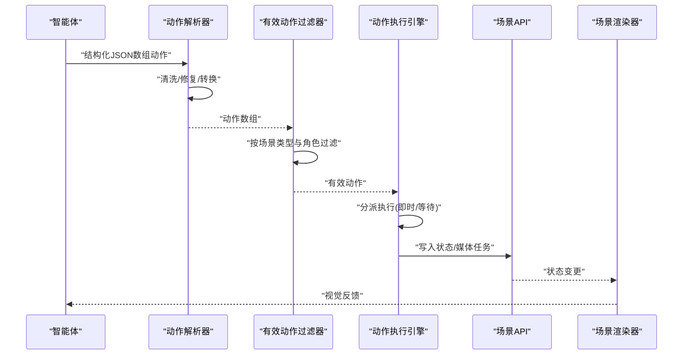
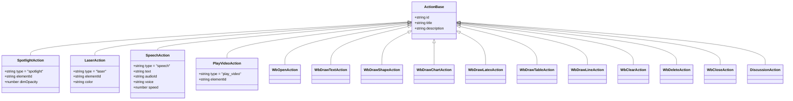
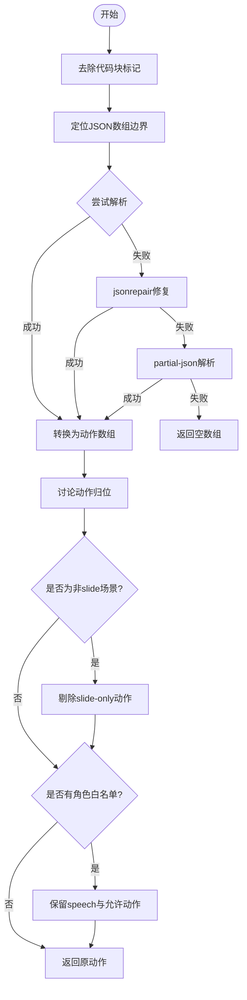
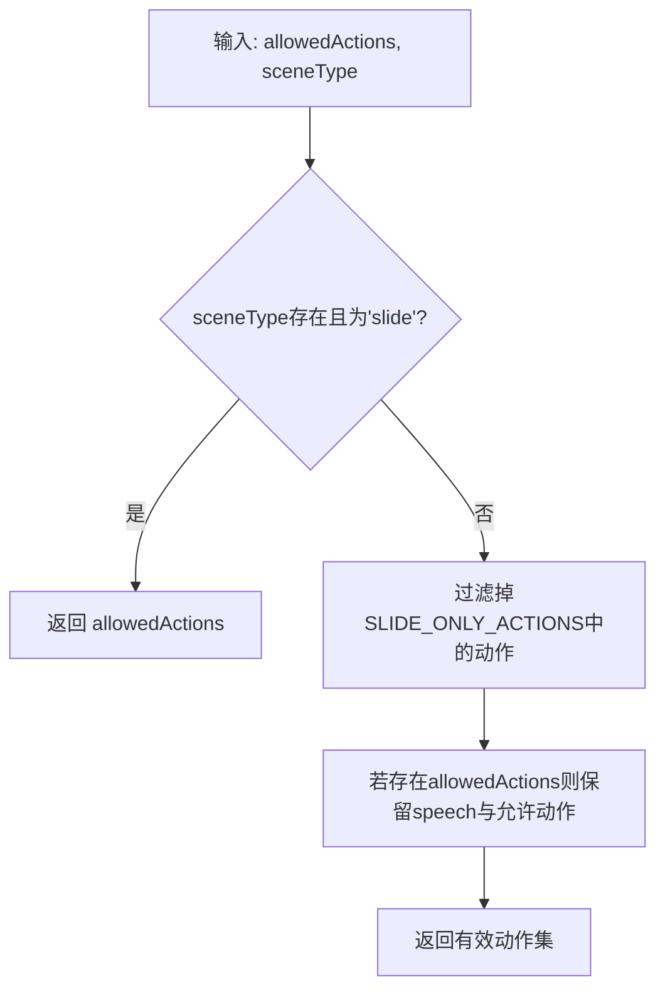
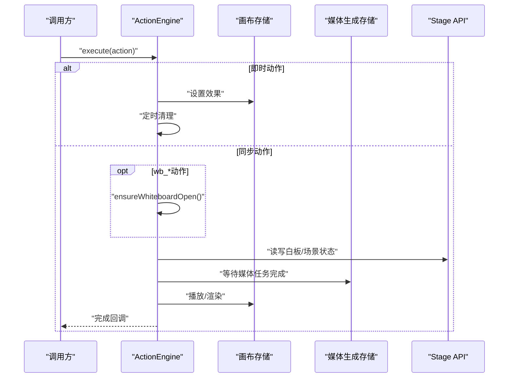
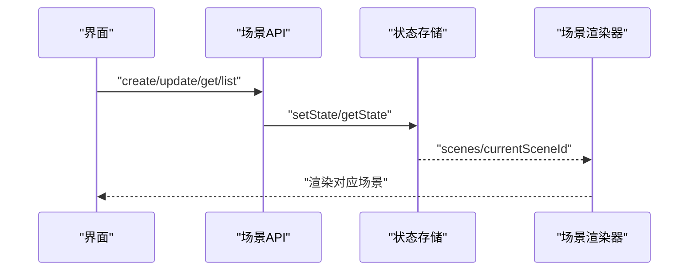
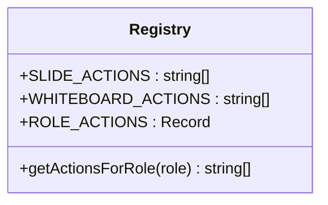
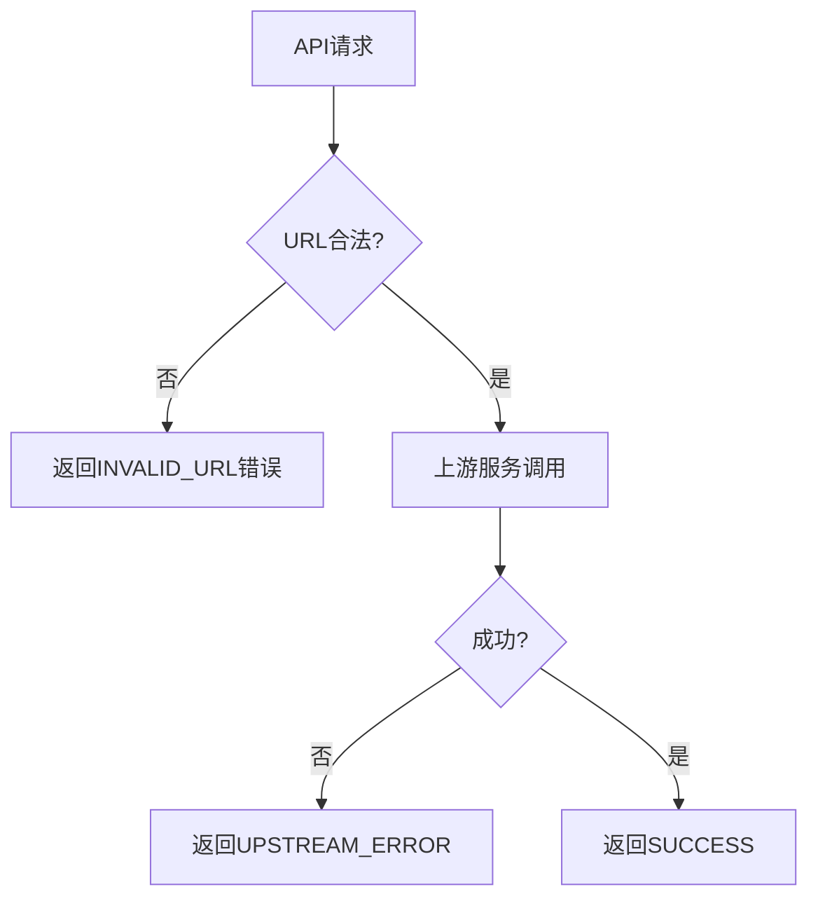
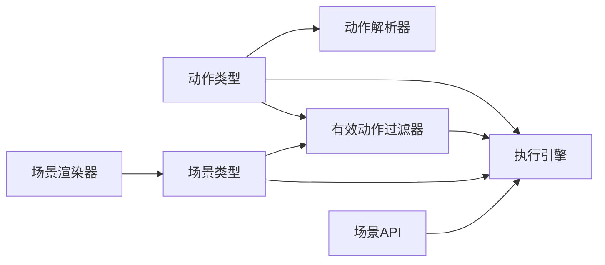

# 工具调用模式

<cite>
**本文档引用的文件**
- [lib/types/action.ts](file://lib/types/action.ts)
- [lib/action/engine.ts](file://lib/action/engine.ts)
- [lib/generation/action-parser.ts](file://lib/generation/action-parser.ts)
- [lib/orchestration/tool-schemas.ts](file://lib/orchestration/tool-schemas.ts)
- [lib/orchestration/registry/types.ts](file://lib/orchestration/registry/types.ts)
- [lib/types/stage.ts](file://lib/types/stage.ts)
- [lib/api/stage-api-scene.ts](file://lib/api/stage-api-scene.ts)
- [lib/api/stage-api-navigation.ts](file://lib/api/stage-api-navigation.ts)
- [lib/contexts/scene-context.tsx](file://lib/contexts/scene-context.tsx)
- [components/stage/scene-renderer.tsx](file://components/stage/scene-renderer.tsx)
- [components/chat/use-chat-sessions.ts](file://components/chat/use-chat-sessions.ts)
- [lib/server/api-response.ts](file://lib/server/api-response.ts)
- [lib/server/ssrf-guard.ts](file://lib/server/ssrf-guard.ts)
- [app/api/azure-voices/route.ts](file://app/api/azure-voices/route.ts)
- [app/api/verify-model/route.ts](file://app/api/verify-model/route.ts)
- [app/api/verify-video-provider/route.ts](file://app/api/verify-video-provider/route.ts)
</cite>

## 目录
1. [简介](#简介)
2. [项目结构](#项目结构)
3. [核心组件](#核心组件)
4. [架构总览](#架构总览)
5. [详细组件分析](#详细组件分析)
6. [依赖关系分析](#依赖关系分析)
7. [性能考量](#性能考量)
8. [故障排除指南](#故障排除指南)
9. [结论](#结论)
10. [附录](#附录)

## 简介
本文件系统化阐述“工具调用模式”的设计与实现，覆盖动作类型约束、场景适配器、有效性检查机制、有效动作过滤器、安全与权限校验、错误处理与回退策略，并提供扩展指南与自定义动作开发示例。目标是帮助开发者在多场景（幻灯片、测验、交互式场景、PBL）中安全、可控地执行动作，确保动作与场景类型匹配、角色权限隔离以及模型输出的鲁棒解析。

## 项目结构
工具调用模式贯穿类型定义、解析器、执行引擎、场景管理与渲染、角色与动作注册表等模块。下图展示关键文件之间的关系：

**图表来源**
- [lib/types/action.ts:1-221](file://lib/types/action.ts#L1-L221)
- [lib/orchestration/registry/types.ts:54-86](file://lib/orchestration/registry/types.ts#L54-L86)
- [lib/generation/action-parser.ts:1-155](file://lib/generation/action-parser.ts#L1-L155)
- [lib/orchestration/tool-schemas.ts:1-41](file://lib/orchestration/tool-schemas.ts#L1-L41)
- [lib/action/engine.ts:1-519](file://lib/action/engine.ts#L1-L519)
- [lib/types/stage.ts:1-124](file://lib/types/stage.ts#L1-L124)
- [lib/api/stage-api-scene.ts:1-176](file://lib/api/stage-api-scene.ts#L1-L176)
- [lib/api/stage-api-navigation.ts:51-94](file://lib/api/stage-api-navigation.ts#L51-L94)
- [lib/contexts/scene-context.tsx:97-125](file://lib/contexts/scene-context.tsx#L97-L125)
- [components/stage/scene-renderer.tsx:1-36](file://components/stage/scene-renderer.tsx#L1-L36)
- [components/chat/use-chat-sessions.ts:234-270](file://components/chat/use-chat-sessions.ts#L234-L270)

**章节来源**
- [lib/types/action.ts:1-221](file://lib/types/action.ts#L1-L221)
- [lib/orchestration/registry/types.ts:54-86](file://lib/orchestration/registry/types.ts#L54-L86)
- [lib/generation/action-parser.ts:1-155](file://lib/generation/action-parser.ts#L1-L155)
- [lib/orchestration/tool-schemas.ts:1-41](file://lib/orchestration/tool-schemas.ts#L1-L41)
- [lib/action/engine.ts:1-519](file://lib/action/engine.ts#L1-L519)
- [lib/types/stage.ts:1-124](file://lib/types/stage.ts#L1-L124)
- [lib/api/stage-api-scene.ts:1-176](file://lib/api/stage-api-scene.ts#L1-L176)
- [lib/api/stage-api-navigation.ts:51-94](file://lib/api/stage-api-navigation.ts#L51-L94)
- [lib/contexts/scene-context.tsx:97-125](file://lib/contexts/scene-context.tsx#L97-L125)
- [components/stage/scene-renderer.tsx:1-36](file://components/stage/scene-renderer.tsx#L1-L36)
- [components/chat/use-chat-sessions.ts:234-270](file://components/chat/use-chat-sessions.ts#L234-L270)

## 核心组件
- 动作类型系统：统一的动作接口、火线/同步动作分类、滑动专用动作集合。
- 解析器：从模型结构化输出解析为有序动作数组，支持多种容错策略。
- 有效动作过滤器：基于场景类型与角色白名单动态裁剪动作集合。
- 执行引擎：统一调度与执行，区分即时生效与需等待完成的动作。
- 场景与渲染：场景类型驱动渲染器与API行为，上下文提供数据访问。
- 安全与权限：角色到动作映射、场景类型限制、SSRF防护与API错误码。

**章节来源**
- [lib/types/action.ts:163-205](file://lib/types/action.ts#L163-L205)
- [lib/generation/action-parser.ts:42-154](file://lib/generation/action-parser.ts#L42-L154)
- [lib/orchestration/tool-schemas.ts:16-21](file://lib/orchestration/tool-schemas.ts#L16-L21)
- [lib/action/engine.ts:55-125](file://lib/action/engine.ts#L55-L125)
- [lib/types/stage.ts:62-62](file://lib/types/stage.ts#L62-L62)

## 架构总览
工具调用模式的关键流程如下：
- 模型生成结构化JSON数组动作列表
- 解析器清洗、修复并转换为内部动作对象
- 过滤器按场景类型与角色白名单裁剪动作
- 执行引擎按动作类型选择执行路径（即时/等待）
- 场景API与渲染器负责可视化与状态更新

**图表来源**
- [lib/generation/action-parser.ts:42-154](file://lib/generation/action-parser.ts#L42-L154)
- [lib/orchestration/tool-schemas.ts:16-21](file://lib/orchestration/tool-schemas.ts#L16-L21)
- [lib/action/engine.ts:80-125](file://lib/action/engine.ts#L80-L125)
- [lib/api/stage-api-scene.ts:32-78](file://lib/api/stage-api-scene.ts#L32-L78)
- [components/stage/scene-renderer.tsx:15-36](file://components/stage/scene-renderer.tsx#L15-L36)

## 详细组件分析

### 动作类型系统与约束
- 动作基类与具体动作类型：定义了光标聚焦、激光指针、语音、白板绘制、视频播放、讨论等动作及其参数。
- 动作分类：
  - 即时动作：spotlight、laser
  - 同步动作：speech、play_video、wb_*系列、discussion
- 场景约束：仅滑动场景支持spotlight、laser；其他场景自动剔除。

**图表来源**
- [lib/types/action.ts:14-221](file://lib/types/action.ts#L14-L221)

**章节来源**
- [lib/types/action.ts:22-34](file://lib/types/action.ts#L22-L34)
- [lib/types/action.ts:38-45](file://lib/types/action.ts#L38-L45)
- [lib/types/action.ts:184-205](file://lib/types/action.ts#L184-L205)

### 动作解析器与有效性检查
- 解析步骤：
  - 去除代码块标记
  - 提取JSON数组范围
  - 三阶段解析：标准JSON → 修复JSON → 部分JSON
  - 将文本项转为speech动作，action项转为对应类型
  - 讨论动作必须位于末尾且最多一个
  - 场景类型过滤：非slide场景剔除slide-only动作
  - 角色白名单过滤：保留speech与允许动作
- 容错策略：日志记录、跳过无效项、防御性裁剪。

**图表来源**
- [lib/generation/action-parser.ts:42-154](file://lib/generation/action-parser.ts#L42-L154)

**章节来源**
- [lib/generation/action-parser.ts:42-154](file://lib/generation/action-parser.ts#L42-L154)

### 有效动作过滤器与场景适配
- 过滤逻辑：
  - getEffectiveActions：当场景类型存在且非slide时，剔除slide-only动作
  - 结合角色白名单：仅保留允许动作与speech
- 作用点：
  - 导演图构建提示词前进行过滤
  - 在流式/离线生成中均生效，确保一致性

**图表来源**
- [lib/orchestration/tool-schemas.ts:16-21](file://lib/orchestration/tool-schemas.ts#L16-L21)
- [lib/types/action.ts:187-188](file://lib/types/action.ts#L187-L188)

**章节来源**
- [lib/orchestration/tool-schemas.ts:16-21](file://lib/orchestration/tool-schemas.ts#L16-L21)
- [lib/orchestration/director-graph.ts:275-281](file://lib/orchestration/director-graph.ts#L275-L281)

### 执行引擎与动作调度
- 执行模式：
  - 即时动作：spotlight、laser，设置效果并定时清理
  - 同步动作：speech、play_video、wb_*系列、discussion，等待完成或动画结束
- 关键能力：
  - 自动打开白板：对wb_*动作前置确保白板开启
  - 媒体占位符解析：将元素ID映射到媒体任务，等待生成完成再播放
  - 渲染等待：为元素淡入/白板开闭等动画预留时间

**图表来源**
- [lib/action/engine.ts:80-125](file://lib/action/engine.ts#L80-L125)
- [lib/action/engine.ts:236-261](file://lib/action/engine.ts#L236-L261)
- [lib/action/engine.ts:272-278](file://lib/action/engine.ts#L272-L278)

**章节来源**
- [lib/action/engine.ts:55-125](file://lib/action/engine.ts#L55-L125)
- [lib/action/engine.ts:165-176](file://lib/action/engine.ts#L165-L176)
- [lib/action/engine.ts:180-228](file://lib/action/engine.ts#L180-L228)
- [lib/action/engine.ts:266-270](file://lib/action/engine.ts#L266-L270)

### 场景管理与渲染适配
- 场景API：创建/删除/更新/查询场景，维护顺序与当前场景ID
- 场景渲染器：根据场景类型选择渲染组件（幻灯片、测验、交互式、PBL）
- 场景上下文：提供类型安全的数据访问钩子

**图表来源**
- [lib/api/stage-api-scene.ts:32-176](file://lib/api/stage-api-scene.ts#L32-L176)
- [components/stage/scene-renderer.tsx:15-36](file://components/stage/scene-renderer.tsx#L15-L36)
- [lib/contexts/scene-context.tsx:119-125](file://lib/contexts/scene-context.tsx#L119-L125)

**章节来源**
- [lib/api/stage-api-scene.ts:32-176](file://lib/api/stage-api-scene.ts#L32-L176)
- [lib/api/stage-api-navigation.ts:51-94](file://lib/api/stage-api-navigation.ts#L51-L94)
- [components/stage/scene-renderer.tsx:15-36](file://components/stage/scene-renderer.tsx#L15-L36)
- [lib/contexts/scene-context.tsx:119-125](file://lib/contexts/scene-context.tsx#L119-L125)

### 角色权限与动作白名单
- 角色到动作映射：教师拥有滑动+白板动作；助教/学生仅白板动作
- 白名单常量：SLIDE_ACTIONS、WHITEBOARD_ACTIONS
- 使用方式：结合getEffectiveActions与allowedActions进行双重过滤

**图表来源**
- [lib/orchestration/registry/types.ts:54-86](file://lib/orchestration/registry/types.ts#L54-L86)

**章节来源**
- [lib/orchestration/registry/types.ts:54-86](file://lib/orchestration/registry/types.ts#L54-L86)

### 错误处理与回退策略
- API错误码：统一的错误码枚举与响应封装
- SSRF防护：URL合法性校验，禁止私有/本地网络地址
- LLM调用重试：基于结果验证的可配置重试
- 流式生成回退：空输出或错误时触发重试事件

**图表来源**
- [lib/server/ssrf-guard.ts:19-49](file://lib/server/ssrf-guard.ts#L19-L49)
- [lib/server/api-response.ts:3-15](file://lib/server/api-response.ts#L3-L15)
- [app/api/azure-voices/route.ts:13-42](file://app/api/azure-voices/route.ts#L13-L42)

**章节来源**
- [lib/server/api-response.ts:26-45](file://lib/server/api-response.ts#L26-L45)
- [lib/server/ssrf-guard.ts:19-49](file://lib/server/ssrf-guard.ts#L19-L49)
- [app/api/verify-model/route.ts:8-46](file://app/api/verify-model/route.ts#L8-L46)
- [app/api/verify-video-provider/route.ts:26-56](file://app/api/verify-video-provider/route.ts#L26-L56)

## 依赖关系分析
- 类型依赖：动作类型被解析器、过滤器、执行引擎广泛使用
- 过滤依赖：过滤器依赖动作类型常量与场景类型
- 执行依赖：执行引擎依赖场景API、画布存储、媒体存储
- 场景依赖：渲染器依赖场景类型与上下文

**图表来源**
- [lib/types/action.ts:163-205](file://lib/types/action.ts#L163-L205)
- [lib/orchestration/tool-schemas.ts:16-21](file://lib/orchestration/tool-schemas.ts#L16-L21)
- [lib/action/engine.ts:55-125](file://lib/action/engine.ts#L55-L125)
- [lib/types/stage.ts:6-6](file://lib/types/stage.ts#L6-L6)

**章节来源**
- [lib/types/action.ts:163-205](file://lib/types/action.ts#L163-L205)
- [lib/orchestration/tool-schemas.ts:16-21](file://lib/orchestration/tool-schemas.ts#L16-L21)
- [lib/action/engine.ts:55-125](file://lib/action/engine.ts#L55-L125)
- [lib/types/stage.ts:6-6](file://lib/types/stage.ts#L6-L6)

## 性能考量
- 解析器采用多阶段容错，避免因格式问题导致的完全失败
- 即时动作设置后定时清理，避免长期占用资源
- 同步动作等待采用订阅与超时控制，减少轮询成本
- 白板动画与元素渲染设置固定延迟，平衡体验与性能

[本节为通用指导，无需特定文件来源]

## 故障排除指南
- 动作未生效
  - 检查场景类型是否为slide（非slide场景会剔除spotlight/laser）
  - 检查角色白名单是否包含该动作
  - 查看解析器日志，确认动作是否被过滤
- 媒体播放失败
  - 确认媒体任务状态为done，否则等待完成后重试
  - 检查resolveMediaPlaceholderId映射是否正确
- API调用异常
  - 使用统一错误码定位问题（如INVALID_URL、UPSTREAM_ERROR）
  - SSRF防护拦截常见于私有/本地地址
- LLM输出不稳定
  - 配置callLLM的重试与验证函数，提升稳定性

**章节来源**
- [lib/generation/action-parser.ts:129-154](file://lib/generation/action-parser.ts#L129-L154)
- [lib/action/engine.ts:180-228](file://lib/action/engine.ts#L180-L228)
- [lib/server/ssrf-guard.ts:19-49](file://lib/server/ssrf-guard.ts#L19-L49)
- [lib/server/api-response.ts:3-15](file://lib/server/api-response.ts#L3-L15)
- [lib/ai/llm.ts:285-335](file://lib/ai/llm.ts#L285-L335)

## 结论
工具调用模式通过“类型统一、解析容错、过滤适配、执行调度、场景渲染”五层架构，实现了跨场景、跨角色的安全动作执行。其核心在于：
- 明确的动作类型与分类
- 基于场景与角色的双重过滤
- 统一的执行引擎与状态管理
- 完备的安全与错误处理机制

[本节为总结，无需特定文件来源]

## 附录

### 工具模式扩展指南
- 新增动作类型
  - 在动作类型定义中添加新接口与联合类型
  - 在执行引擎中新增分支与实现
  - 在解析器中支持新动作字段（如params）
  - 在角色白名单中决定可见性
- 新增场景类型
  - 在场景类型定义中扩展SceneType
  - 在场景渲染器中添加对应渲染组件
  - 在过滤器中决定新场景下的动作可用性
- 新增角色
  - 在角色映射中添加动作集合
  - 在过滤器中确保新角色的动作白名单生效

**章节来源**
- [lib/types/action.ts:163-205](file://lib/types/action.ts#L163-L205)
- [lib/action/engine.ts:80-125](file://lib/action/engine.ts#L80-L125)
- [lib/generation/action-parser.ts:104-121](file://lib/generation/action-parser.ts#L104-L121)
- [lib/orchestration/registry/types.ts:74-86](file://lib/orchestration/registry/types.ts#L74-L86)
- [lib/types/stage.ts:6-6](file://lib/types/stage.ts#L6-L6)
- [components/stage/scene-renderer.tsx:17-32](file://components/stage/scene-renderer.tsx#L17-L32)

### 自定义动作开发示例
- 示例流程
  - 定义动作接口：在动作类型文件中声明新动作的参数
  - 实现执行逻辑：在执行引擎switch中新增case并实现
  - 支持解析：在解析器中识别新动作字段并转换为Action对象
  - 权限控制：在角色映射中决定该动作是否对某角色可见
  - 场景适配：在过滤器中决定该动作在不同场景下的可用性
- 参考路径
  - 动作类型定义：[lib/types/action.ts](file://lib/types/action.ts)
  - 执行引擎实现：[lib/action/engine.ts](file://lib/action/engine.ts)
  - 动作解析支持：[lib/generation/action-parser.ts](file://lib/generation/action-parser.ts)
  - 角色白名单：[lib/orchestration/registry/types.ts](file://lib/orchestration/registry/types.ts)
  - 场景过滤：[lib/orchestration/tool-schemas.ts](file://lib/orchestration/tool-schemas.ts)

**章节来源**
- [lib/types/action.ts:163-205](file://lib/types/action.ts#L163-L205)
- [lib/action/engine.ts:80-125](file://lib/action/engine.ts#L80-L125)
- [lib/generation/action-parser.ts:104-121](file://lib/generation/action-parser.ts#L104-L121)
- [lib/orchestration/registry/types.ts:74-86](file://lib/orchestration/registry/types.ts#L74-L86)
- [lib/orchestration/tool-schemas.ts:16-21](file://lib/orchestration/tool-schemas.ts#L16-L21)