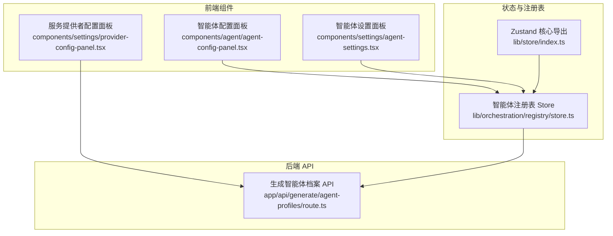
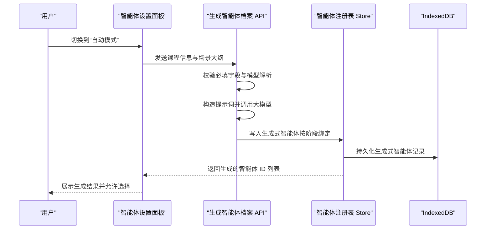
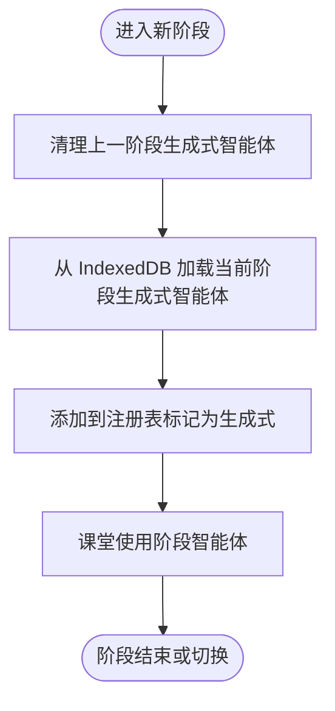
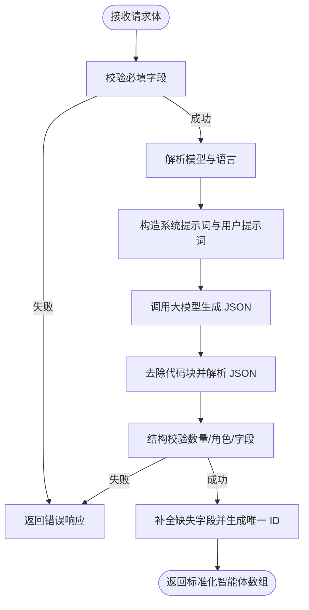
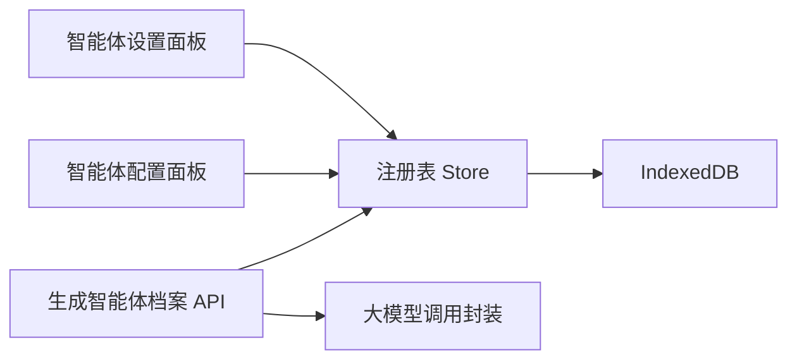

# 智能体配置管理

<cite>
**本文引用的文件**
- [README.md](file://README.md)
- [agent-config-panel.tsx](file://components/agent/agent-config-panel.tsx)
- [agent-settings.tsx](file://components/settings/agent-settings.tsx)
- [store.ts](file://lib/orchestration/registry/store.ts)
- [route.ts](file://app/api/generate/agent-profiles/route.ts)
- [provider-config-panel.tsx](file://components/settings/provider-config-panel.tsx)
- [index.ts](file://lib/store/index.ts)
</cite>

## 目录
1. [简介](#简介)
2. [项目结构](#项目结构)
3. [核心组件](#核心组件)
4. [架构总览](#架构总览)
5. [详细组件分析](#详细组件分析)
6. [依赖关系分析](#依赖关系分析)
7. [性能考量](#性能考量)
8. [故障排查指南](#故障排查指南)
9. [结论](#结论)
10. [附录](#附录)

## 简介
本文件围绕智能体配置管理进行系统化说明，重点涵盖以下方面：
- 智能体注册表系统的设计与实现：数据结构、生命周期管理、动态加载机制
- 请求作用域覆盖机制：在不改变全局配置的前提下临时修改智能体设置
- 智能体角色定义、能力限制与行为模式配置
- 最佳实践与常见配置模式示例
- 配置验证规则与错误处理策略

该系统以“默认智能体 + 用户自定义智能体 + 生成式智能体”的三层结构为核心，结合本地持久化存储与按阶段动态加载，实现灵活且可扩展的多智能体课堂场景。

## 项目结构
OpenMAIC 的智能体配置管理由前端 UI 组件、后端 API、状态存储与类型定义共同组成。下图展示了与智能体配置相关的关键模块及其交互关系。

图表来源
- [agent-config-panel.tsx:1-153](file://components/agent/agent-config-panel.tsx#L1-L153)
- [agent-settings.tsx:1-199](file://components/settings/agent-settings.tsx#L1-L199)
- [store.ts:1-398](file://lib/orchestration/registry/store.ts#L1-L398)
- [route.ts:1-183](file://app/api/generate/agent-profiles/route.ts#L1-L183)
- [index.ts:1-19](file://lib/store/index.ts#L1-L19)

章节来源
- [README.md:372-426](file://README.md#L372-L426)
- [agent-config-panel.tsx:1-153](file://components/agent/agent-config-panel.tsx#L1-L153)
- [agent-settings.tsx:1-199](file://components/settings/agent-settings.tsx#L1-L199)
- [store.ts:1-398](file://lib/orchestration/registry/store.ts#L1-L398)
- [route.ts:1-183](file://app/api/generate/agent-profiles/route.ts#L1-L183)
- [index.ts:1-19](file://lib/store/index.ts#L1-L19)

## 核心组件
- 智能体注册表 Store（Zustand + 持久化）
  - 提供默认智能体集合、增删改查、列表查询、合并持久化状态等能力
  - 支持将生成式智能体按阶段动态加载到注册表，并在新阶段开始前清理旧生成式智能体
- 智能体配置面板（UI）
  - 展示已注册智能体列表，支持新建、编辑、删除操作；展示角色、优先级、可用动作等信息
- 智能体设置面板（UI）
  - 支持“预设模式”和“自动模式”，在预设模式下可多选智能体并配置最大轮次；在自动模式下由系统根据课程内容生成智能体档案
- 生成智能体档案 API
  - 接收课程信息与场景大纲，调用大模型生成符合要求的智能体档案（名称、角色、个性、头像、颜色、优先级），并返回标准化结构
- 服务提供者配置面板（UI）
  - 管理各 LLM 服务提供者的密钥、基础地址、模型列表与连接测试，确保生成智能体档案时的模型可用性

章节来源
- [store.ts:1-398](file://lib/orchestration/registry/store.ts#L1-L398)
- [agent-config-panel.tsx:1-153](file://components/agent/agent-config-panel.tsx#L1-L153)
- [agent-settings.tsx:1-199](file://components/settings/agent-settings.tsx#L1-L199)
- [route.ts:1-183](file://app/api/generate/agent-profiles/route.ts#L1-L183)
- [provider-config-panel.tsx:1-403](file://components/settings/provider-config-panel.tsx#L1-L403)

## 架构总览
下图展示了从用户配置到智能体注册表再到生成式智能体加载的整体流程。

图表来源
- [agent-settings.tsx:1-199](file://components/settings/agent-settings.tsx#L1-L199)
- [route.ts:1-183](file://app/api/generate/agent-profiles/route.ts#L1-L183)
- [store.ts:318-397](file://lib/orchestration/registry/store.ts#L318-L397)

## 详细组件分析

### 智能体注册表系统（Zustand + 持久化）
- 数据结构
  - 智能体配置对象包含：标识符、名称、角色、个性描述、头像、颜色、允许的动作集合、优先级、创建/更新时间、是否默认/是否生成、绑定阶段 ID 等
  - 默认智能体集合在代码中硬编码，确保开箱即用
- 生命周期管理
  - 初始化：启动时合并持久化缓存与默认智能体，保留非默认、非生成的自定义智能体
  - 增删改查：提供原子化的增删改查接口，统一维护 updatedAt 时间戳
  - 动态加载：按阶段从 IndexedDB 加载生成式智能体，加载前清理上一阶段的生成式智能体
  - 动态保存：将生成式智能体写回 IndexedDB 并同步到注册表
- 请求作用域覆盖机制
  - 通过“按阶段绑定”的 isGenerated 标记与 boundStageId 字段，实现“当前阶段生效、跨阶段隔离”的作用域覆盖
  - 在新阶段开始前，先清理上一阶段的生成式智能体，再加载当前阶段的生成式智能体，避免污染其他阶段
- 错误处理
  - 注册表层面对异常进行捕获与日志记录，保证 UI 不崩溃
  - 对于生成式智能体的读写，采用批量操作与事务式写入，提升一致性与可靠性

图表来源
- [store.ts:318-350](file://lib/orchestration/registry/store.ts#L318-L350)

章节来源
- [store.ts:1-398](file://lib/orchestration/registry/store.ts#L1-L398)

### 智能体配置面板（UI）
- 能力
  - 展示智能体列表，包含名称、角色、优先级、默认标记、可用动作数量与前缀展示
  - 支持新建、编辑、删除（非默认智能体）
  - 当无智能体时显示引导占位
- 设计要点
  - 使用卡片布局与头像展示，突出颜色与角色标识
  - 通过 Badge 显示优先级与默认标记，增强可读性
  - 删除操作带有确认提示，防止误删

章节来源
- [agent-config-panel.tsx:1-153](file://components/agent/agent-config-panel.tsx#L1-L153)

### 智能体设置面板（UI）
- 能力
  - “预设模式”：多选已有智能体，支持配置最大轮次（仅多智能体时可见）
  - “自动模式”：由系统根据课程内容生成智能体档案
  - 实时反馈：根据所选智能体数量给出不同提示（无、单个、多个）
- 行为模式
  - 教师角色不可取消勾选（作为必需角色）
  - 多智能体协作时，可配置最大轮次以控制讨论节奏
  - 自动模式下提供描述性提示，帮助用户理解生成逻辑

章节来源
- [agent-settings.tsx:1-199](file://components/settings/agent-settings.tsx#L1-L199)

### 生成智能体档案 API
- 输入
  - 课程信息（名称、可选描述）、场景大纲（标题与描述）、语言、可用头像列表
- 输出
  - 标准化智能体数组（包含 id、name、role、persona、avatar、color、priority）
- 校验与约束
  - 必填字段校验（课程名、语言、可用头像列表）
  - 角色约束：必须恰好包含一个教师角色
  - 数量约束：至少两个智能体
  - 结构校验：严格 JSON 解析与字段完整性检查
- 安全与鲁棒性
  - 移除 Markdown 代码块包裹，确保纯 JSON 输出
  - 记录错误日志，返回结构化错误码与消息
  - 设置最大执行时长，避免长时间阻塞

图表来源
- [route.ts:50-182](file://app/api/generate/agent-profiles/route.ts#L50-L182)

章节来源
- [route.ts:1-183](file://app/api/generate/agent-profiles/route.ts#L1-L183)

### 服务提供者配置面板（UI）
- 能力
  - 管理 API 密钥（可隐藏/显示）、基础地址、是否需要密钥
  - 连接测试：对首个可用模型发起验证请求，反馈成功/失败
  - 模型管理：增删改模型条目，展示视觉/工具/流式等能力标签与上下文窗口信息
  - 重置默认：内置提供者可一键重置为默认配置
- 与生成智能体档案 API 的关系
  - 通过“测试连接”确保模型可用，从而保障生成智能体档案 API 的稳定性
  - 支持在前端层面快速验证配置正确性，减少后端错误重试

章节来源
- [provider-config-panel.tsx:1-403](file://components/settings/provider-config-panel.tsx#L1-L403)

## 依赖关系分析
- 组件耦合
  - 智能体配置面板与设置面板均依赖注册表 Store 获取/更新智能体配置
  - 生成智能体档案 API 与注册表 Store 协作，完成生成式智能体的持久化与加载
- 外部依赖
  - 大模型调用：通过统一的 LLM 调用封装完成智能体档案生成
  - IndexedDB：用于生成式智能体的持久化存储与按阶段加载
  - Zustand：提供轻量级状态管理与持久化中间件
- 循环依赖
  - 未发现直接循环依赖；注册表 Store 与 API 之间通过异步加载与写入解耦

图表来源
- [agent-settings.tsx:1-199](file://components/settings/agent-settings.tsx#L1-L199)
- [agent-config-panel.tsx:1-153](file://components/agent/agent-config-panel.tsx#L1-L153)
- [store.ts:1-398](file://lib/orchestration/registry/store.ts#L1-L398)
- [route.ts:1-183](file://app/api/generate/agent-profiles/route.ts#L1-L183)

章节来源
- [index.ts:1-19](file://lib/store/index.ts#L1-L19)
- [store.ts:1-398](file://lib/orchestration/registry/store.ts#L1-L398)

## 性能考量
- 状态持久化与迁移
  - 使用持久化中间件，版本号迁移策略确保默认智能体始终可用，同时保留用户自定义智能体
- 动态加载与清理
  - 生成式智能体按阶段加载与清理，避免内存与存储冗余
- 批量写入
  - 生成式智能体写入采用批量操作，降低数据库压力
- API 超时控制
  - 生成智能体档案 API 设置最大执行时长，避免长时间阻塞

## 故障排查指南
- 生成智能体档案失败
  - 检查请求体字段是否完整（课程名、语言、可用头像列表）
  - 确认模型解析与可用性（可通过服务提供者配置面板测试连接）
  - 查看后端日志中的结构校验失败原因（数量不足、角色不合法等）
- 注册表加载异常
  - 检查持久化缓存是否损坏；必要时清理浏览器存储或回滚版本
  - 确认生成式智能体是否正确按阶段加载与清理
- UI 行为异常
  - 确认教师角色不可取消勾选的逻辑是否被绕过
  - 检查多智能体模式下的最大轮次配置范围（1–20）

章节来源
- [route.ts:55-68](file://app/api/generate/agent-profiles/route.ts#L55-L68)
- [store.ts:225-243](file://lib/orchestration/registry/store.ts#L225-L243)
- [agent-settings.tsx:170-184](file://components/settings/agent-settings.tsx#L170-L184)

## 结论
本智能体配置管理系统通过“默认智能体 + 用户自定义智能体 + 生成式智能体”的分层设计，结合本地持久化与按阶段动态加载，实现了高可用、可扩展且易维护的多智能体课堂场景。请求作用域覆盖机制确保了在不改变全局配置的前提下，能够临时修改智能体设置并隔离不同阶段的影响。配合严格的配置验证与错误处理策略，系统在复杂教学场景中具备良好的稳定性与可运维性。

## 附录

### 配置最佳实践
- 角色与优先级
  - 保持“恰好一个教师角色”，其余角色按职责分配（助教、学生等），并合理设置优先级
- 动作能力
  - 根据角色定位分配动作集合（如教师可使用白板与课件控制，学生侧重参与互动）
- 生成式智能体
  - 使用“自动模式”生成智能体档案，随后在“预设模式”中进行微调与选择
  - 按阶段绑定生成式智能体，避免跨阶段干扰
- 服务提供者
  - 在生成前进行连接测试，确保模型可用与参数正确

### 常见配置模式示例
- 基础课堂（1 教师 + 2 学生）
  - 教师：高优先级，具备白板与课件控制能力
  - 学生：中低优先级，具备白板书写能力
- 深度讨论（1 教师 + 多学生 + 助教）
  - 助教：辅助讲解与答疑
  - 学生：多样化角色（好奇宝宝、笔记员、思考者等），提升讨论深度
- 项目式学习（1 教师 + 多角色学生）
  - 依据项目目标分配角色与动作，强调协作与产出导向