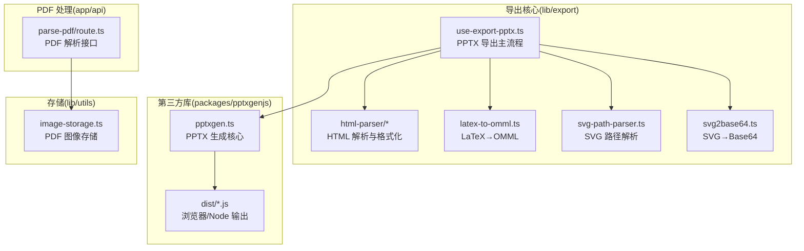
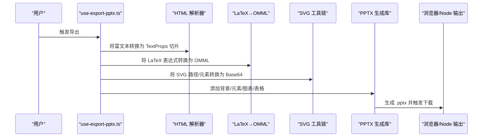
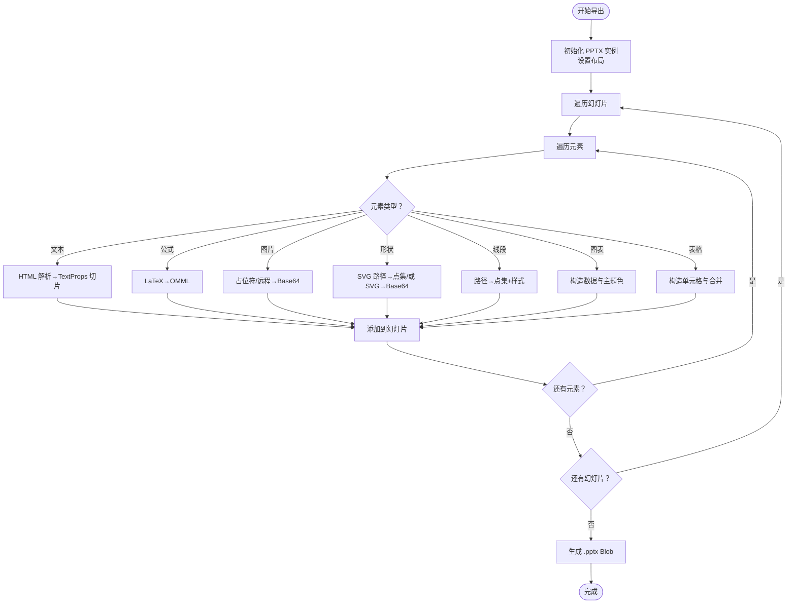
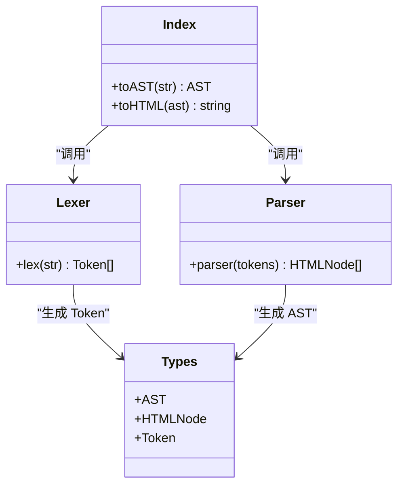
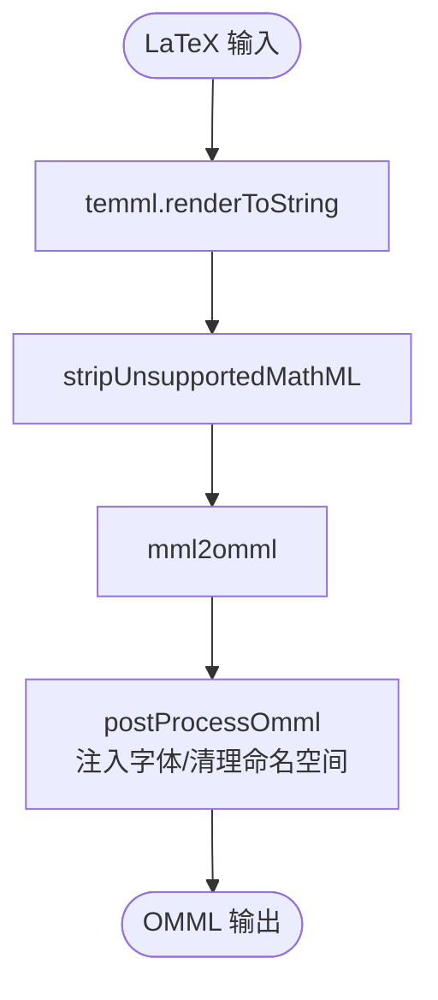
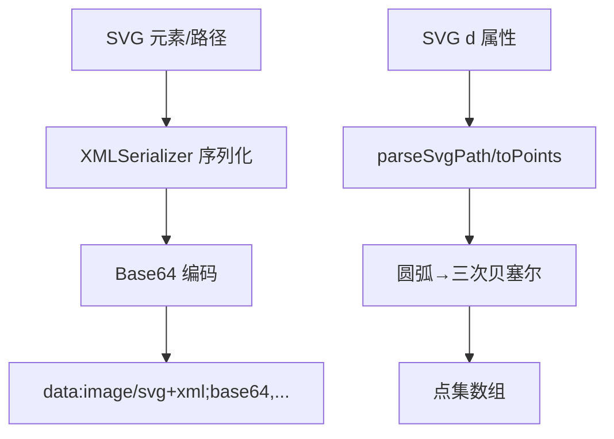
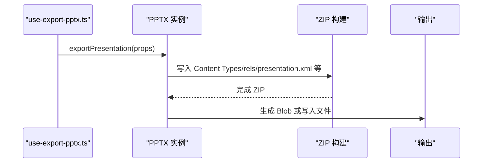
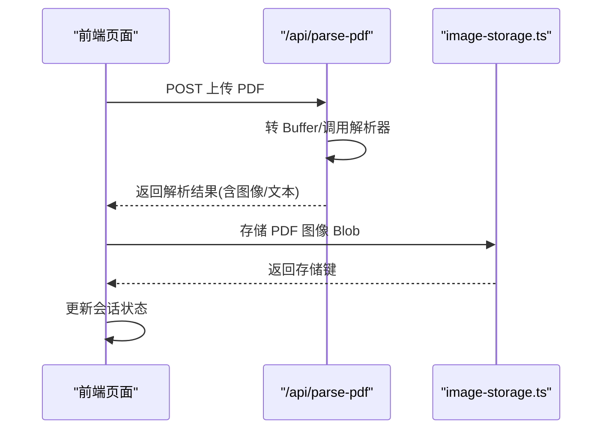
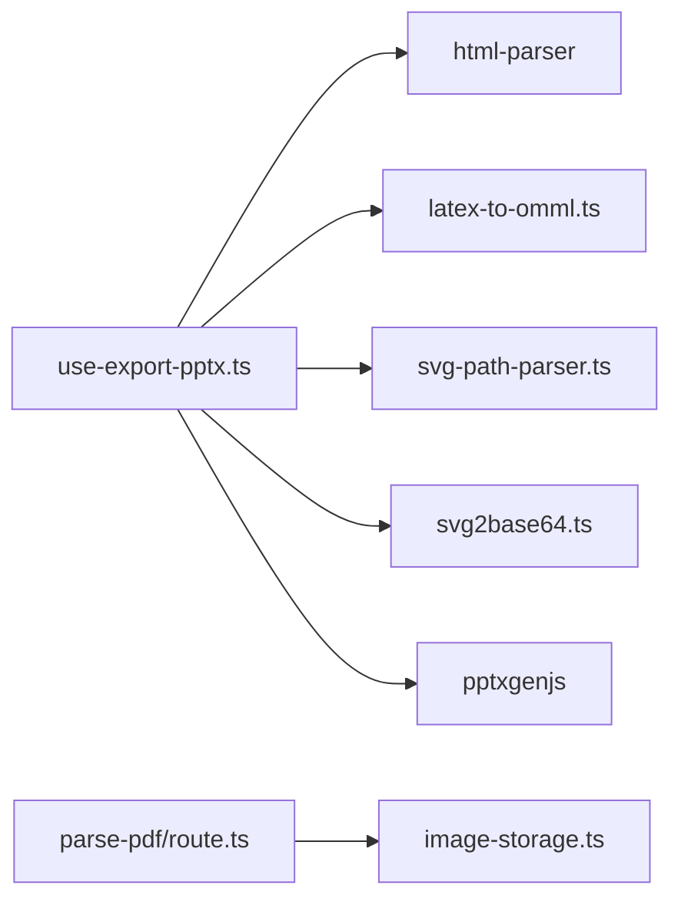

# 导出功能

<cite>
**本文引用的文件**
- [use-export-pptx.ts](file://lib/export/use-export-pptx.ts)
- [latex-to-omml.ts](file://lib/export/latex-to-omml.ts)
- [svg2base64.ts](file://lib/export/svg2base64.ts)
- [svg-path-parser.ts](file://lib/export/svg-path-parser.ts)
- [html-parser/index.ts](file://lib/export/html-parser/index.ts)
- [html-parser/lexer.ts](file://lib/export/html-parser/lexer.ts)
- [html-parser/parser.ts](file://lib/export/html-parser/parser.ts)
- [html-parser/types.ts](file://lib/export/html-parser/types.ts)
- [pptxgen.cjs.js](file://packages/pptxgenjs/dist/pptxgen.cjs.js)
- [pptxgen.es.js](file://packages/pptxgenjs/dist/pptxgen.es.js)
- [pptxgen.js](file://packages/pptxgenjs/dist/pptxgen.js)
- [pptxgen.ts](file://packages/pptxgenjs/src/pptxgen.ts)
- [image-storage.ts](file://lib/utils/image-storage.ts)
- [route.ts](file://app/api/parse-pdf/route.ts)
- [page.tsx](file://app/generation-preview/page.tsx)
- [storage.ts](file://configs/storage.ts)
</cite>

## 目录
1. [简介](#简介)
2. [项目结构](#项目结构)
3. [核心组件](#核心组件)
4. [架构总览](#架构总览)
5. [详细组件分析](#详细组件分析)
6. [依赖关系分析](#依赖关系分析)
7. [性能考量](#性能考量)
8. [故障排查指南](#故障排查指南)
9. [结论](#结论)
10. [附录](#附录)

## 简介
本文件系统性梳理 OpenMAIC 的导出能力，重点覆盖 PowerPoint (.pptx) 导出、HTML 文本与公式处理、PDF 解析与存储管理。文档从架构、数据流、处理逻辑、集成点、错误处理与性能优化等维度展开，辅以可视化图示与最佳实践建议，帮助开发者与使用者高效理解与使用导出功能。

## 项目结构
OpenMAIC 的导出相关代码主要分布在以下区域：
- 导出核心与工具：lib/export 下的 PPTX 导出钩子、HTML 解析器、LaTeX 到 OMML 转换、SVG 路径与位图转换等
- 第三方库封装：packages/pptxgenjs 提供 .pptx 文件生成与下载能力
- PDF 解析与存储：app/api/parse-pdf 负责后端解析；lib/utils/image-storage 负责大对象存储（如 PDF 图像）
- 前端页面集成：app/generation-preview/page.tsx 展示前端如何调用解析与存储流程

**图示来源**
- [use-export-pptx.ts:1-1182](file://lib/export/use-export-pptx.ts#L1-L1182)
- [html-parser/index.ts:1-16](file://lib/export/html-parser/index.ts#L1-L16)
- [latex-to-omml.ts:1-82](file://lib/export/latex-to-omml.ts#L1-L82)
- [svg-path-parser.ts:1-142](file://lib/export/svg-path-parser.ts#L1-L142)
- [svg2base64.ts:1-59](file://lib/export/svg2base64.ts#L1-L59)
- [pptxgen.ts:500-522](file://packages/pptxgenjs/src/pptxgen.ts#L500-L522)
- [pptxgen.cjs.js:7068-7287](file://packages/pptxgenjs/dist/pptxgen.cjs.js#L7068-L7287)
- [route.ts:35-64](file://app/api/parse-pdf/route.ts#L35-L64)
- [image-storage.ts:1-177](file://lib/utils/image-storage.ts#L1-L177)

**章节来源**
- [use-export-pptx.ts:1-1182](file://lib/export/use-export-pptx.ts#L1-L1182)
- [pptxgen.ts:500-522](file://packages/pptxgenjs/src/pptxgen.ts#L500-L522)

## 核心组件
- PPTX 导出主流程（use-export-pptx.ts）
  - 负责将画布场景转换为 PPTX 幻灯片，支持文本、图片、形状、线段、图表、表格等元素
  - 内置 HTML→文本切片、SVG 路径→pptxgen 点集、阴影/描边/链接样式映射
  - 集成 LaTeX→OMML 公式渲染，确保 PowerPoint 中数学公式正确显示
- HTML 解析器（lib/export/html-parser）
  - 自研轻量级 HTML 解析器，支持标签、属性、注释、文本节点，输出 AST
  - 用于将富文本内容转换为 pptxgen 可识别的 TextProps 切片
- LaTeX→OMML（latex-to-omml.ts）
  - 使用 temml 渲染 LaTeX 为 MathML，再经 mathml2omml 转为 OMML，并注入 PPTX 兼容字体与命名空间
- SVG 工具链（svg-path-parser.ts、svg2base64.ts）
  - 将 SVG 路径解析为点集，或序列化为 Base64 数据，便于嵌入 PPTX
- PPTX 生成库（packages/pptxgenjs）
  - 提供 exportPresentation/writeFile 等 API，负责 .pptx ZIP 结构生成、媒体打包与浏览器/Node 输出
- PDF 解析与存储（app/api/parse-pdf/route.ts、lib/utils/image-storage.ts）
  - 后端解析 PDF，前端页面触发解析并将图像存入 IndexedDB，避免 sessionStorage 限制

**章节来源**
- [use-export-pptx.ts:1-1182](file://lib/export/use-export-pptx.ts#L1-L1182)
- [html-parser/index.ts:1-16](file://lib/export/html-parser/index.ts#L1-L16)
- [latex-to-omml.ts:1-82](file://lib/export/latex-to-omml.ts#L1-L82)
- [svg-path-parser.ts:1-142](file://lib/export/svg-path-parser.ts#L1-L142)
- [svg2base64.ts:1-59](file://lib/export/svg2base64.ts#L1-L59)
- [pptxgen.cjs.js:7068-7287](file://packages/pptxgenjs/dist/pptxgen.cjs.js#L7068-L7287)
- [route.ts:35-64](file://app/api/parse-pdf/route.ts#L35-L64)
- [image-storage.ts:1-177](file://lib/utils/image-storage.ts#L1-L177)

## 架构总览
下图展示了从“画布场景”到“PPTX 文件”的完整导出链路，以及与 PDF 解析和存储的衔接：

**图示来源**
- [use-export-pptx.ts:362-800](file://lib/export/use-export-pptx.ts#L362-L800)
- [html-parser/index.ts:9-13](file://lib/export/html-parser/index.ts#L9-L13)
- [latex-to-omml.ts:70-81](file://lib/export/latex-to-omml.ts#L70-L81)
- [svg2base64.ts:53-58](file://lib/export/svg2base64.ts#L53-L58)
- [pptxgen.cjs.js:7088-7170](file://packages/pptxgenjs/dist/pptxgen.cjs.js#L7088-L7170)

## 详细组件分析

### 组件一：PPTX 导出主流程（use-export-pptx.ts）
- 功能要点
  - 幻灯片布局选择：根据视口宽高比自动选择 16x9/16x10/4x3 布局
  - 元素类型适配：文本、图片、形状、线段、图表、表格、特殊形状（SVG 渲染）
  - 文本富样式：粗体、斜体、下划线、删除线、对齐、缩进、超链接、列表等
  - 数学公式：LaTeX→OMML，注入 Cambria Math 字体与 PPTX 兼容命名空间
  - 图片处理：占位符解析、远程/本地/SVG→Base64 转换、裁剪与滤镜
  - 形状与路径：SVG 路径解析为点集，支持渐变/图案叠加
  - 链接与备注：支持 Web 链接与幻灯片内跳转，可写入演讲者备注
- 关键流程（简化）
  - 初始化 PPTX 实例并设置布局
  - 遍历每张幻灯片与元素，按类型构建对应 props
  - 对文本调用 HTML 解析器生成切片
  - 对公式调用 LaTeX→OMML
  - 对 SVG 路径/元素进行序列化与 Base64 编码
  - 对图片进行占位符解析与必要时的远程拉取与编码
  - 添加图表、表格、阴影/描边/旋转/翻转等样式
  - 最终生成 Blob 并触发下载

**图示来源**
- [use-export-pptx.ts:362-800](file://lib/export/use-export-pptx.ts#L362-L800)

**章节来源**
- [use-export-pptx.ts:345-800](file://lib/export/use-export-pptx.ts#L345-L800)

### 组件二：HTML 富文本解析（lib/export/html-parser）
- 设计思路
  - 三段式：词法分析（lexer）→语法解析（parser）→格式化（format）
  - 支持常见标签与内联样式，输出标准化 AST
  - 为 PPTX 文本渲染提供结构化输入，保留段落、列表、链接、对齐等语义
- 关键模块
  - lexer：扫描字符串，产出标签/文本/注释/属性等 Token 流
  - parser：基于栈的递归下降解析，自动闭合与祖先断开规则
  - types：统一的 AST 与 Token 类型定义
  - index：对外暴露 toAST 与 toHTML 辅助

**图示来源**
- [html-parser/lexer.ts:266-275](file://lib/export/html-parser/lexer.ts#L266-L275)
- [html-parser/parser.ts:23-28](file://lib/export/html-parser/parser.ts#L23-L28)
- [html-parser/types.ts:1-76](file://lib/export/html-parser/types.ts#L1-L76)
- [html-parser/index.ts:9-15](file://lib/export/html-parser/index.ts#L9-L15)

**章节来源**
- [html-parser/index.ts:1-16](file://lib/export/html-parser/index.ts#L1-L16)
- [html-parser/lexer.ts:1-275](file://lib/export/html-parser/lexer.ts#L1-L275)
- [html-parser/parser.ts:1-137](file://lib/export/html-parser/parser.ts#L1-L137)
- [html-parser/types.ts:1-76](file://lib/export/html-parser/types.ts#L1-L76)

### 组件三：LaTeX 公式到 OMML（latex-to-omml.ts）
- 处理管线
  - LaTeX → MathML（temml）
  - 清洗不被 mathml2omml 支持的元素（如 mpadded）
  - MathML → OMML（mathml2omml）
  - 注入 PPTX 兼容的字体与命名空间（Cambria Math、移除 DOCX 命名空间）
- 注意事项
  - 若转换失败会记录告警并返回空值，保证导出流程不中断
  - OMML 中的字体大小以“百分之一点”单位传递，需做四舍五入

**图示来源**
- [latex-to-omml.ts:70-81](file://lib/export/latex-to-omml.ts#L70-L81)

**章节来源**
- [latex-to-omml.ts:1-82](file://lib/export/latex-to-omml.ts#L1-L82)

### 组件四：SVG 路径与位图（svg-path-parser.ts、svg2base64.ts）
- SVG 路径解析
  - 将 SVG d 属性解析为命令序列，圆弧（A）转为三次贝塞尔（C），便于 PPTX 自定义几何
  - 计算路径范围，辅助定位与尺寸计算
- SVG→Base64
  - 序列化 SVG 元素为字符串并进行 Base64 编码，用于嵌入 PPTX
- 用途
  - 特殊形状渲染（SVG 渲染为图片）
  - 线条与自定义几何的点集表示

**图示来源**
- [svg2base64.ts:53-58](file://lib/export/svg2base64.ts#L53-L58)
- [svg-path-parser.ts:36-112](file://lib/export/svg-path-parser.ts#L36-L112)

**章节来源**
- [svg2base64.ts:1-59](file://lib/export/svg2base64.ts#L1-L59)
- [svg-path-parser.ts:1-142](file://lib/export/svg-path-parser.ts#L1-L142)

### 组件五：PPTX 生成与输出（packages/pptxgenjs）
- 核心职责
  - 生成 .pptx 所需的 ZIP 结构与内部 XML
  - 处理媒体资源（图片、图表、媒体）打包与引用
  - 在浏览器环境通过 Blob 下载，在 Node 环境写入文件
- 关键行为
  - exportPresentation：构建 ZIP、写入各 XML 文件、生成输出
  - writeFile：规范化参数、决定输出类型（浏览器 Blob/Node 文件）

**图示来源**
- [pptxgen.cjs.js:7088-7170](file://packages/pptxgenjs/dist/pptxgen.cjs.js#L7088-L7170)
- [pptxgen.ts:500-522](file://packages/pptxgenjs/src/pptxgen.ts#L500-L522)

**章节来源**
- [pptxgen.cjs.js:7068-7287](file://packages/pptxgenjs/dist/pptxgen.cjs.js#L7068-L7287)
- [pptxgen.es.js:7066-7285](file://packages/pptxgenjs/dist/pptxgen.es.js#L7066-L7285)
- [pptxgen.js:7070-7187](file://packages/pptxgenjs/dist/pptxgen.js#L7070-L7187)
- [pptxgen.ts:500-522](file://packages/pptxgenjs/src/pptxgen.ts#L500-L522)

### 组件六：PDF 解析与存储（app/api/parse-pdf/route.ts、lib/utils/image-storage.ts）
- PDF 解析
  - 接收上传的 PDF 文件，转为 Buffer，调用解析器并附加元数据
- 存储策略
  - 将 PDF 图像以 Blob 形式存入 IndexedDB，返回存储键
  - 页面加载时可通过存储键读取 Blob，避免 sessionStorage 限制
- 前端集成
  - 生成预览页中触发解析，解析完成后将图像与文本写入会话状态

**图示来源**
- [route.ts:35-64](file://app/api/parse-pdf/route.ts#L35-L64)
- [image-storage.ts:152-177](file://lib/utils/image-storage.ts#L152-L177)
- [page.tsx:192-275](file://app/generation-preview/page.tsx#L192-L275)

**章节来源**
- [route.ts:35-64](file://app/api/parse-pdf/route.ts#L35-L64)
- [image-storage.ts:1-177](file://lib/utils/image-storage.ts#L1-L177)
- [page.tsx:192-275](file://app/generation-preview/page.tsx#L192-L275)

## 依赖关系分析
- 组件耦合
  - use-export-pptx.ts 是导出中枢，依赖 html-parser、latex-to-omml、svg-path-parser、svg2base64
  - PPTX 生成库独立于业务层，通过其 API 完成最终输出
  - PDF 解析与存储与导出流程解耦，但可为导出提供图像素材
- 外部依赖
  - pptxgenjs：.pptx 生成与下载
  - temml/mathml2omml：LaTeX→OMML
  - svg-pathdata/svg-arc-to-cubic-bezier：SVG 路径解析与圆弧转贝塞尔
  - JSZip：ZIP 打包（由 pptxgenjs 内部使用）

**图示来源**
- [use-export-pptx.ts:1-1182](file://lib/export/use-export-pptx.ts#L1-L1182)
- [latex-to-omml.ts:1-82](file://lib/export/latex-to-omml.ts#L1-L82)
- [svg-path-parser.ts:1-142](file://lib/export/svg-path-parser.ts#L1-L142)
- [svg2base64.ts:1-59](file://lib/export/svg2base64.ts#L1-L59)
- [pptxgen.cjs.js:7088-7170](file://packages/pptxgenjs/dist/pptxgen.cjs.js#L7088-L7170)
- [route.ts:35-64](file://app/api/parse-pdf/route.ts#L35-L64)
- [image-storage.ts:1-177](file://lib/utils/image-storage.ts#L1-L177)

**章节来源**
- [use-export-pptx.ts:1-1182](file://lib/export/use-export-pptx.ts#L1-L1182)
- [pptxgen.cjs.js:7088-7170](file://packages/pptxgenjs/dist/pptxgen.cjs.js#L7088-L7170)

## 性能考量
- 导出性能
  - 图片处理：优先使用 Base64 内嵌，减少外部依赖；对远程图片先拉取再编码，避免离线 PPTX 无法访问
  - SVG 路径：将复杂路径转为三次贝塞尔，降低渲染复杂度
  - 压缩选项：在浏览器端可启用 DEFLATE 压缩，减小文件体积
- 内存与存储
  - PDF 图像采用 Blob 存储于 IndexedDB，避免 sessionStorage 5MB 限制
  - 大量图片导出时建议分批处理，避免一次性内存峰值过高
- 兼容性
  - 公式字体：强制使用 Cambria Math，确保 Office 套件兼容
  - 命名空间：剥离 DOCX 专属命名空间，避免 PPTX 解析异常

[本节为通用指导，无需列出具体文件来源]

## 故障排查指南
- 公式未显示或显示异常
  - 检查 LaTeX 是否有效，查看日志是否出现转换失败告警
  - 确认 OMML 注入字体与命名空间是否成功
  - 参考：[latex-to-omml.ts:70-81](file://lib/export/latex-to-omml.ts#L70-L81)
- 图片未嵌入或空白
  - 确认图片 URL 是否为 Base64、本地路径或已成功拉取为 Blob
  - 占位符媒体需等待生成完成后再导出
  - 参考：[use-export-pptx.ts:468-539](file://lib/export/use-export-pptx.ts#L468-L539)
- SVG 形状渲染错位
  - 检查 viewBox 与元素尺寸比例，确认点集缩放参数
  - 参考：[svg-path-parser.ts:580-620](file://lib/export/svg-path-parser.ts#L580-L620)
- 导出文件过大或浏览器卡顿
  - 启用压缩（浏览器端）、减少图片分辨率、拆分幻灯片
  - 参考：[pptxgen.cjs.js:7165-7168](file://packages/pptxgenjs/dist/pptxgen.cjs.js#L7165-L7168)
- PDF 图像缺失
  - 确认解析接口返回图像列表，存储键是否正确写入会话
  - 参考：[route.ts:35-64](file://app/api/parse-pdf/route.ts#L35-L64)、[image-storage.ts:152-177](file://lib/utils/image-storage.ts#L152-L177)

**章节来源**
- [latex-to-omml.ts:70-81](file://lib/export/latex-to-omml.ts#L70-L81)
- [use-export-pptx.ts:468-539](file://lib/export/use-export-pptx.ts#L468-L539)
- [svg-path-parser.ts:580-620](file://lib/export/svg-path-parser.ts#L580-L620)
- [pptxgen.cjs.js:7165-7168](file://packages/pptxgenjs/dist/pptxgen.cjs.js#L7165-L7168)
- [route.ts:35-64](file://app/api/parse-pdf/route.ts#L35-L64)
- [image-storage.ts:152-177](file://lib/utils/image-storage.ts#L152-L177)

## 结论
OpenMAIC 的导出体系以 use-export-pptx.ts 为核心，结合自研 HTML 解析器、LaTeX→OMML、SVG 工具链与第三方 PPTX 生成库，实现了从画布到 .pptx 的全链路导出。配合 PDF 解析与 IndexedDB 存储，既满足了高质量内容导出，也兼顾了性能与兼容性。建议在实际使用中关注公式字体注入、图片处理策略与压缩配置，以获得更稳定的导出体验。

[本节为总结性内容，无需列出具体文件来源]

## 附录
- 导出流程示例（概念步骤）
  - 准备画布场景与元素
  - 触发导出钩子，解析富文本与公式
  - 处理图片与 SVG，生成点集与 Base64
  - 构造图表与表格数据
  - 生成 .pptx 并下载
- 常见问题速查
  - 公式字体：Cambria Math
  - 命名空间：剥离 DOCX 命名空间
  - 图片来源：Base64/本地/远程（需提前拉取）
  - 压缩：浏览器端可启用 DEFLATE

[本节为补充说明，无需列出具体文件来源]