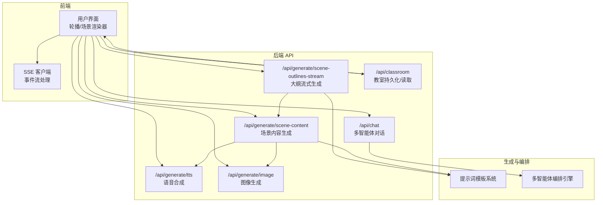
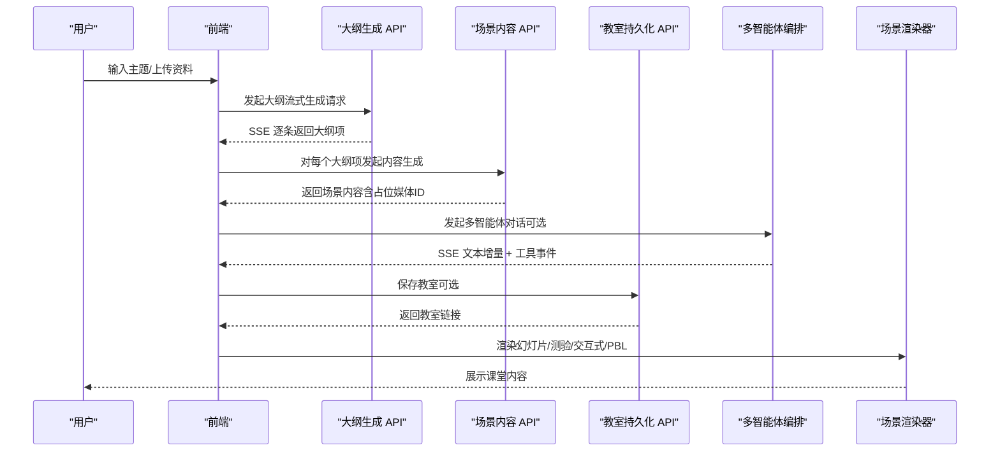
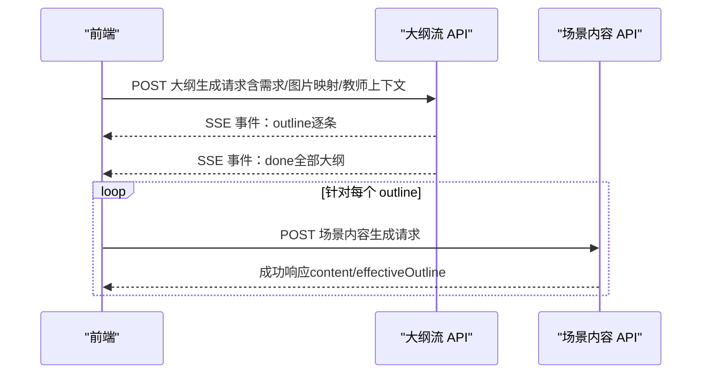
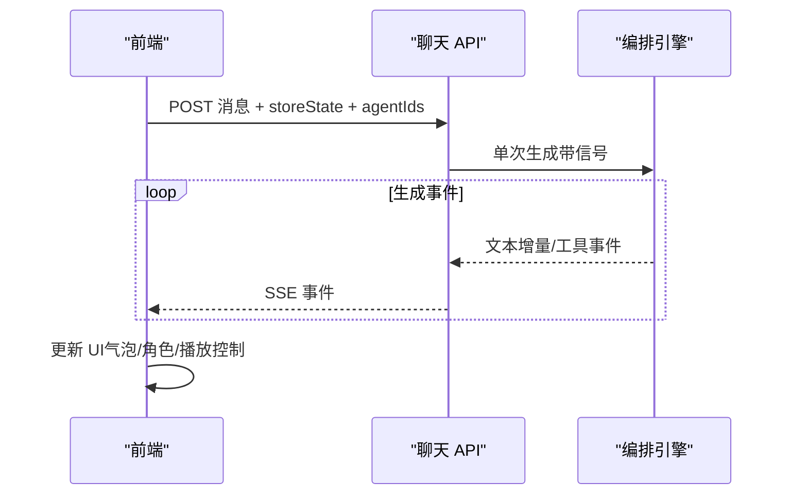
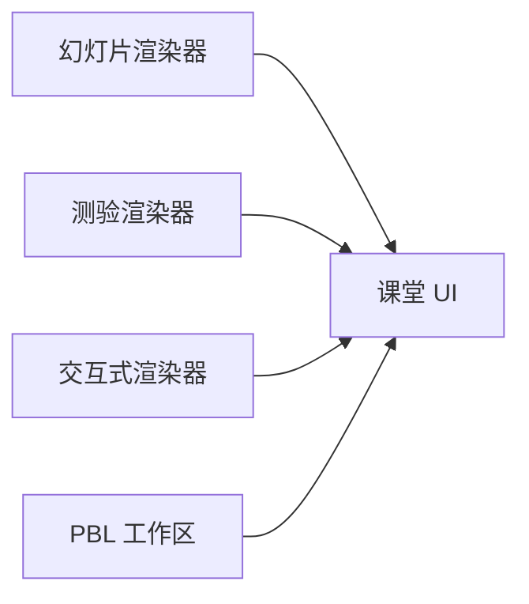
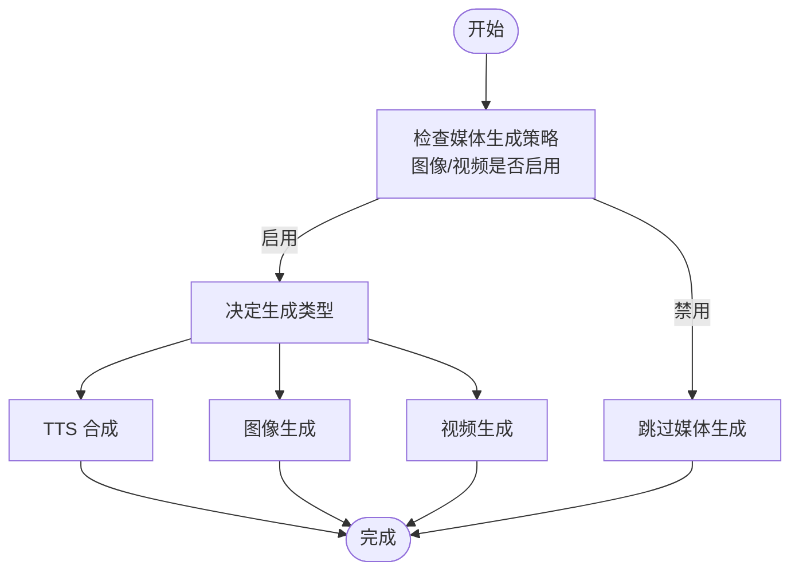
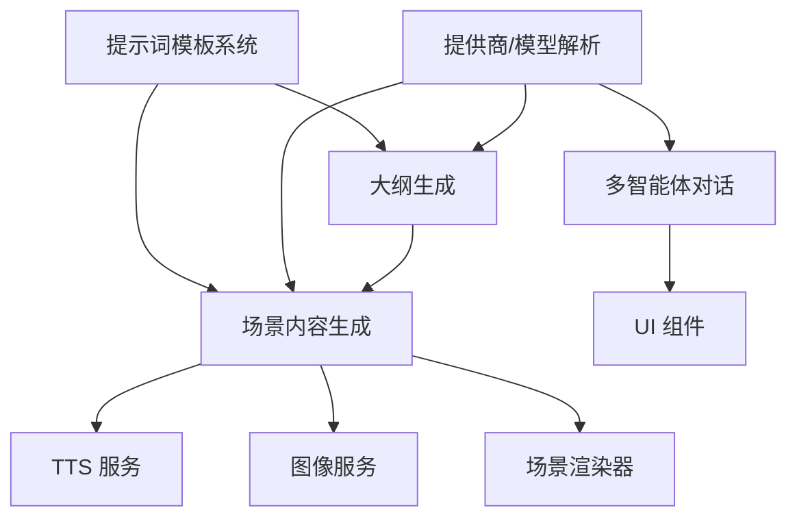

# 核心特性

<cite>
**本文引用的文件**
- [README.md](file://README.md)
- [app/api/generate/scene-outlines-stream/route.ts](file://app/api/generate/scene-outlines-stream/route.ts)
- [app/api/generate/scene-content/route.ts](file://app/api/generate/scene-content/route.ts)
- [app/api/chat/route.ts](file://app/api/chat/route.ts)
- [app/api/generate/tts/route.ts](file://app/api/generate/tts/route.ts)
- [app/api/generate/image/route.ts](file://app/api/generate/image/route.ts)
- [app/api/classroom/route.ts](file://app/api/classroom/route.ts)
- [lib/generation/prompts/index.ts](file://lib/generation/prompts/index.ts)
- [lib/i18n/index.ts](file://lib/i18n/index.ts)
- [components/roundtable/index.tsx](file://components/roundtable/index.tsx)
- [components/scene-renderers/pbl/workspace.tsx](file://components/scene-renderers/pbl/workspace.tsx)
- [components/scene-renderers/quiz-renderer.tsx](file://components/scene-renderers/quiz-renderer.tsx)
- [components/scene-renderers/interactive-renderer.tsx](file://components/scene-renderers/interactive-renderer.tsx)
</cite>

## 目录
1. [简介](#简介)
2. [项目结构](#项目结构)
3. [核心组件](#核心组件)
4. [架构总览](#架构总览)
5. [详细组件分析](#详细组件分析)
6. [依赖关系分析](#依赖关系分析)
7. [性能考量](#性能考量)
8. [故障排查指南](#故障排查指南)
9. [结论](#结论)
10. [附录](#附录)

## 简介
本文件系统性介绍 OpenMAIC 的核心特性与工作原理，重点覆盖两阶段生成管道（大纲生成与场景内容生成）、多智能体交互模式（课堂讨论、圆桌辩论、问答模式、白板协作）、支持的场景类型（幻灯片、测验、交互式模拟、项目式学习）、多媒体能力（语音合成、语音识别、图像生成、视频处理）、导出能力、国际化与主题切换等用户体验特性，并提供典型使用场景与效果说明。

## 项目结构
OpenMAIC 基于 Next.js App Router 架构，采用前后端分离的 API 设计：前端通过 SSE/HTTP 调用后端 API，后端以流式或一次性响应的方式完成两阶段生成、多智能体对话、媒体生成与存储等任务。核心模块包括：
- 生成管线：大纲生成（SSE 流）→ 场景内容生成（一次性）
- 多智能体编排：基于 LangGraph 的状态机驱动，支持课堂讨论、QA、圆桌辩论等
- 场景渲染器：幻灯片、测验、交互式 HTML、PBL 工作区
- 多媒体服务：TTS、ASR、图像生成、视频处理
- 导出与持久化：教室持久化、播放回放、导出为 PPTX/HTML
- 国际化与主题：中英双语界面与暗色模式

图表来源
- [app/api/generate/scene-outlines-stream/route.ts:1-362](file://app/api/generate/scene-outlines-stream/route.ts#L1-L362)
- [app/api/generate/scene-content/route.ts:1-168](file://app/api/generate/scene-content/route.ts#L1-L168)
- [app/api/chat/route.ts:1-191](file://app/api/chat/route.ts#L1-L191)
- [app/api/generate/tts/route.ts:1-81](file://app/api/generate/tts/route.ts#L1-L81)
- [app/api/generate/image/route.ts:1-79](file://app/api/generate/image/route.ts#L1-L79)
- [app/api/classroom/route.ts:1-71](file://app/api/classroom/route.ts#L1-L71)
- [lib/generation/prompts/index.ts:1-34](file://lib/generation/prompts/index.ts#L1-L34)

章节来源
- [README.md:372-426](file://README.md#L372-L426)

## 核心组件
- 两阶段生成管线
  - 大纲生成：接收用户需求与参考材料，通过 LLM 生成结构化大纲，SSE 流式返回每个条目，前端可逐步渲染。
  - 场景内容生成：根据单个大纲项生成具体场景内容（幻灯片、测验、交互式、PBL），支持视觉模型时可带图输入。
- 多智能体交互
  - 课堂讨论/问答：基于状态机的单次/连续生成，SSE 返回文本增量与工具调用事件。
  - 圆桌辩论：多智能体角色围绕主题展开讨论，支持白板绘制与语音讲解。
- 场景渲染器
  - 幻灯片：富媒体课件渲染与播放控制。
  - 测验：单选/多选/简答题，支持实时作答。
  - 交互式模拟：内嵌 HTML/JS 模拟器，沙箱运行。
  - PBL 工作区：议题看板 + 聊天 + 引导面板，支持重启与配置更新。
- 多媒体与导出
  - TTS：按需生成音频并返回 base64。
  - 图像生成：按提示词生成图片，支持尺寸与风格策略。
  - 视频处理：通过视频生成 API 提供视频能力（在生成管线中作为媒体策略的一部分）。
  - 导出：PPTX 与交互式 HTML。
- 国际化与主题
  - 支持中英双语，界面与文案按语言切换。
  - 暗色模式适配，提升夜间学习体验。

章节来源
- [README.md:159-326](file://README.md#L159-L326)
- [app/api/generate/scene-outlines-stream/route.ts:1-362](file://app/api/generate/scene-outlines-stream/route.ts#L1-L362)
- [app/api/generate/scene-content/route.ts:1-168](file://app/api/generate/scene-content/route.ts#L1-L168)
- [app/api/chat/route.ts:1-191](file://app/api/chat/route.ts#L1-L191)
- [app/api/generate/tts/route.ts:1-81](file://app/api/generate/tts/route.ts#L1-L81)
- [app/api/generate/image/route.ts:1-79](file://app/api/generate/image/route.ts#L1-L79)
- [lib/i18n/index.ts:1-27](file://lib/i18n/index.ts#L1-L27)

## 架构总览
下图展示了从用户输入到最终课堂呈现的关键路径：两阶段生成、多智能体编排、场景渲染与多媒体服务协同工作。

图表来源
- [app/api/generate/scene-outlines-stream/route.ts:197-356](file://app/api/generate/scene-outlines-stream/route.ts#L197-L356)
- [app/api/generate/scene-content/route.ts:134-162](file://app/api/generate/scene-content/route.ts#L134-L162)
- [app/api/chat/route.ts:118-173](file://app/api/chat/route.ts#L118-L173)
- [app/api/classroom/route.ts:11-69](file://app/api/classroom/route.ts#L11-L69)

## 详细组件分析

### 两阶段生成管道
- 大纲生成（SSE 流）
  - 功能：接收用户需求、PDF 文本/图片、教师角色上下文，构建提示词，调用 LLM，流式解析 JSON 数组，逐条推送 outline 事件，最后发送 done 事件。
  - 特点：支持视觉模型（Vision）与非视觉模型；媒体生成策略由请求头控制；内置重试与心跳保活。
- 场景内容生成
  - 功能：对单个 outline 生成具体场景内容，支持视觉输入；媒体占位符在客户端并行生成，服务端保留占位 ID。
  - 特点：根据 outline 类型选择不同提示词模板；支持 PBL 场景的专用模型参数。

图表来源
- [app/api/generate/scene-outlines-stream/route.ts:197-356](file://app/api/generate/scene-outlines-stream/route.ts#L197-L356)
- [app/api/generate/scene-content/route.ts:134-162](file://app/api/generate/scene-content/route.ts#L134-L162)

章节来源
- [app/api/generate/scene-outlines-stream/route.ts:1-362](file://app/api/generate/scene-outlines-stream/route.ts#L1-L362)
- [app/api/generate/scene-content/route.ts:1-168](file://app/api/generate/scene-content/route.ts#L1-L168)
- [lib/generation/prompts/index.ts:23-33](file://lib/generation/prompts/index.ts#L23-L33)

### 多智能体交互系统
- 课堂讨论与问答
  - 功能：客户端提交完整状态（消息历史、播放状态等），服务端进行单次生成，SSE 返回文本增量与工具调用事件，支持中断。
  - 特点：完全无状态，超时通过心跳维持；错误统一包装为 SSE 错误事件。
- 圆桌辩论
  - 功能：UI 组件负责渲染教师与学生角色、输入/录音、气泡显示、播放控制等；支持 TTS/ASR、速度循环、自动播放等设置。
  - 特点：发送冷却机制避免重复提交；录音转写后自动触发消息发送。

图表来源
- [app/api/chat/route.ts:118-173](file://app/api/chat/route.ts#L118-L173)
- [components/roundtable/index.tsx:244-310](file://components/roundtable/index.tsx#L244-L310)

章节来源
- [app/api/chat/route.ts:1-191](file://app/api/chat/route.ts#L1-L191)
- [components/roundtable/index.tsx:1-800](file://components/roundtable/index.tsx#L1-L800)

### 支持的场景类型
- 幻灯片
  - 渲染器负责富媒体元素展示与播放控制；支持激光/聚光等课堂特效（由动作执行器驱动）。
- 测验
  - 支持单选/多选/简答题，用户可直接在页面作答；适合课堂即时评估。
- 交互式模拟
  - 内嵌 HTML/JS，沙箱运行，修复 iframe 尺寸与滚动问题，确保在课堂容器中正确显示。
- 项目式学习（PBL）
  - 工作区包含议题看板与聊天面板，支持重启项目、确认操作与配置更新；引导面板帮助用户理解流程。

图表来源
- [components/scene-renderers/quiz-renderer.tsx:1-84](file://components/scene-renderers/quiz-renderer.tsx#L1-L84)
- [components/scene-renderers/interactive-renderer.tsx:1-73](file://components/scene-renderers/interactive-renderer.tsx#L1-L73)
- [components/scene-renderers/pbl/workspace.tsx:1-93](file://components/scene-renderers/pbl/workspace.tsx#L1-L93)

章节来源
- [components/scene-renderers/quiz-renderer.tsx:1-84](file://components/scene-renderers/quiz-renderer.tsx#L1-L84)
- [components/scene-renderers/interactive-renderer.tsx:1-73](file://components/scene-renderers/interactive-renderer.tsx#L1-L73)
- [components/scene-renderers/pbl/workspace.tsx:1-93](file://components/scene-renderers/pbl/workspace.tsx#L1-L93)

### 多媒体功能
- 语音合成（TTS）
  - 功能：按文本生成音频，返回 base64 与格式；支持提供商与声音参数配置。
  - 使用：场景内容生成后，客户端并发请求各语音片段。
- 语音识别（ASR）
  - 功能：录音转写，支持转写完成后自动发送消息；配合 TTS 实现“听讲—提问—回答”的闭环。
- 图像生成
  - 功能：按提示词生成图片，支持尺寸推断、负向提示词、风格策略；服务端校验敏感内容。
- 视频处理
  - 功能：视频生成 API 在生成管线中作为媒体策略的一部分，用于场景中的动态演示。

图表来源
- [app/api/generate/tts/route.ts:21-80](file://app/api/generate/tts/route.ts#L21-L80)
- [app/api/generate/image/route.ts:29-79](file://app/api/generate/image/route.ts#L29-L79)
- [app/api/generate/scene-outlines-stream/route.ts:157-171](file://app/api/generate/scene-outlines-stream/route.ts#L157-L171)

章节来源
- [app/api/generate/tts/route.ts:1-81](file://app/api/generate/tts/route.ts#L1-L81)
- [app/api/generate/image/route.ts:1-79](file://app/api/generate/image/route.ts#L1-L79)
- [components/roundtable/index.tsx:244-310](file://components/roundtable/index.tsx#L244-L310)

### 导出、国际化与主题切换
- 导出
  - PowerPoint（.pptx）：可编辑课件，包含图片、图表与公式。
  - 交互式 HTML：自包含网页，便于分享与离线查看。
- 国际化（i18n）
  - 支持中英双语，翻译键集中管理，按模块拆分（通用、场景、聊天、生成、设置）。
- 主题切换
  - 暗色模式适配，降低夜间使用强度；播放速度循环、自动播放等设置增强课堂体验。

章节来源
- [README.md:312-326](file://README.md#L312-L326)
- [lib/i18n/index.ts:1-27](file://lib/i18n/index.ts#L1-L27)

### 教室持久化与回放
- 教室持久化
  - 功能：保存课堂元数据与场景，返回可访问链接；读取时校验 ID 有效性。
- 回放
  - 功能：结合播放状态机与动作执行器，实现“空闲→播放→直播”状态转换，支持暂停/继续/下一场景等控制。

章节来源
- [app/api/classroom/route.ts:1-71](file://app/api/classroom/route.ts#L1-L71)

## 依赖关系分析
- 生成管线依赖提示词模板系统，按场景类型选择不同模板 ID。
- 多智能体对话依赖统一的提供商解析与模型抽象，支持多种 LLM。
- 场景渲染器与动作执行器解耦，渲染器只负责展示，动作由执行器驱动（如 TTS、白板、特效）。
- 多媒体服务通过独立 API 提供能力，生成管线仅传递占位 ID，客户端并行拉取真实资源。

图表来源
- [lib/generation/prompts/index.ts:23-33](file://lib/generation/prompts/index.ts#L23-L33)
- [app/api/generate/scene-outlines-stream/route.ts:175-187](file://app/api/generate/scene-outlines-stream/route.ts#L175-L187)
- [app/api/generate/scene-content/route.ts:139-148](file://app/api/generate/scene-content/route.ts#L139-L148)
- [app/api/chat/route.ts:79-86](file://app/api/chat/route.ts#L79-L86)

## 性能考量
- 流式输出与心跳
  - 大纲生成与聊天均采用 SSE，并内置心跳以避免代理/浏览器关闭空闲连接。
- 重试与容错
  - 大纲生成具备多次重试与“retry”事件通知，提升鲁棒性。
- 并行媒体生成
  - 场景内容生成后，客户端并发请求 TTS/图像，缩短首屏时间。
- 输出窗口限制
  - 通过模型信息设置最大输出令牌数，平衡质量与耗时。

章节来源
- [app/api/generate/scene-outlines-stream/route.ts:200-220](file://app/api/generate/scene-outlines-stream/route.ts#L200-L220)
- [app/api/chat/route.ts:96-116](file://app/api/chat/route.ts#L96-L116)
- [app/api/generate/scene-content/route.ts:139-148](file://app/api/generate/scene-content/route.ts#L139-L148)

## 故障排查指南
- 大纲生成失败
  - 现象：SSE 返回 error 事件，或多次 retry 后仍为空结果。
  - 排查：检查模型可用性、提示词模板加载、请求头媒体策略、PDF 图片映射是否有效。
- 场景内容生成失败
  - 现象：API 返回失败，日志记录失败标题。
  - 排查：确认 outline 参数完整性、视觉模型能力、媒体占位符是否被正确保留。
- 聊天流异常
  - 现象：SSE 中途断开或报错。
  - 排查：检查网络代理、心跳间隔、客户端中断信号、服务端错误事件是否被正确捕获。
- TTS/图像生成失败
  - 现象：TTS 返回无效或图像被内容安全策略拦截。
  - 排查：确认提供商密钥与基础地址、图像敏感内容检测、输出格式与尺寸参数。

章节来源
- [app/api/generate/scene-outlines-stream/route.ts:286-336](file://app/api/generate/scene-outlines-stream/route.ts#L286-L336)
- [app/api/generate/scene-content/route.ts:150-158](file://app/api/generate/scene-content/route.ts#L150-L158)
- [app/api/chat/route.ts:143-172](file://app/api/chat/route.ts#L143-L172)
- [app/api/generate/tts/route.ts:72-79](file://app/api/generate/tts/route.ts#L72-L79)
- [app/api/generate/image/route.ts:70-77](file://app/api/generate/image/route.ts#L70-L77)

## 结论
OpenMAIC 通过两阶段生成管道与多智能体编排，实现了从主题到课堂的自动化生产；丰富的场景类型与多媒体能力提升了课堂沉浸感；完善的导出、国际化与主题切换进一步优化了用户体验。该架构既保证了生成质量与时效，又为扩展新的场景与交互模式提供了清晰的边界与接口。

## 附录
- 典型使用场景
  - 课堂讲授：输入主题 → 生成大纲 → 逐场景渲染 → AI 教师讲解 + 白板演示。
  - 互动问答：开启 QA 会话 → 学生提问 → AI 回答 + 图表/公式解释。
  - 圆桌辩论：设定主题与角色 → 多智能体展开讨论 → 白板可视化推理过程。
  - 测验评估：生成测验场景 → 学生作答 → 即时反馈与讲解。
  - 项目式学习：进入 PBL 工作区 → 分配议题 → 团队协作 → 进度跟踪与复盘。
- 实际效果
  - 生成速度快、可迭代强：SSE 流式输出与并行媒体生成显著缩短等待时间。
  - 交互自然：多智能体对话与语音识别实现“听—说—学”的闭环。
  - 可视化丰富：图像/视频/动画/白板共同构建多模态课堂体验。
  - 易于分享：导出为 PPTX/HTML，便于教学存档与二次创作。

章节来源
- [README.md:329-364](file://README.md#L329-L364)