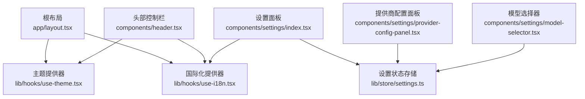
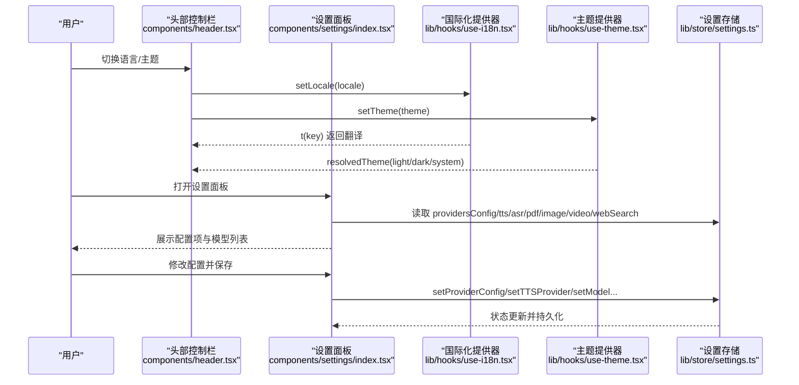
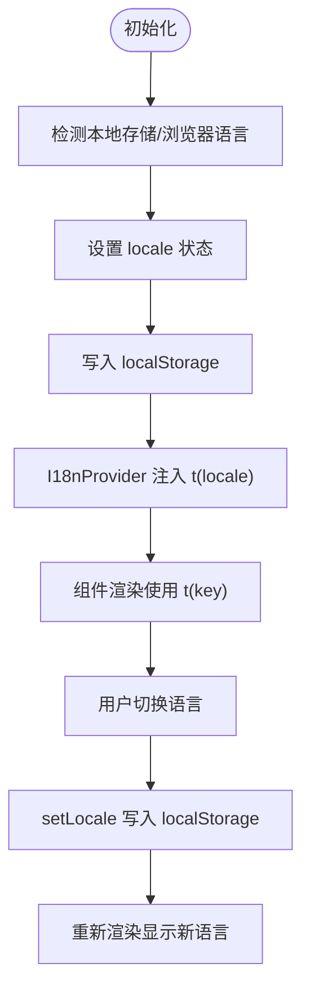
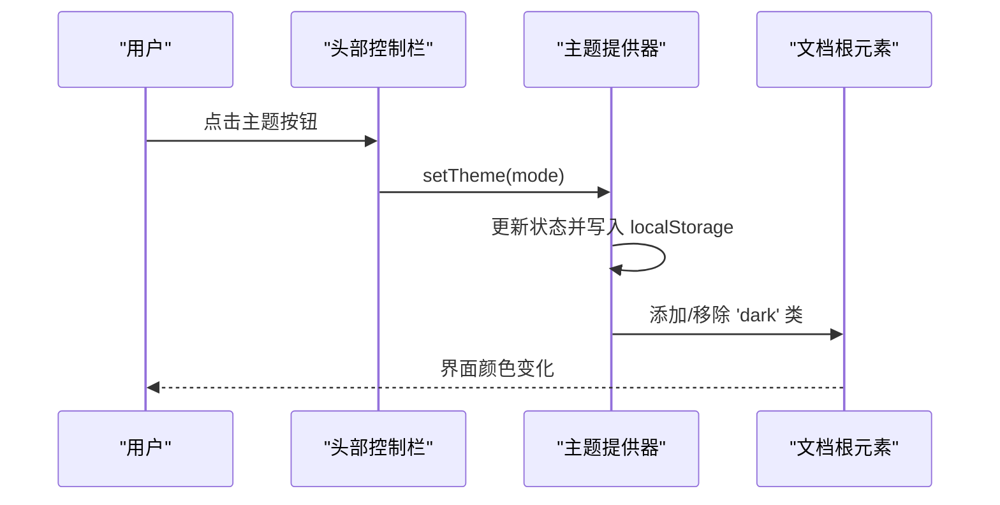
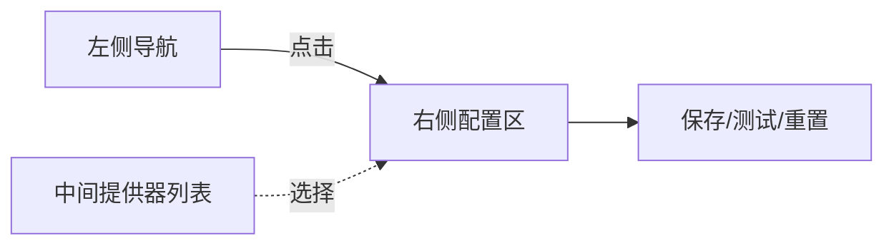
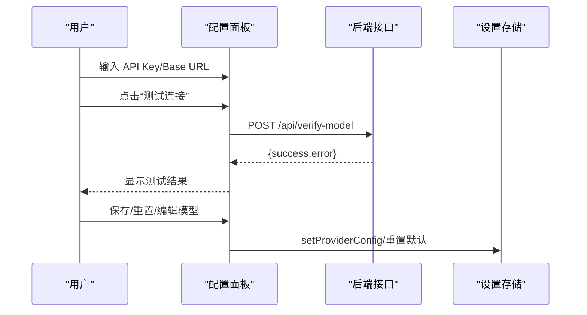
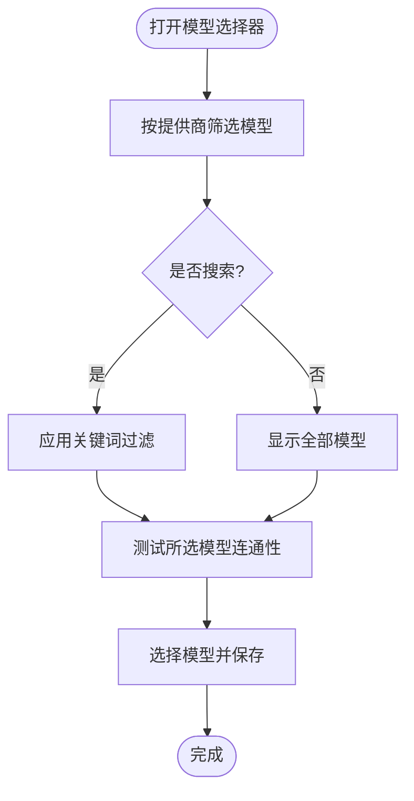
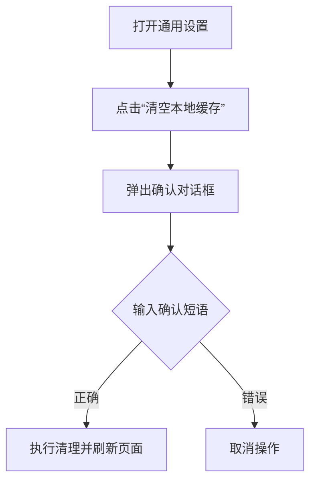
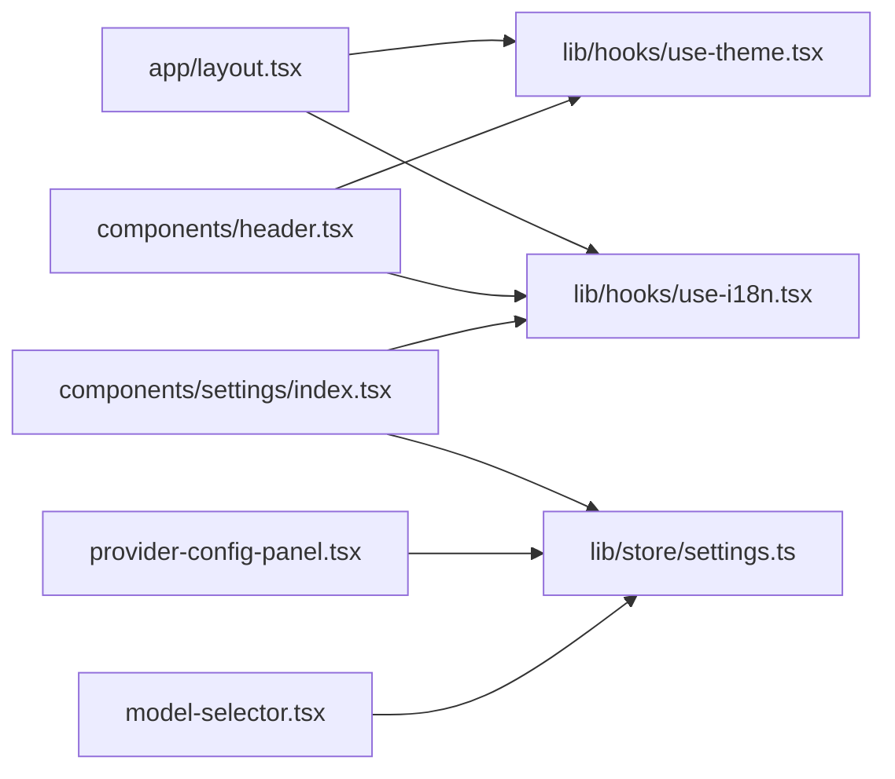

# 用户体验特性

<cite>
**本文引用的文件**
- [app/layout.tsx](file://app/layout.tsx)
- [lib/hooks/use-i18n.tsx](file://lib/hooks/use-i18n.tsx)
- [lib/i18n/index.ts](file://lib/i18n/index.ts)
- [lib/i18n/types.ts](file://lib/i18n/types.ts)
- [lib/i18n/common.ts](file://lib/i18n/common.ts)
- [lib/i18n/settings.ts](file://lib/i18n/settings.ts)
- [lib/hooks/use-theme.tsx](file://lib/hooks/use-theme.tsx)
- [configs/theme.ts](file://configs/theme.ts)
- [components/header.tsx](file://components/header.tsx)
- [components/settings/index.tsx](file://components/settings/index.tsx)
- [components/settings/provider-config-panel.tsx](file://components/settings/provider-config-panel.tsx)
- [components/settings/model-selector.tsx](file://components/settings/model-selector.tsx)
- [components/settings/general-settings.tsx](file://components/settings/general-settings.tsx)
- [lib/store/settings.ts](file://lib/store/settings.ts)
</cite>

## 目录
1. [简介](#简介)
2. [项目结构](#项目结构)
3. [核心组件](#核心组件)
4. [架构总览](#架构总览)
5. [详细组件分析](#详细组件分析)
6. [依赖关系分析](#依赖关系分析)
7. [性能考量](#性能考量)
8. [故障排查指南](#故障排查指南)
9. [结论](#结论)
10. [附录](#附录)

## 简介
本文件聚焦 OpenMAIC 的用户体验特性，围绕以下方面展开：
- 国际化支持：中英文界面切换与本地化内容处理
- 主题切换机制：浅色/深色/跟随系统模式
- 设置面板：AI 服务提供商配置、多媒体设置、模型选择等
- 响应式设计与无障碍访问支持
- 用户界面定制指南与最佳实践

## 项目结构
OpenMAIC 采用 Next.js 应用结构，全局在根布局中注入国际化与主题提供器，并通过组件层实现设置面板与头部控制栏。设置面板集中于 components/settings，状态管理由 lib/store/settings 统一持久化。

图表来源
- [app/layout.tsx:30-42](file://app/layout.tsx#L30-L42)
- [lib/hooks/use-i18n.tsx:17-52](file://lib/hooks/use-i18n.tsx#L17-L52)
- [lib/hooks/use-theme.tsx:15-62](file://lib/hooks/use-theme.tsx#L15-L62)
- [components/header.tsx:29-301](file://components/header.tsx#L29-L301)
- [components/settings/index.tsx:171-656](file://components/settings/index.tsx#L171-L656)
- [lib/store/settings.ts:421-479](file://lib/store/settings.ts#L421-L479)

章节来源
- [app/layout.tsx:25-46](file://app/layout.tsx#L25-L46)

## 核心组件
- 国际化提供器：负责语言切换、本地化翻译与持久化
- 主题提供器：负责浅色/深色/系统主题切换与持久化
- 设置面板：统一的配置中心，涵盖 LLM、TTS/ASR、PDF、图像/视频生成、网络搜索、通用设置
- 头部控制栏：语言与主题下拉、设置入口、导出菜单
- 模型选择器：跨提供商的模型浏览、搜索、测试连通性
- 提供商配置面板：API Key、Base URL、模型列表管理与连通性测试

章节来源
- [lib/hooks/use-i18n.tsx:17-61](file://lib/hooks/use-i18n.tsx#L17-L61)
- [lib/hooks/use-theme.tsx:15-71](file://lib/hooks/use-theme.tsx#L15-L71)
- [components/settings/index.tsx:171-656](file://components/settings/index.tsx#L171-L656)
- [components/settings/provider-config-panel.tsx:55-402](file://components/settings/provider-config-panel.tsx#L55-L402)
- [components/settings/model-selector.tsx:32-413](file://components/settings/model-selector.tsx#L32-L413)
- [components/header.tsx:29-301](file://components/header.tsx#L29-L301)
- [lib/store/settings.ts:421-800](file://lib/store/settings.ts#L421-L800)

## 架构总览
OpenMAIC 的用户体验由“提供器 + 组件 + 存储”三层协同实现：
- 提供器层：I18nProvider、ThemeProvider 在根布局注入，确保全站语言与主题一致
- 组件层：Header、SettingsDialog、ProviderConfigPanel、ModelSelector 等组件消费提供器与状态
- 存储层：Zustand + persist 同步设置到 localStorage，保障跨会话一致性

图表来源
- [components/header.tsx:108-211](file://components/header.tsx#L108-L211)
- [lib/hooks/use-i18n.tsx:38-50](file://lib/hooks/use-i18n.tsx#L38-L50)
- [lib/hooks/use-theme.tsx:53-60](file://lib/hooks/use-theme.tsx#L53-L60)
- [components/settings/index.tsx:171-656](file://components/settings/index.tsx#L171-L656)
- [lib/store/settings.ts:482-618](file://lib/store/settings.ts#L482-L618)

## 详细组件分析

### 国际化支持（中英文界面切换与本地化）
- 语言源：lib/i18n/index.ts 汇总 common、stage、chat、generation、settings 等模块的中英翻译
- 语言切换：lib/hooks/use-i18n.tsx 提供 setLocale 并持久化到 localStorage；首次渲染从 localStorage 或浏览器语言探测
- 语言回退：当翻译键缺失时回退为键名本身
- 头部语言选择器：components/header.tsx 提供 CN/EN 下拉，调用 setLocale 切换
- 设置文案：lib/i18n/settings.ts 提供设置面板的完整中英文案

图表来源
- [lib/hooks/use-i18n.tsx:22-41](file://lib/hooks/use-i18n.tsx#L22-L41)
- [lib/i18n/index.ts:9-26](file://lib/i18n/index.ts#L9-L26)
- [components/header.tsx:108-148](file://components/header.tsx#L108-L148)

章节来源
- [lib/i18n/types.ts:1-4](file://lib/i18n/types.ts#L1-L4)
- [lib/i18n/common.ts:1-82](file://lib/i18n/common.ts#L1-L82)
- [lib/i18n/settings.ts:1-1170](file://lib/i18n/settings.ts#L1-L1170)
- [lib/hooks/use-i18n.tsx:17-61](file://lib/hooks/use-i18n.tsx#L17-L61)
- [components/header.tsx:108-148](file://components/header.tsx#L108-L148)

### 主题切换机制（浅色/深色/跟随系统）
- 主题源：lib/hooks/use-theme.tsx 提供 theme/system 切换与系统偏好监听
- 持久化：localStorage 记录用户选择，避免 SSR 不一致
- DOM 应用：resolvedTheme 决定是否添加/移除 html 的 dark 类
- 预设主题：configs/theme.ts 定义演示用预设主题（用于演示或扩展）

图表来源
- [lib/hooks/use-theme.tsx:15-62](file://lib/hooks/use-theme.tsx#L15-L62)
- [configs/theme.ts:3-126](file://configs/theme.ts#L3-L126)
- [components/header.tsx:153-211](file://components/header.tsx#L153-L211)

章节来源
- [lib/hooks/use-theme.tsx:15-71](file://lib/hooks/use-theme.tsx#L15-L71)
- [configs/theme.ts:3-126](file://configs/theme.ts#L3-L126)
- [components/header.tsx:153-211](file://components/header.tsx#L153-L211)

### 设置面板功能组织
设置面板采用分栏布局与可拖拽列宽，支持：
- 左侧导航：语言模型、图像、视频、TTS、ASR、PDF、网络搜索、系统设置
- 中间提供器列表（部分分区显示）
- 右侧配置区：API Key/Base URL、模型管理、测试连通性、重置默认等

图表来源
- [components/settings/index.tsx:657-763](file://components/settings/index.tsx#L657-L763)
- [components/settings/index.tsx:773-790](file://components/settings/index.tsx#L773-L790)
- [components/settings/index.tsx:171-656](file://components/settings/index.tsx#L171-L656)

章节来源
- [components/settings/index.tsx:171-656](file://components/settings/index.tsx#L171-L656)

### 提供商配置面板（ProviderConfigPanel）
- 功能：配置 API Key、Base URL、是否需要 Key、测试连通性、模型列表管理、重置默认
- 连通性测试：调用 /api/verify-model，返回成功/失败提示
- 服务器配置：支持服务端已配置的提供商，允许覆盖或使用服务端密钥

图表来源
- [components/settings/provider-config-panel.tsx:110-150](file://components/settings/provider-config-panel.tsx#L110-L150)
- [components/settings/provider-config-panel.tsx:285-399](file://components/settings/provider-config-panel.tsx#L285-L399)
- [lib/store/settings.ts:482-491](file://lib/store/settings.ts#L482-L491)

章节来源
- [components/settings/provider-config-panel.tsx:55-402](file://components/settings/provider-config-panel.tsx#L55-L402)
- [lib/store/settings.ts:482-618](file://lib/store/settings.ts#L482-L618)

### 模型选择器（ModelSelector）
- 功能：按提供商筛选模型、搜索过滤、测试模型连通性、选择当前使用模型
- 服务器限制：当服务端限定可用模型时，仅展示允许的模型
- 交互：支持搜索框展开、自动滚动到选中项、测试结果高亮

图表来源
- [components/settings/model-selector.tsx:89-104](file://components/settings/model-selector.tsx#L89-L104)
- [components/settings/model-selector.tsx:136-184](file://components/settings/model-selector.tsx#L136-L184)
- [components/settings/model-selector.tsx:186-192](file://components/settings/model-selector.tsx#L186-L192)

章节来源
- [components/settings/model-selector.tsx:32-413](file://components/settings/model-selector.tsx#L32-L413)
- [lib/store/settings.ts:480-481](file://lib/store/settings.ts#L480-L481)

### 通用设置（GeneralSettings）
- 功能：清空本地缓存（IndexedDB、localStorage、sessionStorage），并提示确认
- 安全性：二次确认输入短语，防止误操作

图表来源
- [components/settings/general-settings.tsx:35-57](file://components/settings/general-settings.tsx#L35-L57)
- [components/settings/general-settings.tsx:116-178](file://components/settings/general-settings.tsx#L116-L178)

章节来源
- [components/settings/general-settings.tsx:24-182](file://components/settings/general-settings.tsx#L24-L182)

### 响应式设计与无障碍访问
- 响应式：头部控制栏在窄屏下仍保持关键控件可见；设置面板列宽可拖拽，适配不同屏幕宽度
- 无障碍：设置面板使用 Dialog/AlertDialog 结构化语义，提供屏幕阅读器友好的标题与描述；图标配合文字标签，提升可理解性

章节来源
- [components/settings/index.tsx:653-656](file://components/settings/index.tsx#L653-L656)
- [app/layout.tsx:30-42](file://app/layout.tsx#L30-L42)

## 依赖关系分析
- 根布局 app/layout.tsx 注入 I18nProvider 与 ThemeProvider，确保全局生效
- Header 组件同时消费国际化与主题，作为顶层控制入口
- SettingsDialog 依赖 useI18n 与 useSettingsStore，承载所有设置配置逻辑
- ProviderConfigPanel 与 ModelSelector 通过 lib/store/settings.ts 与后端接口交互

图表来源
- [app/layout.tsx:30-42](file://app/layout.tsx#L30-L42)
- [components/header.tsx:29-31](file://components/header.tsx#L29-L31)
- [components/settings/index.tsx:171-172](file://components/settings/index.tsx#L171-L172)
- [lib/store/settings.ts:421-479](file://lib/store/settings.ts#L421-L479)

章节来源
- [app/layout.tsx:25-46](file://app/layout.tsx#L25-L46)
- [components/header.tsx:29-301](file://components/header.tsx#L29-L301)
- [components/settings/index.tsx:171-656](file://components/settings/index.tsx#L171-L656)
- [lib/store/settings.ts:421-800](file://lib/store/settings.ts#L421-L800)

## 性能考量
- 翻译键访问：t(key) 逐级查找，建议在高频渲染路径中复用翻译结果，避免重复计算
- 设置存储：Zustand + persist，避免频繁 IO；批量更新时减少渲染抖动
- 模型测试：连通性测试应节流，避免用户快速点击导致多次并发请求
- 列宽拖拽：拖拽事件绑定在 document 上，注意在拖拽结束时释放事件监听

## 故障排查指南
- 语言切换无效
  - 检查 localStorage 是否写入成功；确认 useI18n 初始化逻辑
  - 参考：[lib/hooks/use-i18n.tsx:38-41](file://lib/hooks/use-i18n.tsx#L38-L41)
- 主题切换不生效
  - 检查 resolvedTheme 是否正确；确认 html 根元素是否添加/移除 'dark' 类
  - 参考：[lib/hooks/use-theme.tsx:33-40](file://lib/hooks/use-theme.tsx#L33-L40)
- 设置保存后未持久化
  - 检查 Zustand persist 配置；确认 setProviderConfig 等动作是否触发
  - 参考：[lib/store/settings.ts:482-491](file://lib/store/settings.ts#L482-L491)
- 连通性测试失败
  - 检查 API Key/Base URL 是否正确；确认 /api/verify-model 接口可达
  - 参考：[components/settings/provider-config-panel.tsx:110-150](file://components/settings/provider-config-panel.tsx#L110-L150)
- 清空缓存失败
  - 检查数据库清理权限与异常日志；确认确认短语匹配
  - 参考：[components/settings/general-settings.tsx:35-57](file://components/settings/general-settings.tsx#L35-L57)

章节来源
- [lib/hooks/use-i18n.tsx:38-41](file://lib/hooks/use-i18n.tsx#L38-L41)
- [lib/hooks/use-theme.tsx:33-40](file://lib/hooks/use-theme.tsx#L33-L40)
- [lib/store/settings.ts:482-491](file://lib/store/settings.ts#L482-L491)
- [components/settings/provider-config-panel.tsx:110-150](file://components/settings/provider-config-panel.tsx#L110-L150)
- [components/settings/general-settings.tsx:35-57](file://components/settings/general-settings.tsx#L35-L57)

## 结论
OpenMAIC 的用户体验特性以“提供器 + 组件 + 存储”为核心，实现了：
- 自然的语言切换与本地化文案体系
- 灵活的主题模式与系统偏好联动
- 可扩展的设置面板与模型选择流程
- 良好的响应式与无障碍基础

通过合理使用设置面板与主题/语言控制，用户可以按个人偏好优化使用体验。

## 附录
- 用户界面定制建议
  - 语言：优先使用系统语言探测，尊重用户选择并持久化
  - 主题：默认“跟随系统”，在深色环境下提升对比度
  - 设置：将常用提供商与模型固定在常用位置，减少切换成本
  - 多媒体：按需启用图像/视频生成，避免不必要的资源消耗
  - 无障碍：保持图标与文字并存，提供键盘导航与屏幕阅读器支持