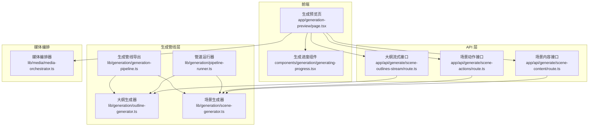
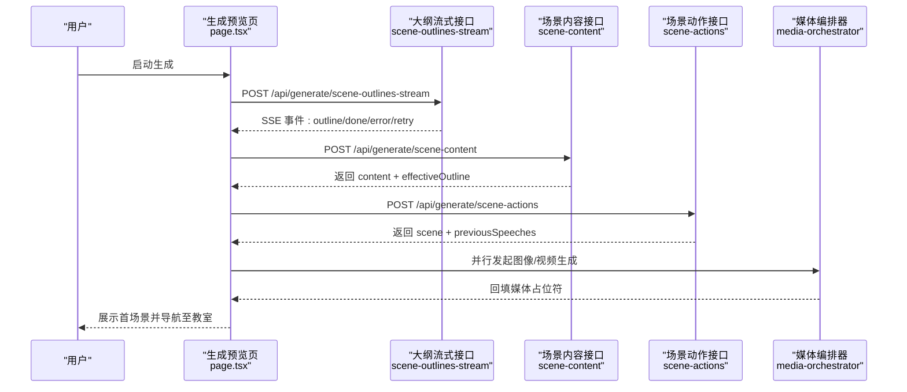
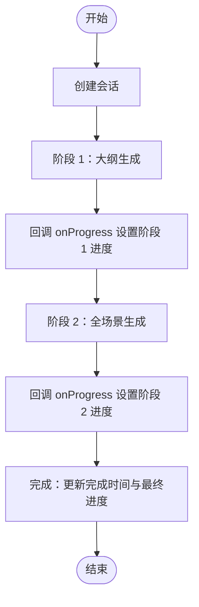
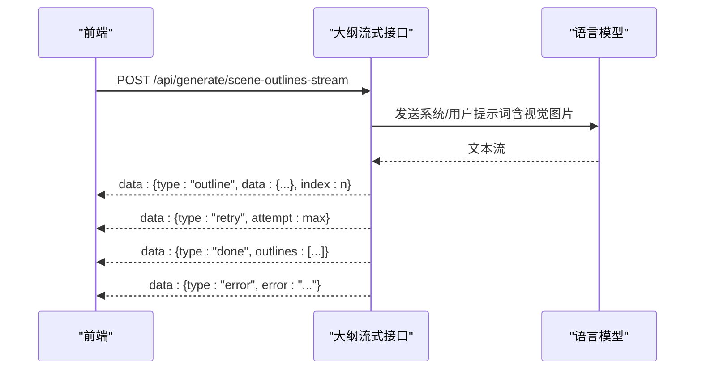
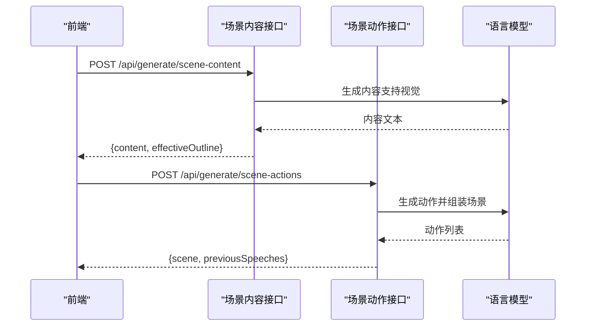
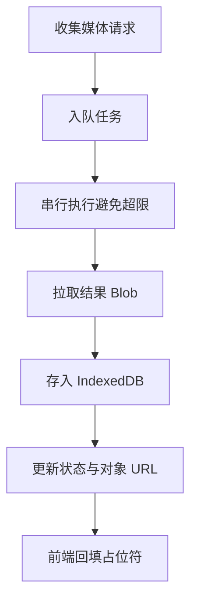
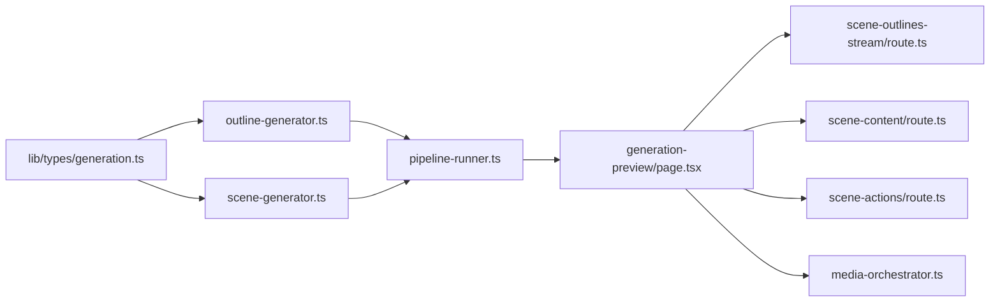

# 两阶段生成管道

<cite>
**本文档引用的文件**
- [app/api/generate/scene-outlines-stream/route.ts](file://app/api/generate/scene-outlines-stream/route.ts)
- [app/api/generate/scene-content/route.ts](file://app/api/generate/scene-content/route.ts)
- [app/api/generate/scene-actions/route.ts](file://app/api/generate/scene-actions/route.ts)
- [lib/generation/generation-pipeline.ts](file://lib/generation/generation-pipeline.ts)
- [lib/generation/pipeline-runner.ts](file://lib/generation/pipeline-runner.ts)
- [lib/generation/outline-generator.ts](file://lib/generation/outline-generator.ts)
- [lib/generation/scene-generator.ts](file://lib/generation/scene-generator.ts)
- [lib/media/media-orchestrator.ts](file://lib/media/media-orchestrator.ts)
- [lib/types/generation.ts](file://lib/types/generation.ts)
- [components/generation/generating-progress.tsx](file://components/generation/generating-progress.tsx)
- [app/generation-preview/page.tsx](file://app/generation-preview/page.tsx)
</cite>

## 目录
1. [简介](#简介)
2. [项目结构](#项目结构)
3. [核心组件](#核心组件)
4. [架构总览](#架构总览)
5. [详细组件分析](#详细组件分析)
6. [依赖关系分析](#依赖关系分析)
7. [性能考虑](#性能考虑)
8. [故障排除指南](#故障排除指南)
9. [结论](#结论)
10. [附录](#附录)

## 简介
本文件面向 OpenMAIC 的两阶段生成管道，系统性阐述从用户需求到完整课堂场景的端到端流程。该管道分为两个阶段：
- 第一阶段：场景大纲生成（场景级规划与媒体需求）
- 第二阶段：场景内容与动作生成（页面元素、交互与教学动作）

文档重点覆盖：
- 管道运行器的会话创建、进度跟踪与阶段间协调
- 第一阶段（场景大纲生成）与第二阶段（场景内容生成）的实现细节、参数传递、回调机制与错误处理
- 完整的使用示例路径，展示如何启动生成会话、监控进度状态与处理生成结果
- 并发处理能力、内存管理与性能优化策略

## 项目结构
围绕两阶段生成管道的关键模块分布如下：
- API 层：负责接收请求、解析参数、调用模型、返回结果或流式事件
- 生成管线层：封装大纲生成、内容生成、动作生成与会话管理
- 前端预览页：编排生成步骤、处理 SSE 流、更新 UI 状态
- 媒体编排器：在前端异步生成图像/视频，填充占位符

**图表来源**
- [app/generation-preview/page.tsx:130-735](file://app/generation-preview/page.tsx#L130-L735)
- [app/api/generate/scene-outlines-stream/route.ts:99-361](file://app/api/generate/scene-outlines-stream/route.ts#L99-L361)
- [app/api/generate/scene-content/route.ts:26-167](file://app/api/generate/scene-content/route.ts#L26-L167)
- [app/api/generate/scene-actions/route.ts:34-158](file://app/api/generate/scene-actions/route.ts#L34-L158)
- [lib/generation/pipeline-runner.ts:13-91](file://lib/generation/pipeline-runner.ts#L13-L91)
- [lib/generation/outline-generator.ts:26-157](file://lib/generation/outline-generator.ts#L26-L157)
- [lib/generation/scene-generator.ts:61-144](file://lib/generation/scene-generator.ts#L61-L144)
- [lib/generation/generation-pipeline.ts:8-50](file://lib/generation/generation-pipeline.ts#L8-L50)
- [lib/media/media-orchestrator.ts:31-184](file://lib/media/media-orchestrator.ts#L31-L184)

**章节来源**
- [app/generation-preview/page.tsx:130-735](file://app/generation-preview/page.tsx#L130-L735)
- [app/api/generate/scene-outlines-stream/route.ts:99-361](file://app/api/generate/scene-outlines-stream/route.ts#L99-L361)
- [app/api/generate/scene-content/route.ts:26-167](file://app/api/generate/scene-content/route.ts#L26-L167)
- [app/api/generate/scene-actions/route.ts:34-158](file://app/api/generate/scene-actions/route.ts#L34-L158)
- [lib/generation/pipeline-runner.ts:13-91](file://lib/generation/pipeline-runner.ts#L13-L91)
- [lib/generation/outline-generator.ts:26-157](file://lib/generation/outline-generator.ts#L26-L157)
- [lib/generation/scene-generator.ts:61-144](file://lib/generation/scene-generator.ts#L61-L144)
- [lib/generation/generation-pipeline.ts:8-50](file://lib/generation/generation-pipeline.ts#L8-L50)
- [lib/media/media-orchestrator.ts:31-184](file://lib/media/media-orchestrator.ts#L31-L184)

## 核心组件
- 管道运行器与会话管理
  - 创建会话、推进阶段进度、回调通知、错误收集
  - 路径参考：[lib/generation/pipeline-runner.ts:13-91](file://lib/generation/pipeline-runner.ts#L13-L91)
- 大纲生成器
  - 将用户需求转换为场景大纲数组，支持视觉模式与媒体策略
  - 路径参考：[lib/generation/outline-generator.ts:26-157](file://lib/generation/outline-generator.ts#L26-L157)
- 场景生成器
  - 内容生成（幻灯片/测验/互动/PBL）、动作生成、场景组装
  - 路径参考：[lib/generation/scene-generator.ts:61-144](file://lib/generation/scene-generator.ts#L61-L144)
- 媒体编排器
  - 在前端并行发起图像/视频生成，存储到 IndexedDB，回填占位符
  - 路径参考：[lib/media/media-orchestrator.ts:31-184](file://lib/media/media-orchestrator.ts#L31-L184)
- 前端生成预览页
  - 编排 PDF 解析、网络搜索、代理生成、SSE 流式大纲、内容与动作生成
  - 路径参考：[app/generation-preview/page.tsx:130-735](file://app/generation-preview/page.tsx#L130-L735)
- 进度 UI 组件
  - 显示大纲就绪与首页生成状态、错误提示与动态状态消息
  - 路径参考：[components/generation/generating-progress.tsx:57-141](file://components/generation/generating-progress.tsx#L57-L141)

**章节来源**
- [lib/generation/pipeline-runner.ts:13-91](file://lib/generation/pipeline-runner.ts#L13-L91)
- [lib/generation/outline-generator.ts:26-157](file://lib/generation/outline-generator.ts#L26-L157)
- [lib/generation/scene-generator.ts:61-144](file://lib/generation/scene-generator.ts#L61-L144)
- [lib/media/media-orchestrator.ts:31-184](file://lib/media/media-orchestrator.ts#L31-L184)
- [app/generation-preview/page.tsx:130-735](file://app/generation-preview/page.tsx#L130-L735)
- [components/generation/generating-progress.tsx:57-141](file://components/generation/generating-progress.tsx#L57-L141)

## 架构总览
两阶段生成管道采用“服务端 API + 前端编排”的混合架构：
- 服务端 API 提供模型调用与流式输出能力
- 前端负责会话编排、SSE 解析、媒体生成与 UI 更新
- 管线层在服务端与前端分别提供运行器，保证一致性与可测试性

**图表来源**
- [app/generation-preview/page.tsx:460-735](file://app/generation-preview/page.tsx#L460-L735)
- [app/api/generate/scene-outlines-stream/route.ts:197-361](file://app/api/generate/scene-outlines-stream/route.ts#L197-L361)
- [app/api/generate/scene-content/route.ts:139-162](file://app/api/generate/scene-content/route.ts#L139-L162)
- [app/api/generate/scene-actions/route.ts:129-153](file://app/api/generate/scene-actions/route.ts#L129-L153)
- [lib/media/media-orchestrator.ts:31-184](file://lib/media/media-orchestrator.ts#L31-L184)

## 详细组件分析

### 管道运行器与会话管理
- 会话创建
  - 初始化唯一 ID、时间戳、进度字段
  - 参考：[lib/generation/pipeline-runner.ts:13-27](file://lib/generation/pipeline-runner.ts#L13-L27)
- 阶段推进与回调
  - 阶段 1：大纲生成，设置总体进度与状态消息
  - 阶段 2：全场景生成，记录场景总数与完成数
  - 错误时回调 onError 并记录到进度错误列表
  - 参考：[lib/generation/pipeline-runner.ts:30-91](file://lib/generation/pipeline-runner.ts#L30-L91)

**图表来源**
- [lib/generation/pipeline-runner.ts:30-91](file://lib/generation/pipeline-runner.ts#L30-L91)

**章节来源**
- [lib/generation/pipeline-runner.ts:13-91](file://lib/generation/pipeline-runner.ts#L13-L91)

### 第一阶段：场景大纲生成（Requirements → Outlines）
- 输入
  - 用户需求、PDF 文本与图片、研究上下文、教师角色、媒体生成策略
  - 参考：[app/api/generate/scene-outlines-stream/route.ts:110-187](file://app/api/generate/scene-outlines-stream/route.ts#L110-L187)
- 视觉模式与媒体策略
  - 检测模型是否具备视觉能力；按策略限制图像/视频生成
  - 参考：[app/api/generate/scene-outlines-stream/route.ts:119-171](file://app/api/generate/scene-outlines-stream/route.ts#L119-L171)
- 流式解析与重试
  - 使用增量 JSON 数组解析器提取新大纲；最多重试若干次
  - 参考：[app/api/generate/scene-outlines-stream/route.ts:45-97](file://app/api/generate/scene-outlines-stream/route.ts#L45-L97)
- SSE 输出
  - 逐条发送 outline 事件；完成后发送 done；失败发送 error；重试发送 retry
  - 参考：[app/api/generate/scene-outlines-stream/route.ts:269-336](file://app/api/generate/scene-outlines-stream/route.ts#L269-L336)
- 前端消费
  - 读取 SSE 数据流，收集 outline，显示重试提示，最终得到完整大纲
  - 参考：[app/generation-preview/page.tsx:469-545](file://app/generation-preview/page.tsx#L469-L545)

**图表来源**
- [app/api/generate/scene-outlines-stream/route.ts:197-361](file://app/api/generate/scene-outlines-stream/route.ts#L197-L361)
- [app/generation-preview/page.tsx:469-545](file://app/generation-preview/page.tsx#L469-L545)

**章节来源**
- [app/api/generate/scene-outlines-stream/route.ts:99-361](file://app/api/generate/scene-outlines-stream/route.ts#L99-L361)
- [app/generation-preview/page.tsx:469-545](file://app/generation-preview/page.tsx#L469-L545)

### 第二阶段：场景内容生成（Outline → Content + Actions）
- 场景内容生成
  - 根据大纲类型（幻灯片/测验/互动/PBL）生成对应内容
  - 支持视觉模式（当模型具备视觉能力且提供图片）
  - 参考：[app/api/generate/scene-content/route.ts:139-148](file://app/api/generate/scene-content/route.ts#L139-L148)
- 动作生成与场景组装
  - 基于内容与大纲生成动作列表，并构建完整场景对象
  - 参考：[app/api/generate/scene-actions/route.ts:129-153](file://app/api/generate/scene-actions/route.ts#L129-L153)
- 前端编排
  - 生成首场景后，可选择生成 TTS 并写入 IndexedDB，随后导航至教室
  - 参考：[app/generation-preview/page.tsx:596-726](file://app/generation-preview/page.tsx#L596-L726)

**图表来源**
- [app/api/generate/scene-content/route.ts:139-162](file://app/api/generate/scene-content/route.ts#L139-L162)
- [app/api/generate/scene-actions/route.ts:129-153](file://app/api/generate/scene-actions/route.ts#L129-L153)
- [app/generation-preview/page.tsx:596-726](file://app/generation-preview/page.tsx#L596-L726)

**章节来源**
- [app/api/generate/scene-content/route.ts:26-167](file://app/api/generate/scene-content/route.ts#L26-L167)
- [app/api/generate/scene-actions/route.ts:34-158](file://app/api/generate/scene-actions/route.ts#L34-L158)
- [app/generation-preview/page.tsx:596-726](file://app/generation-preview/page.tsx#L596-L726)

### 媒体生成与占位符回填
- 前端并行生成
  - 收集所有 outline 中声明的媒体生成请求，按启用开关过滤
  - 串行调用图像/视频 API，避免超限；成功后下载 Blob 存入 IndexedDB
  - 参考：[lib/media/media-orchestrator.ts:31-184](file://lib/media/media-orchestrator.ts#L31-L184)
- 占位符替换
  - 内容生成时保留 gen_img_/gen_vid_ 占位符；媒体完成后由前端回填实际 URL
  - 参考：[lib/generation/scene-generator.ts:245-301](file://lib/generation/scene-generator.ts#L245-L301)

**图表来源**
- [lib/media/media-orchestrator.ts:31-184](file://lib/media/media-orchestrator.ts#L31-L184)
- [lib/generation/scene-generator.ts:245-301](file://lib/generation/scene-generator.ts#L245-L301)

**章节来源**
- [lib/media/media-orchestrator.ts:31-184](file://lib/media/media-orchestrator.ts#L31-L184)
- [lib/generation/scene-generator.ts:245-301](file://lib/generation/scene-generator.ts#L245-L301)

### 进度跟踪与 UI 展示
- 生成进度组件
  - 展示“大纲就绪”“首页生成”里程碑状态，错误时显示错误卡片
  - 参考：[components/generation/generating-progress.tsx:57-141](file://components/generation/generating-progress.tsx#L57-L141)
- 前端状态驱动
  - 通过当前步骤索引与会话状态控制 UI 展示与导航
  - 参考：[app/generation-preview/page.tsx:65-127](file://app/generation-preview/page.tsx#L65-L127)

**章节来源**
- [components/generation/generating-progress.tsx:57-141](file://components/generation/generating-progress.tsx#L57-L141)
- [app/generation-preview/page.tsx:65-127](file://app/generation-preview/page.tsx#L65-L127)

## 依赖关系分析
- 类型与数据结构
  - 用户需求、场景大纲、生成内容、生成进度等核心类型定义
  - 参考：[lib/types/generation.ts:65-229](file://lib/types/generation.ts#L65-L229)
- 管线导出
  - 统一导出类型、提示词工具、JSON 修复、大纲与场景生成器、会话运行器
  - 参考：[lib/generation/generation-pipeline.ts:8-50](file://lib/generation/generation-pipeline.ts#L8-L50)

**图表来源**
- [lib/types/generation.ts:65-229](file://lib/types/generation.ts#L65-L229)
- [lib/generation/generation-pipeline.ts:8-50](file://lib/generation/generation-pipeline.ts#L8-L50)
- [lib/generation/pipeline-runner.ts:13-91](file://lib/generation/pipeline-runner.ts#L13-L91)
- [lib/generation/outline-generator.ts:26-157](file://lib/generation/outline-generator.ts#L26-L157)
- [lib/generation/scene-generator.ts:61-144](file://lib/generation/scene-generator.ts#L61-L144)
- [app/generation-preview/page.tsx:130-735](file://app/generation-preview/page.tsx#L130-L735)
- [app/api/generate/scene-outlines-stream/route.ts:99-361](file://app/api/generate/scene-outlines-stream/route.ts#L99-L361)
- [app/api/generate/scene-content/route.ts:26-167](file://app/api/generate/scene-content/route.ts#L26-L167)
- [app/api/generate/scene-actions/route.ts:34-158](file://app/api/generate/scene-actions/route.ts#L34-L158)
- [lib/media/media-orchestrator.ts:31-184](file://lib/media/media-orchestrator.ts#L31-L184)

**章节来源**
- [lib/types/generation.ts:65-229](file://lib/types/generation.ts#L65-L229)
- [lib/generation/generation-pipeline.ts:8-50](file://lib/generation/generation-pipeline.ts#L8-L50)
- [lib/generation/pipeline-runner.ts:13-91](file://lib/generation/pipeline-runner.ts#L13-L91)
- [lib/generation/outline-generator.ts:26-157](file://lib/generation/outline-generator.ts#L26-L157)
- [lib/generation/scene-generator.ts:61-144](file://lib/generation/scene-generator.ts#L61-L144)
- [app/generation-preview/page.tsx:130-735](file://app/generation-preview/page.tsx#L130-L735)
- [app/api/generate/scene-outlines-stream/route.ts:99-361](file://app/api/generate/scene-outlines-stream/route.ts#L99-L361)
- [app/api/generate/scene-content/route.ts:26-167](file://app/api/generate/scene-content/route.ts#L26-L167)
- [app/api/generate/scene-actions/route.ts:34-158](file://app/api/generate/scene-actions/route.ts#L34-L158)
- [lib/media/media-orchestrator.ts:31-184](file://lib/media/media-orchestrator.ts#L31-L184)

## 性能考虑
- 并发与吞吐
  - 阶段 2：全场景内容与动作生成采用 Promise.all 并行处理，显著提升吞吐
  - 参考：[lib/generation/scene-generator.ts:80-116](file://lib/generation/scene-generator.ts#L80-L116)
- 流式输出与心跳
  - 大纲流式接口使用心跳维持连接，避免超时断开
  - 参考：[app/api/generate/scene-outlines-stream/route.ts:197-219](file://app/api/generate/scene-outlines-stream/route.ts#L197-L219)
- 重试与健壮性
  - 大纲流式接口在空响应或异常时进行有限次数重试，提高成功率
  - 参考：[app/api/generate/scene-outlines-stream/route.ts:248-315](file://app/api/generate/scene-outlines-stream/route.ts#L248-L315)
- 媒体生成限流
  - 媒体编排器串行执行以避免 API 限流，同时前端并行发起以缩短总耗时
  - 参考：[lib/media/media-orchestrator.ts:59-63](file://lib/media/media-orchestrator.ts#L59-L63)
- 内存管理
  - 前端使用对象 URL 并在不再需要时释放；IndexedDB 存储媒体文件，避免长期驻留内存
  - 参考：[lib/media/media-orchestrator.ts:152-154](file://lib/media/media-orchestrator.ts#L152-L154)

[本节为通用性能建议，不直接分析具体文件]

## 故障排除指南
- 大纲流式接口常见问题
  - 空响应或解析失败：检查提示词构建与模型输出格式；查看重试事件与错误事件
  - 参考：[app/api/generate/scene-outlines-stream/route.ts:278-336](file://app/api/generate/scene-outlines-stream/route.ts#L278-L336)
- 场景内容/动作接口错误
  - 必填字段缺失：确保 outline、allOutlines、content、stageId 正确传入
  - 参考：[app/api/generate/scene-content/route.ts:52-65](file://app/api/generate/scene-content/route.ts#L52-L65)、[app/api/generate/scene-actions/route.ts:59-75](file://app/api/generate/scene-actions/route.ts#L59-L75)
- 媒体生成失败
  - 检查启用开关、提供商配置与网络代理；失败项可重试
  - 参考：[lib/media/media-orchestrator.ts:69-100](file://lib/media/media-orchestrator.ts#L69-L100)
- 前端中断与清理
  - 导航或关闭时会触发 AbortController，避免悬挂请求
  - 参考：[app/generation-preview/page.tsx:84-89](file://app/generation-preview/page.tsx#L84-L89)

**章节来源**
- [app/api/generate/scene-outlines-stream/route.ts:278-336](file://app/api/generate/scene-outlines-stream/route.ts#L278-L336)
- [app/api/generate/scene-content/route.ts:52-65](file://app/api/generate/scene-content/route.ts#L52-L65)
- [app/api/generate/scene-actions/route.ts:59-75](file://app/api/generate/scene-actions/route.ts#L59-L75)
- [lib/media/media-orchestrator.ts:69-100](file://lib/media/media-orchestrator.ts#L69-L100)
- [app/generation-preview/page.tsx:84-89](file://app/generation-preview/page.tsx#L84-L89)

## 结论
OpenMAIC 的两阶段生成管道通过清晰的阶段划分、稳健的流式输出与并行处理策略，实现了从需求到完整课堂场景的高效生成。前端负责编排与 UI 展示，服务端提供可靠的模型调用与流式能力，媒体编排器在前端异步回填占位符，整体具备良好的扩展性与可维护性。

[本节为总结性内容，不直接分析具体文件]

## 附录
- 代码示例路径（不含具体代码内容）
  - 启动生成会话与监控进度
    - [app/generation-preview/page.tsx:130-735](file://app/generation-preview/page.tsx#L130-L735)
  - 大纲流式生成（SSE）
    - [app/api/generate/scene-outlines-stream/route.ts:99-361](file://app/api/generate/scene-outlines-stream/route.ts#L99-L361)
  - 场景内容生成
    - [app/api/generate/scene-content/route.ts:26-167](file://app/api/generate/scene-content/route.ts#L26-L167)
  - 场景动作生成与场景组装
    - [app/api/generate/scene-actions/route.ts:34-158](file://app/api/generate/scene-actions/route.ts#L34-L158)
  - 媒体生成与占位符回填
    - [lib/media/media-orchestrator.ts:31-184](file://lib/media/media-orchestrator.ts#L31-L184)
    - [lib/generation/scene-generator.ts:245-301](file://lib/generation/scene-generator.ts#L245-L301)
  - 会话创建与阶段推进
    - [lib/generation/pipeline-runner.ts:13-91](file://lib/generation/pipeline-runner.ts#L13-L91)
  - 核心类型定义
    - [lib/types/generation.ts:65-229](file://lib/types/generation.ts#L65-L229)