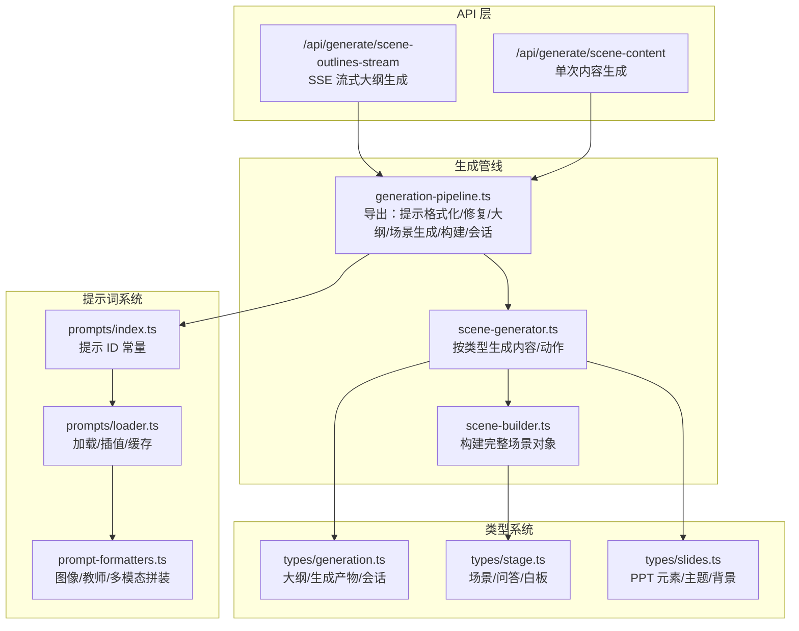
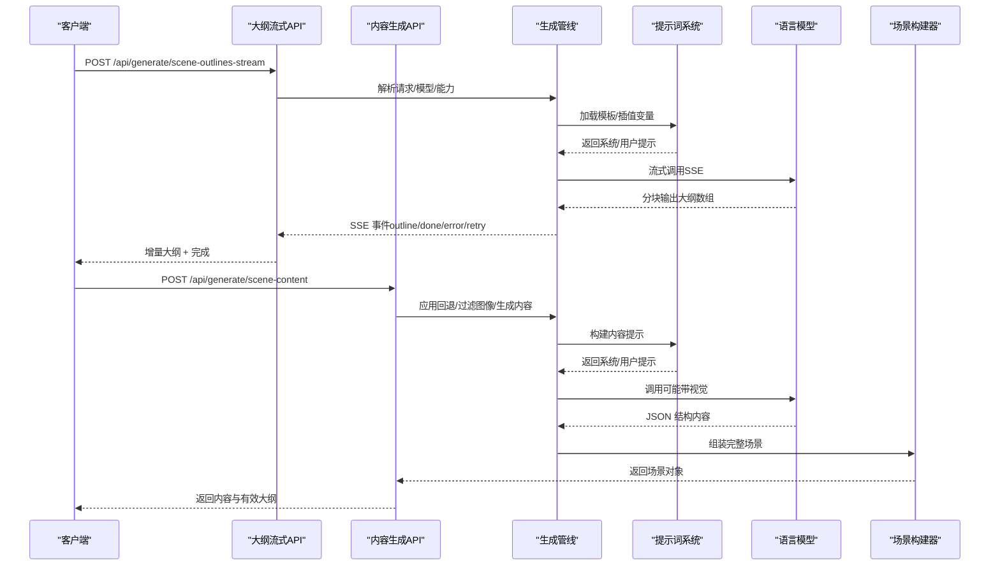
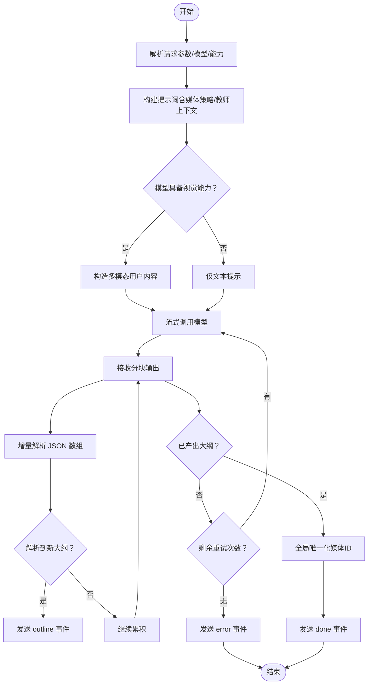
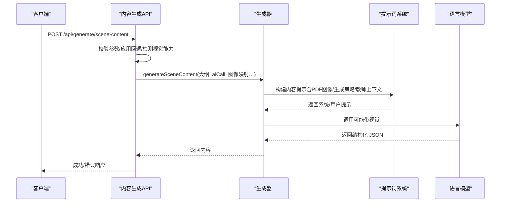
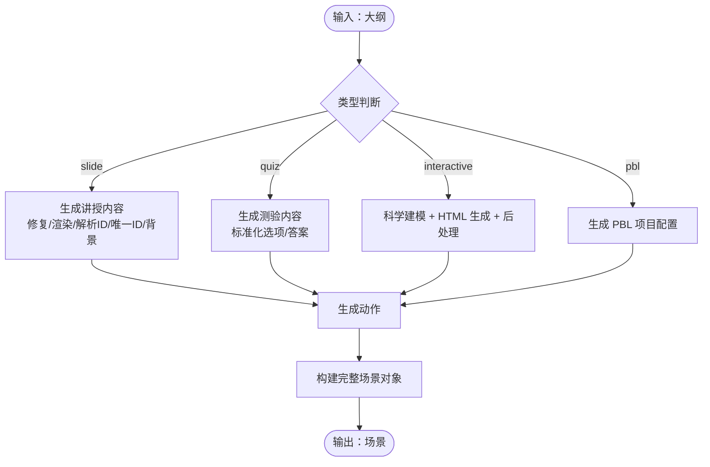
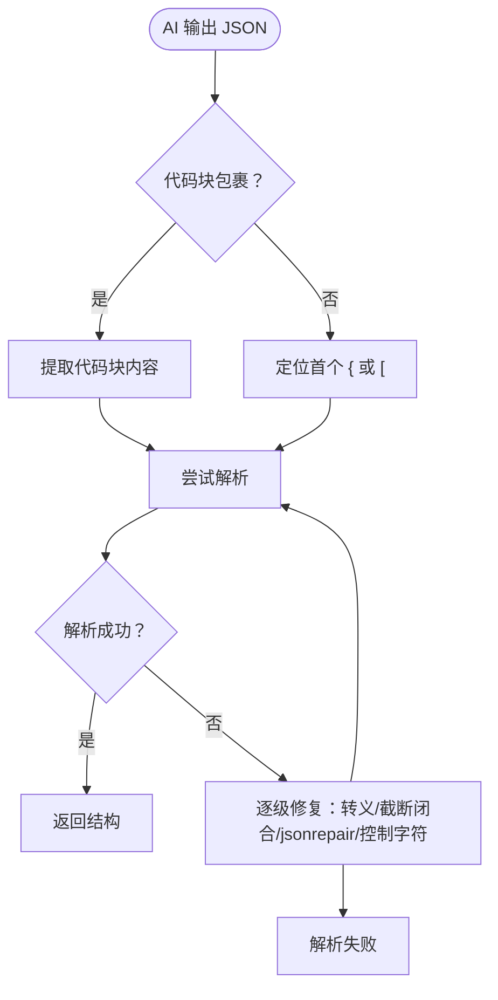
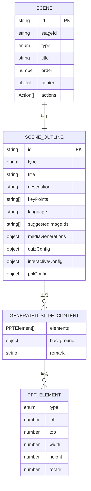
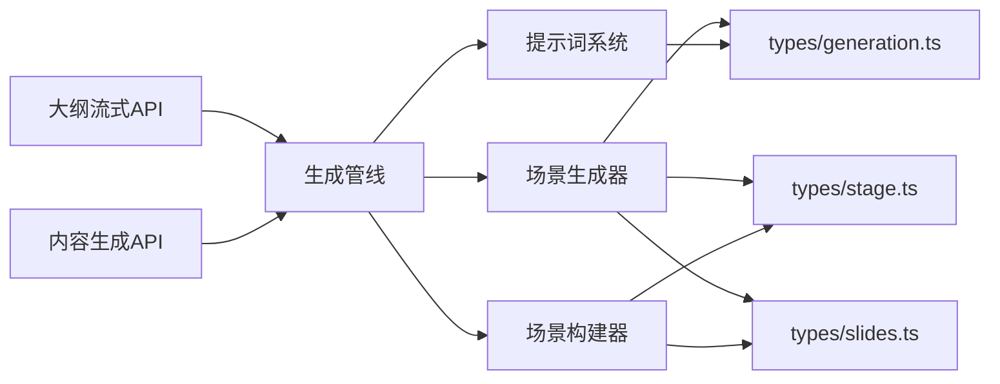

# 场景内容生成

<cite>
**本文引用的文件**
- [app/api/generate/scene-content/route.ts](file://app/api/generate/scene-content/route.ts)
- [app/api/generate/scene-outlines-stream/route.ts](file://app/api/generate/scene-outlines-stream/route.ts)
- [lib/generation/generation-pipeline.ts](file://lib/generation/generation-pipeline.ts)
- [lib/generation/prompts/index.ts](file://lib/generation/prompts/index.ts)
- [lib/generation/prompts/loader.ts](file://lib/generation/prompts/loader.ts)
- [lib/generation/prompt-formatters.ts](file://lib/generation/prompt-formatters.ts)
- [lib/generation/json-repair.ts](file://lib/generation/json-repair.ts)
- [lib/generation/scene-generator.ts](file://lib/generation/scene-generator.ts)
- [lib/generation/scene-builder.ts](file://lib/generation/scene-builder.ts)
- [lib/types/generation.ts](file://lib/types/generation.ts)
- [lib/types/stage.ts](file://lib/types/stage.ts)
- [lib/types/slides.ts](file://lib/types/slides.ts)
</cite>

## 目录
1. [引言](#引言)
2. [项目结构](#项目结构)
3. [核心组件](#核心组件)
4. [架构总览](#架构总览)
5. [详细组件分析](#详细组件分析)
6. [依赖关系分析](#依赖关系分析)
7. [性能考量](#性能考量)
8. [故障排查指南](#故障排查指南)
9. [结论](#结论)
10. [附录](#附录)

## 引言
本文件面向 OpenMAIC 的“场景内容生成”能力，系统化阐述从“大纲项”到“课堂场景内容”的两阶段生成管线：先由用户需求与文档生成“场景大纲”，再由大纲生成“完整场景内容（含动作）”。内容涵盖文本、多媒体与交互设计的生成与整合，模板系统与动态填充、个性化定制、质量控制与一致性检查、版本与媒体映射策略，并提供扩展新场景类型的开发指南。

## 项目结构
围绕场景内容生成的关键模块分布如下：
- API 层：负责接收请求、参数校验、模型选择、视觉能力检测、调用生成器并返回结果
- 生成管线层：封装两阶段生成（大纲生成与内容/动作生成）、统一上下文与回调
- 提示词系统：按 ID 加载模板与片段，变量插值，支持缓存
- 内容生成器：按场景类型（讲授/测验/互动/PBL）生成内容与动作
- 类型系统：统一描述大纲、生成产物、场景对象与 PPT 元素结构
- 构建器：将大纲与内容/动作组装为完整的场景对象



**图示来源**
- [app/api/generate/scene-outlines-stream/route.ts:99-362](file://app/api/generate/scene-outlines-stream/route.ts#L99-L362)
- [app/api/generate/scene-content/route.ts:26-168](file://app/api/generate/scene-content/route.ts#L26-L168)
- [lib/generation/generation-pipeline.ts:8-51](file://lib/generation/generation-pipeline.ts#L8-L51)
- [lib/generation/scene-generator.ts:1-120](file://lib/generation/scene-generator.ts#L1-L120)
- [lib/generation/scene-builder.ts:67-117](file://lib/generation/scene-builder.ts#L67-L117)
- [lib/generation/prompts/index.ts:23-34](file://lib/generation/prompts/index.ts#L23-L34)
- [lib/generation/prompts/loader.ts:61-124](file://lib/generation/prompts/loader.ts#L61-L124)
- [lib/generation/prompt-formatters.ts:111-141](file://lib/generation/prompt-formatters.ts#L111-L141)
- [lib/types/generation.ts:94-129](file://lib/types/generation.ts#L94-L129)
- [lib/types/stage.ts:31-57](file://lib/types/stage.ts#L31-L57)
- [lib/types/slides.ts:666-784](file://lib/types/slides.ts#L666-L784)

**章节来源**
- [app/api/generate/scene-outlines-stream/route.ts:99-362](file://app/api/generate/scene-outlines-stream/route.ts#L99-L362)
- [app/api/generate/scene-content/route.ts:26-168](file://app/api/generate/scene-content/route.ts#L26-L168)
- [lib/generation/generation-pipeline.ts:8-51](file://lib/generation/generation-pipeline.ts#L8-L51)
- [lib/generation/scene-generator.ts:149-202](file://lib/generation/scene-generator.ts#L149-L202)
- [lib/generation/scene-builder.ts:67-117](file://lib/generation/scene-builder.ts#L67-L117)
- [lib/generation/prompts/index.ts:23-34](file://lib/generation/prompts/index.ts#L23-L34)
- [lib/generation/prompts/loader.ts:61-124](file://lib/generation/prompts/loader.ts#L61-L124)
- [lib/generation/prompt-formatters.ts:111-141](file://lib/generation/prompt-formatters.ts#L111-L141)
- [lib/types/generation.ts:94-129](file://lib/types/generation.ts#L94-L129)
- [lib/types/stage.ts:31-57](file://lib/types/stage.ts#L31-L57)
- [lib/types/slides.ts:666-784](file://lib/types/slides.ts#L666-L784)

## 核心组件
- 大纲流式生成 API：以 Server-Sent Events 方式增量输出场景大纲，支持心跳与重试，最终汇总完成事件
- 单次内容生成 API：接收单个大纲，结合 PDF 图像与教师代理信息，生成对应场景内容
- 生成管线：统一导出提示格式化、JSON 修复、大纲生成、场景生成、场景构建与会话运行器
- 提示词系统：按 ID 加载模板与片段，支持变量插值与缓存
- 场景生成器：按类型分派内容生成（讲授/测验/互动/PBL），并生成动作
- 场景构建器：将大纲与内容/动作组装为完整场景对象，处理媒体 ID 唯一化
- 类型系统：统一描述大纲、生成产物、场景对象与 PPT 元素结构

**章节来源**
- [app/api/generate/scene-outlines-stream/route.ts:99-362](file://app/api/generate/scene-outlines-stream/route.ts#L99-L362)
- [app/api/generate/scene-content/route.ts:26-168](file://app/api/generate/scene-content/route.ts#L26-L168)
- [lib/generation/generation-pipeline.ts:8-51](file://lib/generation/generation-pipeline.ts#L8-L51)
- [lib/generation/prompts/index.ts:23-34](file://lib/generation/prompts/index.ts#L23-L34)
- [lib/generation/scene-generator.ts:149-202](file://lib/generation/scene-generator.ts#L149-L202)
- [lib/generation/scene-builder.ts:67-117](file://lib/generation/scene-builder.ts#L67-L117)
- [lib/types/generation.ts:94-129](file://lib/types/generation.ts#L94-L129)
- [lib/types/stage.ts:31-57](file://lib/types/stage.ts#L31-L57)
- [lib/types/slides.ts:666-784](file://lib/types/slides.ts#L666-L784)

## 架构总览
两阶段生成流程：
- 阶段 1（大纲）：需求 + 文档 → 场景大纲（SSE 流式输出）
- 阶段 2（内容/动作）：大纲 → 场景内容（文本/多媒体/交互）+ 动作



**图示来源**
- [app/api/generate/scene-outlines-stream/route.ts:197-356](file://app/api/generate/scene-outlines-stream/route.ts#L197-L356)
- [app/api/generate/scene-content/route.ts:139-148](file://app/api/generate/scene-content/route.ts#L139-L148)
- [lib/generation/generation-pipeline.ts:35-47](file://lib/generation/generation-pipeline.ts#L35-L47)
- [lib/generation/prompts/loader.ts:113-124](file://lib/generation/prompts/loader.ts#L113-L124)
- [lib/generation/scene-builder.ts:122-223](file://lib/generation/scene-builder.ts#L122-L223)

## 详细组件分析

### 组件 A：大纲流式生成（SSE）
- 功能要点
  - 基于用户需求与 PDF 文本/图像，构建提示词（含媒体生成策略、教师上下文）
  - 检测模型是否具备视觉能力，决定是否传入图像
  - 使用流式接口获取分块输出，增量解析 JSON 数组，逐条发出 outline 事件
  - 心跳保活与最多两次重试，最终发送 done 或 error 事件
  - 对顺序生成的媒体占位符进行全局唯一化，避免跨课程冲突
- 关键流程



**图示来源**
- [app/api/generate/scene-outlines-stream/route.ts:175-325](file://app/api/generate/scene-outlines-stream/route.ts#L175-L325)
- [lib/generation/scene-builder.ts:34-61](file://lib/generation/scene-builder.ts#L34-L61)

**章节来源**
- [app/api/generate/scene-outlines-stream/route.ts:99-362](file://app/api/generate/scene-outlines-stream/route.ts#L99-L362)
- [lib/generation/scene-builder.ts:34-61](file://lib/generation/scene-builder.ts#L34-L61)

### 组件 B：单次内容生成
- 功能要点
  - 参数校验：大纲、全大纲集、阶段信息、阶段 ID 必填
  - 应用大纲回退逻辑（语言等字段补全）
  - 检测视觉能力，构造视觉/文本两种 AI 调用函数
  - 过滤分配给当前大纲的 PDF 图像，保留占位符 ID（gen_img_N/gen_vid_N）
  - 调用生成器生成内容，记录日志，返回成功/失败
- 关键流程



**图示来源**
- [app/api/generate/scene-content/route.ts:26-168](file://app/api/generate/scene-content/route.ts#L26-L168)
- [lib/generation/scene-generator.ts:149-202](file://lib/generation/scene-generator.ts#L149-L202)
- [lib/generation/prompts/loader.ts:113-124](file://lib/generation/prompts/loader.ts#L113-L124)

**章节来源**
- [app/api/generate/scene-content/route.ts:26-168](file://app/api/generate/scene-content/route.ts#L26-L168)
- [lib/generation/scene-generator.ts:149-202](file://lib/generation/scene-generator.ts#L149-L202)

### 组件 C：场景生成器（按类型）
- 讲授（Slide）
  - 组装 PDF 图像描述（文本/视觉模式），必要时合并 AI 生成媒体占位符
  - 构建提示词，调用模型生成元素数组，修复缺失字段、渲染 LaTeX、解析图像 ID、分配唯一 ID、处理背景
- 测验（Quiz）
  - 依据配置生成题目数量、难度与题型，解析 JSON，标准化选项与答案
- 互动（Interactive）
  - 科学建模（公式/机制/约束/禁令）+ HTML 生成（带科学约束），后处理
- PBL（Project-Based Learning）
  - 依据大纲生成项目配置
- 通用动作生成与场景创建
  - 生成动作并创建完整场景对象



**图示来源**
- [lib/generation/scene-generator.ts:149-202](file://lib/generation/scene-generator.ts#L149-L202)
- [lib/generation/scene-generator.ts:461-627](file://lib/generation/scene-generator.ts#L461-L627)
- [lib/generation/scene-generator.ts:632-727](file://lib/generation/scene-generator.ts#L632-L727)
- [lib/generation/scene-generator.ts:735-800](file://lib/generation/scene-generator.ts#L735-L800)
- [lib/generation/scene-builder.ts:122-223](file://lib/generation/scene-builder.ts#L122-L223)

**章节来源**
- [lib/generation/scene-generator.ts:149-202](file://lib/generation/scene-generator.ts#L149-L202)
- [lib/generation/scene-generator.ts:461-627](file://lib/generation/scene-generator.ts#L461-L627)
- [lib/generation/scene-generator.ts:632-727](file://lib/generation/scene-generator.ts#L632-L727)
- [lib/generation/scene-generator.ts:735-800](file://lib/generation/scene-generator.ts#L735-L800)
- [lib/generation/scene-builder.ts:122-223](file://lib/generation/scene-builder.ts#L122-L223)

### 组件 D：提示词系统与动态填充
- 模板加载与片段拼装：按 ID 读取 system.md 与 user.md，支持 {{snippet:name}} 与 {{variable}} 插值
- 缓存：提升重复加载性能
- 多模态提示：将图像与文本交错，便于模型关联 ID 与图像尺寸
- 教师上下文注入：将教师角色与个性注入提示，实现个性化风格

```mermaid
classDiagram
class PromptLoader {
+loadPrompt(id) LoadedPrompt
+loadSnippet(name) string
+interpolateVariables(template, vars) string
+buildPrompt(id, vars) {system,user}
+clearPromptCache()
}
class PromptFormatters {
+formatImageDescription(img, lang) string
+formatImagePlaceholder(img, lang) string
+buildVisionUserContent(text, images) parts[]
+formatTeacherPersonaForPrompt(agents) string
}
PromptLoader --> PromptFormatters : "被调用"
```

**图示来源**
- [lib/generation/prompts/loader.ts:61-124](file://lib/generation/prompts/loader.ts#L61-L124)
- [lib/generation/prompt-formatters.ts:78-141](file://lib/generation/prompt-formatters.ts#L78-L141)

**章节来源**
- [lib/generation/prompts/loader.ts:61-124](file://lib/generation/prompts/loader.ts#L61-L124)
- [lib/generation/prompt-formatters.ts:78-141](file://lib/generation/prompt-formatters.ts#L78-L141)

### 组件 E：内容质量控制与一致性检查
- JSON 修复策略：从代码块提取、直接定位结构、逐级修复（转义、截断闭合、jsonrepair、控制字符清理）
- 元素默认值修复：线/文本/图像/形状等缺失字段补齐
- LaTeX 渲染：使用 KaTeX 将 LaTeX 字符串渲染为 HTML，失败则移除元素
- 图像 ID 解析：区分 PDF 图像 ID、生成媒体占位符 ID，映射为实际 URL 或保持占位符
- 媒体 ID 唯一化：将顺序生成的 gen_img_N/gen_vid_N 替换为全局唯一 ID，避免主页缩略图污染



**图示来源**
- [lib/generation/json-repair.ts:9-95](file://lib/generation/json-repair.ts#L9-L95)
- [lib/generation/json-repair.ts:100-184](file://lib/generation/json-repair.ts#L100-L184)
- [lib/generation/scene-generator.ts:425-456](file://lib/generation/scene-generator.ts#L425-L456)
- [lib/generation/scene-generator.ts:245-301](file://lib/generation/scene-generator.ts#L245-L301)
- [lib/generation/scene-builder.ts:34-61](file://lib/generation/scene-builder.ts#L34-L61)

**章节来源**
- [lib/generation/json-repair.ts:9-95](file://lib/generation/json-repair.ts#L9-L95)
- [lib/generation/json-repair.ts:100-184](file://lib/generation/json-repair.ts#L100-L184)
- [lib/generation/scene-generator.ts:425-456](file://lib/generation/scene-generator.ts#L425-L456)
- [lib/generation/scene-generator.ts:245-301](file://lib/generation/scene-generator.ts#L245-L301)
- [lib/generation/scene-builder.ts:34-61](file://lib/generation/scene-builder.ts#L34-L61)

### 组件 F：类型系统与数据模型
- 大纲与生成产物：统一的 SceneOutline、GeneratedSlideContent、GeneratedQuizContent、GeneratedInteractiveContent、GeneratedPBLContent
- 场景对象：Slide/Quiz/Interactive/PBL 的内容封装与动作集合
- PPT 元素：文本/图片/形状/线条/图表/表格/LaTeX/视频/音频等丰富元素类型与属性



**图示来源**
- [lib/types/generation.ts:94-129](file://lib/types/generation.ts#L94-L129)
- [lib/types/generation.ts:139-143](file://lib/types/generation.ts#L139-L143)
- [lib/types/stage.ts:31-57](file://lib/types/stage.ts#L31-L57)
- [lib/types/slides.ts:666-784](file://lib/types/slides.ts#L666-L784)

**章节来源**
- [lib/types/generation.ts:94-129](file://lib/types/generation.ts#L94-L129)
- [lib/types/generation.ts:139-143](file://lib/types/generation.ts#L139-L143)
- [lib/types/stage.ts:31-57](file://lib/types/stage.ts#L31-L57)
- [lib/types/slides.ts:666-784](file://lib/types/slides.ts#L666-L784)

## 依赖关系分析
- API 依赖生成管线与提示词系统
- 生成管线依赖提示词系统与类型系统
- 场景生成器依赖提示词系统、JSON 修复、PPT 类型
- 场景构建器依赖生成器与类型系统



**图示来源**
- [app/api/generate/scene-outlines-stream/route.ts:99-362](file://app/api/generate/scene-outlines-stream/route.ts#L99-L362)
- [app/api/generate/scene-content/route.ts:26-168](file://app/api/generate/scene-content/route.ts#L26-L168)
- [lib/generation/generation-pipeline.ts:8-51](file://lib/generation/generation-pipeline.ts#L8-L51)
- [lib/generation/scene-generator.ts:1-120](file://lib/generation/scene-generator.ts#L1-L120)
- [lib/generation/scene-builder.ts:1-25](file://lib/generation/scene-builder.ts#L1-L25)
- [lib/generation/prompts/loader.ts:61-124](file://lib/generation/prompts/loader.ts#L61-L124)
- [lib/types/generation.ts:94-129](file://lib/types/generation.ts#L94-L129)
- [lib/types/stage.ts:31-57](file://lib/types/stage.ts#L31-L57)
- [lib/types/slides.ts:666-784](file://lib/types/slides.ts#L666-L784)

**章节来源**
- [lib/generation/generation-pipeline.ts:8-51](file://lib/generation/generation-pipeline.ts#L8-L51)
- [lib/generation/scene-generator.ts:1-120](file://lib/generation/scene-generator.ts#L1-L120)
- [lib/generation/scene-builder.ts:1-25](file://lib/generation/scene-builder.ts#L1-L25)
- [lib/generation/prompts/loader.ts:61-124](file://lib/generation/prompts/loader.ts#L61-L124)
- [lib/types/generation.ts:94-129](file://lib/types/generation.ts#L94-L129)
- [lib/types/stage.ts:31-57](file://lib/types/stage.ts#L31-L57)
- [lib/types/slides.ts:666-784](file://lib/types/slides.ts#L666-L784)

## 性能考量
- 流式输出：SSE 增量推送，减少前端等待时间
- 并行生成：阶段 3 的场景并行生成，提升吞吐
- 缓存：提示词与片段缓存降低重复 IO
- 视觉能力检测：仅在具备视觉能力时传入图像，避免不必要的大体积消息
- 媒体占位符：前端异步回填，缩短首屏生成时间

[本节为通用指导，无需特定文件引用]

## 故障排查指南
- 大纲流式解析失败
  - 现象：多次重试后仍无大纲
  - 排查：检查提示词构建、模型输出是否为合法 JSON 数组、网络连接与心跳
  - 参考
    - [app/api/generate/scene-outlines-stream/route.ts:248-336](file://app/api/generate/scene-outlines-stream/route.ts#L248-L336)
- 内容生成失败
  - 现象：AI 返回非结构化或不完整 JSON
  - 排查：启用 JSON 修复策略、检查提示词变量插值、确认模型输出窗口
  - 参考
    - [lib/generation/json-repair.ts:9-95](file://lib/generation/json-repair.ts#L9-L95)
    - [lib/generation/scene-generator.ts:562-567](file://lib/generation/scene-generator.ts#L562-L567)
- 图像/视频占位符未解析
  - 现象：元素 src 仍为占位符 ID
  - 排查：确认 generatedMediaMapping 是否存在、是否已全局唯一化
  - 参考
    - [lib/generation/scene-generator.ts:245-301](file://lib/generation/scene-generator.ts#L245-L301)
    - [lib/generation/scene-builder.ts:34-61](file://lib/generation/scene-builder.ts#L34-L61)
- 教师上下文缺失
  - 现象：内容风格与预期不符
  - 排查：确认 agents 中是否存在教师角色与 persona
  - 参考
    - [lib/generation/prompt-formatters.ts:65-72](file://lib/generation/prompt-formatters.ts#L65-L72)

**章节来源**
- [app/api/generate/scene-outlines-stream/route.ts:248-336](file://app/api/generate/scene-outlines-stream/route.ts#L248-L336)
- [lib/generation/json-repair.ts:9-95](file://lib/generation/json-repair.ts#L9-L95)
- [lib/generation/scene-generator.ts:562-567](file://lib/generation/scene-generator.ts#L562-L567)
- [lib/generation/scene-generator.ts:245-301](file://lib/generation/scene-generator.ts#L245-L301)
- [lib/generation/scene-builder.ts:34-61](file://lib/generation/scene-builder.ts#L34-L61)
- [lib/generation/prompt-formatters.ts:65-72](file://lib/generation/prompt-formatters.ts#L65-L72)

## 结论
OpenMAIC 的场景内容生成采用“大纲 + 内容/动作”的两阶段流水线，结合提示词模板系统、多模态输入与严格的 JSON 修复策略，实现了高质量、可扩展的课堂场景内容生成。通过媒体占位符与全局唯一化、元素默认值修复与 LaTeX 渲染等质量控制手段，确保内容一致性与用户体验。类型系统贯穿始终，使扩展新场景类型（如新增教学法或交互范式）具备清晰边界与可维护性。

[本节为总结，无需特定文件引用]

## 附录

### 扩展新场景类型的开发指南
- 新增类型常量
  - 在提示 ID 常量中添加新类型标识
  - 参考
    - [lib/generation/prompts/index.ts:23-34](file://lib/generation/prompts/index.ts#L23-L34)
- 新增提示模板
  - 在 templates/<新类型>/ 下创建 system.md 与 user.md
  - 使用 {{snippet:...}} 与 {{variable}} 组合
  - 参考
    - [lib/generation/prompts/loader.ts:61-95](file://lib/generation/prompts/loader.ts#L61-L95)
- 实现内容生成
  - 在场景生成器中新增分支，构建提示词并调用模型
  - 参考
    - [lib/generation/scene-generator.ts:182-202](file://lib/generation/scene-generator.ts#L182-L202)
- 实现动作生成
  - 在动作生成模块中新增解析与生成逻辑
  - 参考
    - [lib/generation/scene-generator.ts:138-140](file://lib/generation/scene-generator.ts#L138-L140)
- 组装完整场景
  - 在场景构建器中新增类型分支，组装 Scene 对象
  - 参考
    - [lib/generation/scene-builder.ts:122-223](file://lib/generation/scene-builder.ts#L122-L223)
- 类型定义
  - 在类型系统中补充新类型内容与动作结构
  - 参考
    - [lib/types/generation.ts:139-143](file://lib/types/generation.ts#L139-L143)
    - [lib/types/stage.ts:31-57](file://lib/types/stage.ts#L31-L57)

**章节来源**
- [lib/generation/prompts/index.ts:23-34](file://lib/generation/prompts/index.ts#L23-L34)
- [lib/generation/prompts/loader.ts:61-95](file://lib/generation/prompts/loader.ts#L61-L95)
- [lib/generation/scene-generator.ts:182-202](file://lib/generation/scene-generator.ts#L182-L202)
- [lib/generation/scene-builder.ts:122-223](file://lib/generation/scene-builder.ts#L122-L223)
- [lib/types/generation.ts:139-143](file://lib/types/generation.ts#L139-L143)
- [lib/types/stage.ts:31-57](file://lib/types/stage.ts#L31-L57)