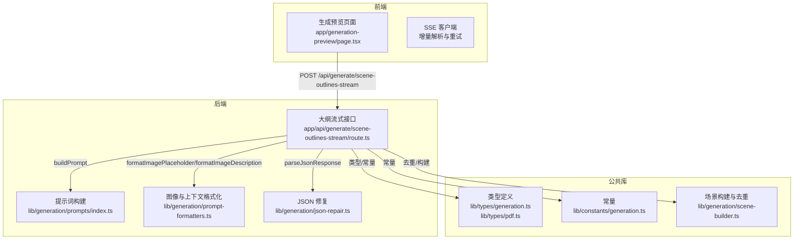
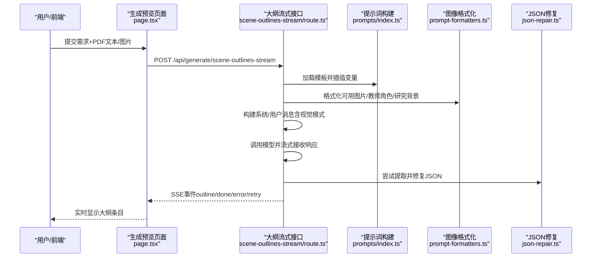
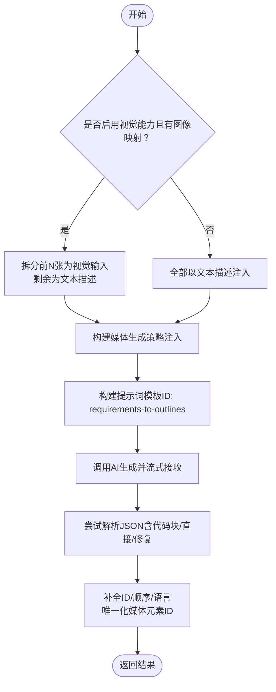
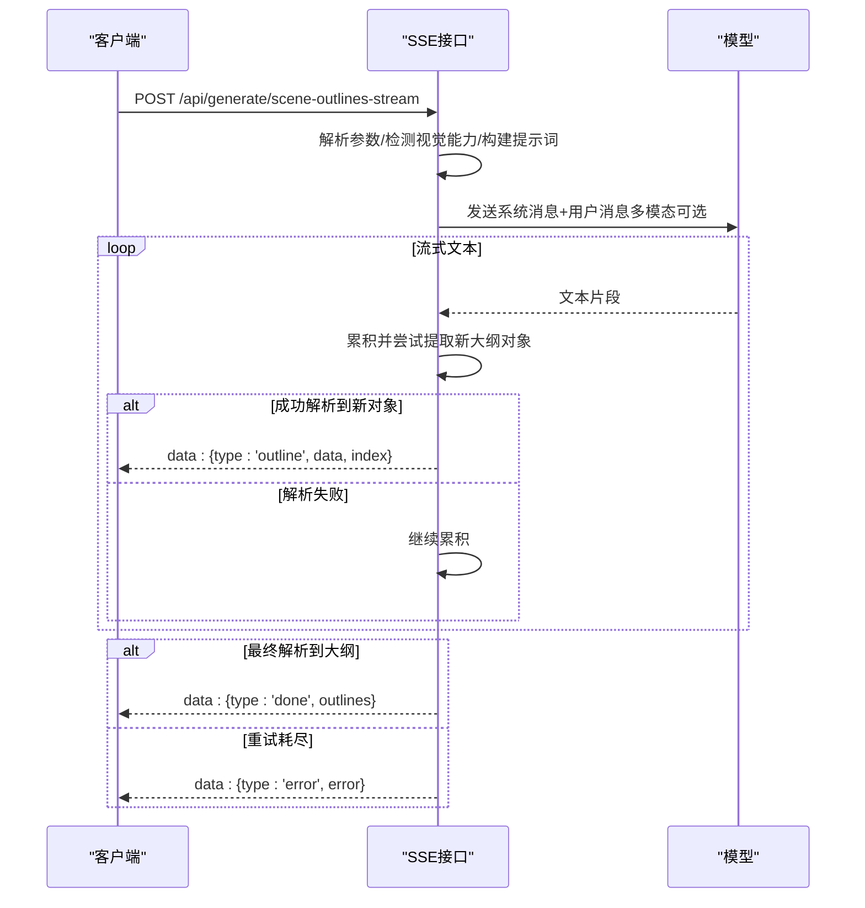
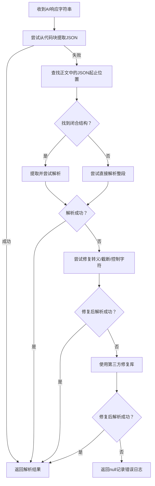
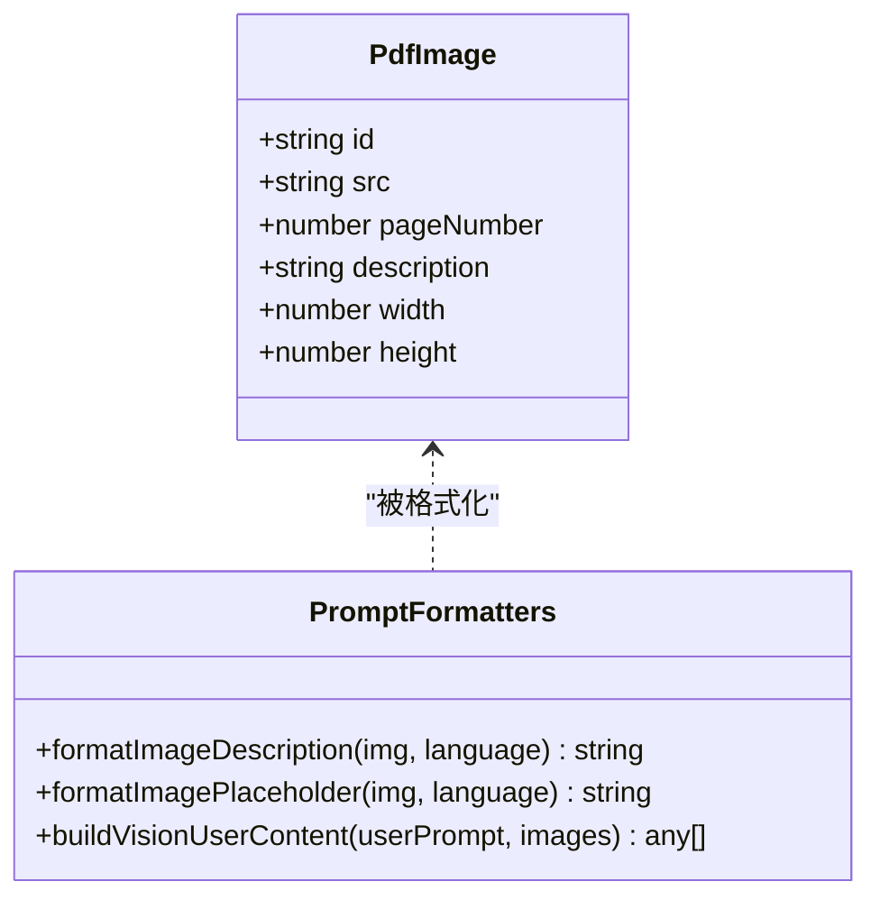
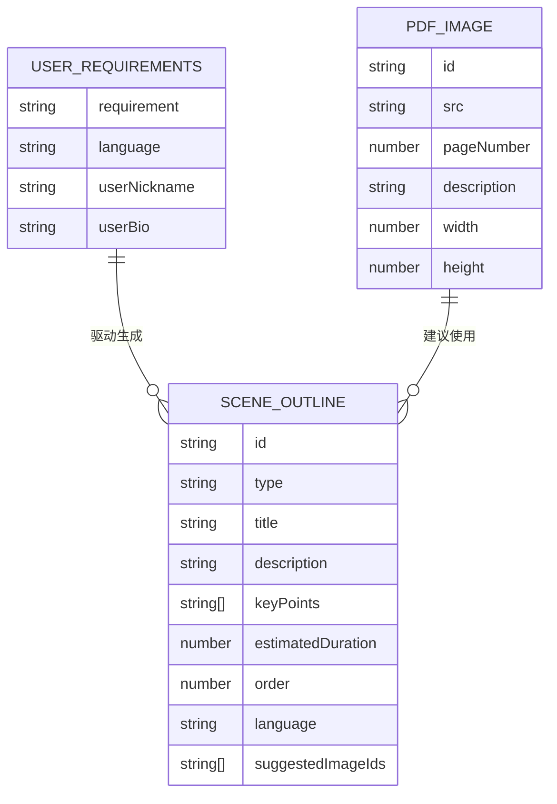
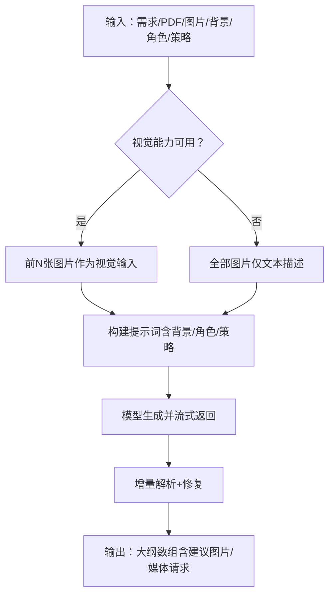

# 场景大纲生成

<cite>
**本文引用的文件**
- [app/api/generate/scene-outlines-stream/route.ts](file://app/api/generate/scene-outlines-stream/route.ts)
- [lib/generation/outline-generator.ts](file://lib/generation/outline-generator.ts)
- [lib/generation/json-repair.ts](file://lib/generation/json-repair.ts)
- [lib/generation/prompt-formatters.ts](file://lib/generation/prompt-formatters.ts)
- [lib/generation/scene-builder.ts](file://lib/generation/scene-builder.ts)
- [lib/generation/scene-generator.ts](file://lib/generation/scene-generator.ts)
- [lib/generation/prompts/index.ts](file://lib/generation/prompts/index.ts)
- [lib/types/generation.ts](file://lib/types/generation.ts)
- [lib/types/pdf.ts](file://lib/types/pdf.ts)
- [lib/constants/generation.ts](file://lib/constants/generation.ts)
- [app/generation-preview/page.tsx](file://app/generation-preview/page.tsx)
- [lib/generation/generation-pipeline.ts](file://lib/generation/generation-pipeline.ts)
</cite>

## 目录
1. [简介](#简介)
2. [项目结构](#项目结构)
3. [核心组件](#核心组件)
4. [架构总览](#架构总览)
5. [详细组件分析](#详细组件分析)
6. [依赖关系分析](#依赖关系分析)
7. [性能考量](#性能考量)
8. [故障排查指南](#故障排查指南)
9. [结论](#结论)
10. [附录](#附录)

## 简介
本文件聚焦 OpenMAIC 的“场景大纲生成”能力，系统性阐述从用户需求输入到可执行大纲输出的完整流程。内容覆盖以下方面：
- 输入处理：纯文本、PDF 文本与图片、多媒体素材映射
- 提示词构建策略：多模态注入、教师角色注入、媒体生成策略注入
- 大纲结构设计与内容组织：类型、关键点、时长估计、建议图片与媒体生成请求
- 使用示例：纯文本、PDF 文件、混合内容三类场景的处理流程
- 验证机制与错误恢复：JSON 修复、流式解析、重试与降级
- 性能优化与最佳实践：视觉模式、长度截断、唯一化媒体元素 ID

## 项目结构
大纲生成位于“生成管线”的第一阶段，采用前后端协同的分层设计：
- 前端通过 SSE 流接收逐步产出的大纲条目，实时可视化
- 后端负责提示词构建、模型调用、增量 JSON 解析与重试
- 公共库提供类型定义、提示词模板加载、图像格式化、JSON 修复等工具

**图表来源**
- [app/generation-preview/page.tsx:460-659](file://app/generation-preview/page.tsx#L460-L659)
- [app/api/generate/scene-outlines-stream/route.ts:1-362](file://app/api/generate/scene-outlines-stream/route.ts#L1-L362)
- [lib/generation/prompts/index.ts:1-34](file://lib/generation/prompts/index.ts#L1-L34)
- [lib/generation/prompt-formatters.ts:1-142](file://lib/generation/prompt-formatters.ts#L1-L142)
- [lib/generation/json-repair.ts:1-185](file://lib/generation/json-repair.ts#L1-L185)
- [lib/types/generation.ts:1-229](file://lib/types/generation.ts#L1-L229)
- [lib/types/pdf.ts:1-76](file://lib/types/pdf.ts#L1-L76)
- [lib/constants/generation.ts:1-11](file://lib/constants/generation.ts#L1-L11)
- [lib/generation/scene-builder.ts:1-224](file://lib/generation/scene-builder.ts#L1-L224)

**章节来源**
- [app/generation-preview/page.tsx:460-659](file://app/generation-preview/page.tsx#L460-L659)
- [app/api/generate/scene-outlines-stream/route.ts:1-362](file://app/api/generate/scene-outlines-stream/route.ts#L1-L362)

## 核心组件
- 大纲生成器（客户端/服务端通用）
  - 负责根据用户需求、PDF 文本与图片、研究背景、教师角色等构建提示词并调用模型，解析 JSON 输出，补全 ID、顺序与语言，并进行媒体元素 ID 唯一化
- 提示词系统
  - 模板加载与变量插值，支持片段组合与多语言
- 图像格式化与多模态用户内容
  - 将 PDF 图片描述注入文本或作为视觉输入；在视觉模式下拆分前 N 张图片作为实际图像，其余仅作为文本描述
- JSON 修复
  - 多策略解析 AI 输出，修复转义、截断、LaTeX 命令等常见问题
- 类型与常量
  - 统一的用户需求、场景大纲、PDF 图像、媒体生成请求等类型定义；限制 PDF 文本长度与视觉图片数量

**章节来源**
- [lib/generation/outline-generator.ts:26-157](file://lib/generation/outline-generator.ts#L26-L157)
- [lib/generation/prompts/index.ts:23-33](file://lib/generation/prompts/index.ts#L23-L33)
- [lib/generation/prompt-formatters.ts:74-141](file://lib/generation/prompt-formatters.ts#L74-L141)
- [lib/generation/json-repair.ts:9-95](file://lib/generation/json-repair.ts#L9-L95)
- [lib/types/generation.ts:65-129](file://lib/types/generation.ts#L65-L129)
- [lib/constants/generation.ts:6-11](file://lib/constants/generation.ts#L6-L11)

## 架构总览
从用户输入到可执行大纲的关键路径如下：

**图表来源**
- [app/generation-preview/page.tsx:469-544](file://app/generation-preview/page.tsx#L469-L544)
- [app/api/generate/scene-outlines-stream/route.ts:99-362](file://app/api/generate/scene-outlines-stream/route.ts#L99-L362)
- [lib/generation/prompts/index.ts:14-20](file://lib/generation/prompts/index.ts#L14-L20)
- [lib/generation/prompt-formatters.ts:74-141](file://lib/generation/prompt-formatters.ts#L74-L141)
- [lib/generation/json-repair.ts:9-95](file://lib/generation/json-repair.ts#L9-L95)

## 详细组件分析

### 组件A：大纲生成器（generateSceneOutlinesFromRequirements）
职责与流程要点：
- 输入：用户需求（文本+语言）、PDF 文本、PDF 图片、图像映射、AI 调用函数、回调、选项（视觉能力、媒体生成开关）
- 图像处理：在视觉模式下将前 N 张图片作为视觉输入，其余仅作为文本描述；否则全部以文本描述形式注入
- 教师角色注入：从代理信息中抽取教师人设，注入到提示词中
- 媒体生成策略：根据开关注入“禁止生成某类媒体”的强约束
- 提示词构建：使用模板 ID “requirements-to-outlines”，变量包括需求、语言、PDF 内容、可用图片、研究背景、教师角色、媒体策略
- 模型调用：传入系统消息、用户消息（或多模态内容），解析 JSON
- 后处理：补全 ID、顺序、语言；全局唯一化媒体元素 ID；进度回调

**图表来源**
- [lib/generation/outline-generator.ts:26-157](file://lib/generation/outline-generator.ts#L26-L157)
- [lib/generation/json-repair.ts:9-95](file://lib/generation/json-repair.ts#L9-L95)
- [lib/generation/scene-builder.ts:34-61](file://lib/generation/scene-builder.ts#L34-L61)

**章节来源**
- [lib/generation/outline-generator.ts:26-157](file://lib/generation/outline-generator.ts#L26-L157)

### 组件B：SSE 大纲流式接口（scene-outlines-stream）
职责与流程要点：
- 请求参数：需求、PDF 文本、PDF 图片、图像映射、研究背景、代理信息
- 视觉能力检测：依据模型能力决定是否使用多模态输入
- 图像处理：与客户端一致的拆分与描述策略
- 媒体策略注入：基于请求头控制图片/视频生成开关
- 提示词构建：同上
- 流式处理：逐字节累积，增量解析 JSON 数组，按条发送 outline 事件
- 心跳与重试：保持连接活跃，最多重试若干次；空结果或错误时发送 retry 或 error 事件
- 完成：解析完成后发送 done 事件并关闭流

**图表来源**
- [app/api/generate/scene-outlines-stream/route.ts:99-362](file://app/api/generate/scene-outlines-stream/route.ts#L99-L362)

**章节来源**
- [app/api/generate/scene-outlines-stream/route.ts:99-362](file://app/api/generate/scene-outlines-stream/route.ts#L99-L362)

### 组件C：JSON 修复与增量解析
- 增量解析：从流式响应中提取完整的顶层对象，避免一次性解析整个缓冲区
- 多策略解析：
  - 从代码块中提取 JSON
  - 在正文内定位首个 { 或 [ 并闭合匹配
  - 直接尝试解析整段响应
  - 修复转义（特别是 LaTeX 命令）、截断结构、控制字符，最后使用第三方修复库
- 返回类型安全：泛型返回，便于后续强类型消费

**图表来源**
- [lib/generation/json-repair.ts:9-185](file://lib/generation/json-repair.ts#L9-L185)

**章节来源**
- [lib/generation/json-repair.ts:9-185](file://lib/generation/json-repair.ts#L9-L185)

### 组件D：图像格式化与多模态用户内容
- 图像描述：包含 ID、页码、尺寸与宽高比、可选描述
- 图像占位符：仅包含 ID、页码、尺寸与宽高比，用于视觉模式下的标签
- 多模态内容：将文本与图像交错排列，确保模型能将标签与图像关联；剥离 data URI 前缀以便 SDK 接受

**图表来源**
- [lib/types/pdf.ts:9-58](file://lib/types/pdf.ts#L9-L58)
- [lib/generation/prompt-formatters.ts:74-141](file://lib/generation/prompt-formatters.ts#L74-L141)

**章节来源**
- [lib/generation/prompt-formatters.ts:74-141](file://lib/generation/prompt-formatters.ts#L74-L141)
- [lib/types/pdf.ts:9-58](file://lib/types/pdf.ts#L9-L58)

### 组件E：类型与常量
- 用户需求：统一的自由文本输入与语言字段，支持学生画像注入
- 场景大纲：类型、标题、描述、关键点、教学目标、时长估计、顺序、语言、建议图片、媒体生成请求、各类配置
- PDF 图像：ID、页码、描述、尺寸、存储引用
- 常量：PDF 文本最大字符数、视觉图片最大数量

**图表来源**
- [lib/types/generation.ts:65-129](file://lib/types/generation.ts#L65-L129)
- [lib/types/pdf.ts:9-58](file://lib/types/pdf.ts#L9-L58)

**章节来源**
- [lib/types/generation.ts:65-129](file://lib/types/generation.ts#L65-L129)
- [lib/types/pdf.ts:9-58](file://lib/types/pdf.ts#L9-L58)
- [lib/constants/generation.ts:6-11](file://lib/constants/generation.ts#L6-L11)

## 依赖关系分析
- 模块耦合
  - SSE 接口依赖提示词系统、图像格式化、JSON 修复、类型与常量
  - 大纲生成器同样依赖上述模块，但面向客户端/服务端复用
- 关键依赖链
  - 输入 → 图像格式化 → 提示词构建 → 模型调用 → JSON 修复 → 结果后处理
- 外部集成点
  - 模型 SDK（通过 AICallFn 抽象）
  - SSE 流（心跳与重试）

**图表来源**
- [app/api/generate/scene-outlines-stream/route.ts:119-187](file://app/api/generate/scene-outlines-stream/route.ts#L119-L187)
- [lib/generation/outline-generator.ts:39-108](file://lib/generation/outline-generator.ts#L39-L108)
- [lib/generation/json-repair.ts:9-95](file://lib/generation/json-repair.ts#L9-L95)
- [lib/generation/scene-builder.ts:34-61](file://lib/generation/scene-builder.ts#L34-L61)

**章节来源**
- [app/api/generate/scene-outlines-stream/route.ts:119-187](file://app/api/generate/scene-outlines-stream/route.ts#L119-L187)
- [lib/generation/outline-generator.ts:39-108](file://lib/generation/outline-generator.ts#L39-L108)

## 性能考量
- 视觉模式吞吐优化
  - 限制视觉图片数量，避免过长的多模态消息导致 Token 消耗过高
- 文本截断
  - 对 PDF 文本进行长度截断，平衡上下文与成本
- 增量解析
  - 流式累积与增量提取，减少内存峰值
- 重试与心跳
  - 在长耗时生成中维持连接活性，降低超时中断概率
- 媒体生成策略
  - 显式禁用不需要的媒体生成，减少后续阶段的额外开销

**章节来源**
- [lib/constants/generation.ts:6-11](file://lib/constants/generation.ts#L6-L11)
- [app/api/generate/scene-outlines-stream/route.ts:197-315](file://app/api/generate/scene-outlines-stream/route.ts#L197-L315)

## 故障排查指南
- 空响应或无法解析
  - 检查提示词构建是否正确注入 PDF 文本与图片描述
  - 确认模型输出是否被包裹在代码块中，或存在截断/转义问题
  - 查看 JSON 修复日志，确认修复策略是否生效
- SSE 连接中断
  - 确认心跳机制是否正常；检查网络稳定性与代理设置
  - 若出现多次 retry，考虑降低输入复杂度或提升模型能力
- 媒体生成未生效
  - 检查请求头中媒体生成开关是否开启
  - 确认大纲中 mediaGenerations 字段是否被唯一化替换
- 类型降级
  - 当缺少交互或 PBL 配置时，自动回退为 slide 类型，确保可执行性

**章节来源**
- [lib/generation/json-repair.ts:9-95](file://lib/generation/json-repair.ts#L9-L95)
- [app/api/generate/scene-outlines-stream/route.ts:286-336](file://app/api/generate/scene-outlines-stream/route.ts#L286-L336)
- [lib/generation/outline-generator.ts:164-181](file://lib/generation/outline-generator.ts#L164-L181)

## 结论
OpenMAIC 的场景大纲生成以“提示词 + 多模态 + 增量解析 + 修复策略”为核心，兼顾了灵活性与鲁棒性。通过严格的输入裁剪、图像格式化与媒体策略注入，以及完善的错误恢复与可视化反馈，能够在多样输入场景下稳定产出可执行的大纲。建议在生产环境中结合业务需求合理设置媒体生成策略与视觉图片数量上限，以获得更优的成本与质量平衡。

## 附录

### 使用示例与处理流程

- 纯文本输入
  - 输入：用户需求文本 + 语言
  - 处理：构建提示词，调用模型，解析 JSON，补全 ID/顺序/语言，唯一化媒体元素 ID
  - 输出：场景大纲数组

- PDF 文件输入
  - 输入：PDF 文本（截断）、PDF 图片（带描述/尺寸/页码）、图像映射
  - 处理：在视觉模式下优先将前 N 张图片作为视觉输入，其余以文本描述注入；若无视觉能力则全部文本描述
  - 输出：包含建议图片与媒体生成请求的大纲

- 混合内容输入
  - 输入：PDF 文本/图片 + 研究背景 + 教师角色 + 媒体生成策略
  - 处理：将教师人设注入提示词；根据策略限制大纲中的媒体生成类型
  - 输出：适配教学风格与资源策略的大纲

**图表来源**
- [app/api/generate/scene-outlines-stream/route.ts:119-187](file://app/api/generate/scene-outlines-stream/route.ts#L119-L187)
- [lib/generation/outline-generator.ts:39-108](file://lib/generation/outline-generator.ts#L39-L108)

**章节来源**
- [app/api/generate/scene-outlines-stream/route.ts:119-187](file://app/api/generate/scene-outlines-stream/route.ts#L119-L187)
- [lib/generation/outline-generator.ts:39-108](file://lib/generation/outline-generator.ts#L39-L108)