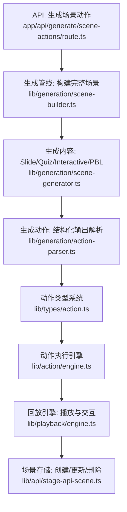
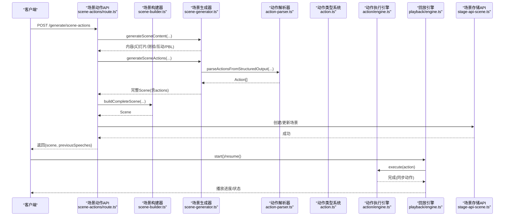
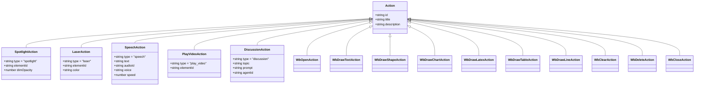
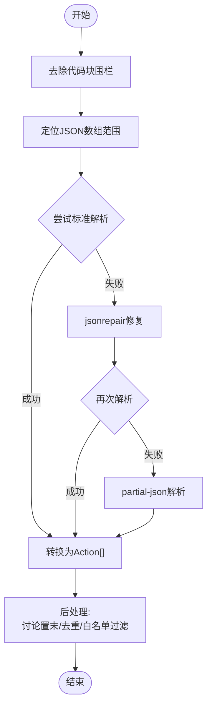
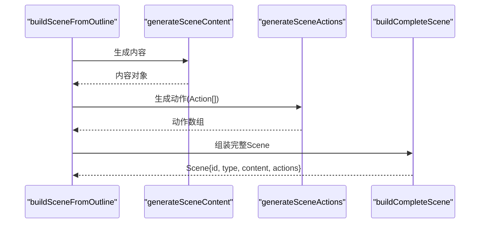
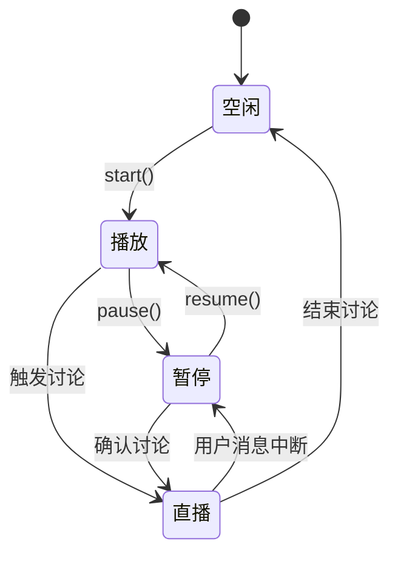
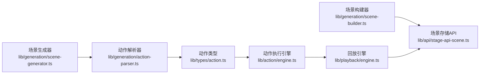

# 场景构建与动作生成

<cite>
**本文引用的文件**
- [app/api/generate/scene-actions/route.ts](file://app/api/generate/scene-actions/route.ts)
- [lib/generation/scene-builder.ts](file://lib/generation/scene-builder.ts)
- [lib/generation/scene-generator.ts](file://lib/generation/scene-generator.ts)
- [lib/generation/action-parser.ts](file://lib/generation/action-parser.ts)
- [lib/types/action.ts](file://lib/types/action.ts)
- [lib/types/stage.ts](file://lib/types/stage.ts)
- [lib/action/engine.ts](file://lib/action/engine.ts)
- [lib/playback/engine.ts](file://lib/playback/engine.ts)
- [lib/api/stage-api-scene.ts](file://lib/api/stage-api-scene.ts)
- [components/chat/use-chat-sessions.ts](file://components/chat/use-chat-sessions.ts)
- [lib/orchestration/director-graph.ts](file://lib/orchestration/director-graph.ts)
</cite>

## 目录
1. [简介](#简介)
2. [项目结构](#项目结构)
3. [核心组件](#核心组件)
4. [架构总览](#架构总览)
5. [详细组件分析](#详细组件分析)
6. [依赖关系分析](#依赖关系分析)
7. [性能考量](#性能考量)
8. [故障排查指南](#故障排查指南)
9. [结论](#结论)
10. [附录：自定义动作类型开发指南](#附录自定义动作类型开发指南)

## 简介
本章节聚焦 OpenMAIC 的“场景构建与动作生成”能力，系统阐述如何将结构化的课程大纲（SceneOutline）与生成的内容（Generated*Content）转化为可执行的课堂场景（Scene），并进一步形成动作序列（Action[]）。文档覆盖以下关键主题：
- 动作类型系统与分类（即时生效 vs 同步阻塞）
- 动作序列生成、时间轴安排与状态管理
- 执行顺序控制与依赖关系处理
- 从场景数据到可播放动作的转换流程
- 动作验证、冲突检测与回滚策略
- 自定义动作类型的扩展方法与最佳实践
- 性能优化建议与常见问题排查

## 项目结构
围绕场景构建与动作生成的关键模块如下：
- 生成管线（两阶段）：先生成内容，再生成动作；支持并行与串行两种模式
- 动作解析：将结构化输出解析为 Typed Action[]
- 动作执行：统一的 ActionEngine，支持即时效果与同步等待
- 回放引擎：PlaybackEngine 驱动动作按序执行，管理状态机与交互
- 类型系统：Action 联合类型与工具常量，确保类型安全与行为一致性

图表来源
- [app/api/generate/scene-actions/route.ts:1-159](file://app/api/generate/scene-actions/route.ts#L1-L159)
- [lib/generation/scene-builder.ts:67-117](file://lib/generation/scene-builder.ts#L67-L117)
- [lib/generation/scene-generator.ts:124-144](file://lib/generation/scene-generator.ts#L124-L144)
- [lib/generation/action-parser.ts:42-154](file://lib/generation/action-parser.ts#L42-L154)
- [lib/types/action.ts:165-205](file://lib/types/action.ts#L165-L205)
- [lib/action/engine.ts:80-125](file://lib/action/engine.ts#L80-L125)
- [lib/playback/engine.ts:369-523](file://lib/playback/engine.ts#L369-L523)
- [lib/api/stage-api-scene.ts:43-133](file://lib/api/stage-api-scene.ts#L43-L133)

章节来源
- [app/api/generate/scene-actions/route.ts:34-153](file://app/api/generate/scene-actions/route.ts#L34-L153)
- [lib/generation/scene-builder.ts:67-117](file://lib/generation/scene-builder.ts#L67-L117)
- [lib/generation/scene-generator.ts:50-116](file://lib/generation/scene-generator.ts#L50-L116)
- [lib/generation/action-parser.ts:42-154](file://lib/generation/action-parser.ts#L42-L154)
- [lib/types/action.ts:165-205](file://lib/types/action.ts#L165-L205)
- [lib/action/engine.ts:80-125](file://lib/action/engine.ts#L80-L125)
- [lib/playback/engine.ts:369-523](file://lib/playback/engine.ts#L369-L523)
- [lib/api/stage-api-scene.ts:43-133](file://lib/api/stage-api-scene.ts#L43-L133)

## 核心组件
- 场景构建器（Scene Builder）
  - 将 Outline 与内容合并为完整的 Scene 对象，负责全局媒体元素 ID 去重与场景组装
- 生成器（Scene Generator）
  - 分两步：生成内容（Slide/Quiz/Interactive/PBL），再生成动作（Action[]）
  - 支持并行生成多个场景
- 动作解析器（Action Parser）
  - 解析结构化 JSON 数组输出，修复不规范 JSON，过滤非法动作
- 动作类型系统（Action Types）
  - 定义所有动作类型及其参数，区分即时生效与同步阻塞两类
- 动作执行引擎（Action Engine）
  - 统一调度所有动作，处理白板、视频、语音等同步等待逻辑
- 回放引擎（Playback Engine）
  - 驱动动作序列执行，维护状态机（空闲/播放/暂停/直播），处理讨论触发与中断
- 场景存储 API（Stage API Scene）
  - 提供创建、更新、删除场景的接口，保证顺序与内容一致性

章节来源
- [lib/generation/scene-builder.ts:67-200](file://lib/generation/scene-builder.ts#L67-L200)
- [lib/generation/scene-generator.ts:50-144](file://lib/generation/scene-generator.ts#L50-L144)
- [lib/generation/action-parser.ts:42-154](file://lib/generation/action-parser.ts#L42-L154)
- [lib/types/action.ts:165-205](file://lib/types/action.ts#L165-L205)
- [lib/action/engine.ts:80-519](file://lib/action/engine.ts#L80-L519)
- [lib/playback/engine.ts:43-525](file://lib/playback/engine.ts#L43-L525)
- [lib/api/stage-api-scene.ts:43-133](file://lib/api/stage-api-scene.ts#L43-L133)

## 架构总览
下图展示了从请求到可播放场景的端到端流程，以及动作在执行与回放路径中的流转。

图表来源
- [app/api/generate/scene-actions/route.ts:34-153](file://app/api/generate/scene-actions/route.ts#L34-L153)
- [lib/generation/scene-builder.ts:122-131](file://lib/generation/scene-builder.ts#L122-L131)
- [lib/generation/scene-generator.ts:124-144](file://lib/generation/scene-generator.ts#L124-L144)
- [lib/generation/action-parser.ts:42-154](file://lib/generation/action-parser.ts#L42-L154)
- [lib/action/engine.ts:80-125](file://lib/action/engine.ts#L80-L125)
- [lib/playback/engine.ts:369-523](file://lib/playback/engine.ts#L369-L523)
- [lib/api/stage-api-scene.ts:43-75](file://lib/api/stage-api-scene.ts#L43-L75)

## 详细组件分析

### 动作类型系统与分类
- 即时生效动作（Fire-and-forget）
  - spotlight、laser：仅触发视觉效果，立即返回，后续自动清理
- 同步动作（Synchronous）
  - speech、play_video、wb_open/wb_draw_*、wb_clear/delete、wb_close、discussion：需等待完成后再继续下一个动作
- 工具常量
  - FIRE_AND_FORGET_ACTIONS、SYNC_ACTIONS、SLIDE_ONLY_ACTIONS：用于运行期筛选与校验

图表来源
- [lib/types/action.ts:22-205](file://lib/types/action.ts#L22-L205)

章节来源
- [lib/types/action.ts:22-205](file://lib/types/action.ts#L22-L205)

### 动作序列生成与解析
- 输入：结构化 JSON 数组（包含 text 与 action 条目）
- 处理：
  - 去除代码块围栏
  - 尝试标准 JSON 解析，失败则使用 jsonrepair 或 partial-json
  - 将 text 条目转为 speech 动作，action 条目映射为具体动作类型
  - 讨论动作必须位于末尾且最多一个
  - 非幻灯片场景剔除仅适用于幻灯片的动作
  - 白名单过滤：根据允许动作集合剔除越权动作
- 输出：保持原始交错顺序的 Action[]

图表来源
- [lib/generation/action-parser.ts:42-154](file://lib/generation/action-parser.ts#L42-L154)

章节来源
- [lib/generation/action-parser.ts:42-154](file://lib/generation/action-parser.ts#L42-L154)

### 场景构建与内容生成
- 两阶段生成：
  - 第一阶段：生成内容（Slide/Quiz/Interactive/PBL）
  - 第二阶段：基于内容与脚本生成动作
- 完整场景组装：
  - 为不同场景类型构造对应内容结构，并注入动作列表
  - 幻灯片场景：构建 Slide Canvas
  - 测验场景：注入题目集合
  - 互动场景：注入 HTML 或 URL
  - PBL 场景：注入项目配置
- 全局媒体 ID 去重：将顺序生成的 gen_img_N/gen_vid_N 替换为全局唯一 ID，避免跨课程污染

图表来源
- [lib/generation/scene-builder.ts:67-117](file://lib/generation/scene-builder.ts#L67-L117)
- [lib/generation/scene-builder.ts:122-200](file://lib/generation/scene-builder.ts#L122-L200)
- [lib/generation/scene-generator.ts:124-144](file://lib/generation/scene-generator.ts#L124-L144)

章节来源
- [lib/generation/scene-builder.ts:67-200](file://lib/generation/scene-builder.ts#L67-L200)
- [lib/generation/scene-generator.ts:124-144](file://lib/generation/scene-generator.ts#L124-L144)

### 动作执行与状态管理
- 即时生效动作（spotlight/laser）
  - 触发后由 ActionEngine 设置画布效果，随后自动清理
- 同步动作
  - speech：等待音频播放完成
  - play_video：等待视频播放完成或媒体任务失败跳过
  - wb_*：自动打开/关闭白板，等待渲染动画完成
- 回放引擎状态机
  - idle → playing → paused → live（讨论中）
  - 支持用户中断、讨论触发、断点续播、定时器恢复等复杂状态切换

图表来源
- [lib/playback/engine.ts:43-84](file://lib/playback/engine.ts#L43-L84)
- [lib/playback/engine.ts:369-523](file://lib/playback/engine.ts#L369-L523)

章节来源
- [lib/action/engine.ts:80-519](file://lib/action/engine.ts#L80-L519)
- [lib/playback/engine.ts:369-523](file://lib/playback/engine.ts#L369-L523)

### 执行顺序控制与依赖关系
- 同步动作之间严格串行：speech、play_video、wb_* 必须等待上一个完成
- 即时动作可并发：spotlight/laser 不阻塞后续动作
- 讨论动作特殊处理：
  - 仅在合适时机触发（默认延迟 3 秒）
  - 受用户选择的代理限制
  - 触发后进入直播态，结束后回到播放态
- 在线与离线路径共享同一套动作类型，确保一致性

章节来源
- [lib/types/action.ts:184-205](file://lib/types/action.ts#L184-L205)
- [lib/playback/engine.ts:464-498](file://lib/playback/engine.ts#L464-L498)
- [lib/action/engine.ts:80-125](file://lib/action/engine.ts#L80-L125)

### 动作验证、冲突检测与回滚策略
- 动作白名单过滤
  - 基于角色允许的动作集合进行二次过滤，防止越权动作
- 场景类型约束
  - 非幻灯片场景剔除仅适用于幻灯片的动作
- 讨论动作位置约束
  - 强制置于末尾，且最多一个
- 回放中断与恢复
  - 中断时保存播放位置，恢复后继续
  - TTS 读秒计时暂停/恢复
- 故障回退
  - 视频播放失败时跳过该动作
  - 解析失败时记录日志并返回空动作列表

章节来源
- [lib/generation/action-parser.ts:123-151](file://lib/generation/action-parser.ts#L123-L151)
- [lib/orchestration/director-graph.ts:350-381](file://lib/orchestration/director-graph.ts#L350-L381)
- [lib/action/engine.ts:180-228](file://lib/action/engine.ts#L180-L228)
- [lib/playback/engine.ts:134-222](file://lib/playback/engine.ts#L134-L222)

### 从场景数据到可播放动作的转换示例
- 请求入口：/generate/scene-actions 接收 outline、content、stageId 等参数
- 构建上下文：计算页码、总页数、历史演讲文本
- 生成动作：调用 generateSceneActions 并解析为 Action[]
- 组装场景：buildCompleteScene 生成完整 Scene
- 存储场景：通过 Stage API 创建/更新场景
- 回放播放：PlaybackEngine 消费 Scene.actions，按类型执行

章节来源
- [app/api/generate/scene-actions/route.ts:34-153](file://app/api/generate/scene-actions/route.ts#L34-L153)
- [lib/generation/scene-builder.ts:122-131](file://lib/generation/scene-builder.ts#L122-L131)
- [lib/api/stage-api-scene.ts:43-75](file://lib/api/stage-api-scene.ts#L43-L75)

## 依赖关系分析
- 类型依赖
  - Scene 依赖 Action 联合类型
  - ActionEngine 依赖 StageStore 与 CanvasStore
  - PlaybackEngine 依赖 ActionEngine 与 AudioPlayer
- 模块耦合
  - 生成器与解析器解耦，便于在线流式与离线批量两种路径复用
  - 执行引擎与回放引擎职责清晰，互不侵入
- 外部依赖
  - 媒体生成任务状态订阅（用于 play_video 等同步等待）
  - KaTeX 渲染 LaTeX 公式（白板公式绘制）

图表来源
- [lib/types/action.ts:165-205](file://lib/types/action.ts#L165-L205)
- [lib/action/engine.ts:80-125](file://lib/action/engine.ts#L80-L125)
- [lib/playback/engine.ts:369-523](file://lib/playback/engine.ts#L369-L523)
- [lib/generation/scene-builder.ts:122-131](file://lib/generation/scene-builder.ts#L122-L131)
- [lib/generation/scene-generator.ts:124-144](file://lib/generation/scene-generator.ts#L124-L144)
- [lib/generation/action-parser.ts:42-154](file://lib/generation/action-parser.ts#L42-L154)
- [lib/api/stage-api-scene.ts:43-75](file://lib/api/stage-api-scene.ts#L43-L75)

章节来源
- [lib/types/action.ts:165-205](file://lib/types/action.ts#L165-L205)
- [lib/action/engine.ts:80-125](file://lib/action/engine.ts#L80-L125)
- [lib/playback/engine.ts:369-523](file://lib/playback/engine.ts#L369-L523)
- [lib/generation/scene-builder.ts:122-131](file://lib/generation/scene-builder.ts#L122-L131)
- [lib/generation/scene-generator.ts:124-144](file://lib/generation/scene-generator.ts#L124-L144)
- [lib/generation/action-parser.ts:42-154](file://lib/generation/action-parser.ts#L42-L154)
- [lib/api/stage-api-scene.ts:43-75](file://lib/api/stage-api-scene.ts#L43-L75)

## 性能考量
- 并行生成：多场景并行处理，显著缩短总生成时间
- 延迟与动画：白板与视频操作等待动画完成，避免 UI 抖动与状态错乱
- 计时与恢复：TTS 读秒计时在暂停时保存剩余时间，恢复时继续，提升体验
- 媒体任务订阅：play_video 等动作等待媒体任务完成，失败时快速跳过
- ID 去重：全局唯一媒体 ID 避免缓存污染，减少回溯成本

## 故障排查指南
- 动作解析失败
  - 现象：返回空动作列表或日志警告
  - 排查：确认输出是否包含 JSON 数组、是否被代码块围栏包裹、是否存在未转义字符
  - 参考：[lib/generation/action-parser.ts:61-81](file://lib/generation/action-parser.ts#L61-L81)
- 讨论动作未触发
  - 现象：无 ProactiveCard 出现
  - 排查：检查是否已消费、代理是否被用户选中、是否处于非播放态
  - 参考：[lib/playback/engine.ts:464-498](file://lib/playback/engine.ts#L464-L498)
- 视频无法播放
  - 现象：动作卡住或直接跳过
  - 排查：媒体任务状态是否失败；元素 ID 是否正确映射到占位符
  - 参考：[lib/action/engine.ts:180-228](file://lib/action/engine.ts#L180-L228)
- 代理越权动作
  - 现象：动作被过滤
  - 排查：检查 allowedActions 白名单与角色权限
  - 参考：[lib/orchestration/director-graph.ts:350-381](file://lib/orchestration/director-graph.ts#L350-L381)
- 在线动作执行
  - 现象：聊天中动作未生效
  - 排查：确认 ActionEngine 是否正确实例化并执行
  - 参考：[components/chat/use-chat-sessions.ts:258-269](file://components/chat/use-chat-sessions.ts#L258-L269)

章节来源
- [lib/generation/action-parser.ts:61-81](file://lib/generation/action-parser.ts#L61-L81)
- [lib/playback/engine.ts:464-498](file://lib/playback/engine.ts#L464-L498)
- [lib/action/engine.ts:180-228](file://lib/action/engine.ts#L180-L228)
- [lib/orchestration/director-graph.ts:350-381](file://lib/orchestration/director-graph.ts#L350-L381)
- [components/chat/use-chat-sessions.ts:258-269](file://components/chat/use-chat-sessions.ts#L258-L269)

## 结论
OpenMAIC 的场景构建与动作生成以“类型安全 + 统一执行层 + 状态机驱动”的方式实现了从结构化内容到可播放课堂场景的高效转换。通过严格的动作分类、白名单过滤与回放状态机，系统在保证一致性的同时提供了良好的交互体验与可扩展性。

## 附录：自定义动作类型开发指南
- 新增动作类型
  - 在动作类型定义中添加新接口与联合类型成员
  - 在工具常量中补充分类（如是否同步、是否仅幻灯片）
  - 参考：[lib/types/action.ts:165-205](file://lib/types/action.ts#L165-L205)
- 实现执行逻辑
  - 在 ActionEngine 中新增分支并实现执行函数（同步/异步）
  - 若涉及 UI 效果，确保自动清理或提供清理接口
  - 参考：[lib/action/engine.ts:86-125](file://lib/action/engine.ts#L86-L125)
- 回放集成
  - 在 PlaybackEngine 的 processNext 中添加分支处理
  - 如为同步动作，确保等待完成后再继续
  - 参考：[lib/playback/engine.ts:398-522](file://lib/playback/engine.ts#L398-L522)
- 解析与过滤
  - 更新解析器对新动作的支持（名称映射、参数透传）
  - 如需白名单控制，在解析后进行过滤
  - 参考：[lib/generation/action-parser.ts:104-121](file://lib/generation/action-parser.ts#L104-L121)
- 在线路径联动
  - 确保聊天中触发的动作可通过 ActionEngine 执行
  - 参考：[components/chat/use-chat-sessions.ts:258-269](file://components/chat/use-chat-sessions.ts#L258-L269)
- 最佳实践
  - 保持动作幂等与可回退
  - 明确动作间依赖与顺序约束
  - 为同步动作提供超时与错误处理
  - 为即时动作提供自动清理与最小化副作用

章节来源
- [lib/types/action.ts:165-205](file://lib/types/action.ts#L165-L205)
- [lib/action/engine.ts:86-125](file://lib/action/engine.ts#L86-L125)
- [lib/playback/engine.ts:398-522](file://lib/playback/engine.ts#L398-L522)
- [lib/generation/action-parser.ts:104-121](file://lib/generation/action-parser.ts#L104-L121)
- [components/chat/use-chat-sessions.ts:258-269](file://components/chat/use-chat-sessions.ts#L258-L269)