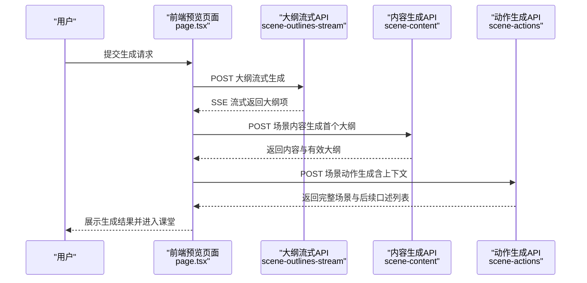
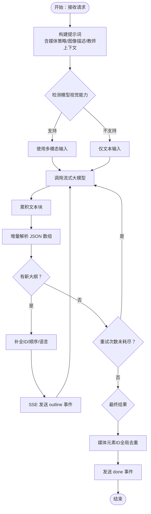
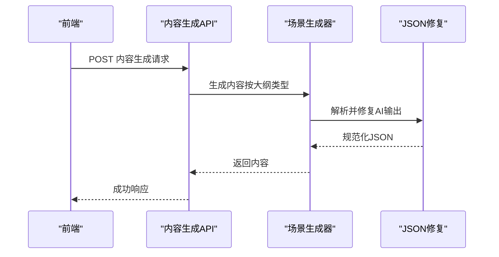
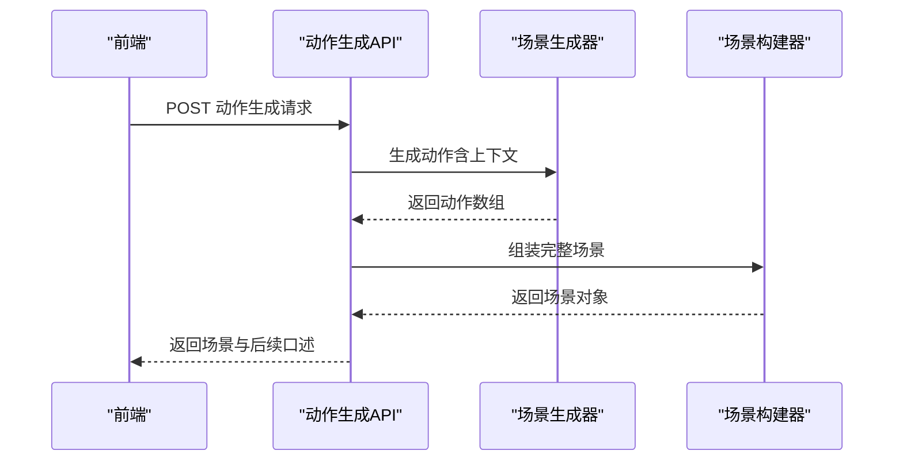
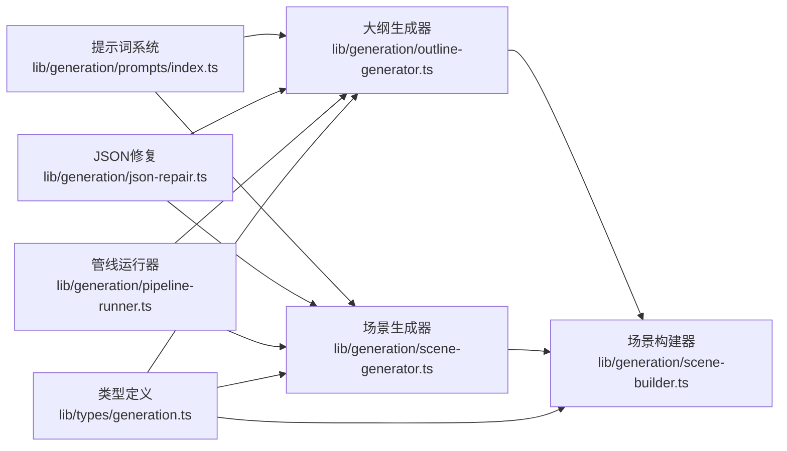

# 课程生成系统

<cite>
**本文档引用的文件**
- [app/api/generate/scene-outlines-stream/route.ts](file://app/api/generate/scene-outlines-stream/route.ts)
- [app/api/generate/scene-content/route.ts](file://app/api/generate/scene-content/route.ts)
- [app/api/generate/scene-actions/route.ts](file://app/api/generate/scene-actions/route.ts)
- [lib/generation/prompts/index.ts](file://lib/generation/prompts/index.ts)
- [lib/generation/generation-pipeline.ts](file://lib/generation/generation-pipeline.ts)
- [lib/types/generation.ts](file://lib/types/generation.ts)
- [lib/generation/outline-generator.ts](file://lib/generation/outline-generator.ts)
- [lib/generation/scene-generator.ts](file://lib/generation/scene-generator.ts)
- [lib/generation/scene-builder.ts](file://lib/generation/scene-builder.ts)
- [lib/generation/json-repair.ts](file://lib/generation/json-repair.ts)
- [lib/generation/pipeline-runner.ts](file://lib/generation/pipeline-runner.ts)
- [components/generation/outlines-editor.tsx](file://components/generation/outlines-editor.tsx)
- [components/generation/generating-progress.tsx](file://components/generation/generating-progress.tsx)
- [app/generation-preview/page.tsx](file://app/generation-preview/page.tsx)
</cite>

## 目录
1. [引言](#引言)
2. [项目结构](#项目结构)
3. [核心组件](#核心组件)
4. [架构总览](#架构总览)
5. [详细组件分析](#详细组件分析)
6. [依赖关系分析](#依赖关系分析)
7. [性能考虑](#性能考虑)
8. [故障排除指南](#故障排除指南)
9. [结论](#结论)
10. [附录](#附录)

## 引言
本文件面向 OpenMAIC 的课程生成系统，聚焦两阶段生成管道的设计与实现：第一阶段由用户输入与文档内容生成结构化课程大纲；第二阶段将大纲项转换为完整的课堂场景内容与动作。文档深入解释提示词构建、内容解析、动作生成等核心流程，并提供从用户输入到完整课程输出的使用示例，同时阐述质量控制机制、错误处理策略与性能优化方案。

## 项目结构
课程生成系统采用前后端分离的 API 设计，前端通过预览页面驱动生成流程，后端以独立的 API 路由实现两阶段生成。类型定义集中于统一的生成类型模块，提示词管理通过提示词系统模块化组织，生成管线在专用模块中编排。

```mermaid
graph TB
subgraph "前端"
Preview["生成预览页面<br/>app/generation-preview/page.tsx"]
Editor["大纲编辑器<br/>components/generation/outlines-editor.tsx"]
Progress["进度显示<br/>components/generation/generating-progress.tsx"]
end
subgraph "后端 API"
OutlinesAPI["大纲流式生成 API<br/>app/api/generate/scene-outlines-stream/route.ts"]
ContentAPI["场景内容生成 API<br/>app/api/generate/scene-content/route.ts"]
ActionsAPI["场景动作生成 API<br/>app/api/generate/scene-actions/route.ts"]
end
subgraph "生成引擎"
Prompts["提示词系统<br/>lib/generation/prompts/index.ts"]
Pipeline["生成管线入口<br/>lib/generation/generation-pipeline.ts"]
Types["生成类型定义<br/>lib/types/generation.ts"]
OutlineGen["大纲生成器<br/>lib/generation/outline-generator.ts"]
SceneGen["场景生成器<br/>lib/generation/scene-generator.ts"]
SceneBuilder["场景构建器<br/>lib/generation/scene-builder.ts"]
JsonRepair["JSON 修复工具<br/>lib/generation/json-repair.ts"]
Runner["管线运行器<br/>lib/generation/pipeline-runner.ts"]
end
Preview --> OutlinesAPI
Preview --> ContentAPI
Preview --> ActionsAPI
Preview --> Editor
Preview --> Progress
OutlinesAPI --> Prompts
OutlinesAPI --> OutlineGen
OutlinesAPI --> JsonRepair
OutlinesAPI --> SceneBuilder
ContentAPI --> Prompts
ContentAPI --> SceneGen
ContentAPI --> JsonRepair
ContentAPI --> SceneBuilder
ActionsAPI --> Prompts
ActionsAPI --> SceneGen
ActionsAPI --> SceneBuilder
Pipeline --> OutlineGen
Pipeline --> SceneGen
Pipeline --> Runner
```

**图表来源**
- [app/generation-preview/page.tsx:1-800](file://app/generation-preview/page.tsx#L1-L800)
- [app/api/generate/scene-outlines-stream/route.ts:1-362](file://app/api/generate/scene-outlines-stream/route.ts#L1-L362)
- [app/api/generate/scene-content/route.ts:1-168](file://app/api/generate/scene-content/route.ts#L1-L168)
- [app/api/generate/scene-actions/route.ts:1-159](file://app/api/generate/scene-actions/route.ts#L1-L159)
- [lib/generation/prompts/index.ts:1-34](file://lib/generation/prompts/index.ts#L1-L34)
- [lib/generation/generation-pipeline.ts:1-51](file://lib/generation/generation-pipeline.ts#L1-L51)
- [lib/generation/outline-generator.ts:1-182](file://lib/generation/outline-generator.ts#L1-L182)
- [lib/generation/scene-generator.ts:1-800](file://lib/generation/scene-generator.ts#L1-L800)
- [lib/generation/scene-builder.ts:1-224](file://lib/generation/scene-builder.ts#L1-L224)
- [lib/generation/json-repair.ts:1-185](file://lib/generation/json-repair.ts#L1-L185)
- [lib/generation/pipeline-runner.ts:1-92](file://lib/generation/pipeline-runner.ts#L1-L92)

**章节来源**
- [app/generation-preview/page.tsx:1-800](file://app/generation-preview/page.tsx#L1-L800)
- [lib/types/generation.ts:1-229](file://lib/types/generation.ts#L1-L229)

## 核心组件
- 两阶段生成管道
  - 阶段一：大纲生成（Outlines）
  - 阶段二：场景内容与动作生成（Content + Actions）
- 提示词系统：基于模板与变量插值，支持片段组合与占位符替换
- 类型系统：统一定义 PDF 图像、用户需求、大纲、生成内容与场景对象
- JSON 修复工具：针对 AI 输出的常见 JSON 不规范问题进行修复与解析
- 场景构建器：将大纲与内容组装为完整的场景对象
- 前端集成：预览页面负责步骤编排、流式接收与状态展示

**章节来源**
- [lib/generation/prompts/index.ts:1-34](file://lib/generation/prompts/index.ts#L1-L34)
- [lib/types/generation.ts:1-229](file://lib/types/generation.ts#L1-L229)
- [lib/generation/json-repair.ts:1-185](file://lib/generation/json-repair.ts#L1-L185)
- [lib/generation/scene-builder.ts:1-224](file://lib/generation/scene-builder.ts#L1-L224)

## 架构总览
两阶段生成管道的核心流程如下：

**图表来源**
- [app/generation-preview/page.tsx:460-735](file://app/generation-preview/page.tsx#L460-L735)
- [app/api/generate/scene-outlines-stream/route.ts:99-361](file://app/api/generate/scene-outlines-stream/route.ts#L99-L361)
- [app/api/generate/scene-content/route.ts:26-167](file://app/api/generate/scene-content/route.ts#L26-L167)
- [app/api/generate/scene-actions/route.ts:34-158](file://app/api/generate/scene-actions/route.ts#L34-L158)

## 详细组件分析

### 大纲生成阶段（Outlines）
- 输入：用户需求文本、语言、PDF 文本与图像、研究上下文、教师角色信息
- 关键流程：
  - 构建提示词（包含媒体生成策略、可用图像描述、教师上下文）
  - 可视能力检测：根据模型能力决定是否使用多模态输入
  - 流式响应解析：增量提取 JSON 数组中的大纲对象
  - 去重与唯一化：将顺序占位媒体 ID 替换为全局唯一 ID
  - 重试机制：空响应或解析失败时自动重试
- 输出：结构化大纲数组（含 ID、顺序、类型、关键要点等）

**图表来源**
- [app/api/generate/scene-outlines-stream/route.ts:175-325](file://app/api/generate/scene-outlines-stream/route.ts#L175-L325)
- [lib/generation/outline-generator.ts:96-156](file://lib/generation/outline-generator.ts#L96-L156)
- [lib/generation/scene-builder.ts:34-61](file://lib/generation/scene-builder.ts#L34-L61)

**章节来源**
- [app/api/generate/scene-outlines-stream/route.ts:99-361](file://app/api/generate/scene-outlines-stream/route.ts#L99-L361)
- [lib/generation/outline-generator.ts:26-157](file://lib/generation/outline-generator.ts#L26-L157)
- [lib/generation/scene-builder.ts:34-61](file://lib/generation/scene-builder.ts#L34-L61)

### 场景内容生成阶段（Content）
- 输入：单个大纲、所有大纲、PDF 图像与映射、舞台信息、教师角色
- 关键流程：
  - 应用大纲回退逻辑（如缺少配置则降级为幻灯片）
  - 过滤分配给该大纲的图像
  - 根据模型能力选择文本或多模态输入
  - 按大纲类型生成对应内容（幻灯片/测验/互动/PBL）
  - 幻灯片内容：元素默认值修复、LaTeX 渲染、图像 ID 解析
- 输出：对应类型的内容对象（幻灯片元素、测验题目等）

**图表来源**
- [app/api/generate/scene-content/route.ts:114-148](file://app/api/generate/scene-content/route.ts#L114-L148)
- [lib/generation/scene-generator.ts:149-202](file://lib/generation/scene-generator.ts#L149-L202)
- [lib/generation/json-repair.ts:9-95](file://lib/generation/json-repair.ts#L9-L95)

**章节来源**
- [app/api/generate/scene-content/route.ts:26-167](file://app/api/generate/scene-content/route.ts#L26-L167)
- [lib/generation/scene-generator.ts:149-202](file://lib/generation/scene-generator.ts#L149-L202)
- [lib/generation/json-repair.ts:9-95](file://lib/generation/json-repair.ts#L9-L95)

### 场景动作生成阶段（Actions）
- 输入：大纲、所有大纲、内容、舞台 ID、教师角色、先前口述列表、用户画像
- 关键流程：
  - 构建跨场景上下文（页码、总页数、标题序列、先前口述）
  - 生成动作列表（如语音、切换、标注等）
  - 组装完整场景对象（包含内容与动作）
  - 提取本次场景的口述用于后续场景连贯性
- 输出：完整场景对象与后续口述列表

**图表来源**
- [app/api/generate/scene-actions/route.ts:118-136](file://app/api/generate/scene-actions/route.ts#L118-L136)
- [lib/generation/scene-generator.ts:137-143](file://lib/generation/scene-generator.ts#L137-L143)
- [lib/generation/scene-builder.ts:122-131](file://lib/generation/scene-builder.ts#L122-L131)

**章节来源**
- [app/api/generate/scene-actions/route.ts:34-158](file://app/api/generate/scene-actions/route.ts#L34-L158)
- [lib/generation/scene-builder.ts:122-131](file://lib/generation/scene-builder.ts#L122-L131)

### 提示词构建与管理
- 提示词 ID 定义：大纲生成、幻灯片内容、测验内容、动作生成等
- 变量插值：将用户需求、PDF 内容、可用图像、媒体策略、教师上下文注入模板
- 片段组合：支持模板片段拼接与变量替换，便于维护与复用

**章节来源**
- [lib/generation/prompts/index.ts:23-33](file://lib/generation/prompts/index.ts#L23-L33)

### JSON 解析与修复
- 多策略解析：优先提取代码块中的 JSON，其次查找响应体内的结构，最后尝试整段解析
- 常见修复：转义字符修正、截断结构闭合、jsonrepair 工具修复、控制字符清理
- 日志记录：对解析失败与修复过程进行日志追踪

**章节来源**
- [lib/generation/json-repair.ts:9-185](file://lib/generation/json-repair.ts#L9-L185)

### 媒体元素 ID 去重与解析
- 全局去重：将顺序占位媒体 ID（如 gen_img_1）替换为全局唯一 ID，避免跨课程冲突
- 图像解析：区分 PDF 提取图像 ID 与 AI 生成媒体占位 ID，分别解析为实际 URL 或保留占位

**章节来源**
- [lib/generation/scene-builder.ts:34-61](file://lib/generation/scene-builder.ts#L34-L61)
- [lib/generation/scene-generator.ts:245-301](file://lib/generation/scene-generator.ts#L245-L301)

### 前端集成与工作流
- 预览页面：负责 PDF 解析、网络搜索、代理头设置、步骤编排与流式接收
- 大纲编辑器：允许用户手动编辑大纲、调整顺序与类型
- 进度显示：两里程碑状态（大纲就绪、首页就绪）与错误提示

**章节来源**
- [app/generation-preview/page.tsx:130-735](file://app/generation-preview/page.tsx#L130-L735)
- [components/generation/outlines-editor.tsx:1-291](file://components/generation/outlines-editor.tsx#L1-L291)
- [components/generation/generating-progress.tsx:1-141](file://components/generation/generating-progress.tsx#L1-L141)

## 依赖关系分析

**图表来源**
- [lib/types/generation.ts:1-229](file://lib/types/generation.ts#L1-L229)
- [lib/generation/prompts/index.ts:1-34](file://lib/generation/prompts/index.ts#L1-L34)
- [lib/generation/json-repair.ts:1-185](file://lib/generation/json-repair.ts#L1-L185)
- [lib/generation/outline-generator.ts:1-182](file://lib/generation/outline-generator.ts#L1-L182)
- [lib/generation/scene-generator.ts:1-800](file://lib/generation/scene-generator.ts#L1-L800)
- [lib/generation/scene-builder.ts:1-224](file://lib/generation/scene-builder.ts#L1-L224)
- [lib/generation/pipeline-runner.ts:1-92](file://lib/generation/pipeline-runner.ts#L1-L92)

**章节来源**
- [lib/generation/generation-pipeline.ts:1-51](file://lib/generation/generation-pipeline.ts#L1-L51)

## 性能考虑
- 流式传输：大纲生成采用 Server-Sent Events，边生成边返回，降低首屏等待时间
- 心跳保活：定期发送心跳事件，避免连接超时
- 重试机制：空响应或解析失败时自动重试，提升稳定性
- 并行生成：场景内容与动作生成在前端可并行推进，提高吞吐
- 图像处理：限制视觉图像数量与 PDF 文本长度，避免上下文过长导致性能下降
- 前端骨架屏：媒体占位 ID 保留为占位，前端渲染骨架图，提升用户体验

[本节为通用指导，无需具体文件分析]

## 故障排除指南
- 大纲为空或解析失败
  - 现象：SSE 返回空或报错
  - 排查：检查提示词构建、模型能力、图像映射与媒体策略
  - 重试：接口内置最多两次重试
- 内容生成失败
  - 现象：返回内容为空或解析失败
  - 排查：确认大纲类型与配置、图像映射、模型能力
  - 修复：依赖 JSON 修复工具与规范化流程
- 动作生成失败
  - 现象：无法组装完整场景
  - 排查：检查上下文构建（页码、标题序列、先前口述）、教师角色与用户画像
- 前端异常中断
  - 现象：导航离开或网络中断
  - 处理：前端使用 AbortController 中断请求，避免悬挂

**章节来源**
- [app/api/generate/scene-outlines-stream/route.ts:286-336](file://app/api/generate/scene-outlines-stream/route.ts#L286-L336)
- [app/api/generate/scene-content/route.ts:150-158](file://app/api/generate/scene-content/route.ts#L150-L158)
- [app/api/generate/scene-actions/route.ts:138-142](file://app/api/generate/scene-actions/route.ts#L138-L142)
- [app/generation-preview/page.tsx:727-735](file://app/generation-preview/page.tsx#L727-L735)

## 结论
OpenMAIC 的课程生成系统通过两阶段管道实现了从用户需求到完整课堂场景的自动化生产。系统以类型安全为核心，结合提示词模板化、JSON 修复与媒体 ID 去重等质量控制机制，确保输出稳定可靠。前端通过流式接收与占位渲染优化用户体验，后端通过重试与心跳保障生成稳定性。整体设计兼顾可扩展性与易维护性，适合在多模型与多模态场景下持续演进。

[本节为总结性内容，无需具体文件分析]

## 附录

### 使用示例：从需求到课程输出
- 步骤 1：提交用户需求与可选 PDF/图像
- 步骤 2：SSE 流式接收大纲项，逐步完善
- 步骤 3：生成首个场景内容与动作，进行 TTS 合成
- 步骤 4：将剩余大纲作为占位继续生成，进入课堂播放

**章节来源**
- [app/generation-preview/page.tsx:460-735](file://app/generation-preview/page.tsx#L460-L735)