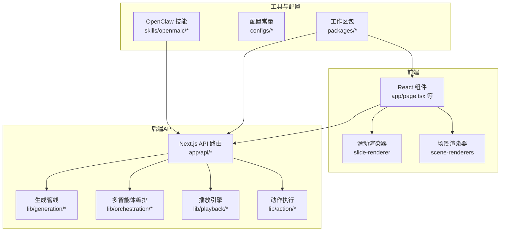
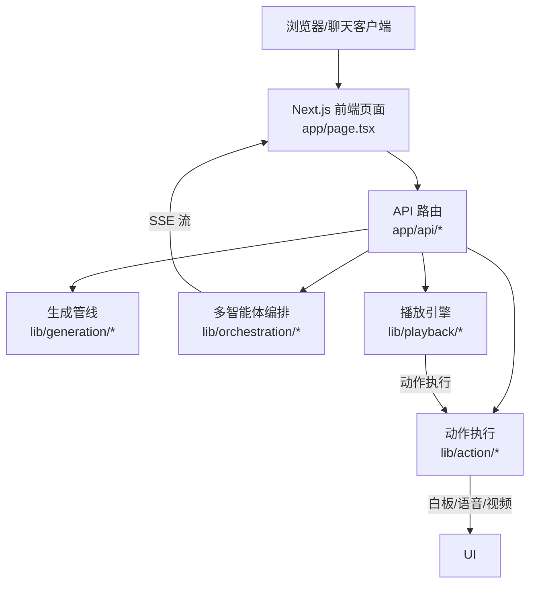
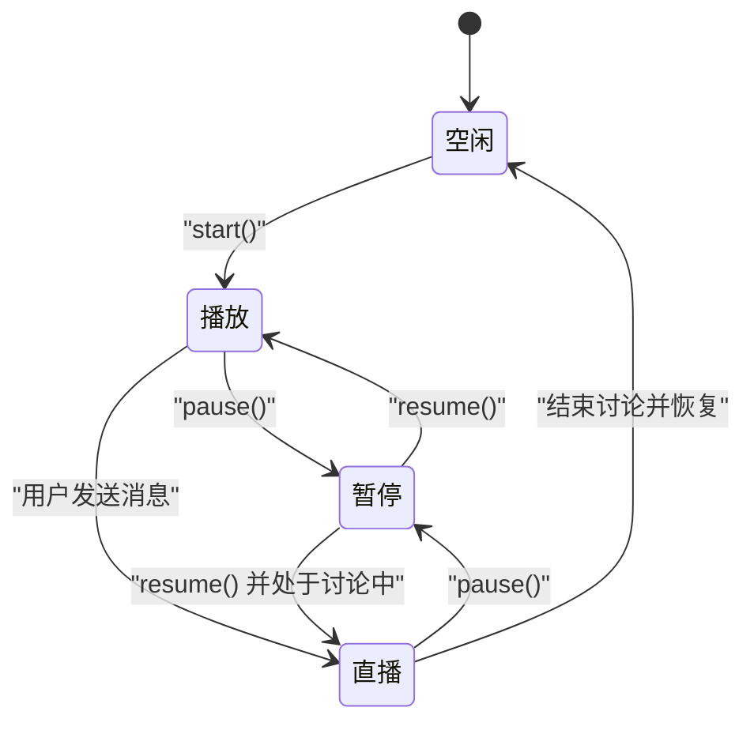
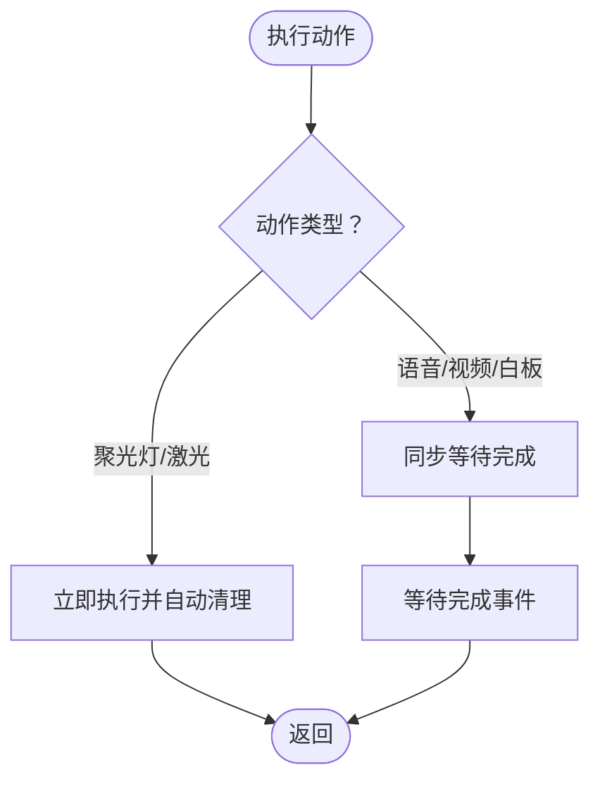
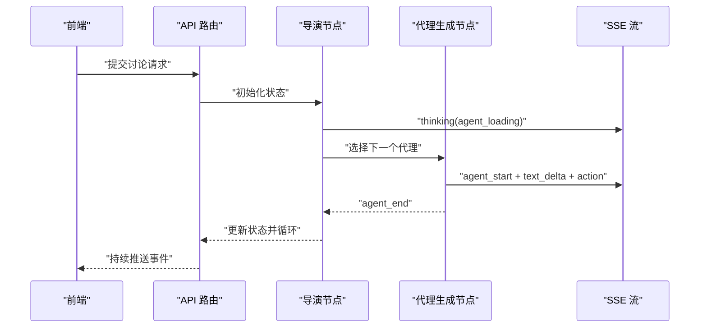
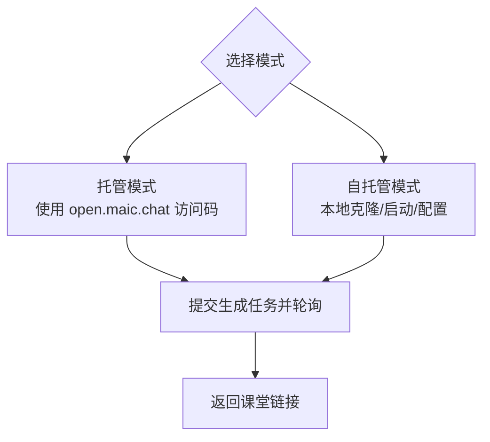
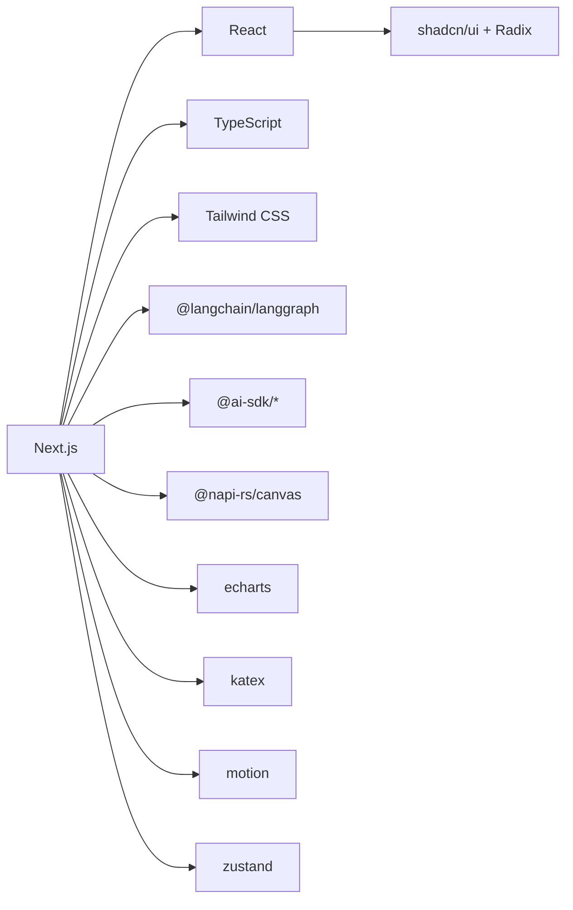

# 项目概述

<cite>
**本文档引用的文件**
- [README.md](file://README.md)
- [package.json](file://package.json)
- [SKILL.md](file://skills/openmaic/SKILL.md)
- [page.tsx](file://app/page.tsx)
- [engine.ts](file://lib/playback/engine.ts)
- [action/engine.ts](file://lib/action/engine.ts)
- [director-graph.ts](file://lib/orchestration/director-graph.ts)
- [next.config.ts](file://next.config.ts)
</cite>

## 目录
1. [引言](#引言)
2. [项目结构](#项目结构)
3. [核心组件](#核心组件)
4. [架构总览](#架构总览)
5. [详细组件分析](#详细组件分析)
6. [依赖分析](#依赖分析)
7. [性能考虑](#性能考虑)
8. [故障排除指南](#故障排除指南)
9. [结论](#结论)
10. [附录](#附录)

## 引言

OpenMAIC（Open Multi-Agent Interactive Classroom）是一个开源的人工智能平台，旨在将任意主题或文档转化为丰富的互动课堂体验。该项目通过多智能体编排技术，自动生成课件、测验、交互式仿真以及基于项目的教学活动，由AI教师与AI同学实时互动，支持语音播报、白板绘制、激光/聚光灯等课堂效果，并可导出为可编辑的PPTX或交互式HTML页面。

OpenMAIC 的核心愿景是“让每个学习者都能在几分钟内获得沉浸式的多智能体课堂体验”。其价值主张包括：
- 一键生成：输入主题或上传资料，AI在数分钟内构建完整课程
- 多智能体课堂：AI教师与同伴实时讨论、提问、演示
- 场景丰富：课件、测验、交互仿真、项目式学习（PBL）
- 白板与TTS：AI在白板上绘制公式与图表，并进行语音讲解
- 导出灵活：支持PPTX与HTML两种主流输出格式
- OpenClaw集成：从飞书、Slack、Telegram等聊天应用直接生成课堂

**章节来源**
- [README.md:39-70](file://README.md#L39-L70)

## 项目结构

OpenMAIC 采用 Next.js App Router 的前后端一体化架构，核心目录组织如下：
- app/: 前端页面与API路由（约18个后端接口）
- lib/: 核心业务逻辑（生成管线、多智能体编排、播放引擎、动作执行、状态管理等）
- components/: React UI 组件库（滑动渲染器、场景渲染器、聊天区、设置面板、白板等）
- packages/: 工作区包（PPTX生成、MathML转Office Math）
- skills/: OpenClaw 技能与操作流程（SOP）

**图表来源**
- [README.md:372-426](file://README.md#L372-L426)

**章节来源**
- [README.md:372-426](file://README.md#L372-L426)

## 核心组件

- 生成管线（lib/generation/）：两阶段流水线——大纲生成 → 场景内容生成
- 多智能体编排（lib/orchestration/）：基于 LangGraph 的状态机，统一调度多个AI角色
- 播放引擎（lib/playback/）：状态机驱动课堂播放与实时互动（空闲→播放→暂停→直播）
- 动作执行（lib/action/）：统一执行层，覆盖28+种动作类型（语音、白板、特效等）

这些组件共同构成 OpenMAIC 的“生成→编排→播放→交互”的闭环。

**章节来源**
- [README.md:428-434](file://README.md#L428-L434)

## 架构总览

OpenMAIC 的系统架构围绕“生成—编排—播放—交互”展开，前端通过 Next.js API 路由调用后端服务；后端利用 LangGraph 实现多智能体对话与动作规划，再由播放引擎与动作执行器驱动课堂效果。

**图表来源**
- [page.tsx:233-302](file://app/page.tsx#L233-L302)
- [engine.ts:1-525](file://lib/playback/engine.ts#L1-L525)
- [action/engine.ts:1-519](file://lib/action/engine.ts#L1-L519)
- [director-graph.ts:1-550](file://lib/orchestration/director-graph.ts#L1-L550)

## 详细组件分析

### 生成与播放引擎

- 生成管线：用户输入主题或材料后，系统先生成课程大纲，再将大纲项转换为富场景（课件、测验、交互模块、PBL活动）。
- 播放引擎：维护“空闲→播放→暂停→直播”的状态机，处理语音播放、白板绘制、激光/聚光灯等视觉效果，并支持用户中断进入直播模式。

**图表来源**
- [engine.ts:7-24](file://lib/playback/engine.ts#L7-L24)

**章节来源**
- [engine.ts:110-222](file://lib/playback/engine.ts#L110-L222)
- [engine.ts:369-523](file://lib/playback/engine.ts#L369-L523)

### 动作执行引擎

动作执行引擎统一处理所有课堂动作，分为“即时生效”（如聚光灯、激光）与“同步等待”（如语音、视频、白板绘制）。它通过 Stage API 与画布状态协作，确保动作顺序与课堂节奏一致。

**图表来源**
- [action/engine.ts:80-125](file://lib/action/engine.ts#L80-L125)
- [action/engine.ts:265-278](file://lib/action/engine.ts#L265-L278)

**章节来源**
- [action/engine.ts:165-228](file://lib/action/engine.ts#L165-L228)
- [action/engine.ts:280-517](file://lib/action/engine.ts#L280-L517)

### 多智能体编排（LangGraph）

多智能体编排通过 LangGraph 的状态图实现，包含“导演节点→代理生成节点”的循环。导演根据当前轮次、可用代理、讨论上下文与白板记录决定下一个发言者，代理生成节点负责流式输出文本与动作，并通过 SSE 推送至前端。

**图表来源**
- [director-graph.ts:102-228](file://lib/orchestration/director-graph.ts#L102-L228)
- [director-graph.ts:240-472](file://lib/orchestration/director-graph.ts#L240-L472)

**章节来源**
- [director-graph.ts:49-78](file://lib/orchestration/director-graph.ts#L49-L78)
- [director-graph.ts:484-496](file://lib/orchestration/director-graph.ts#L484-L496)

### OpenClaw 集成

OpenClaw 技能提供“托管模式/自托管模式”的引导式安装与使用流程，支持从聊天应用直接生成课堂并跟踪异步任务进度。

**图表来源**
- [SKILL.md:54-92](file://skills/openmaic/SKILL.md#L54-L92)

**章节来源**
- [SKILL.md:12-26](file://skills/openmaic/SKILL.md#L12-L26)
- [SKILL.md:27-51](file://skills/openmaic/SKILL.md#L27-L51)

## 依赖分析

- 运行时与框架：Next.js 16、React 19、TypeScript、Tailwind CSS
- 多智能体与流式：@langchain/langgraph 1.1、@ai-sdk/react、@ai-sdk/openai 等
- 媒体与渲染：@napi-rs/canvas、echarts、katex、motion 等
- 状态与UI：zustand、shadcn/ui、Radix UI、@xyflow/react 等
- 打包与构建：Rollup、PostCSS、Prettier、ESLint

**图表来源**
- [package.json:15-94](file://package.json#L15-L94)

**章节来源**
- [package.json:15-94](file://package.json#L15-L94)

## 性能考虑

- 生成管线分阶段执行，避免一次性处理大量数据，提升响应速度与稳定性
- 播放引擎对语音与视频采用“预生成音频优先、阅读时间估算兜底”的策略，减少等待
- 动作执行器对白板绘制与视频播放采用同步等待，保证课堂节奏一致性
- LangGraph 使用自定义流模式，按事件增量推送，降低前端渲染压力
- Next.js 配置启用代理最大主体大小与打包优化，适配大体量媒体资源

**章节来源**
- [engine.ts:415-444](file://lib/playback/engine.ts#L415-L444)
- [next.config.ts:7-10](file://next.config.ts#L7-L10)

## 故障排除指南

- 无法启动或页面空白
  - 检查 Node.js 版本与 pnpm 版本是否满足前置条件
  - 确认至少配置一个 LLM 提供商密钥
  - 参考快速开始中的安装与配置步骤

- 生成失败或无响应
  - 确认已正确填写 .env.local 或 server-providers.yml
  - 若使用 MinerU 文档解析，检查 PDF_MINERU_BASE_URL 与 API Key
  - 查看浏览器控制台与服务端日志定位错误

- OpenClaw 无法连接或生成超时
  - 托管模式：确认访问码有效
  - 自托管模式：确认本地服务健康（/api/health），并正确配置 repoDir/url
  - 生成任务为异步，遵循技能的轮询建议

**章节来源**
- [README.md:75-117](file://README.md#L75-L117)
- [README.md:151-156](file://README.md#L151-L156)
- [SKILL.md:84-92](file://skills/openmaic/SKILL.md#L84-L92)

## 结论

OpenMAIC 通过“生成—编排—播放—交互”的完整链路，将多智能体技术与课堂场景深度融合，实现了从主题到互动课堂的一键生成与流畅播放。其模块化设计、LangGraph 编排与动作执行引擎的协同，既保证了教学效果的丰富性，也为二次开发与扩展提供了清晰的路径。

## 附录

### 快速开始

- 环境要求
  - Node.js >= 18
  - pnpm >= 10

- 安装与运行
  - 克隆仓库并安装依赖
  - 复制并填写 .env.local（至少配置一个 LLM 提供商密钥）
  - 启动开发服务器或生产构建

- 部署选项
  - 本地开发：pnpm dev
  - 生产构建：pnpm build && pnpm start
  - Vercel 一键部署：点击按钮导入仓库并设置环境变量
  - Docker：docker compose up --build

- 可选增强
  - MinerU：用于复杂表格、公式与OCR的高级解析

**章节来源**
- [README.md:75-156](file://README.md#L75-L156)

### 应用场景

- 从零开始教学：例如“Python入门30分钟”、“如何玩好桌游Avalon”
- 数据分析与可视化：例如“分析某公司股价走势”
- 学术论文解读：例如“深入解析某篇最新论文”

**章节来源**
- [README.md:329-364](file://README.md#L329-L364)