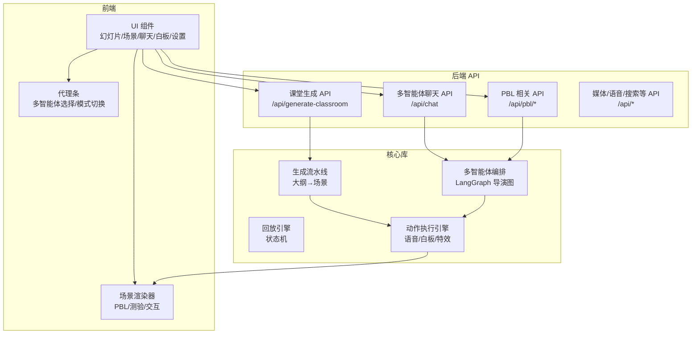
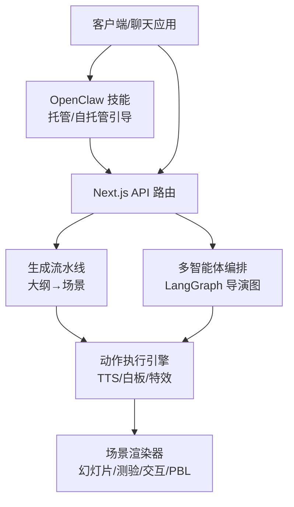
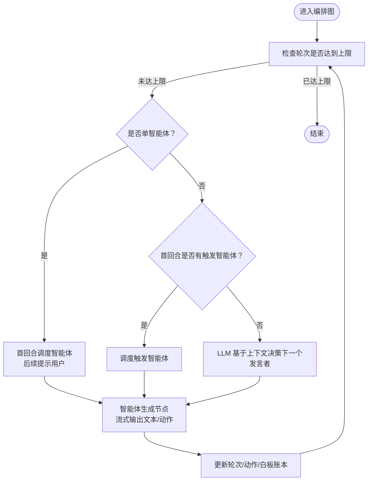
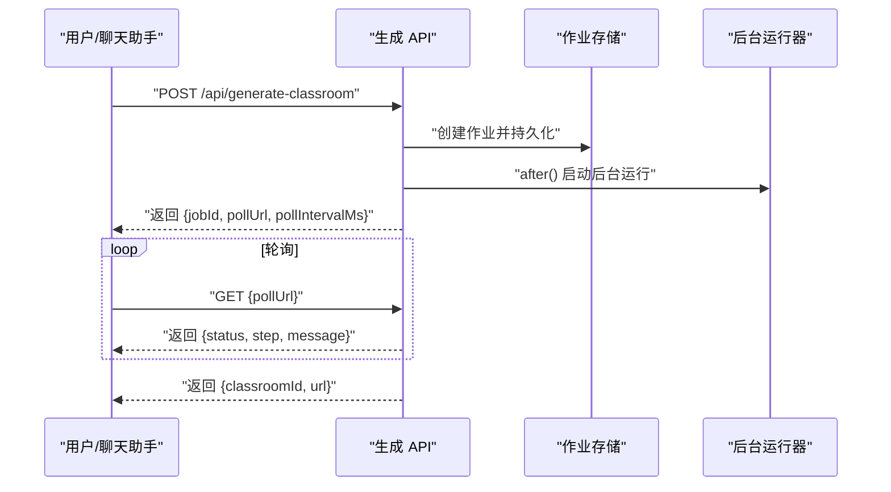
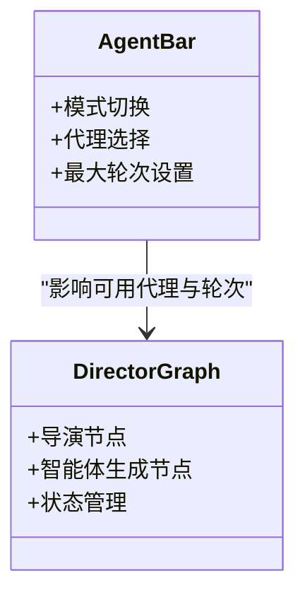
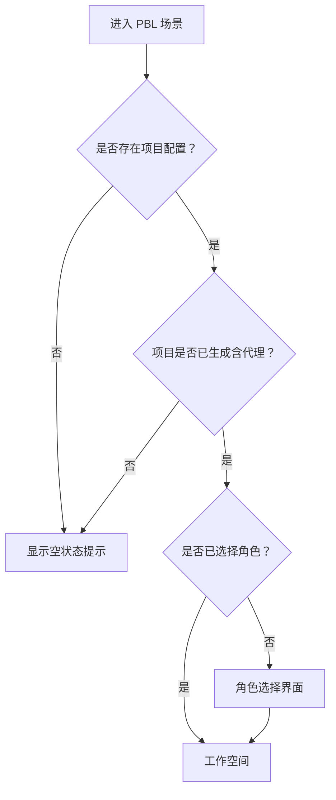
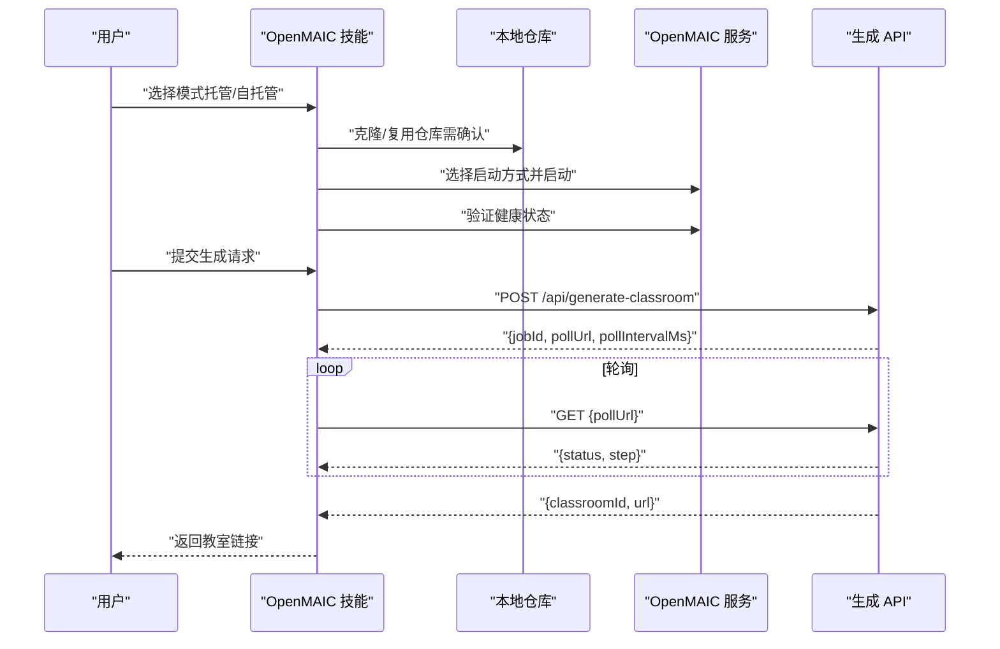
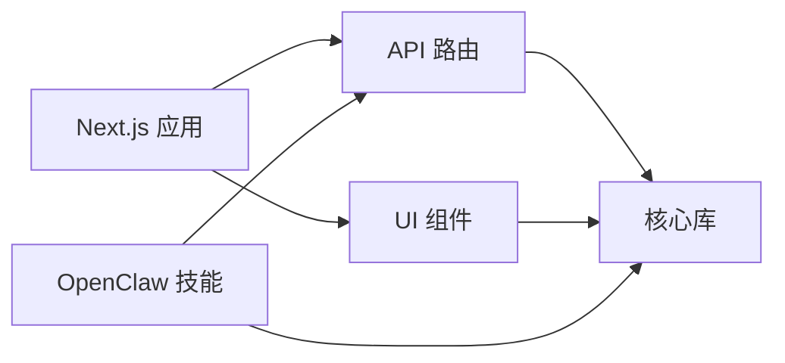

# 项目简介

<cite>
**本文档引用的文件**
- [README.md](file://README.md)
- [README-zh.md](file://README-zh.md)
- [package.json](file://package.json)
- [skills/openmaic/SKILL.md](file://skills/openmaic/SKILL.md)
- [skills/openmaic/references/generate-flow.md](file://skills/openmaic/references/generate-flow.md)
- [app/api/generate-classroom/route.ts](file://app/api/generate-classroom/route.ts)
- [lib/orchestration/director-graph.ts](file://lib/orchestration/director-graph.ts)
- [components/agent/agent-bar.tsx](file://components/agent/agent-bar.tsx)
- [components/scene-renderers/pbl-renderer.tsx](file://components/scene-renderers/pbl-renderer.tsx)
- [community/feishu.md](file://community/feishu.md)
</cite>

## 目录
1. [引言](#引言)
2. [项目结构](#项目结构)
3. [核心组件](#核心组件)
4. [架构总览](#架构总览)
5. [详细组件分析](#详细组件分析)
6. [依赖关系分析](#依赖关系分析)
7. [性能考量](#性能考量)
8. [故障排查指南](#故障排查指南)
9. [结论](#结论)
10. [附录](#附录)

## 引言
OpenMAIC（Open Multi-Agent Interactive Classroom）是一个开源的 AI 教育平台，旨在将任意主题或文档转化为沉浸式的互动课堂体验。项目通过“多智能体编排”技术，将教学内容拆解为结构化的大纲，并进一步生成幻灯片、测验、交互式模拟以及项目制学习（PBL）等多种课堂场景。课堂中由 AI 教师与 AI 同伴共同参与，支持实时讨论、白板绘图、语音讲解与课堂回放，帮助学习者在多模态、多角色的互动中高效掌握知识。

项目定位为“开源 AI 教育平台”，核心价值在于：
- 降低课堂生成门槛：仅需描述主题或上传资料，系统即可在几分钟内生成完整课堂。
- 多智能体协作：AI 教师与同伴在课堂中主动发起讨论、协同解题、绘制图表，营造真实课堂氛围。
- 场景丰富多样：涵盖幻灯片讲授、交互式实验、测验评估与项目制学习，满足不同教学目标。
- 易用与可扩展：内置 OpenClaw 集成，可在飞书、Slack、Telegram 等聊天应用中直接生成课堂；同时提供完善的 API 与配置体系，便于二次开发与企业部署。

面向用户群体：
- 教育工作者：快速制作课程课件、课堂活动与测评。
- 学习者：获得沉浸式、互动性强的学习体验，支持语音讲解与白板演示。
- 开发者与研究者：基于多智能体编排与课堂生成管线进行二次开发与学术研究。

解决的实际问题：
- 传统教学资源准备耗时长、重复劳动多，OpenMAIC 通过自动化生成大幅缩短备课时间。
- 课堂互动单一，缺乏多角色协作与即时反馈，OpenMAIC 提供多智能体讨论与实时评估。
- 教学场景碎片化，难以形成连贯的学习闭环，OpenMAIC 将大纲、场景与回放整合为统一体验。

发展历程与创新：
- 项目以“两阶段生成流水线”为核心：先生成结构化大纲，再将每个大纲项转换为具体场景（幻灯片、测验、交互模块、PBL 活动）。
- 多智能体编排采用 LangGraph 构建状态机，结合 LLM 决策与代码快路径，实现“导演节点”驱动的轮次调度与动作执行。
- 课堂播放与实时互动通过“回放引擎”驱动，支持 idle → playing → live 的状态流转，确保流畅的课堂体验。
- 支持 TTS、ASR、网络搜索、PDF 解析、富媒体导出（PPTX、HTML）等能力，覆盖教学全流程。

**章节来源**
- [README.md:39-70](file://README.md#L39-L70)
- [README-zh.md:39-70](file://README-zh.md#L39-L70)

## 项目结构
OpenMAIC 采用 Next.js App Router 的前后端一体化架构，核心目录与职责如下：
- app/api：后端 API 路由，包含课堂生成、聊天对话、PBL、媒体处理、健康检查等接口。
- lib：核心业务逻辑，包括两阶段生成流水线、多智能体编排（LangGraph）、回放引擎、动作执行、AI 供应商抽象、导出与存储等。
- components：前端 UI 组件，涵盖幻灯片渲染器、场景渲染器（测验、交互、PBL）、聊天区、白板、设置面板、代理条等。
- skills/openmaic：OpenClaw 技能与引导流程，提供托管/自托管模式、生成流程与轮询机制的一站式操作。
- configs：共享常量与主题配置。
- packages：工作区子包，如 PowerPoint 生成与 MathML 转换工具。

**图表来源**
- [README.md:372-426](file://README.md#L372-L426)
- [README-zh.md:372-426](file://README-zh.md#L372-L426)

**章节来源**
- [README.md:372-426](file://README.md#L372-L426)
- [README-zh.md:372-426](file://README-zh.md#L372-L426)

## 核心组件
- 课堂生成流水线（两阶段）
  - 大纲生成：根据用户需求或 PDF 内容生成结构化教学大纲。
  - 场景生成：将大纲中的每一项转换为具体的课堂场景（幻灯片、测验、交互模块、PBL 活动）。
- 多智能体编排（LangGraph）
  - 导演节点：根据当前轮次、可用智能体、讨论上下文与白板记录，决定下一个发言的智能体或是否提示用户。
  - 智能体生成节点：按系统提示与历史消息流式生成文本与动作，支持 TTS、白板绘制、特效等。
- 回放引擎
  - 状态机驱动课堂播放与实时互动，支持 idle → playing → live 的状态流转。
- 动作执行引擎
  - 执行 28+ 种动作类型，包括语音播报、白板绘图/文字/形状/图表、聚光灯、激光笔等。
- OpenClaw 集成
  - 提供托管/自托管两种模式，引导用户完成克隆、配置、启动与课堂生成，并支持轮询查看结果。

**章节来源**
- [README.md:428-434](file://README.md#L428-L434)
- [README-zh.md:428-434](file://README-zh.md#L428-L434)

## 架构总览
OpenMAIC 的整体架构围绕“生成流水线 + 多智能体编排 + 回放引擎 + 动作执行”的核心闭环展开。前端通过 API 与后端交互，后端通过 LangGraph 管理多智能体的对话与动作，最终将生成内容渲染到课堂场景中。

**图表来源**
- [lib/orchestration/director-graph.ts:474-496](file://lib/orchestration/director-graph.ts#L474-L496)
- [app/api/generate-classroom/route.ts:11-51](file://app/api/generate-classroom/route.ts#L11-L51)

**章节来源**
- [lib/orchestration/director-graph.ts:1-50](file://lib/orchestration/director-graph.ts#L1-L50)
- [app/api/generate-classroom/route.ts:1-10](file://app/api/generate-classroom/route.ts#L1-L10)

## 详细组件分析

### 多智能体编排（LangGraph 导演图）
- 导演节点策略
  - 单智能体：纯代码逻辑，首回合直接调度，后续轮次提示用户继续。
  - 多智能体：首回合可指定触发智能体，否则由 LLM 基于对话摘要与上下文决策下一个发言者。
- 智能体生成节点
  - 依据系统提示与历史消息流式生成文本与动作，支持 TTS、白板绘制、特效等。
  - 对动作进行有效性过滤，确保在当前场景类型下仅允许合法动作。
- 状态管理
  - 统一状态注解包含消息、可用智能体、最大轮次、语言模型、思考配置、讨论上下文、触发智能体、用户画像、代理配置覆盖、当前智能体、轮次计数、响应汇总、白板账本、结束标志与动作总数等。
- 图拓扑
  - START → 导演 → 智能体生成 → 导演（循环），直至达到轮次上限或结束条件。

**图表来源**
- [lib/orchestration/director-graph.ts:88-228](file://lib/orchestration/director-graph.ts#L88-L228)
- [lib/orchestration/director-graph.ts:234-472](file://lib/orchestration/director-graph.ts#L234-L472)

**章节来源**
- [lib/orchestration/director-graph.ts:88-228](file://lib/orchestration/director-graph.ts#L88-L228)
- [lib/orchestration/director-graph.ts:234-472](file://lib/orchestration/director-graph.ts#L234-L472)

### 课堂生成 API（异步作业）
- 请求入口
  - POST /api/generate-classroom：接收用户需求或 PDF 内容，创建异步生成作业并返回轮询地址。
- 作业生命周期
  - 创建作业 → 后台运行生成 → 客户端轮询状态 → 成功返回教室 ID 与可访问链接。
- 错误处理
  - 缺少必要字段、内部错误等情况返回标准化错误响应。
- OpenClaw 集成
  - 技能提供托管/自托管两种模式，引导用户完成配置与启动，随后提交生成作业并轮询结果。

**图表来源**
- [app/api/generate-classroom/route.ts:11-51](file://app/api/generate-classroom/route.ts#L11-L51)
- [skills/openmaic/references/generate-flow.md:70-96](file://skills/openmaic/references/generate-flow.md#L70-L96)

**章节来源**
- [app/api/generate-classroom/route.ts:11-51](file://app/api/generate-classroom/route.ts#L11-L51)
- [skills/openmaic/references/generate-flow.md:15-96](file://skills/openmaic/references/generate-flow.md#L15-L96)

### 多智能体交互与代理条
- 代理条
  - 支持“预设模式”与“自动模式”两种选择方式，教师智能体始终启用，其他同伴可按需勾选或自动分配。
  - 提供最大轮次设置，控制课堂讨论节奏。
- 多智能体交互
  - 导演节点根据上下文与白板记录，决定下一个发言智能体或提示用户。
  - 智能体生成节点可输出文本与动作，实现课堂中的实时讲解与演示。

**图表来源**
- [components/agent/agent-bar.tsx:14-305](file://components/agent/agent-bar.tsx#L14-L305)
- [lib/orchestration/director-graph.ts:49-78](file://lib/orchestration/director-graph.ts#L49-L78)

**章节来源**
- [components/agent/agent-bar.tsx:14-305](file://components/agent/agent-bar.tsx#L14-L305)
- [lib/orchestration/director-graph.ts:49-78](file://lib/orchestration/director-graph.ts#L49-L78)

### 项目制学习（PBL）场景
- 角色选择
  - 用户在进入 PBL 场景后，先进行角色选择，随后进入工作空间开展项目协作。
- 项目重置
  - 支持重置所有议题并重新激活首个议题，便于重新开始学习。
- 欢迎消息
  - 若议题包含生成的问题，首次进入时会自动发送欢迎消息，引导用户参与讨论。

**图表来源**
- [components/scene-renderers/pbl-renderer.tsx:17-128](file://components/scene-renderers/pbl-renderer.tsx#L17-L128)

**章节来源**
- [components/scene-renderers/pbl-renderer.tsx:17-128](file://components/scene-renderers/pbl-renderer.tsx#L17-L128)

### OpenClaw 集成与技能流程
- 技能规则
  - 逐阶段推进，每次仅执行一步并征得用户确认；不假设聊天助手的模型或密钥会被复用；生成请求不依赖运行时覆盖参数。
- 模式选择
  - 托管模式：直接使用 open.maic.chat 的访问码，无需本地部署。
  - 自托管模式：引导用户克隆仓库、选择启动方式、配置提供商密钥并启动服务。
- 生成流程
  - 提交生成作业后，遵循保守轮询策略（建议约 60 秒一次），在失败时等待并重试，成功后返回教室链接。

**图表来源**
- [skills/openmaic/SKILL.md:52-92](file://skills/openmaic/SKILL.md#L52-L92)
- [skills/openmaic/references/generate-flow.md:70-136](file://skills/openmaic/references/generate-flow.md#L70-L136)

**章节来源**
- [skills/openmaic/SKILL.md:12-26](file://skills/openmaic/SKILL.md#L12-L26)
- [skills/openmaic/SKILL.md:52-92](file://skills/openmaic/SKILL.md#L52-L92)
- [skills/openmaic/references/generate-flow.md:70-136](file://skills/openmaic/references/generate-flow.md#L70-L136)

## 依赖关系分析
- 技术栈与依赖
  - 前端框架：Next.js 16、React 19、TypeScript。
  - 多智能体编排：@langchain/langgraph 1.1。
  - AI SDK：@ai-sdk/*（OpenAI、Anthropic、Google）。
  - UI 组件库：shadcn/ui + Radix。
  - 其他：Tailwind CSS、Zustand 状态管理、ProseMirror 富文本、ECharts 图表、PPTX 生成与 MathML 转换等。
- 关键依赖关系
  - app/api/* 依赖 lib/server/* 与 lib/orchestration/*。
  - components/* 依赖 lib/store/*、lib/hooks/* 与 lib/types/*。
  - skills/openmaic/* 依赖 app/api/* 与 lib/server/*。

**图表来源**
- [package.json:15-94](file://package.json#L15-L94)
- [README.md:372-426](file://README.md#L372-L426)

**章节来源**
- [package.json:15-94](file://package.json#L15-L94)
- [README.md:372-426](file://README.md#L372-L426)

## 性能考量
- 生成作业的并发与轮询
  - 建议采用保守轮询策略（例如每 60 秒一次），避免频繁请求导致服务压力与资源浪费。
  - 长时间运行的作业应避免重复提交，优先在同一次会话中持续轮询。
- 多智能体编排的流式输出
  - 通过 LangGraph 的流式生成与事件推送，减少一次性响应体积，提升交互流畅度。
- 白板与动作执行
  - 动作执行引擎对场景类型进行动作过滤，避免无效渲染与计算开销。
- 前端渲染优化
  - 使用动画库与虚拟列表等手段优化复杂场景渲染性能。

[本节为通用指导，不直接分析具体文件]

## 故障排查指南
- 生成作业失败
  - 检查生成 API 返回的错误信息，若提示提供商或模型配置问题，优先检查服务器端配置文件（如 .env.local、server-providers.yml），而非尝试运行时覆盖。
  - 若轮询过程中出现网络错误或 5xx，等待约 60 秒后重试同一轮询地址，不要立即重启作业。
- OpenClaw 技能无法启动服务
  - 确认已正确选择启动方式（pnpm dev/build+start/Docker），并在提交生成请求前调用健康检查接口验证服务状态。
- 多智能体无响应或动作无效
  - 检查当前场景类型是否允许该动作；智能体生成节点会对动作进行有效性过滤，非法动作会被跳过。
- 社区支持
  - 可通过飞书群或 Discord 获取社区帮助与交流。

**章节来源**
- [skills/openmaic/references/generate-flow.md:86-136](file://skills/openmaic/references/generate-flow.md#L86-L136)
- [community/feishu.md:1-10](file://community/feishu.md#L1-L10)

## 结论
OpenMAIC 以“多智能体编排 + 两阶段生成流水线”为核心，构建了从主题到课堂的全链路自动化教学系统。通过 LangGraph 的导演图实现多智能体的有序协作，结合动作执行引擎与丰富的场景渲染器，为学习者提供了沉浸式、互动性强的课堂体验。OpenClaw 集成进一步降低了使用门槛，使用户能够在熟悉的聊天应用中一键生成课堂。对于开发者而言，项目提供了清晰的模块划分与完善的 API，便于扩展与定制。

[本节为总结性内容，不直接分析具体文件]

## 附录
- 快速开始与部署
  - 支持本地开发、Vercel 与 Docker 三种部署方式，推荐先使用托管模式快速体验。
- 使用场景示例
  - 包含 Python 入门、桌游规则讲解、股票对比分析与论文解析等多样化示例。
- 开源许可
  - 项目采用 AGPL-3.0 许可，商业授权请联系 thu_maic@tsinghua.edu.cn。

**章节来源**
- [README.md:73-156](file://README.md#L73-L156)
- [README-zh.md:73-156](file://README-zh.md#L73-L156)